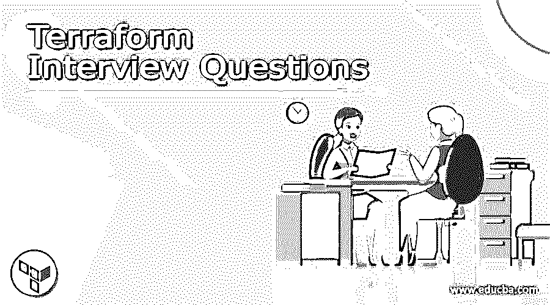

# Terraform 面试问题

> 原文：<https://www.educba.com/terraform-interview-questions/>

## Terraform 简介

Terraform 是一个开源的基础设施，作为一个代码软件工具。它用于高效、安全地进行版本控制、更改和构建基础设施。基础设施 terraform 能够处理低级和高级元素。低级元素是网络、存储、计算实例，高级元素是 SaaS 功能、DNS 条目等。如果你正在寻找一份与 terraform 相关的工作，那么你需要准备好面试的问题和答案。在这篇文章中，我们涵盖了一些顶级问题的答案，这将有助于你破解面试。

### Terraform 面试问题

以下是 terraform 面试问题列表及答案。

<small>网页开发、编程语言、软件测试&其他</small>

#### 1.terraform 的组成部分是什么？

答:terraform 有两个组件——Terraform 核心和 terra form 插件。

*   Terraform 核心:用于可视化 RPC(远程过程调用)与 terraform 插件通信。除此之外，它还根据需要提供不同的发现和加载插件的方法。
*   Terraform 插件；它用于表示特定服务的实现，如 AWS (Amazon Web Service)、Bash 或 provisioner。

#### 2.什么是 terraform 云？

答:Terraform cloud 为 Terraform 提供远程操作，非常适合生产和团队环境。它允许用户轻松创建任何规模的产品。它为每次运行前的基础设施变更提供了一个计划。它有能力计算该计划的成本，然后用任何策略对其进行检查。它还使用组织自己的私有模块注册表和工作区权限，为组织提供自助服务基础架构和运行环境。

#### 3.terraform 与 CloudFormation 有何不同？

答:Terraform 比我们可以在任何云提供商的平台和任何操作系统中使用的更灵活，无需任何修改。这种灵活性使得 terraform 在很多情况下都很受欢迎。在一个系统中，我们可以在不同的云平台中使用 terraform。Terraform 代码存储在 git 存储库或 terraform 文件夹中后，可以在不同的项目中重用。这在云形成中是不可能的，因为单个项目的代码存储在堆栈中，不能被任何其他项目重用。

#### 4.terraform 中的状态是什么？

Ans: State 是 terraform 中的一个命令，用于管理状态。状态是平台良好运行的必要条件。Terraform 必须存储有关托管基础设施和配置的状态。Terraform 使用 state 命令将现实世界的资源映射到您的配置，并跟踪元数据，以提高大型基础架构的性能。地形状态的语法如下
地形状态[选项][参数]

这里地形状态是关键字，选项是固定变量。Args 只不过是一个
参数，您需要在这里提到您想要为变量提供的参数。

#### 5.列出一些 Terraform CLI 命令

答:下面是一些 Terraform CLI 命令的列表

*   get:它用于下载和安装配置模块
*   版本:用于打印 terraform 的版本。
*   工作区:用于管理工作区。
*   graph:它用于基于资源构建一个图。
*   init:它用于初始化工作目录。
*   fmt:它用于将配置文件重写为规范格式。
*   构建:它用于构建或更改基础设施。
*   env:它用于工作区管理。
*   销毁:用于销毁管理。

#### terraform 中应用了什么？

Ans: Apply 是 terraform 中的一个命令，用于应用所需的更改，以对所需的配置状态或 terraform 计划执行计划生成的预定义操作集做出反应。

#### 7.空资源如何在 terraform 中工作？

回答:空资源遵循标准的资源生命周期，但不做任何其他事情。triggers 选项允许您指定一组任意值，如果这些值被修改，将导致资源被替换。

#### 8.terraform 有什么特点？

答:terraform 的特点如下:

*   改进维护:它能够将配置分解成小部分或大块，以便改进组织和维护。
*   资源关系:地形化有把握资源联系的能力，这是非常有用的能力。
*   图形化:它内置的图形化特性对于可视化基础设施非常有用。
*   更新:开源项目增加了新的特性和升级。它是在大量贡献者的帮助下完成的。
*   自定义语法:它的自定义语法是用户友好的，这有助于提高生产率。

#### 9.解释 terraform 的工作原理

答:Terraform 创建了一个执行计划，概述了它将做什么来实现期望的状态，然后执行它来创建所描述的基础设施。Terraform 可以确定随着配置的变化而变化的内容，并提供可以应用的增量执行计划。

#### 10:如何 terraform CLI？

答:Terraform 由一个命令行界面(CLI)控制，使用起来非常简单。只有一个命令行应用程序:terraform。之后，给这个应用程序一个子命令，如“应用”或“计划”。左侧的导航有一个完整的子命令列表。

### 结论

在本文中，我们讨论了 10 个面试问题及其答案。我们希望它能帮助你在面试中取得成功。

### 推荐文章

这是一个 Terraform 面试问题指南。这里我们讨论一下引言，Terraform 面试问题列表。您也可以看看以下文章，了解更多信息–

1.  [二叉树 JavaScript](https://www.educba.com/binary-tree-javascript/)
2.  [生成树算法](https://www.educba.com/spanning-tree-algorithm/)
3.  [树遍历 Python](https://www.educba.com/tree-traversal-python/)
4.  [数据结构的二叉树](https://www.educba.com/binary-tree-in-data-structure/)

