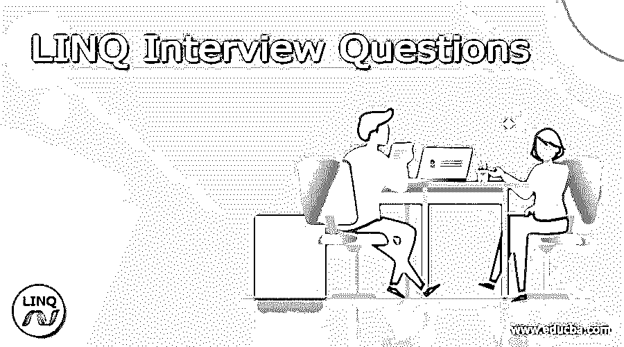

# LINQ 面试问题

> 原文：<https://www.educba.com/linq-interview-questions/>

## LINQ 简介

LINQ 代表语言集成查询，它是微软的产品。NET 框架模块，这些模块将本地数据查询连接到。网络语言。LINQ 是一个创新的东西，用于连接两个平台，称为 Visual Studio 和。NET 框架。LINQ 是完全集成的，我们可以轻松地从数据库、内存对象和 XML 文档中检索数据。LINQ 代码是一个可读的代码，它定义了查询不同数据源的标准方法。让我们一起来看看 LINQ 常见的一些面试问题及其答案；这可能有助于进一步的考试和面试，

### LINQ 面试问题及其答案

让我们讨论一下 LINQ 的面试问题。

<small>网页开发、编程语言、软件测试&其他</small>

#### 1.解释 LINQ 及其重要角色？

LINQ(语言集成查询)是一组标准查询，它有助于将可用的查询服务集成到。NET 框架语言，如 VB.Net，C#。LINQ 的主要作用是将查询工具集成到几个。Net 语言就像是数据和对象之间的桥梁。

#### 2.LINQ 有哪些不同的类型？

*   LINQ 对物体
*   LINQ 到数据集
*   LINQ 到 XML (XLINQ)
*   LINQ 到 SQL (DLINQ)
*   LINQ 至实体

#### 3.在 LINQ 有多少种连接方式？

在 LINQ 有四种类型的连接，它们是

*   内部连接
*   左外部连接
*   交叉连接
*   群组加入

#### 4.分享一下 First()和 FirstOrDefault()的区别？

如果没有要返回的记录，First()将抛出异常，而如果没有找到记录，FirstOrDefault()将返回 NULL。

#### 5.什么是 LINQ 量词运算符并解释？

LINQ 限定符只返回布尔值作为结果，这意味着它检查数据源中的所有或部分值是否满足给定的条件，并返回结果 true 或 false。有三个运算符，

1.  all()–它检查数据源中的所有元素是否满足给定的条件
2.  any()-它检查数据源中的任何元素或至少一个元素是否满足给定的条件
3.  contains()–它检查数据源是否包含该特定元素。

这三个方法只返回布尔值作为结果；true 或 false 取决于数据源中的元素以及满足条件的元素。

#### 6.与存储过程相比，使用 LINQ 有什么优势？

*   LINQ 是一种类型安全，所以在编译时会检查查询错误。
*   在 LINQ 中，调试在开发过程中很容易，而在存储过程中，GUI 数据将花费时间，所以它将是耗时的。
*   在 LINQ 中，没有进一步的任务来部署它，但是在存储过程中，部署它需要整个过程。在 LINQ 部署很容易。

#### 7.什么是投影算子？

投影运算符有两种类型，它们是

*   Select()它从项目集合中选择一个值。
*   SelectMany()它从称为嵌套集合的集合组中选择值。

#### 8.LINQ 对 SQL 文件的扩展是什么？

该文件使用的扩展名是. dbml。

#### 9.请举例说明 LINQ 的不同运算符。

LINQ 非重复运算符属于集合运算符，它从集合中删除重复值并返回唯一值。Distinct 运算符仅在方法语法中可用，它不支持查询语法。
例如:

`listItems= { 22,33,44,22,22,55,77,55,33,88}
result=listItems.distinct();
Result: {22, 33, 44, 55, 77, 88}`

#### 10.什么是 LINQ 排序运算符，用语法解释它的类型？

排序运算符用于根据属性将给定的项目序列重新排列成升序或降序。有五种不同的排序运算符

1.order by–用于按升序或降序对元素进行排序
a . var data _ in _ order by = product list。order by(p =>p . product name)；
2。order by descending–它只按降序对元素进行排序。
a . var data _ in _ OrderByDesc = product list。OrderByDescending(p =>p . product name)；
3。ThenBy-它仅用于次要目的，一旦 orderBy 函数完成，它将继续执行。
a . var data _ then by = product list。order by(p =>p . product name)。then by(p =>p . product cost)；
4。然后按降序排序——一旦 orderByDescending 完成，也使用它，一旦主要排序完成，这个排序将继续进行。

形容词（adjective 的缩写）`Var data_ThenByDesc = productList.OrderBy(p => p. productName).ThenByDescending(p=> p.productCost);`

5.Reverse- reverse sort 什么都不是，但是它以相反的方向显示顺序，升序和降序不适用。它从当前位置以相反的顺序显示元素。

形容词（adjective 的缩写）`var data _Reverse= productList.Reverse();`

#### 11.什么是 LINQ 的 DataContext 类？

LINQ 中的 DataContext 类充当了 SQL Server 数据库和 LINQ 到 SQL 之间的桥梁，为了数据库的使用和在数据库中的进一步更新，它使用了连接字符串和一些功能来制作它。它执行三个基本任务来实现它。为了创建到数据库的连接，它检索并提交对象到数据库
转换对象到 SQL 查询等等。

#### 12.LINQ 的 Lambda 和查询表达式是什么？

Lambda 表达式使用 lambda 运算符= >它是一个没有指定名称的函数，该函数计算并返回作为单个值的结果，这里在运算符= >中，它在左侧指定输入数据，在右侧指定语句块\表达式。查询表达式它包含标识查询数据源的查询组合，它具有排序、分组、连接、过滤的标准以利用数据源。LINQ 查询表达式类似于 SQL 语法，它只是指定应该从数据源检索什么数据。

#### 13.LINQ 的实体类有哪些？

实体类现在主要用于所有的编程中，它是开发 LINQ 的基本构件，在这个类中，它通常是数据库表的对象包装，并且具有实体的原型。

### 结论

在这篇文章中，我们提供了 LINQ 面试问题及其相应的答案，有助于提高你的技能和信心，以应对任何面试或考试，实现你的预期目标。希望这篇文章能帮助你应对即将到来的 LINQ 考试和面试。

### 推荐文章

这是 LINQ 面试问题指南。这里我们讨论一下 LINQ 的简介、面试问题。您也可以看看以下文章，了解更多信息–

1.  [Perl 面试问题](https://www.educba.com/perl-interview-questions/)
2.  [春季批量面试试题](https://www.educba.com/spring-batch-interview-questions/)
3.  [硒面试问题](https://www.educba.com/selenium-interview-questions/)
4.  [DynamoDB 面试问题](https://www.educba.com/dynamodb-interview-questions/)

