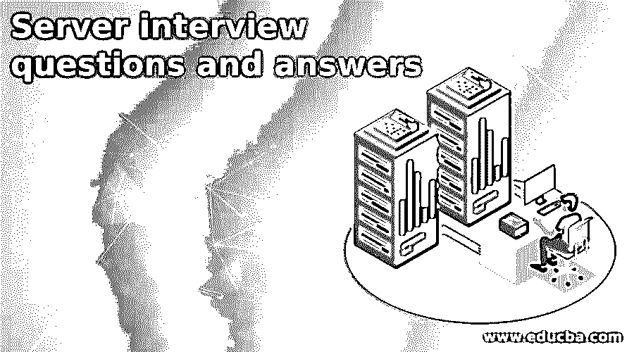

# 服务器面试问题和答案

> 原文：<https://www.educba.com/server-interview-questions-and-answers/>

## 服务器面试问答介绍

服务器是一种专门的机器或软件，用于连接多个本地或互联网上的客户端，我们也可以说它可能是物理的或位于云上，单词“服务器”并不意味着它与任何机器相关联，而是可以分配给任何计算机系统的角色。

**面试问题:**

<small>网页开发、编程语言、软件测试&其他</small>

面试是受访者和面试官之间的交流，受访者可以问一些与工作要求相关的问题，以找到匹配的个人资料，作为回应，面试官必须直接回答。

### 第 1 部分–服务器面试问题和答案(基础)

这第一部分包括基本的面试问题和答案。

#### 1.客户端操作系统和服务器端操作系统有什么区别？

**答案:**

服务器操作系统是通过向客户端提供服务来响应客户端请求的设备或程序，当客户端请求服务时，它向其客户端提供服务，例如数据库服务器、文件服务器和 web 服务器，而客户端-服务器是通过 web 请求服务的程序或设备，它向服务器请求内容或服务功能，例如台式机、笔记本电脑、智能手机、平板电脑和 web 浏览器。

#### 2.服务器中的活动目录是什么？

**答案:**

在服务器操作系统中，活动目录是由微软开发的目录服务，它用于存储用户、计算机、打印机的信息以及网络相关信息，它有助于管理具有多个域控制器的网络，这些域控制器为我们在不同位置的计算机提供了唯一的名称，它还能够从任何域控制器管理活动目录，这将被替换为所有其他域控制器，它是保存活动目录数据库的服务器，它还验证 windows 域中的用户和计算机。

#### 3.系统管理员的角色是什么？

**答案:**

系统管理员有许多不同类型的任务，系统管理员的角色取决于组织，他们的主要任务是安装、支持和维护服务器和计算机，还有许多其他任务如下:

*   为了安装补丁并更新操作系统，补丁是一种工具或者是一种类型的更新，它克服了来自任何计算机系统的弱点，并且它需要定期更新和安装。
*   查看系统日志，以检查系统是否正常工作，并检查系统日志的详细信息，包括系统访问的位置、访问方式，以及检查其流程是否存在问题，分析流程也是系统管理员的工作。
*   对用户进行访问管理，意味着检查用户的信息，控制用户的访问，这将是系统管理员的责任。
*   灾难恢复规划、备份、恢复相关工作。
*   创建和恢复备份，维护系统，制作备份，根据组织恢复备份，也需要由系统管理员处理。
*   此外，为了符合密码的要求，在客户端级别和服务器级别提供密码安全性，这也是系统管理员的工作。
*   检查访问控制无论在我们的网络中进行什么，以及系统审计日志记录，这些都是在服务器上进行的工作，审计服务器是系统管理员的主要任务，系统管理员的工作是审计服务器来维护系统的安全，我们可以说系统管理员的工作是解决网络中服务器到客户端之间的问题。

#### 4.什么是域？

**答案:**

域是由活动目录提供并由微软服务器设计的服务。通过它，我们可以部署服务，并且我们可以在网络中提供服务，例如，如果我们搜索 www.google.com、www.youtube.com 等。因此，YouTube 是一个致力于为我们提供服务的活动目录的域，如果我们有任何疑问，它都会回答。

#### 5.什么是图式？

**答案:**

模式是由用户创建的逻辑结构，它的名称和用户名相同，它也是一种信息，可以存储在活动目录中，活动目录模式是对象类及其属性的集合，属性是名、姓、电子邮件、部门以及域中具有规则、策略、规章的其他内容，对象类是用户。

### 第 2 部分–服务器面试问题和答案(高级)

现在让我们来看看高级面试的问题和答案。

#### 6.解释一下 Hyper-v？

**答案:**

它是微软提供的可视化工具，用于在一台物理服务器上创建多个虚拟机，降低了硬件成本，提高了效率。

#### 7.什么是 LDAP？

**答案:**

它是一个轻量级的目录访问协议，我们可以说它是一种存储计算机、用户对象等的数据库，有助于在目录中添加、删除和上传计算机对象。

#### 8.Wsus 是什么？

**答案:**

Wsus 代表由微软开发的 Windows Server Update Services，它在 Windows 环境中管理更新的分发，并允许部署微软产品的最新更新。

#### 9.Powershell 是什么？

**答案:**

它是由微软开发的，并建立在。NET 框架，Windows 的 PowerShell 是一个命令行 Shell，它的目的是使管理员的任务自动化，这些任务既适用于本地也适用于远程 Windows 机器。

### 结论

在上面的文章中，我们已经解释了一些在面试中可能会问到的与服务器相关的重要问题，如果你想了解它的概念，那么这篇文章肯定会对你有所帮助，并且也看到了计算机向其他计算机提供信息的定义。

### 推荐文章

这是一个服务器面试问题和答案列表的指南，以便候选人可以轻松地解决这些面试问题。在本帖中，我们研究了面试中经常被问到的顶级服务器面试问题。您也可以阅读以下文章，了解更多信息——

1.  [Informatica 云面试问题](https://www.educba.com/informatica-cloud-interview-questions/)
2.  [反应本土面试问题](https://www.educba.com/react-native-interview-questions/)
3.  [DHCP 面试问题](https://www.educba.com/dhcp-interview-questions/)
4.  [ESL 面试问题](https://www.educba.com/esl-interview-questions/)

