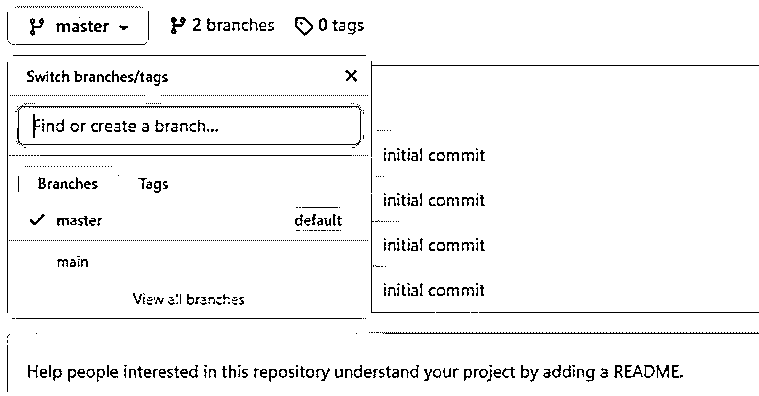
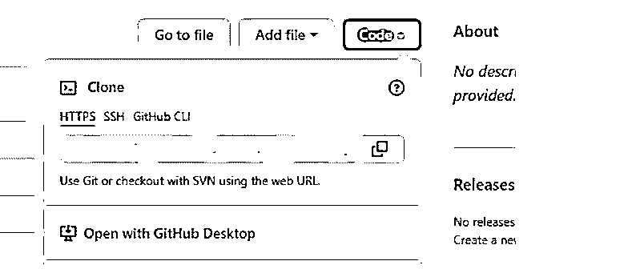

# GitHub 面试问题

> 原文：<https://www.educba.com/github-interview-questions/>

## GitHub 面试问题介绍

下面这篇文章提供了 GitHub 面试问题的大纲。GitHub 是在面试中被问得最多的问题之一，因为它帮助我们管理我们的代码，通过它的帮助我们可以很容易地帮助我们的代码版本化。如果我们在不同的团队中工作，那么我们可以轻松地处理我们的代码，避免在做同一件事情时可能发生的冲突。此外，我们不需要担心我们的代码，因为 GitHub 安全地保存了我们所有的代码及其历史。这是一个基于网络的平台，提供广泛的在线支持。我们在面试的时候会遇到很多关于 GitHub 的问题，但是大多数都只和 git 有关。

### 第 1 部分–GitHub 面试问题(基础)

第一部分包括基本的面试问题和答案:

<small>网页开发、编程语言、软件测试&其他</small>

#### Q1。什么是 GitHub 资源库？

**答案:**

首先，我们试图理解存储项目代码的存储库共享。我们可以从那里参考我们最新的代码。这可以由我们的裁判创建为您计算机上的本地文件夹。此外，它也可以指 github 上的存储空间，在这里我们可以保存我们的文件、文本、目录或图像等任何类型的文件。为此，我们必须首先在 GitHub 上创建存储库。

**链接:**【https://github.com/】T2

#### Q2。GitHub 中有哪些分支？

**答案:**

在确定了存储库之后，我们现在可以为它创建一个不同的版本。与此同时，你可以有不同的版本，这可以帮助我们在团队中没有任何冲突地开发不同类型的新功能。每个团队成员都为单独的变更或新功能创建自己的分支。

所有的分支都可以在下面的图上看到。

创建分支的简单命令是:

**代码:**

`git checkout -b branch_name`

**输出:**

#### Q3。如何向 GitHub 提交代码？

**答案:**

要将代码提交给 GitHub，我们需要执行与使用其他存储库管理平台时相同的步骤。我们既可以通过命令行来实现，也可以通过 GitHub 来实现，但是我们总是建议通过任何版本控制工具来实现，这里我们将使用 git。我们可以从他们的官网下载这个。

按照下面的命令将代码提交到您的本地存储库。

**代码:**

`git commit -m "your message"`

*   这里的-m 用于说明提交的消息，以便让其他开发人员了解我们为这次提交做了哪些更改。

#### Q4。如何在 GitHub 中添加文件到本地存储库？

**答案:**

要将我们想要提交的文件添加到远程存储库中，也可以通过 git 命令提示符来完成。

为此，我们需要运行如下几个命令:

**代码:**

`git add "your file name with full path"`

#### Q5。如何将提交推送到远程存储库？

**答案:**

要将更改推送到远程存储库，我们需要运行一些命令，我们也可以在 GitHub 中执行相同的步骤，但建议使用任何版本控制工具。推动变更仅仅意味着，使我们的本地变更对远程存储库可用，这现在可以被其他开发人员使用和查看，以进行审查或贡献。

### 第 2 部分–GitHub 面试问题(高级)

现在让我们来看看高级面试问题:

#### Q6。如何在 GitHub 中切换分支？

**答案:**

*   切换分支，简单地说就是从一个分支导航到另一个分支。
*   通过使用命令，我们可以通过使用版本控制工具轻松地做到这一点。此外，我们可以通过 GitHub 来查看其他分支的变化。只是我们必须去 GitHub 官方网站，选择我们想要转移到的分支。

此外，如果我们想在本地切换代码分支，那么可以很容易地在命令提示符下运行下面的命令。

**代码:**

`git checkout "your branch name"`

#### Q7。我们如何恢复本地的更改？

**答案:**

要恢复任何更改或将文件恢复到上次的更改，我们可以使用 git 命令，也可以恢复文件。这里推荐使用版本控制工具，因为 GitHub 可以做任何事情，但是我们不应该这样做。

因此，运行下面的命令来恢复我们在本地的最后一次更改。

**代码:**

`git stash`

#### Q8。合并命令。

**答案:**

要将不同的分支合并成一个分支，我们可以使用 GitHub 接口来加快速度，我们也很欣赏 git 命令这样做。但是对于大一新生和初学者来说，要做到这一点似乎很难。所以 GitHub 让我们很容易在那里给出这个选项。

#### Q9。如何从 GitHub 克隆资源库？

**答案:**

这里的克隆意味着通过使用 URL 在我们的本地系统上制作副本的完全相同的副本。为此，我们可以使用 git 命令和我们想要克隆的 URL。这个 URL 可以在 GitHub 页面上找到。它与我们想要克隆到本地系统中的分支相关联。

另外，找到以下命令来克隆存储库:

**代码:**

`git clone “ url ”`

**输出:**

#### Q10。详细讲解 Git 开发流程？

**答案:**

*   分析
*   规格
*   体系结构
*   需求的实现
*   功能或应用的测试
*   详细记录这些事情

### 推荐文章

这是 GitHub 面试问题指南。这里我们讨论一下 GitHub 的简介和基本&高级面试问题。您也可以看看以下文章，了解更多信息–

1.  [熊猫面试问题](https://www.educba.com/pandas-interview-questions/)
2.  [Xamarin 面试问题](https://www.educba.com/xamarin-interview-questions/)
3.  [手机测试面试问题](https://www.educba.com/mobile-testing-interview-questions/)
4.  [人工测试面试问题](https://www.educba.com/manual-testing-interview-question/)

