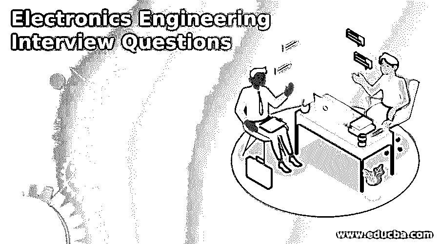

# 电子工程面试问题

> 原文：<https://www.educba.com/electronics-engineering-interview-questions/>

## 电子工程导论

以下文章提供了电子工程面试问题的大纲。电子工程是电气领域的一个分支，研究半导体中的电子流及其控制方法。这项研究导致了二极管、晶体管和集成电路(IC)的发展。

这些 IC 是影响我们日常生活的众多器件的一部分，包括手机、电视、音频/视频设备、个人电脑、存储设备、卫星、雷达、通信设备、家用设备、机械、航空设备和许多其它家用设备。除了作为工程的电气/计算机科学分支的一部分，电子工程与其他分支如机械、航空、化学、土木工程很好地结合和吸收，为用户带来创新的解决方案。

<small>网页开发、编程语言、软件测试&其他</small>

### 电子工程面试热门问题

以下是电子工程面试中最常见的问题:

#### Q1。定义什么是电子学？

**答案:**

它是物理学和电学的融合，用于跟踪电荷(电子)通过气体、真空、半导体等非金属介质的流动，研究它们的行为，并将其用于电子设备的设计。这些设备利用电子的控制方面，如其对流动的阻力、存储和磁性充电的能力，来实现其操作目标。

#### Q2。描述电子学的发展？

**答案:**

在 19 世纪之前和 20 世纪，电已被使用，通过真空管的低压电流、其电阻、充电能力以及电子流的产生和控制有助于处理信号。二极管和三极管有助于放大信号，并由此诞生了无线电和其他电子设备。

20 世纪 60 年代，半导体和晶体管取代了二极管和三极管，这有助于大大减小电子器件的尺寸。它消耗的能量也更少。集成电路，一种微芯片，一种制作在单一电路板上的微型电子电路，通过减少尺寸、元件数量和价格，在更大程度上彻底改变了电子设备。自 1970 年以来，集成电路在个人电脑、移动设备、微型计算机和其他新型电子设备的发展中发挥了重要作用。

#### Q3。电子电路由什么组成？

**答案:**

诸如电容器、电阻器、二极管、电感器和晶体管的电子元件被组装在印刷电路板上，并且该电路执行设计的功能。收音机中的调谐器电路用于滤除不需要的频率波，仅接收所需的频率，它包含实现此目的的组件和设计。

#### Q4。电子工程有哪些子领域？

**答案:**

电子工程的主要子领域是:

**a .信号处理:**该科目管理模拟或数字信号。可能随信息连续变化的模拟信号可能需要调制/解调来传递信号，并对音频进行滤波/放大。数字信号在处理时可能需要压缩、错误检测。

**b .通信:**信息可以通过光缆/同轴电缆或无线方式进行通信。

无线通信可以通过:

*   使用发射机和接收机的射频传输
*   短距离红外传输
*   微波传输
*   光波传输
*   卫星通信
*   蓝牙通信

蜂窝通信用于电话，GPRS 用于位置跟踪。

**c .航空航天:**它处理飞行数据的管理，包括计量数据和导航数据、与基站的通信以及与飞机仪表信息的集成。

**d .电磁学:**通过电磁波处理信号的传输。

**e .控制工程:**利用反馈机制为任何系统设计控制。它控制飞机、汽车或任何其他仪器的操作。

**f .仪表工程:**来自测量温度、压力和流量的仪表的信号用于控制它们所连接的系统的运行。安装在这些仪器中的传感器向控制系统发出信号，以进行监控并采取行动。

**g. VLSI 设计:**处理超大规模集成电路的集成。

**h .计算机硬件:**微型计算机、工业计算机、可编程逻辑控制器(PLC)、嵌入式系统、软件控制的硬件系统都是电子工程的一部分。

#### Q5。电气和电子是一样的吗？

**答案:**

不，它们是不同的。电子学是电气领域的一个子系统。电子学是建立在电子流经半导体的因果原理上的，而电学是建立在电子流经金属的原理上的。通过硅的电子流在电子学中处理，通过铜的电子流在电学中处理。

#### Q6。电气设备和电子设备有什么区别？

**答案:**

**电气设备:**

*   它将电能转化为物理能量
*   像铜/铝这样的金属是最常用的
*   使用高压交流电
*   功耗高并且占用更多空间
*   响应速度更快，但没有数据处理能力
*   安全性低，主要做机械工作

**电子设备:**

*   将电能转换成规定的功
*   使用非金属，如硅和锗
*   使用低压直流电
*   功耗低，占用空间小
*   具有数据处理能力
*   安全性高
*   信号处理和数据处理有用吗

#### Q7。电子设备是如何工作的？

**答案:**

任何电子设备都具有:

*   **输入系统:**接收外界信号并转换成电信号。
*   **处理:**对信号进行处理，得出动作结果。
*   **输出:**将结果从处理系统中取出，并转换成外界可读信号。

收音机通过天线接收来自空中的电磁波，调谐器电路仅过滤掉调谐的频率，晶体管电路放大音频。

#### Q8。电子工程师是做什么的？

**答案:**

吸收物理、数学和其他工程技术，设计创新的电信系统。设计机器人来自动化制造活动和非制造活动。通过与物理世界的接口建立有效的控制系统，以监测和控制过程。

设计有效的制造执行系统，促进制造 4.0。简化现有的人机界面和系统界面，提高生产力。开发无需人工干预的实时控制任何物理系统功能的软件。

### 结论-电子工程面试问题

今天的世界充满了小工具，我们被小工具、应用程序和手机所统治。传感器将地球上的一切与互联网连接起来，并催生了许多 IOT 应用。这些应用让我们的生活变得简单，让我们的世界变得渺小。电子学是所有这些成就的基础。

### 推荐文章

这是电子工程面试问题指南。这里我们讨论一下电子工程中的入门和顶级面试问题。您也可以看看以下文章，了解更多信息–

1.  [熊猫面试问题](https://www.educba.com/pandas-interview-questions/)
2.  [Xamarin 面试问题](https://www.educba.com/xamarin-interview-questions/)
3.  [手机测试面试问题](https://www.educba.com/mobile-testing-interview-questions/)
4.  [人工测试面试问题](https://www.educba.com/manual-testing-interview-question/)

