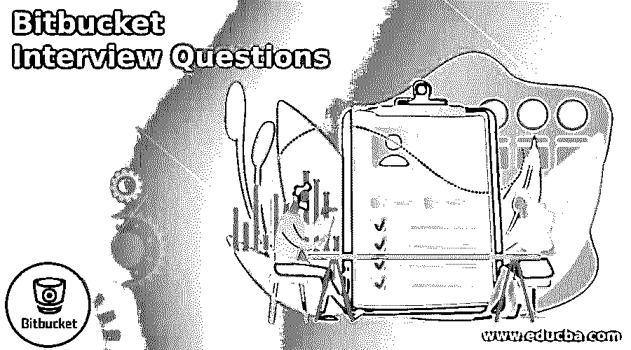

# Bitbucket 面试问题

> 原文：<https://www.educba.com/bitbucket-interview-questions/>

## Bitbucket 面试问题介绍

Bitbucket 在软件开发过程中起着非常重要的作用，可以使开发变得容易。从你的职业角度来看，了解 Bitbucket 是什么以及他们在面试中可以问什么类型的问题是非常重要的。Bitbucket 是一个基于 git 的工具，为开发者提供不同的服务，比如托管源代码。它还允许开发人员创建新的存储库等。在访谈过程中，他们可以基于 Bit Bucket 工具提出问题，例如什么是拉动式请求，什么是合并和创建回购等。

这篇 2022 Bitbucket 面试问题的文章将呈现 09 个最重要、最常被问到的 Bitbucket 面试问题。这些面试问题分为以下两部分:

<small>网页开发、编程语言、软件测试&其他</small>

### 第 1 部分–服务器面试问题和答案(基础)

这第一部分包括基本的面试问题和答案。

#### 1.Bitbucket 中的管道是什么？

**答案:**

Bitbucket Pipelines 是另一种 CI/CD 机械组件，特别像 CircleCI 或 Travis CI。这是一个构造，每次你把代码推到开始的时候，你可以在你的库上计划和执行快速系统。我们可以在我们的创建服务器上运行测试、制造和 SSH，在此期间移动代码或重启进程，用发光的 catches 连接起来以保持消息灵通。与此同时，Pipelines 实现了您的一切基本需求。

CI/CD 装置是物品收集进程的基础。无论您是否使用它来自动化测试、运输周期或与客户的关联，所有聚会都可以通过将 CI/CD 加入到他们的工作交互中来受益。Bitbucket Pipelines 是 Bitbucket Cloud 的 CI/CD，它整合在 UI 中，位于您的存储设施附近，简化了 it，便于人们进行设计、测试和发送代码。束新的 CI/CD 的整个方式，通过那些与当今的运动和计划的管道。

#### Q2。Bitbucket 中的服务器是什么？

**答案:**

Bitbucket 服务器也称为 stash 基本上，Bitbucket 服务器结合了 git 服务器和在 maven 帮助下创建的 web 接口。通过使用这种组合，我们既可以执行 git 操作，也可以按照我们的要求审查代码。

#### q3。什么是存储库，我们如何在 Bitbucket 中创建它？

**答案:**

这个存储库只不过是一个基于云的存储平台，提供商业计划的托管服务，并且是免费的。换句话说，我们可以说，我们意识到 Bitbucket 是用来为高级专家小组处理 git 库的。因此，它给出了处理所有 git 库的焦点答案，并在产品的所有改进流程中协同工作。

首先，我们需要在 Bitbucket 中创建一个没有代码的空存储库。这没问题，因为我们将很快开始添加一些记录。创建一个商店后，您将复制一个版本到您附近的结构中；这样，你可以从一个回购激活它，然后将这些运动转移到下面。

对于创建位存储库，我们希望遵循如下类似的步骤。

1.  在 Bitbucket 中，我们希望点击+图像并选择 Repository 选项卡。
2.  在 Repository 选项卡中，我们创建了另一个仓库。
3.  选择该选项并填写所需的数据，例如，归档名称、访问级别和项目名称，此外，我们还有包含保险库描述的高级设置选项。

#### Q4。什么是 Bitbucket DevOps 工具？

**答案:**

我们知道 Bitbucket 是 Atlassian 的一部分。它使用第三方工具提供不同的服务，如开发、运营和业务团队。

#### Q5。什么是 ssh 密钥，我们如何在 Bitbucket 中生成它？

**答案:**

通常，SSH 密钥用于建立位桶和服务器之间的安全连接。在 SSH 密钥的操作过程中，我们想要创建两个密钥:私钥和公钥。私钥在附近的机器上处理，公钥在 Bitbucket 上继续。SSH key Bitbucket 的后一个策略确认了重要的一对，并据此给出了段落。

SSH 密钥的生成取决于操作系统；在这里，我们讨论了如下窗口。

在创建 SSH 密钥时，我们需要检查本地机器上现有的密钥。如果 SSH 密钥可用，我们可以直接利用它；否则，我们需要使用以下命令来创建它。

cd *指定用户配置文件*。嘘

dir id_*

ssh-keygen–t 指定的密钥–c“指定的电子邮件 id”

### 第 2 部分 Bitbucket 面试问题和答案(高级)

现在让我们来看看高级面试的问题和答案。

#### Q6。Bitbucket 中的分布式系统是什么？

**答案:**

Bitbucket 支持分布式系统，以协作的方式简化开发过程。

#### Q7。Bitbucket 有什么特点？

**答案:**

Bitbucket 提供了如下特性。

1.  托管 git 存储库。
2.  Bitbucket 提供智能镜像。
3.  它提供了一个内置的交付过程。
4.  其中一个重要的特点就是集群化。
5.  我们可以很容易地跟踪 Bitbucket 中的问题。
6.  比特桶允许我们整合吉拉。
7.  在 bitbucket 中，我们根据需要添加了一些第三方工具。

#### Q8。如何在 Bitbucket 中管理代码？

**答案:**

我们知道 Bitbucket 为开发人员提供了处理代码的中央存储库，他们可以轻松地托管代码。

#### Q9。Bitbucket 和 GIT 的基本区别是什么？

**答案:**

GIT 在本地机器上运行，而不是在云上，另一方面，Bitbucket 是一个基于云的 GIT 存储库服务，它结合了团队成员。它还提供了一个基于 web 的界面。最后，Bitbucket 是一个开源工具，我们可以在一个集中的存储库中维护代码，这样任何人都可以在需要时轻松访问代码。

### 结论

我们希望从这篇文章中你能学到更多关于比特桶面试问题的知识。从上面的文章中，我们已经理解了不同比特桶问题的基本思想，并看到了其表现形式。从这篇文章中，我们了解了关于 bitbucket 的不同问题。

### 推荐文章

这是一个比特桶面试问题和答案列表的指南，以便候选人可以轻松地解决这些面试问题。在本帖中，我们研究了面试中经常被问到的最常见的面试问题。您也可以阅读以下文章，了解更多信息——

1.  [电子工程面试问题](https://www.educba.com/electronics-engineering-interview-questions/)
2.  [GitHub 面试问题](https://www.educba.com/github-interview-questions/)
3.  [Java 并发面试问题](https://www.educba.com/java-concurrency-interview-questions/)
4.  [Webpack 面试问题](https://www.educba.com/webpack-interview-questions/)

