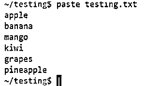
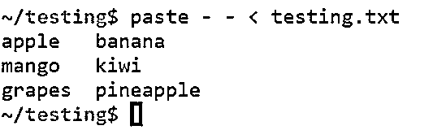
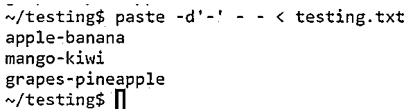
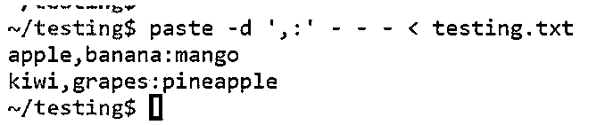
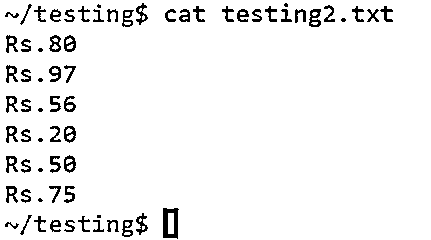
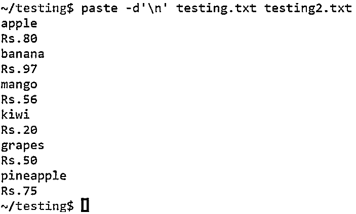
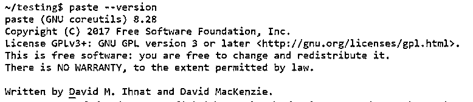
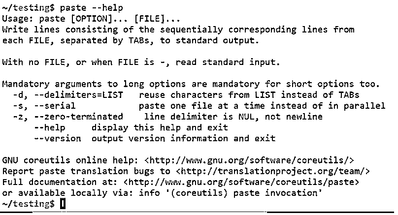

# Unix 中的粘贴命令

> 原文：<https://www.educba.com/paste-command-in-unix/>

## Unix 中的粘贴命令简介

Unix 中的 Paste 命令是 Unix 或 Linux Shell 脚本中最常见和最有用的命令之一。paste 命令的主要用途是通过用制表符分隔每个文件的行来水平连接文件，以获得所需的输出。粘贴命令可用于合并单个文件或合并一组文件。通常，粘贴命令用于单个文件处理和多个文件处理。

**语法:**

<small>网页开发、编程语言、软件测试&其他</small>

Unix Shell 脚本中粘贴命令的基本语法如下所示:

`paste [option].. [files]..`

### 粘贴命令在 Unix 中是如何工作的？

paste 命令的主要用途是通过用制表符分隔每个文件的行来水平连接文件，以获得所需的输出。

粘贴命令中可用的选项有:

*   **-d，分隔符:**指定输入参数中提到的分隔符，以指定的方式显示输出。
*   **––帮助:**该选项有助于显示粘贴命令中可用的帮助信息和选项。
*   **––版本:**显示系统中正在运行的粘贴命令的版本，并退出。
*   **–s，-serial:** 帮助以水平格式显示文件中的内容。

### Unix 中的粘贴命令示例

下面是 Unix 中粘贴命令的示例:

**a .用于单个文件处理的粘贴命令。**

让我们考虑一个文件“testing.txt”有以下内容。我们可以使用“cat”命令列出文件中的内容，如下所示:

**代码:**

`cat testing.txt`

**输出:**

对单个文件的粘贴命令类似于 Unix 中的 cat 命令。在下面的例子中，你可以看到粘贴命令的功能与 cat 命令相同。

**代码:**

`paste testing.txt`

**输出:**

#### 示例#1:选项-s

选项“s”用于将成行的内容连接成水平格式。由于没有指定分隔符，因此“tab”被用作列分隔符的分隔符。

**语法:**

`paste -s  file_name.txt`

**代码:**

`paste -s testing.txt`

**输出:**

#### 示例 2:选项 d

粘贴命令与选项' d '一起使用时，用于提及分隔符。当它与-d 和-s 结合使用时，文件中的行会合并成一行，并指定分隔符。

**语法:**

`paste -d, -s file_name.txt`

**代码:**

`paste -d, -s testing.txt`

**输出:**

#### 示例 3:合并一列中的内容

选项'-'用于从给定的输入文件中读取一行。输入中传递的'-'的数量将给出并排拆分的行数。

**语法:**

`paste - - < file_name.txt`

**代码:**

`paste - - < testing.txt`

**输出:**

#### 示例#4:用分隔符合并内容

通过指定分隔符，我们还可以用指定的分隔符将行分成列。

**语法:**

`paste -d'-' - - < file_name.txt`

**代码:**

`paste -d ' - ' - - < testing.txt`

**输出:**

#### 示例 5:将数据合并到不同的分隔符中

我们还可以通过在输入参数中传递两个不同的分隔符来合并文件中具有不同分隔符的行。

**语法:**

`paste -d',:' - - - < file_name.txt`

**代码:**

`paste -d ' , : ' - - - < testing.txt`

**输出:**

**b .多个文件处理的粘贴命令选项。**

让我们考虑一个文件“testing2.txt ”,它包含以下几行:

**代码:**

`cat testing2.txt`

**输出:**

#### 示例#1:选项粘贴

当我们试图粘贴两个文件时，paste 命令会将输入中提到的两个文件并排放在一起。

**语法:**

`paste file1.txt file2.txt`

**代码:**

`paste testing.txt testing2.txt`

**输出:**

#### 例 2: **选项-d**

选项“d”有助于合并两个文件，并在输入参数中指定分隔符。

**语法:**

`paste -d, file1.txt file2.txt`

**代码:**

`paste -d, testing.txt testing2.txt`

**输出:**

#### 示例#3:选项' \n '

unix 中的粘贴命令也可以用来交替读取两个文件中的行。每一行被一个接一个地交替显示，并作为输出给出。

**语法:**

`paste -d'\n' file1.txt file2.txt`

**代码:**

`paste -d ' \n ' testing.txt testing2.txt`

**输出:**

#### 示例#4:选项–版本

该选项帮助我们了解系统中使用的粘贴命令的版本。

**语法:**

`paste –version`

**代码:**

`paste - - version`

**输出:**

#### 示例 5: **选项–帮助**

“–help”选项用于显示 Unix Shell 脚本中可与 paste 命令一起使用的选项。

**语法:**

`paste –help`

**代码:**

`paste - -help`

**输出:**

### 结论

从上面的文章中，我们现在清楚了如何在 Unix Shell 脚本中使用 paste 命令，并根据所需的输出使用不同的选项。粘贴命令通常用于合并给定输入文件中的一行或多行。正如我们在上面的文章中看到的，可以在粘贴选项中处理单个或多个文件。

### 推荐文章

这是 Unix 中粘贴命令的指南。这里我们讨论一下简介，粘贴命令在 unix 中是如何工作的？并附有示例。您也可以看看以下文章，了解更多信息–

1.  [对于 Unix 中的循环](https://www.educba.com/for-loop-in-unix/)
2.  [Crontab in Unix](https://www.educba.com/crontab-in-unix/)
3.  [Unix 中的 VI 编辑器](https://www.educba.com/vi-editor-in-unix/)
4.  [Unix 的使用](https://www.educba.com/uses-of-unix/)

