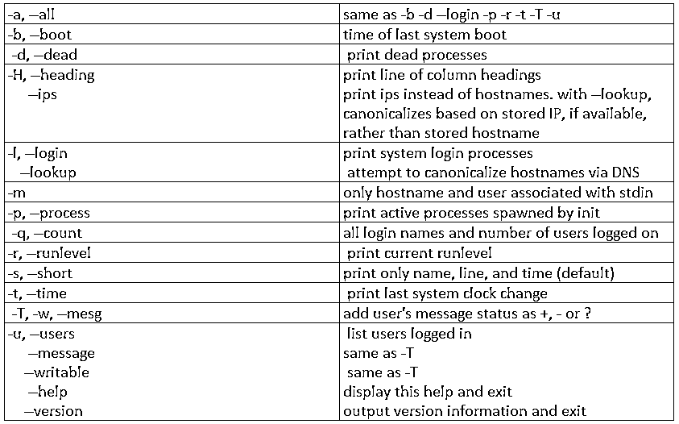
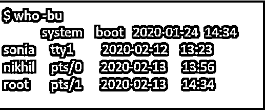

# Unix 中的世卫组织命令

> 原文：<https://www.educba.com/who-command-in-unix/>

## Unix 中世卫组织命令的定义

在 Unix 中，“who”命令允许显示或打印当前已登录到您的 Unix 计算机系统的用户数量。在 Unix 中不带命令行参数的 who 命令的主要用途是显示当前登录的用户名。此外，基于 Unix 系统，我们还可以获得打印终端的信息和他们登录的时间。who 命令用于打印当前登录的所有用户的信息。

Unix 中的 Who 命令用于确定以下信息:

<small>网页开发、编程语言、软件测试&其他</small>

1.  上次系统启动的时间。
2.  系统当前时间戳的运行级别。
3.  登录到系统的用户列表等等。

### 世卫组织命令在 Unix 中是如何工作的？

`Usage: who [OPTION]... [ FILE | ARG1 ARG2 ]`

**描述:**提供当前已登录用户的信息。以下是“who”命令行提供的几个选项及其说明。

**语法:**

Unix 中 who 命令的语法如下所示:

`who [option]..[file] [am I ]`

### Unix 中世卫组织命令的例子

下面是一些例子:

#### 1.没有选择

谁的命令没有任何输入参数，将显示系统的信息，如用户名，登录时间，用户的终端，以及系统上的主机名。

**命令:**

`who`

**输出:**

以上示例给出了有关用户的以下信息:

*   已登录的用户的名称。
*   终端中的行号。
*   用户登录系统的时间。
*   已登录用户的主机名。

#### 2.选项-H

选项-H 用于显示 who 命令中显示的列标题。

**命令:**

`who -H`

**输出:**

#### 3.选项-q

此选项将允许显示登录系统的登录名和用户总数。

**命令:**

`who -q`

**输出:**

#### 4.选项-m

要仅显示与 stdin 链接的主机名和用户，我们可以使用选项-m，如下所示。

**命令:**

`who -m`

**输出:**

#### 5.选项 b

我们可以看到系统上次启动的用户和时间。当-b 选项与-c 选项一起使用时，它将允许在输出中列出登录的用户。

**命令:**

`who -b`

**输出:**

**命令:**

`who -bu`

**输出:**

#### 6.选项-r

要检查当前的处理运行级别，我们可以使用-r 选项，如下所示。

**命令:**

`who -r`

**输出:**

#### 7.选项-d

该选项将有助于确定系统中的死进程。

**命令:**

`who -d`

**输出:**

检查 INIT 派生处理的所有活动进程。

**命令:**

`who -p -H`

**输出:**

#### 8.打印系统的用户名

我们可以通过下面的语法显示当前系统的用户名。

**命令:**

`who am I`

**输出:**

打印当前登录用户的所有信息。

**命令:**

`id`

**输出:**

#### 9.选项 w

' w '命令为我们提供了关于当前登录用户的更多附加信息。用户名、当前登录时间、用户空闲天数等。该选项的示例如下:

**命令:**

`w`

**输出:**

### 结论

在 unix 中不带命令行参数的 who 命令的主要用途是显示当前登录的用户名。此外，基于 Unix 系统，我们还可以获得打印终端的信息和他们登录的时间。who 命令用于打印当前登录的所有用户的信息。

### 推荐文章

这是 Unix 中世卫组织命令的指南。在这里，我们还将讨论 who 命令的定义和在 unix 中的工作方式，以及不同的示例和代码实现。您也可以看看以下文章，了解更多信息–

1.  [Crontab in Unix](https://www.educba.com/crontab-in-unix/)
2.  [Unix 中的数组](https://www.educba.com/array-in-unix/)
3.  [Unix Shell 命令](https://www.educba.com/unix-shell-commands/)
4.  [Unix 文件权限](https://www.educba.com/unix-file-permissions/)

