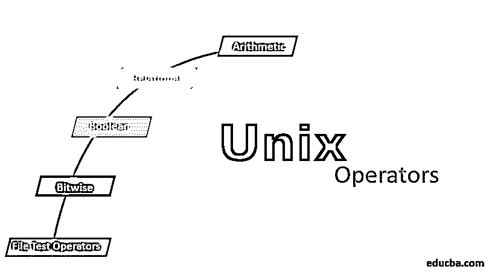
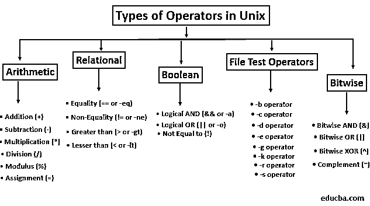

# Unix 操作员

> 原文：<https://www.educba.com/unix-operators/>

## Unix 操作符简介

支持变量之间操作的实体可以分为不同的类型，它们之间具有一定的重要性顺序，并且在每种类型中还可以存在某些子类。每个表单中的子类别都有特定的执行顺序，子类别中的每个实体在处理必要数量的变量时都有其特殊的意义。从 Unix 编程的意义上来说，使用对其自身来说是唯一的逻辑进行操作，并且符合数学、逻辑或算法的原则，这被称为 Unix 操作符。

Unix 由 3 部分组成:内核、外壳和程序。

<small>网页开发、编程语言、软件测试&其他</small>

*   内核是 Unix 的核心，它为任务管理时间和内存
*   Shell 是内核和用户之间的 CLI ( [命令行接口](https://www.educba.com/what-is-cli/))。当用户登录系统时，他进入 shell，在那里接受命令并调用相应的程序来处理这些命令。
*   程序和文件 Unix 的各种命令都记录在手册中，可以通过键入 man <command></command>来访问。还有一些在 shell 中运行的进程由它们唯一的 PID(进程标识符)来标识。存储在 Unix 中的文件和目录有一个以/开始的层次结构/路径，意思是根目录。

### Unix 中的运算符类型

Unix 中有 5 种基本操作符，分别是:
1。算术
2。亲戚
3。布尔型
4。文件测试操作员
5。按位

#### 1)算术运算符

这些用于执行算术数学运算。以下是一些算术运算符:

*   **加法(+):** 用于执行两个操作数之间的加法
    例如:c=`expr $a + $b '
*   **减法(-):** 用于执行两个操作数之间的减法
    例如:c = ' expr $ a–b '
*   **乘法(*):** 用于将两个操作数的值相乘
    例如:c=`expr $a \* $b '
*   **除法(/):** 用于将第一个操作数除以第二个操作数
    例如:c=`expr $a / $b '
*   **模数(%):** 用于提供第一个操作数除以第二个操作数所得的余数
    例如:f=`expr $a % $b '
*   **赋值(=):** 用于将第二个操作数中给定的值赋给第一个操作数
    例如:c=$b
*   **增量(++):** 用于将操作数的值加 1。
    Ex:((a++)–后置递增，((++a))–前置递增，((a-)–后置递减，((–a))–前置递减

#### 2)关系运算符

这些用于比较和找出两个操作数之间的关系。以下是一些关系运算符:

*   **相等(==或-eq):** 如果两个操作数相等，则返回 true，如果不相等，则返回 false。
    Ex:a = = $ b
*   **不平等(！=或-ne):** 这与相等运算符相反，如果两个操作数不相等，则返回 true，反之亦然。
    Ex:a！= $b
*   **大于(>或-gt):** 如果第一个操作数大于第二个操作数，则返回 true，反之亦然。
    Ex:a>b
*   **小于(<或-lt):** 如果第一个操作数小于第二个操作数，则返回 true，反之亦然。
    Ex:a<b
*   **大于或等于(> =或-ge):** 如果第一个操作数大于或等于第二个操作数，则返回 true，否则返回 false。
    Ex: $a > = $b
*   **小于或等于(< =或-le):** 如果第一个操作数小于或等于第二个操作数，则返回 true，否则返回 false。
    Ex: $a < = $b

#### 3)布尔/逻辑运算符

这些用于[对操作数执行逻辑运算符](https://www.educba.com/matlab-logical-operators/)。

*   **逻辑与(& &或-a):** 如果两个操作数都满足真条件，则返回布尔值真，否则返回假。
    例:当 a=20 且 b=5 时，this [ $a -lt 10 -a $b -gt 1]变为假，因为 a 不小于 10
*   **逻辑 OR (|| or -o):** 如果任何一个操作数满足条件，则返回布尔值 true，否则返回 false。
    例:当 a=20，b=5 时，这个[ $a -lt 10 -o $b -gt 1s]变为真，因为 b 大于 1 为真
*   **不等于(！):**如果操作数值为假，则返回布尔真值，反之亦然。
    例句:如果 a=true [！$a == true]为 false

#### 4)文件操作符

这些用于测试与 Unix 文件系统的各个文件相关的属性。

*   **-b 运算符:**当文件存在且为特殊块文件时为真，否则返回假
*   **-c 运算符:**当文件存在并且是字符型特殊文件时为真，否则返回假。
*   **-d 运算符:**如果给定的文件名是一个目录，则返回 true，否则返回 false。
*   **-e 运算符:**如果给定文件存在，则返回 true，否则返回 false。
*   **-g 运算符:**如果给定文件的 SGID(设置组 ID)位设置为真，该运算符将返回真。
*   **-k 运算符:**如果给定文件的 sticky 位设置为 true，则返回 true。
*   **-r 运算符:**如果给定文件对登录用户可读，则返回 true，否则返回 false。
*   **-s 运算符:**检查给定文件的大小，如果大于零则返回 true，否则返回 false。
*   **-u 运算符:**如果给定文件的 SUID(设置用户 ID)位设置为真，则返回真。
*   **-w 运算符:**如果用户必须对给定文件进行写访问，则返回 true，否则返回 false。
*   **-x 运算符:**检查给定文件是否可以被用户执行，否则返回 false。

#### 5)按位运算符

它们用于对操作数执行按位运算。

*   **按位 AND ( & ):** 这里对操作数的每一位进行 AND 运算。
    例如:对于下面所有的例子，考虑 a = 55 和 b = 23
    a&b = 01
*   **按位 OR (|):** 这里对操作数的每一位进行 OR 运算。
    例如:a | b = 77
*   **按位异或(^):** 这里对每个操作数执行异或运算。例:a ^ b = 76
*   **补码(~):** 对操作数的每一位执行补码，并返回值。
    Ex: ~a = AA

算术运算符可以独立使用，而其他类型的运算符需要与条件语句(如 if、switch 语句)结合使用才能使用其功能。
本文总结了 Unix 中主要的操作符类型及其示例。

### 推荐文章

这是 Unix 操作员指南。这里我们详细讨论 Unix 中运算符的基本概念和类型，包括算术、关系、布尔和按位。您也可以阅读以下文章，了解更多信息——

1.  [VB.NET 算子](https://www.educba.com/vb-dot-net-operators/)
2.  [Unix 职业生涯](https://www.educba.com/career-in-unix/)
3.  【UNIX 备忘单
4.  [Unix 中的函数](https://www.educba.com/functions-in-unix/)

