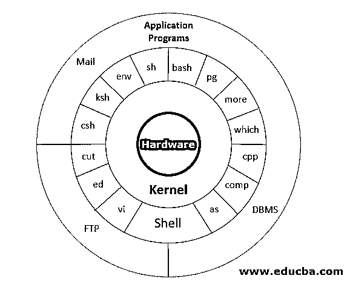
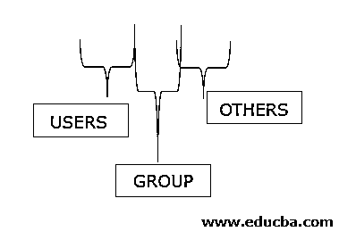

# Unix Shell 命令

> 原文：<https://www.educba.com/unix-shell-commands/>


## 什么是 Unix Shell 命令？

Unix shell 命令是 Unix 体系结构的四层之一，它使人能够与操作系统进行交互，通过解释器发出命令来指示操作系统开始某些进程。它由一组命令组成，如 cp、grep、cat、id、mv 等。，它们是预定义的并存储在库中。Unix shell 命令有三种类型:基本、中级和高级，包括各种命令，如 ls、cat、rm、mv、mkdir、chmod、find、chown、chgrp、head、tail、grep、ln、cut 等。

### UNIX 架构

下面是下面的 [UNIX 架构](https://www.educba.com/unix-architecture/)下面提一下

<small>网页开发、编程语言、软件测试&其他</small>




*   **第一层:硬件**

这一层包括所有正在使用的硬件资源。

*   **第二层:内核**

内核就像操作系统的心脏。它是硬件和操作系统之间的交互模式。它还使用调度过程来管理任务和资源，以保证系统的平稳运行。

*   **第三层:外壳命令**

它是人类与操作系统交互并告诉它启动某些进程的方式。使用解释器，从定义已定义并存储在库中的所有命令集中给出操作命令。

命令的一些例子是 cp、mv、cat、grep、id、wc、nroff、a.out 等等。

*   **第四层:应用层**

它执行给定的外部应用程序。它是执行应用程序的最外层。

### Unix Shell 命令列表

下面是下面提到的 Unix Shell 命令的列表:

*   基本的。
*   中级。
*   高级。

让我们详细看看上面的 Unix Shell 命令列表

#### 1.基本 Unix Shell 命令

**a .列出文件(ls)–**‘ls’命令用于列出一个目录中的所有文件。

**语法-**

```
ls -<option> directory_name
```

**举例-**

```
ls test
```

| **选项** | **描述** |
| ls -a | 列出隐藏文件以“.”开头的所有文件 |
| ls –color | 显示彩色列表，可以是[=总是/从不/自动] |
| ls -d | 要列出所有目录 |
| ls -F | 向条目中添加一个字符 |
| ls -i | 要列出忽略案例的所有文件 |
| ls -l | 列出文件的所有细节 |
| ls -la | 列出包含隐藏文件的长格式 |
| ls -lh | 列出可读文件大小的长格式 |
| ls -ls | 带有文件大小的长格式列表 |
| ls -r | 逆序列表 |
| ls -R | 递归列出目录树 |
| ls -s | 列表文件大小 |
| ls -S | 按文件大小排序 |
| ls -t | 按时间和日期排序 |
| ls -X | 按扩展名排序 |

**b .创建&查看文件-**'[cat 命令可用于](https://www.educba.com/cat-command-in-linux/)创建文件或查看文件内容。

**语法—**

```
cat >filename
```

**示例—**cat>test1 . dat—将创建一个文件，并等待输入被写入文件。

cat filname–将在屏幕**上显示文件的内容。**

**c.** **删除文件—**‘RM’命令用于从目录中删除文件。

**语法-**

```
rm filename
```

| **标签** | **描述** |
| -f，–力 | 忽略不存在的文件，从不提示。 |
| ［构成来自拉丁语、结尾为-us 的名词的复数］ | 每次移除前提示。 |

**d .移动和重命名文件—**“mv”命令用于将文件从一个位置移动到另一个位置。当源文件被删除和新文件被创建时，该命令也可用于重命名文件。

**语法**–

```
mv <source_file> <target_file>
```

**示例—**mv test1.dat test2.dat—在这里，test1 文件的内容被复制到同一目录下的 test2 . dat，test1 . dat 文件被删除。

**e .制作目录—**Unix 还为我们提供了制作自己的目录的命令。这就像是制作一个我们自己的文件夹，所有相关的文件都可以保存在里面。

**语法—**

```
mkdir  <dir_name>
```

**示例—**mkdir/abi/sand/results—该命令将在/ABI/sand 路径下创建一个目录。如果/abi/sand/ path 不存在，此命令将不起作用。

#### 2.中间的

**a . Chmod–**有时，当我们需要写入写保护的文件时，我们需要更改赋予文件或目录的权限。这里的“chmod”命令用于给出合适的权限。但是应该知道授予权限的模式。

权限以 rwxrwxrwx 的形式给出




如果需要启用它，我们必须将权限设置为 1，如果需要禁用它，我们必须将权限设置为 0。

例如，如果希望只读取和执行用户和其他人的权限，而不是组的所有权限。那么我们必须将其设置为‘101111101’。如果转换成三个一组的十进制数，这意味着“575”。因此，对于授予权限，我们给出如下命令

**例子**--

```
chmod 575 file1.dat
```

**b . Find–**该命令用于查找特定目录及其子目录中的文件或目录。

**语法—**

```
find <options> <paths>
```

**示例—**

| **选项** | **描述** |
| 时间 | 如果文件在 n 天前被访问过，则返回 true |
| 时间 | 如果文件在 n 天前被更改，则返回 true |
| -时间 | 如果 n 天前修改了文件内容，则返回 true |
| -名字 | 如果文件名与特定模式匹配，则返回 true |
| -尺寸 | 如果文件大小为 n 个块，则返回 true。 |
| -c 型 | 如果被搜索的文件是 c 类型的，则返回 true(如果 c = 'f '表示它是一个文件；如果‘d’表示它是一个目录) |

**示例**–如果有人想在目录中搜索文件名“test1 ”,他应该发出这样的命令

```
find –type f –name test1 /abi/sand
```

–该命令将给出/abi/sand 目录中的所有 test1 文件

**c . chown–**更改文件的所有权。有时，有人希望更改文件的所有者，以便当前正在处理该文件的人可以访问该文件。只有文件的所有者有权更改文件所有权。

**语法**:

```
chown [owner] [file]
```

**示例**:将 test1 的所有者更改为用户名‘aaggasa’，假设当前用户当前拥有它

```
> chown aaggasa test1
```

**d. chgrp** :改变文件的组所有权。该命令用于更改文件所属的组。只有文件的所有者有权更改文件所有权。

**语法**:

```
chgrp [group] [file]
```

**示例**:将 test1 的组改为 group2，假设当前用户当前拥有它。

```
> chgrp group2 test1
```

Unix 给了我们这个命令行工具来提取文件的第一部分。它将结果写入标准输出。

**语法**–

```
head <option> <filename>
```

| **选项** | **描述** |
| **-n** | 用于指定要提取的行数 |
| **–****c** | 用于指定要提取的字节数。 |
| **-q** | 用于隐藏标题行。 |

**示例**–如果有人想提取文件的前 5 行，我们必须使用

```
>head –n 5 /abi/sand/test1.dat
```

**注意**–默认情况下，如果 head 命令没有指定选项，UNIX 将显示 10 行。

Unix 给了我们这个命令行工具来提取文件的第一部分。它将结果写入标准输出。

**语法**–

```
tail <option> <filename>
```

| **选项** | **描述** |
| **-n** | 用于指定要提取的行数 |
| **–****c** | 用于指定要提取的字节数。 |
| **-q** | 用于隐藏标题行。 |

**示例**–如果有人想提取文件的前 5 行，我们必须使用

```
>head –n 5 /abi/sand/test1.dat
```

**注意**–默认情况下，如果没有用 head 命令指定的[选项，UNIX 将显示 10 行。](https://www.educba.com/head-command-in-linux/)

#### 3.高级 Unix Shell 命令

a. Grep: 这是一个命令实用程序，有助于在文件中搜索特定的模式或字符。它返回与该特定文件中的模式匹配的所有行。

**语法-**

```
grep <options> <pattern> <files>
```

| **选项** | **描述** |
| 同-EN | 显示匹配的行及其行号。 |
| -v | 打印与图案不匹配的线条。 |
| -我 | 显示文件名列表。 |
| -丙 | 可以提取与模式匹配的行数。 |
| -h | 显示匹配的行，但不显示文件名 |
| ［构成来自拉丁语、结尾为-us 的名词的复数］ | 忽略匹配的大小写 |
| -w | 匹配表达式中的整个单词 |

**b. ln:** 对文件和目录进行链接和符号链接。符号链接由一种特殊类型的文件组成，该文件包含对另一个文件的引用。这有助于在文件之间创建链接。有两种类型的链接"

1.  软链接——指的是文件的抽象路径。
2.  硬链接——指的是该文件的确切位置，

使用“ln”命令创建软链接。

**语法**–

```
ln -s {source_filename} {symbolic_filename}
```

**示例**–如果我们想要创建到路径'/abi/sand/dir1 '的软链接 l1，那么我们必须执行以下命令:-

```
>ln link1 /abi/sand/dir1
```

该命令将在当前目录中创建一个指向该目录的链接

要检查链接，请执行-

```
ls –l
```

**输出**–lrwxrwxrwx 1 Priya Priya 16 2007-09-25 22:53 link 1->/ABI/sand/dir 1

**c . cut–**该命令实用程序用于从文件中提取特定的列。要提取列，我们需要指定分隔符，这将有助于区分该文件中的列。

**语法**–

```
cut <options> <file>
```

| **选项** | **描述** |
| -丙 | 对于固定宽度的字段，使用-c 选项。 |
| -d | 用于指定分隔符。默认情况下，分隔符是制表符。 |
| -乙 | 用于指定要提取的字节数 |
| -f | 用于指定需要提取的字段编号。 |

**示例—**如果有人想从“city.txt”文件中提取第二个字段，其中“|”被视为列的分隔符。

```
cut –d "|" –f 2 city.txt
```

### 结论

Unix 命令是一个非常强大的工具，可以帮助用户执行进程和完成各种任务。它内置的解析器有助于使用各种脚本语言进行开发。借助其强大的命令集实用程序，甚至可以执行需要从寄存器读取的所有功能。

### 推荐文章

这是 Unix Shell 命令的指南。这里我们讨论 Unix 体系结构中的 Unix Shell 命令列表(基本、中级、高级)。您也可以看看以下文章，了解更多信息–

1.  [什么是 Unix Shell？](https://www.educba.com/what-is-unix-shell/)
2.  [Unix 文件系统](https://www.educba.com/unix-file-system/)
3.  [UNIX 管理员](https://www.educba.com/unix-administrator/)
4.  [Unix 操作员](https://www.educba.com/unix-operators/)


