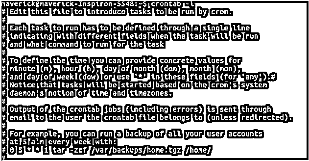

# Crontab in Unix

> 原文：<https://www.educba.com/crontab-in-unix/>


## Unix 中的 Crontab 简介

在预定义的时间执行特定命令时始终运行的实用程序称为 Crontab。当有需要重复执行的任务时，我们使用 crontab 文件。crontab 文件给出了 CRON 守护程序 shell 命令，这些命令在特定的日期和时间运行。简单来说，crontab 的工作方式与我们手机中的闹钟相同。如果我们把闹钟设在每天早上 6 点，闹钟会在每天早上的指定时间自动响起。Crontab 基于同样的原理，Unix 通过这种方式确保我们不会忘记重要的事件。

**Crontab 的语法如下:**

<small>网页开发、编程语言、软件测试&其他</small>

```
minute(s) hour(s) day(s) month(s) weekday(s) command(s)
```

*   Crontab 提供了六个字段。语句的执行时间表包含在前五个字段中，因此它们是整数字段。
*   顾名思义，分钟字段包含 0-59 范围内的值，以分钟为单位显示命令执行的时间。
*   顾名思义，小时字段包含 0-23 范围内的值，以小时为单位显示命令执行的时间。
*   顾名思义，day 字段包含 1-31 范围内的值，显示命令执行的天数。
*   顾名思义，month 字段包含 1-12 范围内的值，显示命令执行的月数。
*   顾名思义，weekday 字段包含 0-6 范围内的值，显示命令执行的天数。
*   Bourne shell 命令是要执行的第六个字段。
*   在前五个字段中使用星号(*)表示允许所有可能的值。
*   使用逗号(，)表示值列表。
*   使用连字符(-)表示值的范围。
*   使用分隔符(/)表示步长值。

### Crontab 在 Unix 中的工作

Red Hat Enterprise Linux 运行系统的任务，根据预配置更新系统。Red Hat Enterprise Linux 由自动化的任务实用程序组成，如 cron、at、batch 等。

Crontab 是一个在预定义的时间执行特定命令时始终运行的实用程序。如果我们想要按照期望的时间表运行命令表，我们使用 crontab。这些命令表可以使用命令 crontab 进行管理。Crontab 是 cron 表的缩写。这些作业由调度程序 cron 执行，因此得名 cron 表。Chronos 是希腊语中表示时间的词，cron 是以 Chronos 命名的。

例如，可以将 cron 作业设置为每周、每月或每天运行一次文件，或者如果我们希望每天备份数据库，则可以使用 cron 作业来运行脚本，以便每天自动备份数据库，而无需手动运行脚本。例如，要在每周早上 5 点运行用户帐户的备份，必须使用以下命令，如下面的快照所示。




cron 守护进程由可以使用 crontab 安装、卸载或列出的表驱动。每个用户都拥有一个单独的 crontab，它们是/var 中的文件。虽然它们在/var 中，但不能直接编辑。如果要调用用户的 crontab，必须使用-u 选项。如果不使用-u 选项，则为执行命令的人执行 crontab。

crontab 命令可以使用以下选项:

*   **Crontab-文件名:**Crontab 文件是要安装的文件名。
*   **Crontab -e:** 该选项用于待编辑的 Crontab 文件。如果 crontab 文件尚不存在，则会创建一个新文件。
*   **Crontab -l:** 该选项显示 Crontab 文件。
*   **Crontab -r:** 该选项删除 Crontab 文件。
*   **Crontab -v:** 显示上次编辑 Crontab 文件的时间。

Cron 使用一种算法在内部调度作业。

该算法的工作原理如下:

1.搜索帐户持有人的所有主目录，以找到名为“”的文件。crontab”当 cron 启动时。

2.找出对找到的 crontab 文件运行命令的时间。

3.事件列表将那些要执行的命令与时间一起放在它们的队列中，放在五个字段中。

4.接下来，它进入主循环:

*   当任务进入队列时，检查任务并确定它在未来运行多长时间。
*   它在未来运行的时间段就是它休眠的时间段。
*   如果用户创建了任务，他就拥有某些特权。当 cron 在验证时间后唤醒时，用户在后台执行该任务。
*   找出下次运行该命令的时间，并在该时间点将该命令放回事件列表的队列中。

在不同的服务器上设置 cron 作业有不同的选项。无法在不支持 Cron 的服务器上设置 cron 作业。通过控制面板，可以在一些服务器上设置 cron 作业。Easycron 是那些不支持 cron 的服务器的解决方案之一。

### 例子

*   Crontab 在每天下午 3:15 运行一个命令

```
15 15 * * * /path/to/script/script.sh
```

*   Crontab 只在星期一的同一时间运行相同的脚本。

```
15 15 * * 1 /path/to/script/script.sh
```

*   Crontab 在星期一和星期四的同一时间运行相同的脚本。

```
15 15 * * 1,4 /path/to/script/script.sh
```

*   Crontab 在星期一和星期二的同一时间运行相同的脚本。

```
15 15 * * 1-2 /path/to/script/script.sh
```

### 结论

Unix 操作系统中最有用的实用程序是 Crontab。我们可以使用 crontabs 在指定的时间执行命令。这些命令称为 cron 作业。他们有各种各样的应用程序，如运行计划备份、监控磁盘空间、运行系统维护任务等。

### 推荐文章

这是 Unix 中 Crontab 的指南。在这里，我们讨论了 Crontab 在 Unix 中的示例和工作方式以及语法。您也可以看看以下文章，了解更多信息–

1.  [Unix Shell 命令](https://www.educba.com/unix-shell-commands/)
2.  [Unix 操作员](https://www.educba.com/unix-operators/)
3.  [Unix 中的数组](https://www.educba.com/array-in-unix/)
4.  [Unix 的使用](https://www.educba.com/uses-of-unix/)


