# Unix 中的 egrep 命令

> 原文：<https://www.educba.com/egrep-command-in-unix/>

## Unix 中的 egrep 命令简介

Unix shell 脚本中的 egrep 命令属于 grep 命令家族，用于在 Unix 中搜索和匹配特定模式。egrep 的工作方式类似于 grep-E(grep Extended regex′)。egrep 一般搜索一个特定的文件，甚至是逐行搜索，或者打印输入文件中扫描了正则表达式的那一行。它将选择的模式作为正则表达式，并最终打印出与指定模式相同的输出行。在任何情况下，如果有许多文件具有相同的匹配模式，那么它将给出输出，显示与每行模式匹配的文件名。

### 从 egrep 命令我们能做什么？

借助 egrep 命令，在 Unix 中有许多选项可以搜索和匹配特定的模式。我们可以执行 n 个搜索模式，并获得 egrep 命令所需的输出。

<small>网页开发、编程语言、软件测试&其他</small>

以下是可用于搜索和匹配模式的几个选项:

**模式选择和解释:**

| -E，–扩展正则表达式 | 模式是一个扩展的正则表达式。 |
| -F，–固定字符串 | 模式是一组换行符分隔的字符串。 |
| -G，–基本正则表达式 | 模式是一个基本的正则表达式(默认)。 |
| -P，–perl-regexp | 模式是一个 Perl 正则表达式。 |
| -e，–regexp =模式 | 使用模式进行匹配。 |
| -f，–FILE = FILE | 从文件中获取模式。 |
| -我-忽略-案例 | 忽略大小写区别。 |
| -w，–单词正则表达式 | 强制模式只匹配整个单词。 |
| -x，–行正则表达式 | 强制模式只匹配整行。 |
| -z, –null-data | 数据行以 0 字节结尾，而不是换行。 |

**输出控制:**

| -m，-最大计数=NUM | 在选定行数后停止。 |
| -b，–字节偏移量 | 用输出行打印字节偏移量。 |
| -n，–行号
–线路缓冲 | Print line number with output lines.刷新每一行的输出。 |
| -H，–带有-filename | 打印文件名和输出行。 |
| -h, –no-filename
–label=LABEL | Suppress the file name prefix on output.使用 LABEL 作为标准输入文件名前缀。 |
| -o，–only-匹配 | 仅显示线条匹配图案的一部分。 |
| 安静，安静 | 抑制所有正常输出。 |
| -a，-文本 | 相当于–二进制文件=文本。 |
| -d，–目录=操作 | How to handle directories;操作为“读取”、“递归”或“跳过”。 |
| -r，–递归 | like–directory = recurse。 |
| -R，–解引用递归
–包含=文件模式–排除=文件模式–排除-从=文件–排除-目录=模式 | Likewise, but follow all symlinks.仅搜索与 FILE_PATTERN 匹配的文件跳过与 FILE_PATTERN 匹配的文件和目录。从文件中跳过匹配任何文件模式的文件。匹配模式的目录将被跳过。 |
| -L，–不匹配的文件 | 仅打印没有选定行的文件名。 |
| -l，–匹配文件 | 仅打印带有选定行的文件名。 |
| -c，–计数 | 每个文件只打印选定的行数。 |
| -T，–首字母-tab | 使标签对齐(如果需要)。 |
| -Z，–null | 在文件名后打印 0 字节。 |

**上下文控制:**

| -B，–在上下文之前–编号 | 打印前导上下文的 NUM 行。 |
| -A，–后上下文–编号 | 打印结尾上下文的 NUM 行。 |
| -C，–上下文–编号 | 打印输出上下文的 NUM 行。 |
| -数字 | 同–context = NUM。 |
| –color[= WHEN]， | 使用标记突出显示匹配的字符串； |
| –颜色[=何时] | 什么时候是“总是”、“从不”或“自动” |
| -U，-二进制 | 不要在停产时去掉 CR 字符(MSDOS/Windows)。 |

**egrep 的语法:**

egrep 命令需要一个选项来提到，匹配模式和文件名来搜索和匹配文件中的模式。

以下是 egrep 命令的语法:

`egrep [options] [pattern] [files..]`

### 在 Shell 脚本中使用 egrep 命令的示例

让我们假设有一个名为“testing.txt”的文件，其中包含以下数据，我们将使用该文件并展示以下示例:

**代码:**

`cat testing.txt`

**输出:**

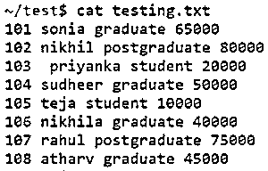

#### 例#1: **选项-c**

它用于计算文件中与模式匹配的行数。

**语法:**

`egrep -c [pattern] file_name`

**代码:**

`egrep -c student testing.txt`

**输出:**

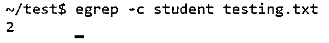

#### 示例#2 **选项-v**

此选项有助于打印与输入参数中指定的模式不匹配的行。

**语法:**

`egrep -v [pattern] filename`

**代码:**

`egrep -v student testing.txt`

**输出:**

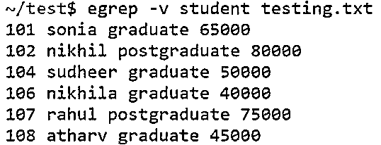

#### 示例 3:选项一

它显示文件中与输入模式匹配的行，而忽略字母的大小写。

**语法:**

`egrep -i [pattern] filename`

**代码:**

`egrep -i student testing.txt`

**输出:**

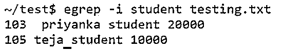

#### 示例#4:选项-w

它只显示包含完整单词的行。

**语法:**

`egrep -w [pattern] filename`

**代码:**

`egrep -w graduate testing.txt`

**输出:**

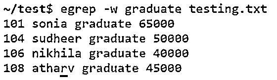

#### 示例 5:选项-x

使用此选项，我们只能打印输入文件中给出的整行。

**语法:**

`egrep -x [line] filename`

**代码:**

`egrep -x '101 sonia graduate 65000' testing.txt`

**输出:**

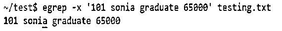

#### 示例 6:选项-m

使用此选项，它将继续搜索模式，直到输入中提到的计数数量达到参数中提到的数量。

**语法:**

`egrep -m [number] [pattern] filename`

**代码:**

`egrep -m 3 graduate testing.txt`

**输出:**

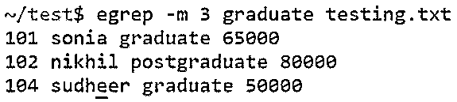

#### 示例#7:选项-r

它递归地扫描输入参数中给出的匹配模式。它将为您提供文件中与输入模式匹配的信息。

**语法:**

`egrep -r [pattern] filename`

**代码:**

`egrep -r '*grad*' testing.txt`

**输出:**

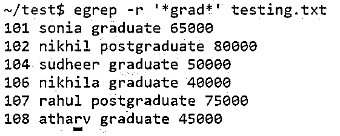

#### 例 8:选项“或”

我们可以使用竖线“|”符号来选择“或”。当我们必须在两个选项中做出选择时，就用 OR。

**语法:**

`egrep 'option1|option2' filename`

**代码:**

`egrep 'sonia|teja' testing.txt`

**输出:**

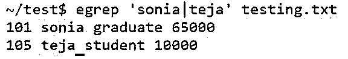

#### 例 9: **选项-l**

该选项有助于只打印包含匹配模式或字符串的文件名。它只会给你匹配字符串的文件名。

**语法:**

`egrep -l 'string' filename_pattern`

**代码:**

`egrep -l sonia *.txt`

**输出:**

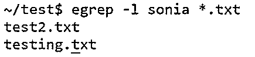

#### 示例#10:选项-o

我们可以只打印文件中指定的模式，而不是打印文件中的整行。输出将显示该单词在指定文件中出现的次数。

**语法:**

`egrep -o [pattern] filename`

**代码:**

`egrep -o student testing.txt`

**输出:**

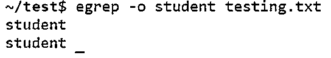

### 结论

Unix shell 脚本中的 egrep 命令属于 grep 命令家族，用于在 Unix 中搜索和匹配特定模式。egrep 的工作方式类似于 grep-E(grep Extended regex′)。egrep 一般搜索一个特定的文件，甚至是逐行搜索，或者打印输入文件中扫描了正则表达式的那一行。

### 推荐文章

这是 Unix 中 egrep 命令的指南。这里我们讨论一下入门，从 egrep 命令可以做什么？以及使用 egrep 命令的示例。您也可以看看以下文章，了解更多信息–

1.  [对于 Unix 中的循环](https://www.educba.com/for-loop-in-unix/)
2.  [Crontab in Unix](https://www.educba.com/crontab-in-unix/)
3.  [Unix 中的 VI 编辑器](https://www.educba.com/vi-editor-in-unix/)
4.  [Unix 的使用](https://www.educba.com/uses-of-unix/)

