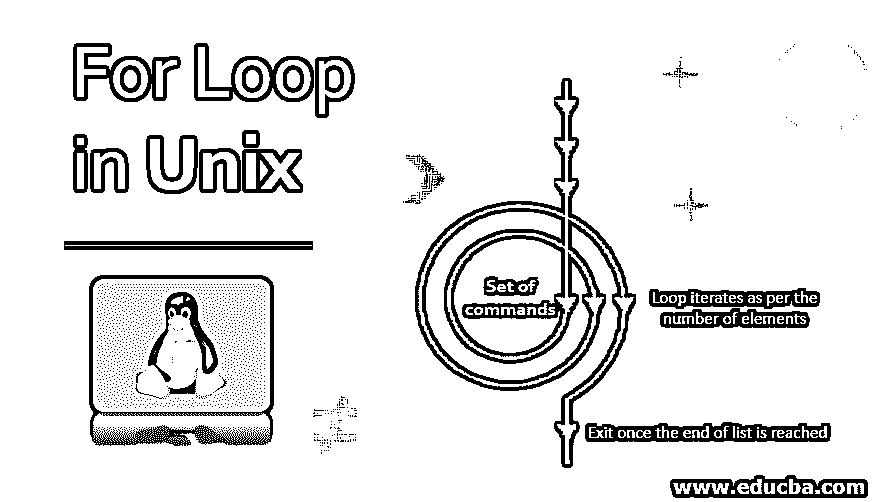
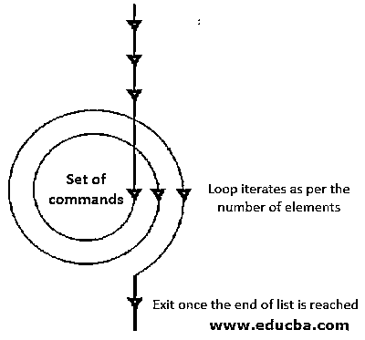
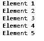
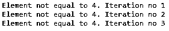
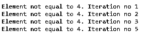
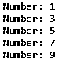

# Unix 中的 For 循环

> 原文：<https://www.educba.com/for-loop-in-unix/>




## Unix 中 For 循环概述

循环只不过是一系列不断重复的指令，直到达到某个条件。它对项目列表进行操作，并对列表中的每个项目重复一组命令。循环是任何编程语言的基本概念。在 Unix 中，使用了四种循环编程:

*   While 循环
*   [为循环](https://www.educba.com/for-loop-in-matlab/)
*   直到循环
*   选择循环

不同的循环用于不同的情况。对于一个优秀的程序员来说，根据情况使用适当的循环是至关重要的。具体说 for 循环。该循环被执行当前次数。循环对给定的项目列表进行操作，并对列表中的每个项目执行命令集。

<small>网页开发、编程语言、软件测试&其他</small>

**语法:**

```
for item in element1 element2 element3 . .. element
do
Set of commands
done
```

这里的 item 是一个接一个分配给元素的变量名。这里是元素 1 元素 2 元素 3。..元素是由空格分隔的字符序列。

### Unix 中的 For 循环是如何工作的？

当您想要多次运行一组命令时，可以使用循环。每次执行循环时，都称为一次迭代。当循环执行时，该值被赋给一个名为 item 的变量。当我们在循环中迭代时，它被设置为元素列表中的下一个元素。让我们借助一个例子来理解回路的工作原理。




### Unix 中 For 循环的示例

让我们借助一些基本的例子来理解 for 循环的用法。

#### 示例#1

让我们看一个简单的 for 循环语句的例子。

**代码:**

```
for var in 1 2 3 4 5
do
echo "Element $var"
done
```

**输出:**




**解释:**在上面显示的脚本中，for 循环将遍历列表(1 2 3 4，因为列表包含五个元素，因此循环运行五次。Echo 命令打印语句，如上面的输出所示。$告诉 shell 解释器将 var 视为一个变量名，并用它的值来代替它，而不是将其视为文本或外部命令。

使用下面提到的命令可以改变循环的流程。

*   **Break:** 中断循环流，并单步执行代码，直到循环结束。这样做的目的是，一旦执行了某个命令集，或者直到 break 语句满足了条件，您就想终止整个循环的执行。
*   **Continue:** Continue 命令类似于 break 语句，除了它退出循环的当前迭代，而不是整个循环。目的是在发生错误时使用，并且我们愿意在循环的其他迭代中进一步执行代码。

#### 实施例 2

让我们看一个带有 break 语句的例子。

**代码:**

```
for var in 1 2 3 4 5
do
if [ $var == 4 ]
then
break
fi
echo "Element not equal to 4\. Iteration no $var"
done
```

**输出:**




**解释:**在上面显示的脚本中，for 循环将遍历列表(1 2 3 4 5)，一旦满足 if 子句中指定的条件，它将执行 break 语句，循环将被终止。上面显示的输出清楚地证明了这一点。当 var 的值等于 4 时，循环终止，fi 子句中包含的 echo 命令不再打印任何迭代

#### 实施例 3

让我们看一个带有 continue 语句的例子。

**代码:**

```
for var in 1 2 3 4 5
do
if [ $var == 4 ]
then
continue
fi
echo "Element not equal to 4\. Iteration no $var"
done
```

**输出:**




**解释:**这里，for 循环也将遍历元素，并检查元素的值是否等于 4。如果满足条件，它将跳过 continue 语句下面的命令，并继续迭代的下一项。在上面的例子中，条件将在第四次迭代时得到满足，continue 语句将被执行，它将跳过 echo 命令，直接移动到第五次迭代。同样的情况也反映在输出中。

#### 实施例 4

使用一定范围的数字和增量。

**代码:**

```
for var in {1..10..2}
do
echo "Number: $var"
done
```

**输出:**




**解释:**这里，循环从 1 开始，增加 2，直到达到 10。上面的循环将迭代五次，输出将如上所示。

**需要记住的要点:**

*   [外壳脚本区分大小写](https://www.educba.com/what-is-shell-scripting/)，因此在编写外壳脚本时要遵循正确的语法。
*   环内的缺口不是必须的。但是它让我们的剧本变得合法。
*   列表的元素必须用空格分隔。如果使用逗号(，)，它将被视为列表中的一个单独元素。
*   此外，字符串字符不能用引号括起来，否则它将被视为字符串变量的一部分。

### 结论

循环是结构化编程技术中最重要的概念之一。它有助于我们通过自动化提高生产效率和流程的稳定性。通过使用循环，我们可以避免输入多余的命令，这在较大的节点上有助于我们减少工作量和打字错误。

### 推荐文章

这是 Unix 中 For 循环的指南。在这里，我们将讨论 Unix 中 For 循环的语法和工作方式，以及示例和代码实现。您也可以看看以下文章，了解更多信息–

1.  [Unix 中的 SED 命令](https://www.educba.com/sed-command-in-unix/)
2.  [Unix Shell 命令](https://www.educba.com/unix-shell-commands/)
3.  [安装 UNIX](https://www.educba.com/install-unix/)
4.  [Crontab in Unix](https://www.educba.com/crontab-in-unix/)


