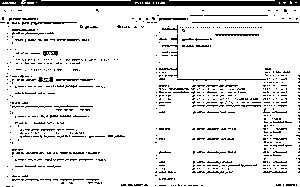

# Gnome 开发

> 原文：<https://www.educba.com/gnome-development-via-python-programming/>

## Gnome 开发简介

Gnome development builder 有助于实时解决问题和创建 GUI。Gnome Builder 是一个稳固的生态系统，你可能想在开始做其他事情之前尝试一下。它给了开发人员更多的权力和灵活性。以前，由于 python 绑定的不可用以及缺乏维护和打包，gnome 应用的开发受到了 SUGAR 的限制。

**让我们更详细地研究一下 Gnome 开发:**

<small>网页开发、编程语言、软件测试&其他</small>

嗨伙计们。所以，今天我们将谈论臭名昭著的 Gnome 开发。所以，如果你是 python 和 Linux 的新手，那么这里并不适合你。你需要回去搞清楚一些基本情况。但是，如果你是一个初级的 python 程序员，并且至少知道如何使用 fedora 或 ubuntu，那么这篇教程非常适合你。

有其他编程语言背景的人，这个博客可能会对他们有所帮助，但至少掌握基本知识会让他们清楚地了解这是如何工作的。那么，我们开始吗？

### Gnome 开发

我们首先需要的是一个稳定的 python 环境。我正在使用并且建议使用的是 Python 2.7。虽然现在人们使用 Python 3.3 或 3.4，但我建议使用 2.7，因为它仍然是世界上使用最广泛的 Python 版本，并且非常稳定和兼容。本以为 [Python 3.4 兼容](https://www.educba.com/python-3-commands/)，但有些东西还是[攻破 python 3.4](https://www.educba.com/python-3-cheat-sheet/) ，这显然是我们不希望的。

第二件事将是一个适当的 Python GTK。到目前为止，最新且稳定的版本是 Python GTK+。尽管在继续下一步之前，你必须阅读一下 [GNOME](https://www.educba.com/gnome-development-via-python-programming/ "Gnome development via Python Programming") HIG，这是关于如何在 python 的帮助下[设计](https://www.educba.com/free-designing-an-app-in-ios-online-course/ "Free Designing an App in iOS online course")一个有效的 GNOME 应用的人机界面指南。但是，如果这么容易，你一开始就不会在这里了。

侏儒 HIG 并不那么容易理解。因此，在这篇博客中，我将尽可能给出最好的理解，并尽可能使它简单明了。但是一旦，你已经从这个博客里明白了一切，当我说一切的时候，我是认真的。所以，在完成这篇博客后，我肯定会建议你阅读 GNOME 人机界面指南。

首先，GTK+提供了 n 种可能性以及通用的设计模式来创建有效的用户界面。因此，假设您知道如何创建和调用 python 文件，我将继续前进。在 windows 中开始使用 gnome 应用程序非常容易。因此，由于我对使用 pyqt 和 Tkinter 创建 python GUI 应用程序有很好的理解，我认为开发 gnome GUI 应用程序会很容易，但事实恰恰相反。

最难的部分是开始。我在学习时看到的所有教程都只是直接进入 GUI 的方式，但对于初学者来说没有容易的方式。当我开始真正理解 Gnome GUI 时，我越来越对自己写的毫无希望的代码感到恼火。因此，经过长时间的寻找，我最终选择了 PyGTK/GTK+和 Glade。

两者都是跨平台的，所以工作、安装和编译它们并不是什么大事。但是，由于这是一个面向初学者的博客，所以我不会详细介绍 Glade 之类的东西。我建议使用非常简单的可视化 Grep 工具。当我在学习开发 gnome 应用程序时，我不知道 V-Grep。但是现在，我为你简化了这个。您也可以从命令行使用 grep。但有时，你只需要简单的东西，而不是极其可怕和复杂的东西。

我不能比引用阿尔伯特·爱因斯坦的话更简单了:

“如果你不能向一个六岁的孩子解释清楚，那你自己也不明白。”

显然，报价是一个宽泛的概念，但我们不是来讨论报价的，对吗？

接下来，你需要理解的是 IDE 的概念。你显然需要一个合适的 IDE。所以，作为初学者，我会建议使用 PyCharm 社区版。Pycharm 是一个非常健壮的集成开发环境，完全支持 tab 和代码完成、重构和调试。

虽然还有其他 ide，如 Adjuta 和 Eclipse，它们也可以用于 GTK+ Gnome 开发栈，但是没有一个像 PyCharm 那样专注于开发。

GTK3 使用了自省绑定，这对于一些 ide 来说是有问题的。但是 Pycharm 通过生成一个也被称为其模块的框架来处理它。但是万一，这不是我们的选择，你总是可以使用一个叫做 faker 的包来做同样的事情。

但是如果你试图用 faker 在 PyCharm 中运行一个应用程序，它会失败，因为 faker 文件取代了真正的 GTK 应用程序。但是，这仍然是一个公平的交易。你不可能在不失去某些东西的情况下得到你想要的一切。

另一种方法是使用 Gnome development builder IDE。这是一个使 Gnome 基础构建极其简单的 IDE。

下面是 Gnome development builder 的样子:来自我电脑的截图:  

只要看一眼 Gnome development builder，你就会知道它与 GNOME3 HIG 非常接近，只有一个最小的接口。即使有一个极简的界面，它也包含了许多功能，让 gnome 应用程序看起来像绿巨人面前的洛基。抓住重点。耶！事实就是如此。

说到 PyGTK，它也很棒，但不完全是初学者类型，它包含了非常有趣的 PyGObject 项目。PyGTk 还支持在 python 和 C 之间转换的能力，这意味着您可以快速地用 Python 创建原型，然后简单地将其编译成 C 以增强性能。

运行在主要 PyGObject 代码之上的模块不必担心支持 C Python APIs。他们只需要理解基本的 GObject 自省概念，比如注释和建模 API，这样它们就可以被包装。这种基本的理解实际上使得 GObject 开发人员通过限制使用或局限于私有 API(C 允许的一些更深奥的代码模式)来编写更清晰的公共 API。

这对于理解自省给应用程序和模块开发人员带来的力量是很重要的。现在，如果你想提供一个新的 Python 模块，你不必了解 C Python API 您可以简单地使用您的 GObject 知识来创建一个 API，可以从 Python 或任何其他具有内省支持的语言(如 JavaScript)访问该 API。Vala 甚至支持内省，所以你可以用 Vala 写对象，并通过 Python 访问它们。

我们没有单一的运行时，所以，不幸的是，你不能混合脚本语言，但大多数使用自省的项目要么只使用一种脚本语言编写，要么使用编译语言作为基础，使用脚本语言作为快速原型，作为胶合语言或插件。最大的挑战是协调支持 PyGObject 或受 PyGObject 支持的不同库和应用程序。

自省是非常新的事物，随之而来的是成长的烦恼。然而，在绑定开发人员可以在泡泡中工作之前，赶上 API 开发人员添加或更改的任何东西，他们看得最清楚。然而，现在一切都高度集成，以至于绑定开发人员必须与 API 开发人员密切合作。

这可能会给所有相关人员带来很多挫折和额外的工作，但从长远来看，更紧密的合作将会带来更好的最终用户体验。

如果说这些年来我在 GNOME 中学到了什么，那就是最终用户很重要，使用内省有助于向那个目标前进。

说到最终用户，我们已经结束了这个博客。准确地说，我说得越多，在开始学习时，就越容易弄不清到底应该使用哪一种。Gnome development builder 很简单，有很多特性。但是 Python 有很强的支持，我建议继续使用它，尽管它有时会有点混乱。

### 推荐文章

这是 Gnome 开发的指南。这里我们已经讨论了 Gnome 开发构建器的基本概念。您也可以看看以下课程，了解更多信息——

1.  [Python 职业生涯](https://www.educba.com/careers-in-python/)
2.  [Python 的新未来](https://www.educba.com/python-you-should-be-using-it/)
3.  [Python 或 Go](https://www.educba.com/python-vs-go/)
4.  [卡莉 Linux vs Ubuntu](https://www.educba.com/kali-linux-vs-ubuntu/)

