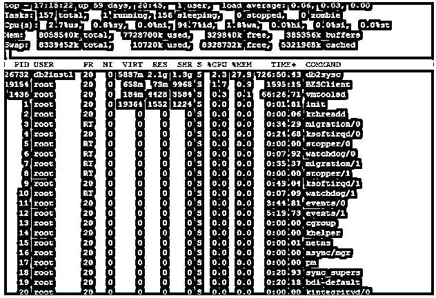
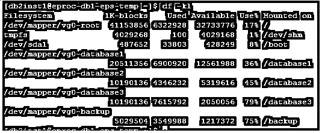

# UNIX 面试问题

> 原文：<https://www.educba.com/unix-interview-questions/>

## UNIX 面试问答介绍

UNIX 基本上是一种安全的操作系统，在银行部门，尤其是那些偏好安全系统的组织中最受欢迎。它实际上取代了 [Windows 操作系统](https://www.educba.com/windows-server-interview-questions/)主要针对服务器位置或环境。

UNIX 面试官主要是问或集中在 UNIX 命令，这是非常众所周知的和共同的命令。获得面试机会的人必须在 UNIX 命令或 shell 脚本方面更强。

<small>网页开发、编程语言、软件测试&其他</small>

### 通用 UNIX 命令

常见的 UNIX 命令解释如下:

ls —>所有可用的文件都通过执行相同的命令来显示。

ls -l —>主要用于以长格式列出文件，它包含更多信息，如文件大小、所有者详细信息、其他用户的权限或许可，并提供上次修改的数据。

ls -a —>主要用来显示那些以点开始的文件。

更多文件名—>显示文件的某个部分，它可以在一个屏幕上调整多少。点击空格键将显示该文件的更多数据，q 可用于退出。要搜索文件中的文本，搜索文本可以放在/之后。

mv 文件名 1 文件名 2 —>只需移动文件或剪切文件。通常用于将一个文件从一个目录移动到另一个目录。

cp 文件名 1 文件名 2 —>将包含内容的文件复制到同一位置。

rm filename —>用于从目录中删除文件。有一个使用 RM–I 的选项，它在删除之前向用户提供一个确认文本，通过在. cshrc 文件中添加一个别名，可以将此行为作为任何删除活动的默认行为。

diff filename1 filename2 —>用于比较两个文件并给出不同的结果。

WC filename--文件中若干行、单词或字符的给定细节。

chmod options filename-->主要用于提供对特定脚本或文件的权限。创建者阅读和编辑的默认权限。但是任何人都需要读、写和执行特定的文件，那么就需要使用 [chmod 命令](https://www.educba.com/chmod-command-in-linux/)。在执行 chmod 时，我们主要使用 3 号。

Chmod 754

第一个数字 7 =为用户提供读取、写入和执行权限。

第二个数字 5 =为组提供读取和执行权限。

第三个数字 4 =为其他人提供一个读取权限

| 英语字母表中第十四个字母 | 描述 | 限位开关（Limit Switch） | 二进制的 |
| Zero | 完全没有权限 | — | 000 |
| One | 仅执行 | –x | 001 |
| Two | 只写 | -w- | 010 |
| Three | 编写并执行 | -wx | 011 |
| Four | 只读 | r– | One hundred |
| Five | 阅读并执行 | r-x | One hundred and one |
| Six | 直读式记录 | rw- | One hundred and ten |
| Seven | 读取、写入和执行 | rwx | One hundred and eleven |

gzip filename —>压缩多个文件，类似于 windows 的 zip 文件概念。

gunzip filename —>主要解压缩 gzip 压缩的 zip 文件。

lpr filename-->主要用于打印，希望指定不同的打印机名称而不是默认打印机，可以使用–P 选项。

mkdir dirname —>在命令可执行文件位置创建新目录的命令。不允许重复的目录名，所有名称都区分大小写。

cd dirname —>主要用于改变目录，它将有助于移动到另一个目录并找到新目录中的所有文件名(ls–lrt 命令将有助于显示该目录下的所有文件)。正常情况下使用 cd 移回到上一个目录..，并移回多个正常执行 cd 的父目录../ ../ ..，这有助于通过执行一个命令直接在 3 个顶级目录中移动。Cd 目录名在 windows 命令脚本中也经常使用。通常，当一个用户登录到 UNIX 系统时，他会移动到一个主目录，然后他们必须使用 cd 命令移动到正确的目录来执行任何其他需要的命令。

pwd —>始终显示用户的当前位置。

准备 UNIX 中的工作面试。我相信你想知道最常见的 2022 UNIX 面试问题，这些问题将帮助你轻松应对 UNIX 面试。以下是 UNIX 面试中常见问题和答案的列表。

### 第 1 部分 UNIX 面试问题和答案(基础)

第一部分涵盖了基本的 UNIX 面试问题和答案

#### 1.命令找出那些隐藏在当前目录中的文件

**答案:**
$ ls -lrta

#### 2.命令来找出 UNIX 系统中当前正在运行的进程？

**答案:**
$ ps -ef

现在，如果我们知道进程的名称，我们可以在 PS–ef 后面添加 grep，如下所示:

$ ps –ef | grep java

让我们转到下一个 UNIX 面试问题

#### 3.如何确定 UNIX box 中整个进程的内存利用率？

**回答:**
这是面试中被问到的基本 UNIX 面试问题。
通过使用$ top 命令。

top 命令提供了所有细节，包括内存使用、进程 ID 等。命令显示应该如下:

#### 4.解释命令以找出应用程序日志文件中的异常，假设日志文件名为 server.log？

**答案:**
$ grep ' Exception ' server . log—>会给出预期的结果。

$ grep ' Exception ' server . log | WC–l—>将给出整个应用程序服务器日志文件中异常的正确计数。

#### 5.命令查找存在于相同目录或子目录中的所有文件，该目录或子目录包含类似“Java”的名称。

**答案:**
$找到。-名称“Java”

### 第 2 部分 UNIX 面试问题和答案(高级)

第一部分涵盖了高级 UNIX 面试问题和答案

#### 6.在 shell 脚本逻辑中，Shell 脚本是如何接受命令行参数进行内部处理的？

**回答:**
通过使用$(美元符号)可以在 shell 脚本中轻松接受从命令行传递的参数。它总是跟在命令行上的参数数字位置后面。

#### 7.在 UNIX 框中显示或呈现现有文件的最后 200 行。

**答案:**
$ tail -200f newfile.txt

让我们转到下一个 UNIX 面试问题

#### 8.命令找出 UNIX/Linux 服务器中剩余的磁盘空间。

**答案:**
$ df–KL

[db2inst1@eproc-db1-eps-temp ~]$ df -kl

文件系统 1K-已用块可用使用百分比装载在

/dev/mapper/vg0-root  41153856 6322928  32733776  17% /

tmpfs 409268 100 409168 1%/dev/shm

/dev/sda 1 487652 33803 428249 8%/boot

/dev/mapper/vg0-数据库 1

20511356 6900920 12561988 36%/数据库 1

/dev/mapper/vg0-数据库 2

10190136 4346232 5319616 45%/数据库 2

/dev/mapper/vg0-数据库 3

10190136 7615792 2050056 79%/数据库 3

/dev/mapper/vg0-backup

5029504 3549988 1217372 75%/备份

#### 9.提供对可执行文件的任何脚本文件的访问。

**答案:**
$ chmod 755 *。嘘

这是面试中被问到的高级 [UNIX](https://www.educba.com/career-in-unix/) 面试问题。如果要求脚本对于任何用户都是可读、可写和可执行的，那么命令可以是 chmod 777 *。嘘

#### 10.我们怎样才能杀死 UNIX 盒子中的一个进程呢？

**答案:**
$ kill -9 #pid — >执行 PS–ef 命令可以找到 pid。

### 推荐文章

这是 UNIX 面试问题列表的指南。这里我们列出了最有用的 10 组面试问题，这样求职者就能轻松应对面试。您也可以阅读以下文章，了解更多信息——

1.  [4 种对 Linux 新手有用的 Shell 脚本类型(helical)](https://www.educba.com/shell-scripting-in-linux/)
2.  [高级 SQL 面试问答](https://www.educba.com/advance-sql-interview-questions/)
3.  [有用的 Windows Server 面试问题](https://www.educba.com/windows-server-interview-questions/)
4.  [从头开始面试问答](https://www.educba.com/ab-initio-interview-questions/)
5.  [java web 服务面试问答](https://www.educba.com/java-web-services-interview-questions-and-answers/)

