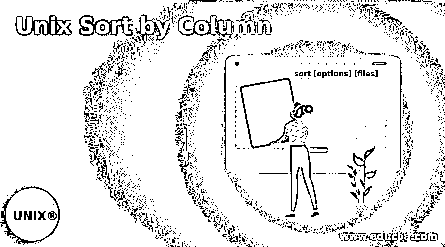
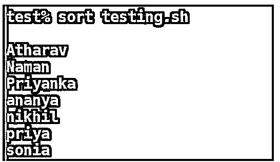
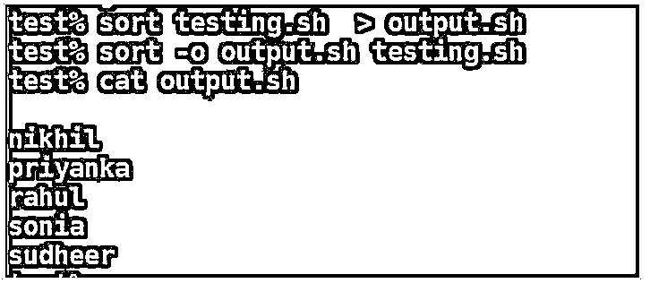
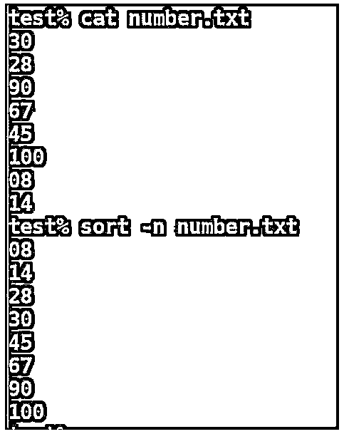
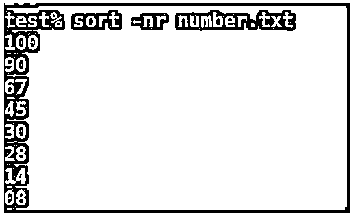
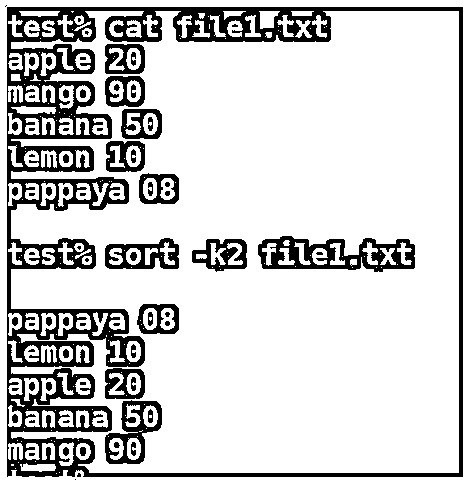
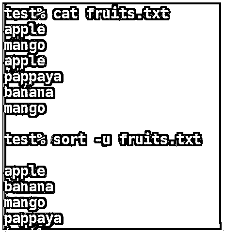
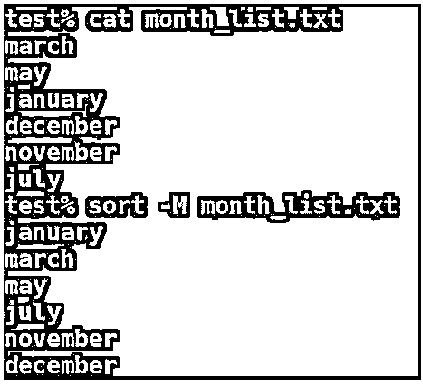

# Unix 按列排序

> 原文：<https://www.educba.com/unix-sort-by-column/>

## Unix 按列排序简介

以下文章提供了 Unix 按列排序的概述。Unix 中的 Sort 命令帮助我们在系统中对文件中的内容进行排序或排列，以排序的方式排列数据，并以 stdout 格式重定向输出。默认情况下，sort 命令有助于对以 ASCII 方式显示内容的文件进行排序。通过使用 sort 命令的选项，我们还可以用数字方式或许多其他方式对内容进行排序。

### 排序命令的功能

Unix 中的 Sort 命令是 shell 脚本中非常有用且最常用的命令，用于过滤输入内容并将输出打印为 stdout 格式。

<small>网页开发、编程语言、软件测试&其他</small>

下面列出了一些功能，以便更好地了解排序命令

*   Unix 中的 Sort 命令有助于逐行排列或排序文件中的数据。
*   sort 命令用于对文本文件行进行排序，并充当命令行实用程序。此命令有助于按字母顺序、月份、数字或相反顺序对内容进行排序，并有助于删除文件中的重复内容。
*   默认情况下，空格被用作字段分隔符。
*   Unix 中的排序通常基于一个或多个键来完成，这些键是针对输入内容提取的。

### Unix 按列排序是怎么做到的？

sort by 命令的基本语法如下所示:

`sort [options] [files]`

以下是排序通常使用的一些选项列表:

*   **sort -b:** 忽略文件中数据开头的空格。
*   **sort -r:** 它反转文件的内容并按顺序排序。
*   **sort -o:** 指定并以排序的方式打印输出文件。
*   **sort -n:** 用于对数值进行升序排序。
*   **sort -M:** 有助于按日历月对内容进行排序。
*   **sort -u:** 它帮助删除文件中的重复项，并以排序的方式返回输出。

### 在 Unix 中使用 Sort 命令的示例

假设我们已经创建了一个名为 testing.sh 的文件名，并在其中写入了一些内容，如下所示:

我们可以使用“cat”命令列出文件中的内容，如下所示:

**代码:**

`test% cat testing.sh`

**输出:**

现在，在 sort 命令的帮助下，我们将对文件中的数据进行排序。

**语法**:

`sort file_name.sh`

#### 示例#1

在这里，我们可以看到文件已经使用 sort 命令按字母顺序进行了排序。

**代码:**

`test% sort testing.sh`

**输出:**

如果我们在文件中有大写和小写的数据，默认情况下，sort 命令将首先对数据进行大写排序，然后进行小写排序，如下所示。

#### 实施例 2

首先对所有大写数据进行排序，然后是小写数据。

**代码:**

`test% sort testing.sh`

**输出:**

### 排序命令选项

带选项的排序命令有几种用法。下面列出了一些排序选项和示例:

#### 1.选项-o

与选项' o '一起使用时，Sort 帮助您将内容排序到一个新文件中，并以排序的形式重定向输出。在选项“o”的帮助下，它有助于以排序的形式将内容重定向到输出文件。

**举例:**

**代码:**

`test% sort testing.sh > output.sh
test% sort -o output.sh testing.sh
test% cat testing.sh`

**输出:**

#### 2.选项-r

在 Unix 中，带有' r '选项的 sort 命令允许您以相反的顺序对内容进行排序。该选项以相反的方式对给定的输入进行排序，默认情况下是降序。

**语法:**

`sort -r file_name.sh`

**举例:**

**代码:**

`test% sort -r testing.sh`

**输出:**

#### 3.选项-n

在 Unix 中，当您尝试以数字方式对文件进行排序时，可以在 sort 命令中使用选项'-n '。该命令用于对文件中的数字内容进行排序。默认情况下，它按升序排序。

**语法:**

`sort -r file_name.sh`

**举例:**

**代码:**

`test% cat number.txt`

**输出:**

#### 4.选项-编号

sort 中的这个选项有助于以相反的顺序对文件中的数字内容进行排序。默认情况下，逆序数字数据以降序给出内容。

**语法:**

`sort -nr file_name.txt`

**举例**:

**代码:**

`test% sort -nr number.txt`

**输出:**

#### 5.选项-k

选项-k 为我们提供了按照列号的顺序对表格进行排序的选项。您可以给列号加上“-k”来对特定的列进行排序。

**语法:**

`sort -k file_name.txt`

**举例:**

**代码:**

`test% cat file1.txt
test% sort -k2 file1.txt`

**输出:**

#### **6。**选项 **-c**

选项'-c '有助于检查文件中的内容是否已排序。如果没有排序，这个选项的输出将给出结果。如果没有输出，这意味着文件中的内容已经排序。它还会给出内容没有排序的行号。

**语法:**

`sort -c file_name.txt`

**举例:**

**代码:**

`test% sort -c testing.sh
test% cat testing.sh`

**输出:**

#### 7.选项-u

当与 sort 一起使用时，此选项有助于删除重复项并对文件中的内容进行排序。默认情况下，文件中产生的输出不会重复，并按升序排序。

**语法:**

`sort -u file_name.txt`

**举例:**

**代码:**

`test% cat fruits.txt
test% sort -u fruits.txt`

**输出:**

#### 8.选项-M

Unix 还为我们提供了对文件中的月份进行排序的特性。将给出的输出将是排序形式的月份。

**语法:**

`sort -M file_name.txt`

**举例:**

**代码:**

`test% cat month_list.txt
test% sort -M month_list.txt`

**输出:**

### 结论

从上面的例子中，现在清楚如何在 Unix Shell 脚本中使用 sort 命令了吗？根据所需的输出修改选项，这将使您的过滤器查询变得容易。Unix 中的 Sort 命令是 shell 脚本中非常有用且最常用的命令，用于过滤输入内容并将输出打印为 stdout 格式。排序命令也有助于排序的内容按字母顺序，数字，逆序，按月，或逆序。通过上述选项的组合，您可以根据输出的需要以多种方式使用 sort 命令。请注意，空白被视为字段分隔符。

### 推荐文章

这是 Unix 按列排序的指南。这里我们讨论一下简介、特性；Unix 如何按列排序？示例和选项。您也可以看看以下文章，了解更多信息–

1.  [Unix 中的世卫组织命令](https://www.educba.com/who-command-in-unix/)
2.  [Unix 中的 SED 命令](https://www.educba.com/sed-command-in-unix/)
3.  [什么是 Unix？](https://www.educba.com/what-is-unix/)
4.  [Unix 中的排序命令](https://www.educba.com/sort-command-in-unix/)

