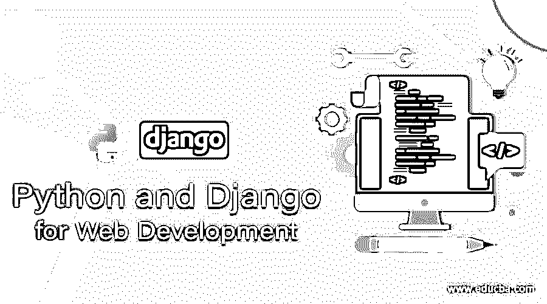

# 用于 Web 开发的 Python 和 Django

> 原文：<https://www.educba.com/python-and-django-for-web-development/>

## 用于 Web 开发的 Python 和 Django 简介

如果你对 web 开发感兴趣，你肯定会发现 Django 很有趣。Django 本质上是一个基于 Python 的 [web 开发框架](https://www.educba.com/web-development-frameworks/)。它旨在为您节省大量时间，并使 web 开发更加简单和有趣。您可以使用 Django 轻松构建和维护高质量的 web 应用程序。

Web 开发本身是创造性和有趣元素的混合，以及一堆重复的东西。Django 所做的是让你专注于 web 应用程序的有趣部分和关键部分，同时减少重复部分的麻烦。换句话说，它为 web 开发中常见的编程任务和模式抽象提供了一条捷径。它也给出了解决问题的明确约定。它做到了所有这些，同时也给了你在需要的时候在框架范围之外工作的自由。

<small>网页开发、编程语言、软件测试&其他</small>

### 什么是 Web 框架？

当然，在我们介绍 Django 之前，我们需要首先了解什么是 web 框架，因为它们在当今的 web 应用程序中非常重要。为了理解 web 框架，让我们看看当你不使用框架时，一个 [Python 应用程序](https://www.educba.com/benefits-and-limitations-of-using-python/)是如何编码的。最简单的方法是使用公共网关接口(CGI)。您只需要创建一个带有 HTML 输出的脚本，然后将带有. cgi 扩展名的脚本保存到 web 服务器。对于简单的页面，从头开始写可能是最好的方法。代码更简单易懂，没有其他代码需要阅读。它的部署也更简单。

尽管这种方法很简单，但也带来了一些挑战。例如，如果您需要应用程序的多个部分连接到数据库，您会怎么做？如果采用上述方法，您将不得不在每个 CGI 脚本中复制数据库连接代码。这不仅麻烦，还会增加人为错误的可能性。然而，更简单的方法是将这段代码放在一个共享函数中。当代码在具有单独的密码和数据库的各种环境中重用时，您必须为每个特定的环境配置代码。

此外，如果您没有多少 Python 经验，您很可能会犯一些小错误，导致应用程序崩溃。页面的逻辑最好与 HTML 显示元素分开，这样编辑器就可以编辑每个元素而不会影响其他元素。

web 框架通过形成应用程序编程的基础结构来解决这些问题。这有助于您专注于编写更易维护、更简洁的代码。这也是姜戈所做的。

### 模型-视图-控制器

Django 严格遵循模型-视图-控制器(MVC)模式，以至于它可以被归类为 MVC 框架。该模式将领域建模、表示和基于用户输入的动作分成三个不同的类。为了更好地理解这一点，只需看一下 Python CGI 脚本。

一个标准的 CGI 脚本将包括一些用于前端的介绍性 HTML 元素，然后是一个到数据库的连接。以下是 Python CGI 中数据库连接的示例代码:

`connection = MySQLdb.connect(user='ABC', passwd='xxxxxxxx', db='my_db')`

之后，您有一个运行查询的执行命令。然后，您有一些 HTML 来显示前端的查询结果。最后，用一行简单的代码关闭连接:

`connection.close()`

现在，使用 Django，您有三个 Python 文件，用它们的。py 后缀。第一个是数据库表 models.py。第二个包含应用程序逻辑 views.py。第三个包含 URL 配置 urls.py。最后，您需要一些 HTML 元素在前端显示结果。各种 Python 文件的分离是这里的关键；你不必担心语法。

models.py 文件包含对数据库表的描述。使用这个 Python 类，您可以使用简单的 Python 代码而不是重复的 SQL 语句来创建、删除、检索和更新记录。views.py 文件有业务逻辑，latest_books()函数是视图。urls.py 文件指定对于给定的 URL 调用什么视图。例如，您可以编写一个视图，以便在浏览器加载域 URL /example/时调用。这意味着，如果你的域名是 abc.com，访问 abc.com/example/的网址就会调用这个函数。

HTML 模板描述了页面设计。它使用模板语言和基本逻辑语句。总之，这些部分遵循 MVC 模式。

MVC 是一种软件开发方法，因为模型(访问和定义数据的代码)与控制器(请求路由逻辑)是分离的，而控制器也与视图(用户界面)是分离的。MVC 是有用的，因为组件是非常松散耦合的。因此，web 应用程序的每个部分都有自己的单一用途，可以独立更改，而不必彻底更改其他部分。例如，您可以在应用程序的任何部分更改 URL，这将更改实现，而无需接触呈现它的 Python 代码。您可以重命名数据库中的一个表，并在一个地方指定更改，而无需替换几十个文件。

### 姜戈简史

现在您已经对 web 框架有了一些了解，是时候深入了解一下 Django 的历史了。了解 Django 从何而来，可以帮助你更好的理解它的工作原理，以及如何操作它的快捷方式。如果您一直在构建 web 应用程序，您可能已经知道与 CGI 相关的问题。web 开发的经典路径是这样的:

1.  您从头开始编写 web 应用程序
2.  您编写第二个应用程序
3.  您意识到这两个应用程序之间有一些共同的元素
4.  您重构了代码，使应用程序 1 与第二个应用程序具有相同的代码
5.  你重复 2-4 几次
6.  你意识到你已经形成了一个框架

姜戈也是这样被创造出来的。它是由堪萨斯州的一个 web 开发团队编写的真实应用程序形成的。它创建于 2003 年，当时 web 程序员 Adrian Holovaty 和 Simon Willison 开始使用 Python 构建应用程序。

负责维护和制作几个当地新闻网站的世界在线团队看到了由新闻截稿时间决定的网络开发环境的巨大好处。对于这些网站，记者和管理层希望在短短几天或几个小时内就能快速添加功能和构建应用程序。两位开发人员随后形成了一个 web 开发框架，以节省时间并在截止日期内构建可维护的应用程序。

该团队随后在 2005 年夏天将该框架作为开源软件发布，并以坦哥·雷恩哈特的名字将其命名为 Django，他可以说是有史以来最伟大的爵士乐吉他手之一。从那时起，Django 已经成为一个受欢迎的开源项目，在全世界拥有成千上万的支持者、贡献者和用户。最初的开发人员中的两个，Jacob 和 Adrian，仍然为框架的发展提供核心指导。

但是我们为什么要讨论姜戈的历史呢？有两个原因。首先，它有助于识别和解释软件的“甜蜜点”。Django 诞生于新闻环境，因此充满了最适合内容网站的功能，如华盛顿邮报、亚马逊和 Craigslist，提供数据库驱动的动态信息。不过，Django 对任何动态网站来说都是好的。第二个原因是，姜戈的历史有助于你理解其社区文化是如何形成的。

Django 是从现实世界的代码中形成的，而不是从商业产品或学术实践中形成的。因此，它高度专注于解决最初的 web 开发人员所面临的问题，以及当前开发人员仍然面临的问题。这意味着 Django 几乎每天都在进步。框架维护团队的既得利益是确保该工具为开发人员节省时间，并生成易于维护的应用程序，以及在重负载下运行良好的应用程序。换句话说，他们都想让事情变得更简单。

### 安装 Django

所以，现在应该很清楚 Django 是一个简化 web 开发的工具。但是安装工具本身可能需要几个步骤，因为在当今的 web 开发环境中有许多可移动的部分。

Django 基本上是 Python 代码，所以它可以在 Python 能运行的任何地方运行，包括一些手机。让我们假设您将它安装在台式机、笔记本电脑或服务器上。由于 Django 是用 Python 写的，所以首先需要安装 Python。从 2.5 开始的任何 Python 版本的核心 Django 框架。如果您不确定选择什么，请选择 Python 的最新版本，因为它们具有您可能会发现有用的语言特性和性能改进。

如果你用的是 Mac 或 Linux，你的电脑里可能已经有 Python 了。您可以通过进入命令提示符并在命令行键入“python”来验证这一点。您应该会看到类似这样的内容:

*Python 3 . 5 . 1(v 3 . 5 . 1:37a 07 ce 5969，2015 年 12 月 6 日 01:54:25)*

*【MSC v . 1900 64 位(AMD64)】在 win32 上*

键入“帮助”、“版权”、“学分”或“许可证”以获取更多信息。

*T2>T4*

如果你没有看到这个，你需要下载并安装它。一旦安装完毕，你必须下载并安装 Django。您可以从两个版本中选择:最新的官方版本或最新的 web 开发版本。你的选择是基于你想要的。如果你想要一个经过测试的、稳定的版本，就去找官方版本吧。如果你想拥有最新的功能，想为社区做贡献，并且能够处理缺乏稳定性的问题，那么就选择 web 开发版本。

首先，最好去找官方发布。你可以在 Django 项目网站上找到最新的。如果您有带有 Django 包的 Linux 发行版，请使用发行版的版本，这样您也可以获得安全更新。

### 设置数据库

Django 的唯一先决条件是您有一个工作的 Python 安装。一旦你设置好了，你就可以马上开始编写一个 web 应用程序了。然而，如前所述，Django 的开发侧重于以内容为中心、数据库驱动的 web 应用程序。所以你可能会开发一个数据库驱动的网站。在这种情况下，您需要设置一个数据库服务器。

Django 支持四种数据库引擎:MySQL、Oracle、SQLite 3 和 PostgreSQL。所有的引擎在大部分情况下与核心框架都工作得很好。如果您不依赖于遗留系统，并且可以选择数据库后端，那么推荐使用 PostgreSQL。

要设置数据库，您需要安装和配置服务器本身。你选择的每个数据库都有自己的设置方式，所以你需要参考。其次，您必须为特定的数据库后端安装 Python 库。这是 Python 与数据库交互的第三方代码。

如果您只是尝试使用 Django，并且不想安装服务器，那么推荐使用 SQLite。它不需要安装；它可以在你的系统上读写数据到一个单独的文件，Python 2.5 和更高版本支持它。Windows 使得获取数据库驱动程序二进制文件有点困难。

如果您选择 MySQL，您需要 MySQL 4.0 或更高版本，因为旧版本不支持 Django 的特性。您还必须从 Django 项目页面安装 MySQLdb 包。如果您使用 Linux，您的发行版的包管理系统可能有一个名为“mysql-python”、“python-mysqldb”或“python-mysql”的包。

Django 支持 Oracle 数据库服务器的 9i 或更高版本。您还需要从 cx-Oracle 网站安装 cx_Oracle 库。或者，如果您只想使用 Django 来服务动态页面而不引用数据库，您可以完全不使用数据库。也就是说，Django 中的一些工具确实需要数据库，没有数据库会导致您错过它们。

### 推荐文章

这里有一些文章可以帮助你获得更多关于 Python 和 Django 用于 Web 开发的细节，所以只要浏览一下链接就可以了。

1.  [Python vs JavaScript](https://www.educba.com/python-vs-javascript/)
2.  [网页开发面试问题](https://www.educba.com/web-development-interview-questions/)
3.  [Python vs Ruby 性能](https://www.educba.com/python-vs-ruby-performance/)
4.  [Python vs JavaScript](https://www.educba.com/python-vs-javascript/)

