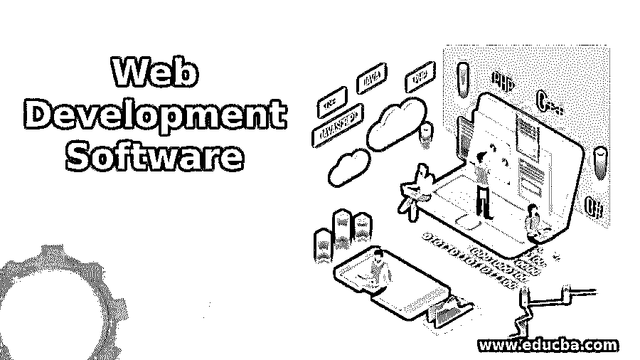

# 网络开发软件

> 原文：<https://www.educba.com/web-development-software/>

## 网页开发软件简介

随着互联网成为我们日常生活中越来越重要的一部分，网络开发软件专业人员的职业前景越来越好。

> 根据美国劳工统计局的数据，到 2022 年，网络开发人员的就业率将增长 20%。

<address>Image source: pixabay.com</address>

web 开发软件专业人员的工作包括创建网站，保持网站的功能，并在需要时更新网站。要做到这一点，你需要了解网页设计的概念和理论，并且精通一两种编程语言。

<small>网页开发、编程语言、软件测试&其他</small>

您还需要知道各种网站元素是如何组合在一起的，比如 web 应用程序、数据库和服务器。此外，web 开发人员应该能够预测用户如何与网站交互，并创建一个在所有条件下都能实现最佳网站性能的界面。

可以想象，成为一名 web 开发软件专业人员需要很强的沟通能力和技术技能。需要沟通技巧来理解客户需求和技术需求，以将这些需求转化为现实。

### 成为网络开发软件专家的培训

web 开发软件专业人员可以来自任何教育背景。进入门槛很低，如今许多专业人士都是自学成才的。

如果你有诀窍、兴趣和奉献精神，你也可以进入 web 开发软件领域。一些客户确实在寻找具有大学教育或相关学位的开发人员，但大多数客户更看重技能和表现。

编程知识可能是 web 开发人员最重要的要求之一。一个网络开发软件或计算机科学教育项目应该给你一个关于编程的好主意。

### 计算机科学和网络开发软件程序

计算机科学专业侧重于教授计算机体系结构、计算理论、面向对象编程和数据结构。

他们给你一个很好的理论基础，但是一个网站开发者必须能够用目前网站开发中使用的语言来编写代码。这需要独立的学习和大量的实践。

与此同时，网络开发软件项目也有大专或本科学位项目。它们涵盖了用 JavaScript、CSS 和 HTML 等特定语言编程和编码的基础知识，这些语言通常用于构建网页。

这些程序还涵盖了服务器端语言，如 PHP 和数据库编程。一些研究生级别的 web 开发软件项目还会关注一些高级主题，如内容管理系统、动态 web 应用、移动开发、云计算、应用安全、项目管理和人机交互。

### 学习网页设计

Web 开发工具专业人员经常在网站的后端结构上工作，但是学习前端 web 设计可以是一个巨大的优势。

网页设计通常着眼于网站的可用性和视觉吸引力，设计师专注于用户如何与网站交互，以创建将浏览者的注意力集中在最重要方面的网站。

作为一名网页开发工具专家，你可以选择网页设计的短期课程或学位课程，或者通过网上的资源自学网页设计来提高你的技能。

不管你选择的是 web 开发工具、计算机科学还是 web 设计的学位课程还是短期课程，重要的是要注意一点:成为 web 开发软件专业人员是一个持续的学习过程。

大多数 web 开发人员继续投入时间学习新技术和语言，即使受过大学教育。作为一名 web 开发人员，你可以从书籍或在线社区中学习最新的行业技巧，或者通过创建一个新的网站或应用程序来尝试新的行业技巧。

### 认证和许可证要求

成为一名 web 开发工具专业人员不需要任何执照或证书，尽管有很多证书可以给你的简历增色不少。

开发者可以获得 HTML5、 [Java](https://www.educba.com/java-tutorial-online/ "Java Tutorial Online") 、PHP、 [Python](https://www.educba.com/software-development/courses/python-certification-course/ "Python Training Course Bundle") 、JavaScript 或 Ruby 等编程语言的认证。他们还可以在不同的开发平台和环境中寻求认证。

### 投入多少时间？

在网上快速搜索会让你在几周内找到声称涵盖特定编程语言的 web 开发软件启动活动和程序。但请记住，这将涵盖大部分只是理论知识。

掌握一种或多种编程语言的实用编码技能可能需要很长时间。许多 web 开发软件专业人员在年轻时就对编程感兴趣，并从那时起开始磨练他们的技能。

然而，许多其他人很晚才转向 web 开发软件，投入时间和精力来发展他们的技能。虽然学习必要技能所需的时间因人而异，但通常需要一年左右的时间来获得足够的知识，以便进入 web 开发软件领域。

### 入门指南

既然你已经知道了成为一名网络开发软件专家需要什么，这里有一些你需要的工具和资源。

*   #### Command line tool

作为一名 web 开发工具专业人员，您必须熟练使用命令行。如果您想知道命令行是什么，它是一个基于文本的界面，使用文本命令来实现与图形用户界面(GUI)相同的功能，即当您使用鼠标导航和操作计算机时。您可以通过 Windows 上的 Cygwin 或 Linux 或 Mac 上的终端打开命令行。

*   #### Development environment

一个 web 开发工具专业人员还必须有一个开发环境，其中包括您工作所需的所有软件工具。对于您的开发环境来说，最重要的工具是您的文本编辑器。

像 Microsoft Word 和 OpenOffice 这样的文字处理器不适合编写代码，因为会有大量额外的格式数据与文本一起存储。

对于 web 开发人员来说，最好的文本编辑器应该是那些具有专门开发软件或集成开发环境(IDE)的功能的编辑器。Sublime Text 是一个拥有扩展和插件库的优秀文本编辑器的例子。其他选项包括 Eclipse、TextMate 和 Emac。

*   #### 学习超文本标记语言和 CSS

您需要了解 HTML 和 CSS，它们用于开发基本的静态网页，然后才能跳到更高级的开发元素或应用程序。

如果你喜欢用传统的方式学习，你可以选择 w3 网络联盟的 W3 学校，该联盟为这两种代码制定了标准。对于初学者来说，另一个不错的选择是 Treehouse，这是一个将 web 技术分解成可测试和可管理的组件的平台。

*   #### JavaScript 和 jQuery

JavaScript 和 JQuery 都是现代网页的重要组成部分。你在今天的网站上看到的很多东西都是由这两种语言运行或影响的。

图库、自动填充表单、[切换按钮](https://www.educba.com/bootstrap-toggle-button/)和其他类似的组件依赖于 JavaScript 或 jQuery。事实上，简单的谷歌主页大多是基于 JavaScript 而不是 HTML 构建的。

JavaScript 可能需要一段时间来学习，但如果你已经知道 HTML，应该会更容易。网上也有很多学习这门语言的免费资源，包括 w3school 和 Treehouse。你也可以选择短期项目来学习语言，但重要的是坚持练习。

*   #### Ruby on Rails

至此，您应该已经熟悉了 HTML、CSS 和 JavaScript，以及命令行。了解了这些元素之后，现在是时候进入更具挑战性的领域了:Ruby on Rails。

Ruby 本身是一种简单而优雅的编程语言，而 Rails 是将网页连接到存储所有信息的数据库的框架。

这是一个非常简单的概念，其他编程语言的知识应该为学习这种特殊的语言打下良好的基础。许多当今最受欢迎的网站都使用 Ruby on Rails，比如 Twitter。

有很多教程和其他资源可以带你了解 Ruby on Rails，比如面向初学者的 Try Ruby 15 分钟教程和在线版的 Ruby Koans。

其他选项包括 Rubymonk，它遵循与 Ruby Koans 相同的概念，同时使您对该语言的理解更上一层楼。

Rails 教程也是一个不错的选择，但是它是建立在你已经了解 Ruby 的前提下的。如果你有，那么本教程将引导你完成一个类似 Twitter 的 web 应用程序的开发过程。

它介绍了 Ruby on Rails 的关键概念，如测试驱动开发和模型-视图-控制器应用程序。再加上您的 CSS 和 HTML 编程知识，到最后您就可以部署一个功能齐全、优雅的 Rails 应用程序了。

如果你喜欢以有趣的方式学习编程，你可以选择僵尸 Rails。这也是一个很受欢迎的选择，所以你应该得到很多支持。

要更全面地了解 Ruby on Rails，您可以选择加州大学伯克利分校等教育机构的课程。

该大学的 EdX 的 Ruby on Rails 课程向您介绍了构建软件即服务、访问 API、测试驱动开发、Ruby on Rails 等等。然而，它假设你已经知道一些编程。

*   #### Version control

在 Ruby on Rails 培训结束时，你应该完全精通成为一名 web 开发工具专家所需的所有关键语言:HTML、CSS 和 Ruby on Rails。现在你知道了编码，你学习的最大部分已经结束了！但是如果不学习版本控制，您的技能集将是不完整的。

版本控制允许您监视文件的当前状态，以便您可以跟踪主要的更改。它还允许您设置和访问文件还原点，这样，如果出现问题，您总是可以回滚到最稳定的快照。

有很多版本控制工具可用，但是 Git 在其他工具中遥遥领先。Git 是由发起 Linux 开源运动的同一个人写的。

您可以将项目存储在 Github 上，Github 是代码的公共存储库。如果你更喜欢保持你的编码的私密性，你也可以按月付费。

Github 还存储了很多开源项目，你需要熟悉这个工具才能成为一个优秀的 web 开发工具专业人士。

### 其他一般技能

作为一名网络开发软件专业人员，你可以发展一些其他的外围和可选的[技能来提升自己](https://www.educba.com/25-self-development-skills-to-learn/ "25 Self Development Skills to Learn")。例如，程序员使用键盘的次数比任何其他计算机部件都多。因此，学习如何快速打字和知道更多的键盘快捷键会是一个巨大的福音。

至此，你已经拥有了成为专业 web 开发人员的所有工具和知识。现在你需要做的就是通过练习编码来提高你的技能，并跟上新技术和编程语言。

### web 开发软件专业人员的长期前景

web 开发工具领域是一个快节奏的领域，您需要随时准备学习新的技术、技巧和语言。开发者最不应该做的事情就是过时。

作为一名网站开发人员，你可以自己工作，获得自己的客户，或者加入一家公司。在一家公司里，你可以晋升到责任更大的职位，并有可能晋升到管理职位。

独立开发人员可以从小客户开始，随着他们获得更多的经验并扩展他们的工作组合，他们可以发展到更大的客户。如果你脑子里有一个绝妙的原创想法，你也可以把所有精力放在原创应用或初创企业上。

### 网页开发如何找工作？

如果你想加入一家网站开发公司，你可以选择一般的招聘网站、求职板和其他通用工具来寻找合适的职位。你也可以找到完全针对设计和开发工作的工作公告板。

如果你缺乏以前的网站开发经验，通过制作自己的网站来建立自己的作品集是个好主意。你也可以为慈善团体或家庭免费或减价开发一个，或者从较小的自由工作开始。增加更多的小型自由职业工作，建立你的投资组合，这样你就可以吸引更大的客户。

### 如何进一步了解如何成为一名 web 开发软件专业人员？

如果你想了解更多关于 web 开发工具专业人员的知识，你可以随时求助于互联网。有几个专门面向 web 开发人员的社区，它们是让您了解行业最新动态的重要信息来源。

这些社区也是一个很好的方式来提出你的疑问，并在你需要的时候获得帮助。这些开发人员来自各行各业，有着不同层次的经验，与他们讨论这个领域可能是一种有启发性的经历。

### 推荐**篇文章**

这是一个网页开发软件的指南。在这里我们讨论了基本概念，互联网成为我们日常生活中越来越重要的一部分，一个网页开发软件专业的职业前景越来越好。您也可以看看以下文章，了解更多信息–

1.  [网页开发面试问题](https://www.educba.com/web-development-interview-questions/)
2.  [网络开发工具](https://www.educba.com/top-10-web-development-tools/)
3.  [Go 编程中的 Web 开发应用](https://www.educba.com/web-development-with-go-programming/)
4.  [Drupal Web 开发](https://www.educba.com/drupal-web-development/)

