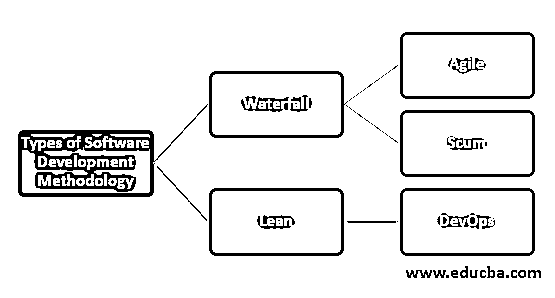

# 什么是方法论？

> 原文：<https://www.educba.com/what-is-methodology/>

## 方法论导论

应用于任何应用或研究领域的方法的分析被称为方法论。这是一个系统化和理论化的过程，使得所有与知识领域相关的方法和原理都得到很好的探索。这一过程收集有关特定主题的信息和数据，对其进行深入思考，进行分析，并找到解决问题的方法。它解释了过程的定义和如何进行；因此，用户非常了解该过程。它解释了达到结果的方法和结果一样重要。

### 什么是软件开发方法论？

软件开发方法/过程，也称为软件开发生命周期，是指导开发团队成功完成项目的一套原则或规则。方法的选择取决于项目需求和时间框架。根据所选择的开发方法，开发工作被划分为不同的阶段。根据项目需求，它可以遵循迭代方法或一次完成端到端的方法。

<small>网页开发、编程语言、软件测试&其他</small>

### 我们为什么用 SDM？

这些方法确保了平稳的软件开发体验，同时满足了项目需求。软件开发方法只关心软件开发的计划方面，因此它作为一个框架，用于设计、计划和指导软件开发过程。

如果 SDM 没有到位或者没有正确实现，随着开发工作的进展，各种问题就会出现。这也可能导致软件应用程序的开发有很多缺陷。存在各种缺陷的软件可能会损害公司的可靠性和形象。

### SDM 的重要性

软件开发方法在开发过程中非常重要。

*   当您选择特定的方法时，团队中的所有角色、过程和管理技术都将由该方法定义。
*   您的方法决定了需求收集过程。例如，如果项目需求经常变化，最好遵循敏捷方法。但是如果需求被清晰地定义并且不被期望改变，那么最好是[遵循瀑布模型](https://www.educba.com/waterfall-model/)。
*   如前所述，它也决定了你的软件质量。该方法应该涵盖软件开发方法的所有基本需求，并且应该特别关注测试。选择更好的方法将会提高软件的质量。
*   SDM 组织开发过程。

### 软件开发方法的类型

下面是软件开发方法的类型:

#### 1.瀑布

瀑布模型被认为是最基本和最传统的软件开发方法。瀑布模型由按顺序执行的阶段(需求、设计、实现、验证、维护)组成，并关注每个阶段的特定任务。每个阶段必须在下一阶段开始前完成。一旦一个阶段完成，就不能再回到那个阶段进行修改。

瀑布法因其顺序性而易于管理。具有明确定义的需求和目标的项目，不期望发生变化，最适合在瀑布方法中实现。瀑布非常紧密和坚硬，这导致该过程缓慢并且可能成本高昂。

#### 2.敏捷

当团队期望对需求进行更改或对现有功能进行任何增加时，就会用到它。软件开发是随着变更以迭代的方式完成的。由于开发方法遵循迭代方法，软件是在迭代中发布的。这种迭代方法允许团队在早期发现缺陷并修复它们，从而提高开发过程的效率。在功能驱动的方法中，软件开发是一个功能一个功能地完成的，其中功能是客户优先考虑的工作，交付时间是两周。

特性驱动的开发分五步完成:

*   开发一个模型软件。
*   为每个重要的特性建立一个列表。
*   根据特性的优先级规划开发。
*   按功能设计
*   按功能构建

任何功能的开发和交付的最长时间是两周。如果任何功能的开发需要超过 2 周的时间，那么它应该被分解成两个部分，这样它就可以在两周的时间内交付。

#### 3.人渣

Scrum 是实现敏捷开发方法的另一种方式。在 Scrum 中，团队、开发人员和测试人员高度合作来交付产品。

软件的开发遵循迭代方法，在这种方法中，整个团队在开始时将其可交付成果分解为更小的任务，并在固定的时间内完成这些任务，称为 sprints。

Scrum 是提供过程结构的传统开发方法和提供开发过程灵活性的现代迭代开发方法的结合。

#### 4.倾斜

精益是从制造业借鉴的方法过程，并应用于软件开发。

精益的基本流程方法是优化解决方案，消除浪费，生产优质产品，在稍后阶段承诺，尽早交付产品，帮助公司在组织层面做出决策，并在保持良好公司环境的同时检测任何问题。

#### 5.DevOps

开发运维涉及产品的持续交付。DevOps 基于不同团队或部门之间增强的协作。 [DevOps 方法缩短了](https://www.educba.com/devops-methodology/)上市时间，降低了故障率，缩短了解决问题的时间，同时提高了产品的可靠性。

### 结论

SDM 是每个参与软件开发的团队必须遵循的。它有助于加快工作速度，消除缺陷，并增加产品的可靠性。每种软件方法都有优点和缺点。实现开发方法的混合有助于高效安全地开发软件。

### 推荐文章

这是一个什么是方法论的指南？这里我们讨论软件开发方法的介绍、重要性、重要性和不同类型。您也可以看看以下文章，了解更多信息–

1.  [聚类算法](https://www.educba.com/clustering-algorithm/)
2.  [Scrum 原则](https://www.educba.com/scrum-principles/)
3.  [Scrum 开发团队](https://www.educba.com/scrum-development-team/)
4.  [什么是敏捷开发？](https://www.educba.com/what-is-agile-development/)

