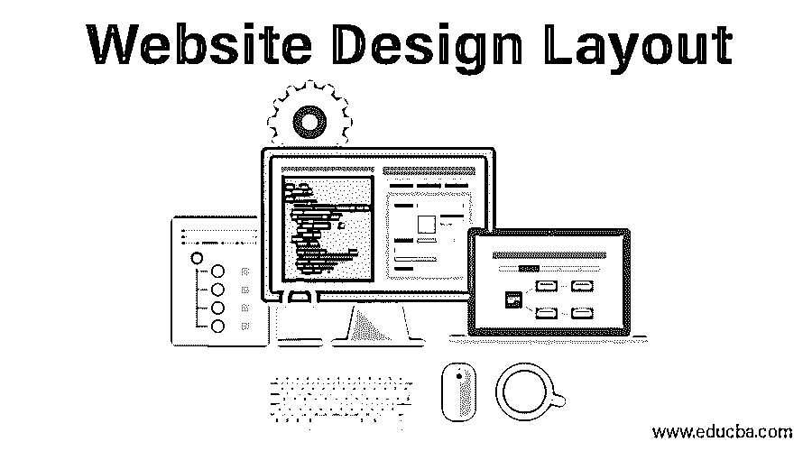

# 网站设计布局

> 原文：<https://www.educba.com/website-design-layout/>

“好的设计让用户满意，让制造商盈利，让审美者不受影响。”
——雷蒙德·洛伊

## 网站设计布局介绍

互联网浏览和冲浪已经成为我们今天生活中不可分割的一部分。每天，我们都会浏览“n”个网站来购物、搜索、探索和购买服务，或者只是去谷歌。我们只停留在少数几个网站上，或者想反复访问这些网站。

<small>网页开发、编程语言、软件测试&其他</small>

其他的好像不太吸引人。嗯，不止一次访问一个特定网站的主要原因是它的网站设计布局。虽然这是一个艰难的平衡，但要实现一个设计良好、功能精简的网页，努力改善客户体验是非常值得的。

现在已经被证明的事实是，影响网站可信度的是它的设计，而不是输入的内容。[一个设计完美的网页](https://www.educba.com/web-page-design-layout/ "How To Create a Perfect Web Page Design")不一定要在其他方面下很大的功夫才能把一个访客留在你的网页上。UX 和用户界面设计共同构成了网页的整体布局和功能。

搭建一个完美的网站设计布局的大师是麦当劳。他们真的把所有东西都放在了合适的位置，甚至包括如何放置泡菜。所以，你也会想出和麦当劳一样好甚至更好的东西。

### 网站设计布局的 10 大步骤

今天将详细了解网站设计布局的 10 大步骤，具体如下:

1.  有一个专业设计的标志适当地链接到主页
2.  使用直观导航
3.  避免混乱，给访客喘息的空间
4.  有策略地使用颜色和图像来响应 web
5.  选择易于跨设备和浏览器阅读的 web 响应字体。
6.  每一页都应该设计成登陆页
7.  始终创建响应性设计，适应所有设备
8.  使用 HTML5 而不是 Flash
9.  提交或发送按钮应该有吸引力
10.  不要忘记测试你的设计

> 生活是对话式的。网站设计布局也应该如此。在网上，你正在和一个你可能从未见过面的人说话，所以清楚准确是很重要的。因此，结构良好的网站设计导航和内容组织与良好的对话密切相关。
> 
> ——chike zie e jiasi
> (来自 Twitter 的一条推文)

1.  #### There is a professionally designed logo properly linked to the homepage

网站设计排版公司首先确定的就是它的 logo。具有专业设计标志的网页比华而不实的标志更能吸引顾客。一个标志形成了一个公司或网站的品牌身份。

你应该始终坚持使用高分辨率的网站设计图像作为标志。网站设计图片应该总是出现在网站每个页面的左上角。此外，记住把网站上的所有标志链接到你的主页的好的老的经验法则，为你的客户在网站设计导航上容易地访问。

2.  #### Website Design Navigation

你有没有想过为什么你会从这么多网页中跳出来，而只停留在一两个网页上？这是因为客户不愿意费力去弄清楚一个复杂的网站。相反，他们会退出该页面，转到下一页。

这就是为什么直观导航如此重要的主要原因。主要的网站设计导航选项通常应该部署在顶部的水平菜单栏中，而次要的导航条应该在它的下面或者页面的左边距的下面。

此外，注意只在必要的地方放置链接，不要分散客户对你的行动号召或最重要信息的注意力。

3.  #### Avoid confusion and give customers breathing room

在一个页面上过多的使用图形或者过多的图片会造成混乱。网站设计图像是理解的重要媒介，但图像的视觉超载会停止大脑对信息的处理。

当面对太多的网站设计布局时，客户会感到困惑。为了尽量减少登录页面的混乱，请限制页眉和页脚中的链接和选项数量。精简页面的另一个方法是保持段落简短。

简短意味着不超过五到六行，因为客户往往会对非常长的文本失去兴趣。一个好的网站设计布局还有另一个经验法则，即给客户一些喘息的空间。

这种空间可以通过在段落和网站设计图片之间留出足够的空间来创造，这样浏览者可以呼吸和吸收你网站的更多功能和产品。随着响应式网络的竞争日益激烈，现在越来越少被认为是更多。

在整个布局中有控制地使用空白将使用户的注意力集中在内容上，并增加用户体验。受控的用户流量将增加网站的回报。

4.  #### Use colors and images strategically to respond to Web 【T1]

要呈现一个现代、整洁、优雅的网页，尽量使用中性色。随着竞争越来越激烈，在标题和关键图形中使用少量的颜色将有助于你的访问者抓住你的网页，并注意最重要的细节。始终使用与您的徽标互补的调色板，并应与其他营销宣传材料保持一致。

尝试投资摄影或购买专业的库存图片，因为网页上的访问者可以在一眨眼的时间里嗅出普通的图片。网站设计图片会给你的公司留下一个总体印象。

专业的库存图片或好的照片会吸引人们对内容的注意，并立即产生情感联系。仅举一个例子——如果你想把你的访问者的注意力吸引到一个特定的信息或行动号召上，那么使用一个看着那个方向的人脸或一个指向那里的手指。

这只是因为，一个人倾向于看着另一个人看的同一个方向。颜色和网站设计图像都应该选择适合所有响应网络的方式——手机、平板电脑、笔记本电脑等。

5.  #### Select the Web response font

随着网络的快速响应，你应该注意选择适合所有浏览器的字体，无论是笔记本电脑、平板电脑还是手机。

如果你选择大尺寸字体，它们可能在笔记本电脑上读得很好，但在移动设备上就不好了，失去了感觉和外观。总是选择一个容易阅读的字体，大小不小于 11pt。

如果你选择网页字体，那么不要使用超过 2 个字体系列，以确保快速加载。对于固定宽度的设计，使用一行最多允许 15 到 20 个单词的字体，而在流畅的设计中，使用 1000 像素宽度的 15 到 20 个单词的字体。

6.  #### Each page should be designed as a landing page

网站设计者通常设计他们的网站，假设访问者通过主页进入，然后进入登录页面。但是，事实几乎没有什么不同。大多数访问者登陆的页面不是大多数网站的主页。

所以，关键的想法是在所有的登陆页面和网站设计布局上保留所有的主要信息，这样访问者就不必四处寻找重要的信息。

7.  #### Always create a responsive design to suit all equipment

在这个忙碌的世界里，当你连正常吃饭的时间都没有的时候，为什么还要为每个设备设计不同的网站呢？通过设计一个根据所用设备适应浏览器大小的响应式网站来节省您的时间和精力。

一个有响应的网站通常能长时间吸引访问者的注意力，从而提高转化率。

8.  #### Use HTML5 instead of Flash 【T1]

随着苹果和 Adobe 之间持续的争端，Flash 现在已经过时并接近尾声。所以，设计师们！脱离潮流，尝试更多网络和用户友好的选项。

HTML5 因其搜索引擎友好的文本和在移动操作系统上无需插件的简单功能而越来越受欢迎，不像 Flash。

9.  #### The submit or send button should be attractive

Web 表单底部的“提交”或“发送”按钮是对网页上的操作项的最重要的调用。但这也可能是最丑陋的部分，所以设计师需要制作表单提交按钮，让可爱的访问者无法控制自己点击它们。

他们只需要点击它。这些行动号召按钮可以通过多种方式变得有趣，例如当访问者将鼠标移动到行动号召按钮上时，它应该在几秒钟内改变颜色、渐变、不透明度或字体处理来吸引你的注意。

但是，也要注意过度都是不好的。它应该逐渐变细，直到看起来有吸引力，否则会产生相反的影响。

10.  #### Don't forget to test your design

设计决策只是一种假设。你是决定什么在你的网页上好看的最佳人选。通过尝试行动号召按钮的不同位置或使用不同的颜色来优化网页，可以对你的网页产生很大的影响。用户测试。A/B 测试和分析可以帮助你即兴创作你的网页。

而真正的即兴创作来自于人。接受他们的反馈并实施，直到它看起来不错。举个例子来说明测试你的设计有多重要——微软曾经通过测试和实现一种特定的蓝色获得了 8000 万美元的额外收入。所以你永远不知道你的设计什么时候能让你产生暴利。

这些小问题可能看起来如此无关紧要和显而易见，但经常在网页的实时版本中出现。到那时，企业已经从其前景中损失了一小部分潜在收入。

如今有了几个可用的平台，从网站的 UX 和用户界面设计中产生“哇”的时刻并不是什么大不了的事情。只需要很少的努力和一点创造力，就能让所有的访问者在登陆你的网页后惊叹不已。

所以，设计网页的最佳方式是思考。重新思考。学习。重新学习。千万不要用同一个概念。了解你的顾客需求，然后…开始你的设计。

通过形成直观的用户体验，改变你的设计实践可以对你的参与度和转化率产生巨大的影响，这种用户体验将展示你的专业性，同时以视觉上引人注目的方式提供人们想要和需要的东西。

### 相关文章

这是一个网站设计布局的指南。这里我们讨论了网站设计布局的 10 大步骤。你也可以看看下面的文章

1.  [Photoshop 中的网站布局](https://www.educba.com/website-layout/)
2.  [为您的网站带来有机流量](https://www.educba.com/drive-organic-traffic-to-your-website/)
3.  [网站错误](https://www.educba.com/errors-in-website/)
4.  [网站设置错误](https://www.educba.com/website-setup-mistakes/)

