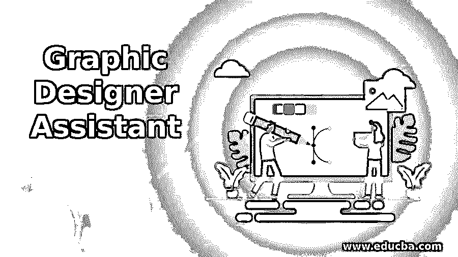
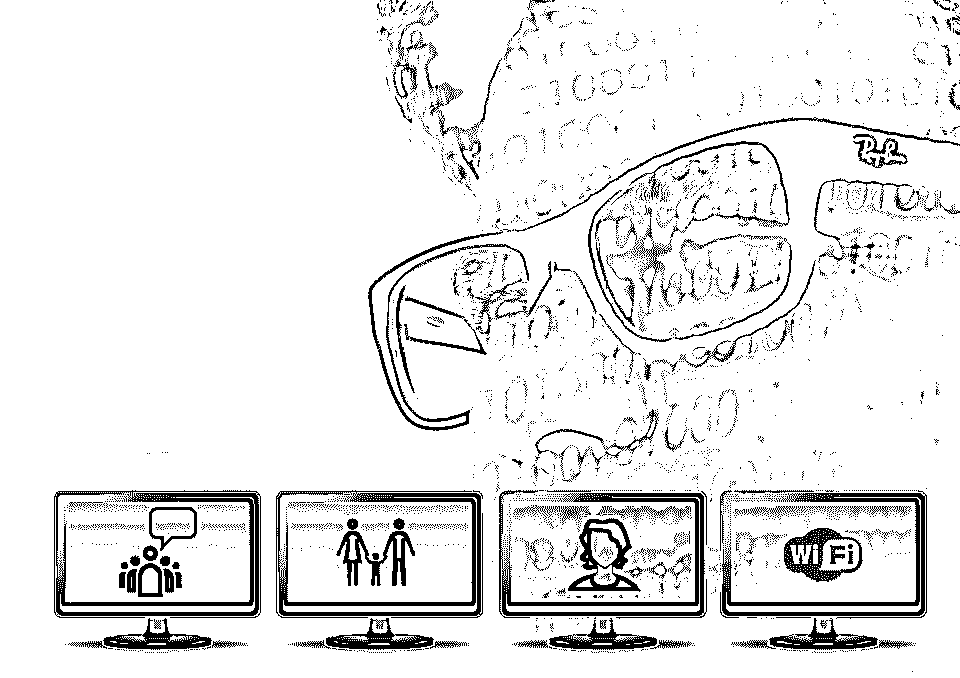
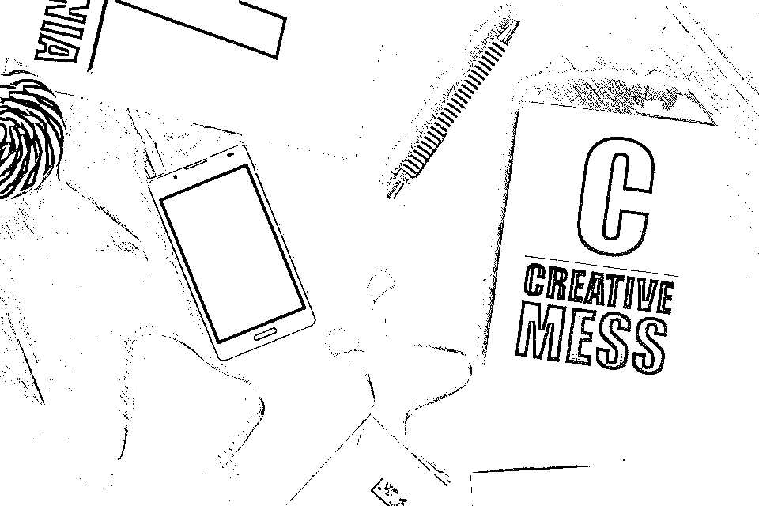

# 平面设计师助理

> 原文：<https://www.educba.com/graphic-designer-assistant/>

## 平面设计师助手简介

创建一个两小时的电影充满扣人心弦的场景，难以想象的序列和视觉效果，你从来没有见过，平面设计师助理是一个伪装的向导！你一定经常听说“图片比文字更能解释一个故事”。这是平面设计师助理的唯一座右铭。

平面设计是平面设计师助理以各种形式和功能发挥其创造力的领域，无论是印刷出版物中的新闻、广告或娱乐，还是数字和广播媒体，如电视、网络浏览器、社交平台和便携式设备，或者是在游戏机上给你真实的体验。设计是一项艺术工作，平面设计师助理让它看起来很精致。

<small>网页开发、编程语言、软件测试&其他</small>

技术并没有停止进步，因此，平面设计师助理的作用只会随着时间的推移而扩大。创意、新鲜和快速是市场对平面设计师助理的要求，他们必须做到。这可能非常具有挑战性，但同样值得。

我们梦想拥有超能力，平面设计师助理拥有超能力。创造吸引消费者的视觉的技能是一种只有少数人拥有的能力。

让每个人都看到你所看到的让你成为一个强大的超级英雄！平面设计师助理通过在纸上或使用软件交流他们的想法来激励、通知和迷惑消费者。

平面设计师助理有一大堆活动要做。动画、书籍设计、插图、网络漫画、网页设计、品牌和广告只是其中的几个例子。印刷或数字，平面设计师助理无处不在。

但是现在，仅仅拥有技能或天赋是远远不够的。一个人必须遵循一套准则才能获得成功。这些指导方针通过给你正确的方向来帮助你朝着你的目的地前进，并且帮助你避免一些真正的错误，这些错误可能会拖你的后腿。

 

<address>Image source: pixabay.com</address>

如果你渴望成为一名成功的平面设计师助理，以下是你必须遵循的 10 条准则:

1.  从基础开始，决定你感兴趣的领域。
2.  选择你最习惯使用的媒体。
3.  尽早接触所需的工具。
4.  了解一下。
5.  学习一门课程，你需要一个学位。
6.  原创是关键。
7.  为推销你的技能创造最好的投资组合。
8.  学习生意的基本知识，给自己找个实习机会。
9.  大胆创业吧。
10.  对各种选择持开放态度，并据此制定策略。

这些任务看起来令人生畏，但实际上非常容易和简单。规则很简单——做你喜欢的事情！

### 成为平面设计师助理的步骤

以下是成为平面设计师助理需要遵循的步骤:

#### 1.从基础开始，决定你感兴趣的领域

很明显，如果你不知道如何设计，你就不可能成为一名设计师。实现你的天赋是第一步，不能跳过。

探索这个领域，在平面设计的历史中探索自己，确定什么吸引你，因为一旦你研究了它，你就会知道有很多选择。

平面设计是一棵树，它分为以下几个子类:

*   网页设计
*   动画
*   品牌和广告
*   商业印刷设计
*   出版物设计
*   多媒体设计
*   排印
*   逻各斯圣语

如果你在高中，有点迷茫，不要着急。这是实验的时候，改变你的选择，深入挖掘，因为只有这样你才能完全确定你擅长什么，你感兴趣的领域是什么。

一旦决定了，就不要拖延。向前走，这只是漫长旅程的开始。

#### 2.选择你最习惯使用的媒体

这是至关重要的。你工作的媒体为你在平面设计中的未来搭建了舞台。

如果你喜欢的是纸，那么印刷设计就是你的媒介。在你的舒适区内工作。与印刷媒体的目标受众沟通是传统的设计方式，即使技术正在接管世界，这种方式仍然很活跃。

长期的优势，吸引更多的观众，并知道它的可信度，使印刷媒体保持活力，并成为那些不是我们所说的“技术极客”的人的有利选择。

所以不要害怕在平面设计上有未来。它不会死得这么快！对于那些认为坐在电脑前激发你的创造力会让你更有力量，虚拟交流的想法会让你兴奋的人来说，那么数字平面设计就是适合你的，看看这项技术是如何发展的，这可能是一个不错的选择。

数字图形设计师的技能与软件有关，这使他们比印刷媒体设计师更有优势，因为他们的设计更快更精确。此外，越来越多的人正在转向互联网和社交媒体，这一事实确实开辟了另一个领域。

当你了解到数字设计的不同专业时，它的前景会变得更加美好。动画、网页设计、多媒体设计对平面设计师来说都是激动人心的领域。

显而易见的缺点是，数字图形设计师技能学习软件的有效使用，并迅速适应技术的进步。但是挑战是所有美好事物的一部分，你面对挑战越多，你就会变得越好！

#### 3.尽早让自己接触到所需的工具

做好决策，习惯你的工作领域，然后前进，不要止步于此。得到你需要的工具，并尽早开始使用它们，因为你用得越多，你就会成为越好的设计师。

不要忘记，每个领域都有竞争，平面设计是趋势之一，如果你想在这方面出类拔萃，你需要提高你的平面设计技能。

就数字设计师而言，你有很多工作要做。首先，在网上获取平面设计师技能，搜索你感兴趣领域的最新技术。松开你的口袋，给自己买一台苹果 i-mac 电脑或者 Wacom Bamboo。如果你想成为最好的，就用最好的！

你知道你还不能错过什么吗？Adobe Creative Suite 软件包的使用。这是你所有有抱负的平面设计师的必备。其他软件和图形设计师软件帮助你开发一个伟大的网页设计是时间跟踪应用程序，帮助你在一个时间线内工作，其他是社交网站。为什么？你以后不用宣传你的工作吗？

所以，了解你的工具，并把它们用出来。没有他们，设计师是不完整的。

 

<address>Image source: pixabay.com</address>

#### 4.阅读它

说真的，尽可能多地阅读关于平面设计的书籍。是掌握艺术的最好方法。

以下书籍一定要放在你的书包里:

*   平面设计的要素。
*   平面设计布局。
*   如何成为一名平面设计师，而又不失灵魂？

并且毫不犹豫地在网上阅读。从各种来源可以获得大量的信息。你绝不能停止收集。

#### 5.学习一门课程，你需要一个学位

贴上封条！让自己被一所好大学录取，获得学位。这将有助于你在未来获得一份好工作，并获得一份非常需要的经验，放在你的简历上，增强你的投资组合。课程的持续时间各不相同，完全取决于你。为几周、六个月或一年的较短时间设计的课程不会提供非常深入的教育，只是基础知识。两年制和四年制的课程非常适合那些希望在未来真正以平面设计为职业的人。

要做好你所做的事情需要时间，所以抽出一些时间，参加一个持续时间更长的项目，尽可能多地发展你的技能。

#### 6.原创是关键

很明显，不是吗？如果你的风格已经在市场上存在，为什么你会被雇用？

相信自己，你有自己独特的风格。不要让被选中和做好事的压力改变你的创造力。永远记住，只有你自己才是你思想的主人。不要让恐惧、压力和失败蒙蔽了你的直觉和判断。

埃德温·兰德曾经说过——“创造力的本质是不害怕失败。”

把它写在一页纸上，贴在你面前的墙上，让这些话激励你吧！

#### 7.创建最佳投资组合来推销你的技能

现在，让市场知道你在你的领域有多好。创建一个展示你最好作品的文件夹。你是你最好的评论家。如果你的任何设计不能让你 100%满意，就不要突出它。

永远从你最有创意的作品开始你的作品集，展示你在学习过程中获得的技能，但永远不要忘记把你最好的作品放在最后。

要注意的一个关键点是，永远不要把你创造的所有东西都放进投资组合。你永远不会希望走进一个满是看过你所有作品的人的房间，而没有什么可谈的。让他们想要更多！你的目标是成为一名平面设计师和动画师。

放聪明点！把你的作品集放到网上，拓展你的边界。当你的平面设计师软件作品在网上出现时，你被浏览和被选中的机会就会增加。

#### 8.学习业务的基本知识，开始实习

平面设计师和动画师有很多选择。如果你一直梦想着开创自己的事业，做一名自由职业者，仅仅知道你的工作是一名平面设计师和动画师是远远不够的。你必须知道如何建立和经营一家企业。

你的法律合同、纳税申报政策、新项目的持续流入都是经营一个成功企业的基础。

要获得如何经营好企业的实践经验，去实习吧。实习是学习和获得你想要的领域的经验的最快方式，并且有机会和曾经和你一样的设计师一起工作，会证明对你非常有益。

见见专家，谈谈你的计划，然后你会了解你犯的明显错误，并避免犯这些错误。学习的过程永无止境，所以不要停止！

#### 9.大胆创业吧

成为一个成功企业的员工是一次真正的学习经历。但是记住我在开始时说的，不要停止前进！

鼓起你所有的勇气，创办你自己的公司。你需要的东西都有了。勇敢一点，大胆一点。你生来就是领导者。自主创业是最好的就业。

你富有创新和创造力，具备平面设计师的所有技能。自己创业，你能行！

#### 10.对各种选择持开放态度，并据此制定策略

在你的工作环境中，你最终会面对那些对他们想要的产品一点都不清楚的客户。他们想要的是一个为他们工作的专业人士，以实现他们想要实现的任何目标。

在这种情况下，你的工作就是对所有可能的选择持开放态度，并把它们呈现给你的客户，让他们对你有一个更清晰的了解。你需要快速适应，并根据情况，当然还有你的客户来规划你的策略。

要想脱颖而出，你的计划要与众不同。有很多杰出的设计师，你必须超越他们。

希望这 10 种方法能让你成为一名出色的平面设计师和动画师。外面有一个神奇的世界等着看你创造了什么，它可以是任何形式，只要你是现实世界的巫师！

我想引用保罗·兰德的一句非常优美的话来结束这篇文章

“设计是将形式和内容结合在一起的方法。设计，就像艺术一样，有多重定义；没有单一的定义。设计可以是艺术。设计可以是美学。设计如此简单，这就是它如此复杂的原因。”

### **推荐文章**

这是一个平面设计师助理的指南。在这里，我们讨论了成为平面设计师助理的 10 个步骤的基本概念。您也可以阅读以下文章，了解更多信息——

1.  [原型工具](https://www.educba.com/prototyping-tools/)
2.  [InDesign 文档](https://www.educba.com/indesign-document-setup/)
3.  [如何使用 Indesign](https://www.educba.com/how-to-use-indesign/)
4.  [平面设计面试问题](https://www.educba.com/graphic-design-interview-questions/)

