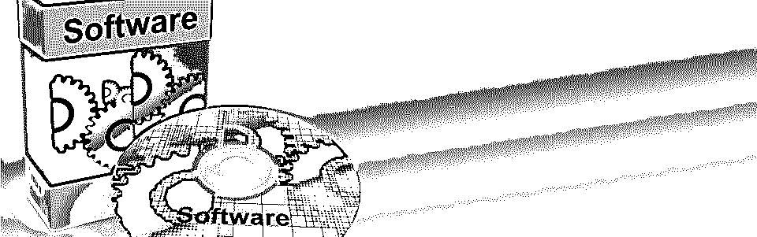

# 免费网页设计软件

> 原文：<https://www.educba.com/free-web-page-designing-software/>

 

## 免费网页设计软件

在这个主题中，我们将讨论免费的网页设计软件，拥有自己的网站比几页纸打印的成果要好得多。你自己的网站展示了你所有的创造力、想象力和学习能力。它给你的创作打上了一个印记。它带来了你最好的技能和天赋，特别是当你把大脑和努力工作抛在脑后的时候。

如果你真的想在全世界用户的电脑屏幕上宣传你自己并反映你的个性，你需要一个由你亲自设计的网站，你可以通过使用以下 10 个最好的免费网页设计软件来做到这一点。

<small>网页开发、编程语言、软件测试&其他</small>

### 10 款最佳免费网页设计软件

下面是提到的 10 个最好的网页:

1.  #### mobi rise web builder—

如果你在寻找一个可以在手机上操作的免费网页设计工具，你的搜索会把你带到免费网页设计生成器。它的界面就像任何一个[移动应用程序](https://www.educba.com/testing-of-mobile-application/ "Mobile Application Testing Strategies and Tactics")，而不是普通的桌面应用程序。

只需将你的块拖放到你的网页上——菜单、标题、文本、滑块、图片库、视频、地图、表格、表单、页脚等等。网页设计的主要部分已经完成了。然后，如果你想定制它，你可以用许多不同的方法。

在免费的[网页设计](https://www.educba.com/web-designing-tools/ "A Beginners Guide to Web Designing")每一页后，你可以使用为你提供的按钮在你的桌面、平板电脑或手机上预览页面。这让你对你的网站在手机、平板电脑或台式机上的外观有了一个概念。完成后，您可以将完成的网站导出到 FTP 服务器或 Google Drive 上。

它的主要特点是-极简和非常易于使用的界面，最新的网站块，开箱即用的技术，最适合商业和非营利用途。

Mobirise web builder 适用于 Windows XP+、OS X 和 Android 操作系统。

2.  #### Free HTML editor for coffee cups

害怕编程的初学者总是喜欢新的免费网页设计软件，他们用这个软件来指导他们完成设置和设计的整个过程。CoffeeCup 的帮助功能可以帮你做到。它有所有你需要的工具来建立一个流畅的工作网站。

但是对于所有精通技术的设计师来说，如果你想炫耀你的编码天赋，你可以关闭这个帮助功能。CoffeeCup 就像任何其他 HTML 编辑器一样，它给你一个友好的编码环境，并允许你在预览窗口中观察你的修改。

CoffeeCup 也有一套强大的高端功能:良好的网站和项目管理，一个存储可重用代码片段的库，与多种工具的轻松集成，拼写检查，同义词库，元标签生成器，代码清理器，以及许多您可能没有想到的功能。

此外，内置的工具可以帮助您添加背景，插入图像，调整，样式和完整的文本，添加网页设计表格等等。你可以从头开始创建你的网站，也可以从现有的主题或布局中启动一个新的项目，开始你的免费网页设计。

如果你已经有一个现有的网站，从你的电脑上打开它的文件，或者直接从你的网络服务器上打开它们，然后开始编辑。

所以，不管你是不是程序员，CoffeeCup 绝对值得一试！

3.  #### Komodo Edit –

这是严格的程序员只有 HTML 和 CSS 的基础知识。Komodo Edit 是 Active State 套件的一部分，对于初学者来说是一个玩一些有趣的编码技巧的好方法。

Komodo 最好的特性之一是它允许你以一种简单得多的方式添加不同的语言和特殊字符。所以，如果你想让你的网站被全世界的人浏览，使用 Komodo edit 来设计你的网站。

编辑器通过在空白处突出显示未保存的更改以及任何未提交的 SCC 更改来帮助您跟踪未保存的更改。此外，只要有语法错误，内嵌的语法检查功能就会弹出警告。它使 HTML 编码体验更好，允许您更改开始和结束标签，而不必单独选择每个标签，因为当选择一个 HTML (XML)标签时，相应的开始/结束标签也会被选择。

Komodo Edit 提供了许多令人兴奋的功能，如果你想通过编程来设计你的网站，那么最好试试这个编辑器！

4.  #### webflow—

你们大多数人都在寻找最好的免费网页设计软件，它不需要编码，但仍然为你工作。Webflow 就是这样一个软件，它可以帮助你创建漂亮的响应网站，最棒的是它不需要编码。

Webflow 是一个三合一的网页设计工具，它也给你一个托管你的网站的平台，它也是一个内容管理系统。

这个最好的免费网页设计软件为你提供了一个诱人的现代模板集合，它非常容易使用，但你也可以选择用你自己的一套最适合你需要的元素来定制你的网站。

如今，重要的是你的网站可以在手机和平板电脑等所有设备上浏览，而不仅仅是在桌面上。但是你创建的网站只适用于台式机，这意味着你必须为你的网站重新编写代码，使其适用于所有类型的设备。Webflow 具有自动重新格式化代码以适应所有查看设备的独特功能。光是 Webflow 的使命就能激发你使用它。它说，“让设计师、创意专家和企业家有能力为网络创作。”

 

5.  #### lanyu-

Bluefish 是一个开源开发项目，是程序员和 web 开发人员的强大编辑器。它支持许多编程和标记语言，以便让您选择自己喜欢的语言。

Bluefish 是一个多平台应用程序，可以在大多数操作系统上运行，包括 Linux、FreeBSD、MacOS-X、Windows、OpenBSD 和 Solaris。

它有一个庞大的功能列表，如快速加载，多文档界面允许轻松打开 500 多个文档，在线拼写检查，这是一个意识到编程语言中的错误，自动恢复修改后的文件崩溃，杀死或关闭，突出匹配块开始和结束标记，以及列表继续下去。

因此，Bluefish 是 web 开发人员为他们的网站编写代码的完美平台，也是 web 设计不可或缺的一部分。

6.  #### syn write—

这是一个免费的文本和编码编辑器，具有大量的开发特性。但这还不是最精彩的部分。这个免费的网页设计软件最好的部分是你不需要在你的 Windows 操作系统上安装这个 Synwrite，你可以简单地从 u 盘上运行它。

就像任何其他 HTML 编辑器一样，Synwrite 支持语法突出显示、自动完成、标签自动关闭、跨文件搜索和替换，以及一系列更多的功能。一些最强大的项目，文件和页面管理工具，以及大量的插件被集成在一起，使得编码变得更加容易。

在 Synwrite 的众多特性中，有一些是宏记录、代码突出显示、代码折叠、多插入符号编辑和正则表达式。对于程序员来说，清单不止于此。该编辑器可以帮助您自动完成、自动关闭标签/括号、代码模板、智能标签跳转功能、同步编辑功能以编辑相同的标识符、Emmet (Zen Coding)支持(HTML + CSS + XSL 高速编码引擎)、颜色预览、颜色选择器、图像预览、插入图像标签、插入日期/时间戳、便携式书签、列标记、微地图等。

希望这足以帮助你设计一个有吸引力的网站。

7.  #### openbex-

    的缩写

让我们把注意力转回到非程序员身上，向他们展示另一系列软件，OpenBEXI。最简单的网页设计工具，具有图片、图表和文本的拖放功能。

这是史诗般的“所见即所得”网站编辑器，可在线使用，因为它是开源软件，所以绝对免费！

它兼容所有著名的浏览器，如浏览器，火狐，Opera min 等。但是它的特别之处在于它有一个指南标签来帮助你设计网页。所以，如果你在任何一点上遇到困难，只要阅读教程来帮助自己。

现在就开始下载 OpenBEXI 吧！

8.  #### TOWeb–

点开 TOWeb 和 ABRACADABRA 的链接！从网页设计开始，你有 120 个模板。您可以探索一些布局和配色方案来增强您的设计。惊喜似乎不止于此。侧边栏包含了大量可以使用的额外功能。例如，给图片添加水印、对个人页面进行密码保护、允许访问者发表评论、为你的社交网站添加按钮以及定制模板文本和图像等功能都变得非常简单，只需动动手指就能完成。

完成网页设计后，您可以预览网站在桌面、平板电脑和移动设备上的外观。TOWeb 还可以优化您的网站搜索引擎，并通过为 Google 优化的现代 HTML5 网站提高您在搜索引擎中的知名度和排名。

TOWeb 是多语言的，即它支持所有语言和字符集，这意味着您可以吸引国际观众。其他功能包括访问 100 多种谷歌网络字体，保护任何有密码的页面的安全功能，以及保护你的表格的验证码验证，你还可以得到更多。

有了 TOWeb，你不需要从头开始你的网页设计，现在简单多了！它适用于 Windows XP+，OS X，Linux。

9.  #### page breeze—

如果你不想从事免费网页设计的技术方面，只想处理基本的工作，PageBreeze 是最适合你的免费网页设计软件。它指导你完成网页设计的每一步，因此如果你没有编程知识，你也可以轻松完成。

但首先，你需要安装 Internet Explorer，并且 PageBreeze 只与 Windows 操作系统兼容。

它为您提供了一个双重环境，您既可以在可视模式下工作，也可以在 HTML 编辑器上工作。在这两种模式之间切换只需点击一下鼠标，您在任一模式上所做的更改都会在两种模式上反映出来。

现在就在您的 Windows PCs 上下载最新版本的 PageBreeze，只需点击几下鼠标，就能拥有数百个模板和一个外观精美的网站！

10.  #### PSP—

编码员！这里有另一个工具可供选择，请注意！最好的总是留到最后。PSP 是一款强大、智能且易于使用的软件。该编辑器具有完整的功能，如语法高亮显示、CSS 编辑器、自动更正、跨文件搜索和替换、匹配括号高亮显示、一次处理多个文档并将所有文档保存为“会话”以便稍后轻松恢复的能力、帮助您直接在服务器上编辑文件的 FTP 客户端等等。

PSP 是为那些想省钱，但仍有专业产品功能的人准备的，因为 PSP 对商业和政府目的也是免费的。它是一个拥有强大权力的小编辑。所以，不要犹豫使用它。

现在几乎所有的东西都有工具和最好的免费网页设计软件。有了这 10 个最好的免费网页设计软件，网页设计变得相当容易。充分利用这个最好的免费网页设计软件，让你的网站成为市场上最好的网站。

### **推荐文章**

这是一个免费网页设计软件的指南，在这里我们讨论了以下 10 个最好的免费网页设计软件。您也可以浏览我们推荐的其他文章，了解更多信息——

1.  [网站架构工具](https://www.educba.com/10-best-website-architecture-tools/)
2.  [网络开发工具](https://www.educba.com/top-10-web-development-tools/)
3.  [Spring Boot 首发网](https://www.educba.com/spring-boot-starter-web/)
4.  [移动应用测试](https://www.educba.com/mobile-application-testing-basics/)

