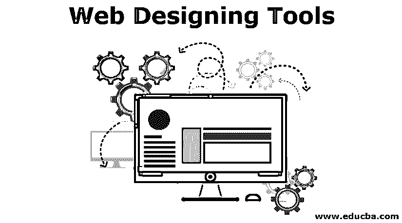
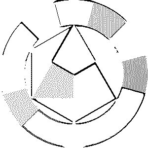
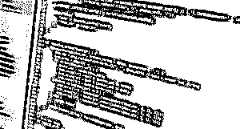
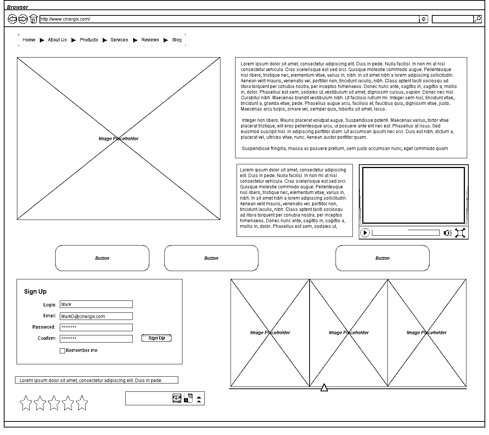
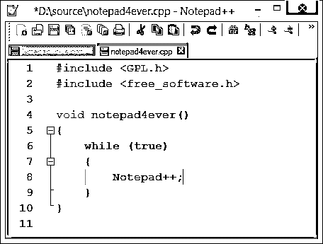
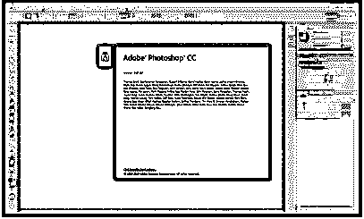

# 网页设计工具

> 原文：<https://www.educba.com/web-designing-tools/>

## 网页设计工具初学者指南

想设计自己的网站吗？还是想以网页设计工具为职业？嗯，这并不容易。设计自己的网站需要时间、耐心和大量的辛勤工作。虽然一篇文章不足以传授成为一个网页设计工具所需的所有技能、工具和技术，但这篇特别的指南将帮助你找到正确的方向。一旦你知道了要走的路，你需要不断的发展和学习才能到达你的目的地。

这个指南是为那些没有正式背景或者没有受过网页设计工具教育的人准备的。只要你知道操作电脑的基本知识，你应该能很好地理解本指南的内容。然而，请记住，网页设计工具是一个非常高端的主题。你可能会从基础开始，但你必须掌握大量的技能和知识，比如网站设计中的人际互动、色彩理论，当然还有 CSS 和 HTML 等编码语言。你可能还需要学习 JavaScript 和其他编程语言。然后是搜索引擎优化、内容管理系统等等。

<small>网页开发、编程语言、软件测试&其他</small>

### 网页设计工具的概念

让我们从浏览网页设计工具的一些概念开始:

#### 用户体验网页设计工具

也被称为 UX 或用户界面设计，用户体验设计基本上是关于知道人们将如何查看，互动和使用你的网站设计，以及如何使用这些知识来做一个更好的网站设计。这涉及到很多工作，也有很多尝试和错误。你与网站设计互动和体验的方式可能与别人不同。你的网页设计工具可能对你来说很有意义，但最终会让别人感到困惑。

当你学习用户体验设计时，开始阅读线框也是一个好主意，在这个过程中，你可以勾画出非常基本的网页设计工具布局思想。草图和概念很粗糙，所以你可以用一支旧的笔和纸或者字母。当你的网页设计工具的布局变得更加详细时，你可以切换到平板电脑或台式机。这个过程决定了你的网站设计将如何工作，从零开始。

#### 学习审美技能

有些人倾向于在追求美学之前先学习编码，但是在接触编码之前先了解美学的理论部分会更有益。毕竟，美学是很难掌握的。口味是无法解释的；对你来说很好的东西对其他人来说可能是难吃的。看起来和你整个网站的主题很协调的字体，对其他人来说可能看起来很奇怪，而且完全错误。一切都是主观的，但都是有科学依据的。如果你能明确这门科学并掌握美学的基本规则，你就能克服大部分与网页设计工具相关的问题。

### 1。排版

 

图片和视频在网上变得非常流行，但是文字仍然是网站设计中最大的部分。互联网是关于文字以及如何让它们看起来和读起来都令人惊叹的。写出好的文字取决于作者，但让文字看起来好看取决于排版。然而，字体设计不仅仅是选择一种字体。这也是关于选择一个好的字体大小和类型，并安排它使你的网站访问者可读，不管他们在什么设备上使用什么浏览器。这也是关于在标题、标题和正文之间创建一个视觉层次。

一旦你知道了排版的规则，是时候为网站设计选择合适的字体了。你可以找到很多免费的，特别是谷歌网络字体可以成为一个很好的工具。在网页设计工具中，许多设计师选择谷歌字体，因为它们可以直接嵌入到网站设计中。你甚至可以在网上找到一些很棒的谷歌字体组合，或者使用网络字体组合器来配对和预览你自己的字体组合。

在某些情况下，您可能需要自己嵌入字体，这并不方便。如果你想学习如何自己嵌入字体，你必须开始学习一些基本的 CSS 和 HTML 编码。

#### 2。色彩理论

 

色彩理论不仅仅是学习各种颜色的专业名称。事实上，它处理的是颜色组合以及不同的颜色如何对人类的情绪产生不同的影响。色彩理论是一门真正的科学，对网站设计的可用性和用户体验有很大的影响。例如，如果网页上的文本颜色与背景颜色太接近，那么它就不太明显。屏幕眩光、视觉障碍和配置不佳的屏幕会增加挑战。

#### 3。HTML

 

一旦你了解了网页设计工具背后的美学和理论，是时候动手学习一些编码了，从最基础的语言开始:超文本标记语言或 HTML。每一个网站设计都使用 HTML，它告诉网络浏览器它正在看一个视频、链接、图像还是文本。

你需要学习的下一门语言是层叠样式表或 CSS，这是让你的网站设计看起来不错的东西。它告诉浏览器文本的字体和各种元素的颜色。它还可以定义网站设计的布局，按钮的外观，各种元素的大小，甚至动画。

HTML 和 CSS 实际上很容易掌握，但是它们非常广泛，可以以各种方式用于制作独特的网页设计技能。学会如何有效地使用它们需要时间和练习。

#### 4。JavaScript

学习 JavaScript 是一件可选的事情，但它可以是一个巨大的奖励。它是一种编程语言，能够以 CSS 或 HTML 无法做到的方式操作网页内容。但它并不是每个网站设计的必需品，而且比 HTML 或 CSS 更难掌握。然而，它是非常有用的，是网页设计技巧中的一项重要技术。您可以使用它来添加幻灯片等有趣的元素，或者调用新内容，而无需重新加载页面。这可以提高网站设计的可用性。

### 获取所需工具

网页设计技能需要特定的工具、流程和工作流程，尽管很难锁定特定的组合。每个人都有自己喜欢的工具，有些人会用野蛮的忠诚来捍卫他们的选择。抛开这种强烈的忠诚不谈，不断尝试新的网页设计技巧总是一个好主意，而不是把自己锁起来。

把自己锁在数量有限的工具中，并且对它们过于适应，从来都不是一个好主意。不断尝试新工具，保持思维新鲜。然而，首先让我们看看免费的。

*   **所有主流浏览器**

主流浏览器——Mozilla Firefox、Google Chrome 和 Microsoft Internet Explorer——都有自己独特的工作方式，可以用不同的方式显示相同的网页。你需要看看你的网站在所有这些主要的浏览器中是什么样子，并确保在这些浏览器中没有大的问题。一般来说，由于功能上的改进，网站布局在各大浏览器中是非常统一的，但是不能说所有的元素都是一样的。良好的网页设计技巧的关键是在多种环境中进行测试。

还需要使用移动浏览器，尽管您会受限于您当前拥有的设备。然而，今天大多数主流移动浏览器都有类似的功能。Chrome 是最常见的移动浏览器，但 Mozilla 正在开发 iOS 版 Firefox 的移动版本。Opera 和 Opera Mini 是其他常见的替代产品。

*   **线框工具**

对于线框，你可以使用一个基本的纸笔或某种绘图应用程序。关键是要有一些一次性的东西，并有一个平台来勾画出粗略的想法，以进一步完善它们。

 

*   **绘图应用**

一旦你开始为你的代码制作真正的线框，是时候给自己弄一个线框应用了。Google Draw from Drive 是一个很好的选择，因为它具有所有基本的形状以及实时协作和共享功能，以防你想要工作或从其他人那里获得帮助。它也是基于网络的，你可以获得大约 15GB 的自由空间。如果你用平板电脑工作，你必须找到一个替代品。

*   **代码编辑器**

HTML 和 CSS 可以在像记事本这样简单的东西上编码。你所需要的只是一个文本编辑器，而不是像微软 word 那样的文字处理器。代码编辑器本质上是文本编辑器，增加了使编码程序和网站更容易的功能。

 

有很多可用的方法，在这里最好的方法是尝试，不要局限于一种。对于初学者来说，从括号开始是一个很好的选择。它稳定且免费，可以在 Linux、Mac 和 Windows 上运行。括号也是专门为那些在浏览器上建立和设计网站的人设计的。

*   **图像编辑器**

文本构成了网站的大部分内容，但图像也是体验的一大部分，你需要为你的网站创建和编辑图标、标志、照片和其他图像。再次强调，关键是不断尝试不同的程序。你将不得不为这些编辑器付费，但是你可以免费试用它们。常见的开始包括 GIMP，Photoshop，Paint.Net，CorelDraw 和其他 Corel 应用程序。

 

*   **本地服务器**

这个是可选的，但是在你的个人电脑上安装一个网络服务器是个好主意。网络服务器本质上意味着允许人们访问你的全部或部分网站。除非你有一个真正快速的互联网连接和一台功能强大的计算机，否则本地服务器不会连接到互联网。相反，你可以设置一个服务器来模仿在线工作的方式。学习使用本地安装的服务器也可以节省你上传文件到实际托管服务器的时间。对于初学者来说，XAMPP 是一个设置本地服务器的好选择。它可以安装在 Linux、Mac 或 Windows 上。

#### 网站设计的步骤

现在你已经有了所需的工具、技能和知识，是时候快速看看网页设计技能流程了:

*   **引入内容**

创建网站内容不同于网页设计技能过程。你必须自己写内容，或者从你的客户那里得到内容。也可以请摄影师或文案，或者选择好的库存图片。在任何情况下，您都需要将所有内容，包括文本和图像，组织好并准备好。

一旦你有了所有的内容，是时候把一切都组织起来了。主页和其他页面上有什么，这些页面是如何连接的？这些问题对于建立一个结构组织是很重要的，这个结构组织将决定你的站点导航、文件组织和其他方面。

线框是一个很好的过程。从一次性线框开始，保持简单。这是一个快速的过程，完成每一页不应该超过半个小时。一旦你完成了一次性的线框制作过程，制作更详细的版本。尽可能多地包含实际内容，并添加单独的元素，如按钮和表单。不断增加更多的定义。如果你有很多相同类型的页面，每种类型各做一页。

*   **编码**

现在终于到了戴上编码帽，启动文本编辑器的时候了。这里的关键是不断地输入代码，直到你对最终的输出满意为止。括号文本编辑器有一个很好的特性:实时预览按钮。它会打开一个 Google Chrome 浏览器窗口，该窗口会根据您对代码所做的更改进行更新。在此过程中，您将多次调整浏览器的大小，以查看网站在不同大小下的外观。会有错别字，会有试错。

*   **测试**

有了基本代码，是时候开始在所有主要的桌面和移动浏览器上测试网站，并开始修复错误了。不要担心小的不一致；关键是让用户体验是积极的，与浏览器无关。用户应该能够像你希望的那样浏览网站，并达到行动要求。

### 推荐文章

这是一个以网页设计工具为职业的指南？嗯，这并不容易。以下是与网页设计工具相关的外部链接。

1.  [Web 开发框架](https://www.educba.com/web-development-frameworks/)
2.  [网页设计趋势](https://www.educba.com/web-design-trends/)
3.  [网站设置错误](https://www.educba.com/website-setup-mistakes/)
4.  [c#中的 Web 服务](https://www.educba.com/web-services-in-c-sharp/)

