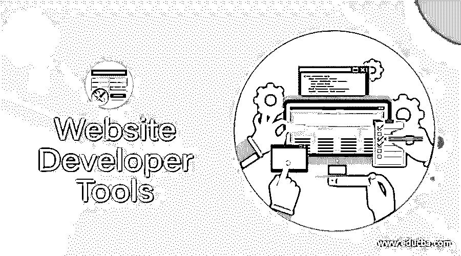

# 网站开发者工具和资源

> 原文：<https://www.educba.com/website-developer-tools/>

## 网站开发者工具和资源介绍

就像你无法想象一个巫师没有他的魔杖，一个警察没有他的枪，或者一个医生没有听诊器，很难想象一个好的网络开发者没有他的工具。web 开发人员使用这些 web 开发工具和技术，为自己的创造力插上翅膀。根据您的需求，市场上有许多 web 开发工具和技术。

这里收集了 20 种优秀的网站开发工具和技术，如果你不想错过体验网站设计和开发的美妙艺术的机会，你一定要拥有它们。

<small>网页开发、编程语言、软件测试&其他</small>

### 网站开发者工具

以下是不同的工具:

#### 1.web drive–网站开发工具

[WebDrive](https://southrivertech.com/ "WebDrive") 是用于驱动器映射的资源，即可以将网络驱动器映射到 FTP、SFTP、亚马逊 S3 或其他云服务器。然后，您可以打开并编辑文件，就像在个人计算机上工作一样。不仅如此，你还可以访问任何文件，无论是存储在本地、远程服务器上，还是 OneDrive、Google Drive、Dropbox 等云服务器上。

它有一些非常独特的功能，如如果您的连接在文件传输过程中丢失，WebDrive 会从故障点恢复传输。它有一个缓存，保存所有最近的访问，以便您可以在需要时快速访问。

如果您的文件存储在多个位置时需要编辑，并且您正在寻找一个单一的访问点，那么 WebDrive 就是您的必备工具！

#### 2.font ello–网站开发工具

Fontello 页面打开了一个充满图标和字体可供选择的世界。你能想象和需要的所有图标在这里都有。图标被转换成字体，因此如果您的桌面屏幕分辨率较高，图标将保持不变。由于有了界面，选择过程就简单多了；您可以使用 CSS 更改图标的颜色、大小和阴影。

您可以创建一组非常需要的图标，或者从 GitHub 资源库下载整个集合。Fontello 是一个开源项目，是免费的。

#### 3.bootstrap Studio–网站开发工具

如果你想使用 [Bootstrap](https://getbootstrap.com/ "Bootstrap") 框架创建你的网站，使用 Bootstrap Studio。这是一个强大的桌面应用程序，具有简单直观的界面，充满了可以拖放到您的网页上的功能，以创建一个响应网站。

它自动为您的网页上使用的组件编写 HTML 代码，并且您可以自定义您使用的每个细节。预览选项允许您在多个浏览器和设备上查看您的设计，如果您在任何一个设备上进行任何更改，它都会在任何地方得到反映。它还有一个编辑器，其中的代码简洁易读。

#### 4.grid gum–网站开发工具

首先要抓住浏览者的注意力的是你网站的主题。它为你的网站设定了基调。互联网上有成千上万可供选择的文章，但如果你想为你的网站设计一个优雅且有针对性的主题，你必须查看 GridGum。

GridGum 上也有 WordPress 和 Bootstrap 主题。GridGum 提供数百个精彩且有针对性的主题，相信质量胜于数量。所以，如果你正在寻找让你惊奇的东西，不要忘记去 GridGum 看看！

#### 5.html 5 Maker–网站开发工具

保持时尚很重要。就像在你的网站中嵌入动画是时髦的一样。HTML5 Maker 是创建横幅等动画元素的工具。在线，你不需要一个动画设计的学位。您可以使用它来为您的网站创建广告或动画主题。HTML5 Maker 让你立刻成为动画天才。

#### 6.webflow–网站开发者工具

Webflow 是一个网页设计、内容管理系统和虚拟主机工具。三合一包装。它允许您使用拖放功能来帮助您设计一个响应式的 web 页面，并且后端的代码会得到处理。如果有多人在网站上工作，您可以允许您的团队成员更新网页。Webflow 是一个你必须尝试的网站建设者。

#### 7.bug Muncher——网站开发工具

你的网站必须具备的最重要的功能是反馈选项。即使你的网站已经被托管了，你也必须继续工作，因为即使你尝试和测试了几百万次，也一定会有一些错误。

因此， [Bug Muncher](https://saberfeedback.com/ "Bug Muncher") 不会浏览和重读与投诉和长时间电话相关的电子邮件，而是对你的网站开发者网站上突出显示的反馈或问题进行截图。用户无法向您提供的重要信息，例如，他们使用的浏览器的名称和版本、操作系统、访问您的网站的路径等。，这被证明是解决问题的关键，被 Bug Muncher 自动捕获。他们有一个简单的座右铭——“不要让用户描述问题；让他们给你看。”

所以，让他们去吧！

 

#### 8.我有反应吗？–网站开发工具

随着手机变得和电脑一样强大，网站现在应该能够在这些设备上同样有效地运行。此外，谷歌更优先考虑的网站是“移动”的移动友好的网站；你能检查你的网站在不同设备上的反应吗，以及“我反应快吗？“允许你这么做。

#### 9.typo saurus——网站开发工具

bug 是技术错误，通常是可以接受的，但是不能接受的是拼写错误。审查整个网站并检查可能的拼写错误可能会很乏味。Typosaurus 负责扫描整个网站并指出错误。它还有一个 chrome 扩展，可以在动态标签中发现错误。也给你适当的建议。所以，如果你不想因为一些错别字而尴尬，那就使用 Typosaurus。

#### 10.base camp–网站开发者工具

很多时候，你不是唯一一个在网站工作的人；因此，你和你的队友需要互相同步。作为一个团队，你可能需要做很多事情，比如存储关键文件，讨论重要的事情，发布公告，以及定期互相检查以确保一切正常！

Basecamp 包含所有的 web 开发工具和技术，以及实现上述目标所需的组件。最新发布的 Basecamp 3 带有一个全新的界面来管理您的项目和团队。最棒的是，它不仅可以在网上使用，还可以在 iOS 和 Android 上使用。

#### 11.放置-网站开发者工具

假设你有一张图片必须放在网站上，但是它的分辨率不正确，你需要添加一些东西来使它成为你自己的；你去哪里？

Placing 有一个文本字段，您可以在其中输入您的图像的 URL，您可以自定义和过滤您的视觉，然后将其插入到您的网站。很酷，对吧？

#### 12.free pik–网站开发工具

没有图形设计，你的网站开发者网站是不完整的。相信我；你不需要为这项工作雇佣一个[平面设计师](https://www.educba.com/graphic-designer-assistant/ "10 Ways to Be a Graphic Designer")，尤其是当你已经有数百万个平面设计可供选择的时候。

Freepik 是最好的网络开发工具和技术之一，在寻找矢量设计、PSD、独家插图、图标、照片和所有免费的东西时可以使用！你还在等什么？注册并期待探索它！

#### 13.by people–网站开发工具

我们通常认为，解决问题的最佳方案是那些有过面对问题经历的人。 [By People](https://www.bypeople.com/ "ByPeople") 是由最优秀的设计师为你们所有的设计师和网页开发者打造的。它收集了免费图片、代码片段、web 开发人员工具评论和其他有价值的资源，可以很容易地从网站上下载。

该网站的用户和管理员不断更新它，以保持其新鲜和最新的。更有甚者，可以通过编辑、建议、评论等方式赚取积分。，在月底变成现金，你可以用这笔钱购买保费计划。厉害！

#### 14.emmet–网站开发工具

编码时，您希望过程很快，但是文本编辑器本身没有这个特性。Emmet 是所有常规文本编辑器的插件，通过将类似 CSS 的选择器快速转换为 HTML 代码来加速编码过程。

Emmet 与速度息息相关。编写几行代码，用新标签包装代码，遍历代码，选择代码的一部分或某些部分，所有这些都可以通过 Emmet 更快地完成。不要保持缓慢的步伐；和埃米特一起变矮！

#### 15.W3 验证器–网站开发工具

顾名思义， [W3 验证器](https://validator.w3.org/ "W3 Validator")用于验证你的代码。它检查你的整个网站，并根据标记语言(Html，XHTML 等)的规则检查你的代码是否“语法”正确。)用来写它们。它支持大多数标记语言，并且它提供的验证是免费的。这种质量检查可以确保您的 web 文档不会出错。这很重要，不可避免。因此，使用 W3 Validator 可以节省您的时间和金钱。

#### 16.HipChat、Github 和 bit bucket–网站开发工具

Hipchat 为您提供实时屏幕共享、视频聊天功能、和文件共享权限，以便与您的同事保持同步。有时候，和和你不在一个城市的队友面对面的对话就变得很有必要。在线视频聊天和屏幕共享功能允许您进行适当的讨论。它还可以保存完整的聊天记录，以便您可以从离开的地方继续。

Github 和 [BitBucket](https://bitbucket.org/ "BitBucket") 是在线储存库，你可以在那里保存并与同事分享你的工作。

#### 17.浏览器截图–网站开发工具

[BrowserShots](http://browsershots.org/ "BrowserShots") 有一个可以浏览你的网站的浏览器列表，让你预览在不同的操作系统上使用这些浏览器浏览网页时的样子。它会对模拟进行截图，您可以无障碍地对其进行检查。

在所有的操作系统浏览器上测试你的 web 开发者网站显然是非常耗时的。BrowserShots 测试你的网站与所有不同浏览器的兼容性。

#### 18.多麦。NR–网站开发工具

选择域名的主要问题是你永远不知道它是否已经被使用。有了[domainr.com](https://domainr.com/ "Domai.nr")，你不仅可以检查一个域名的可用性，还可以扩大你的范围。com，。net，还有。组织选择。

它可以帮助你为你的网站找到一个完美的域名，有很酷很时髦的扩展名，比如 tra.kz，by，sword.me 等等！

#### 19.Pingdom 的网站速度测试——网站开发工具

当你的网站准备好上线时，你必须测试它需要多少时间来加载，并学习如何让它运行得更快。Pingdom 的网站速度测试提供在线速度测试。它分析你的网站的工作速度，并产生一个详细的，信息丰富的结果。然后，您可以通过采取必要的措施来提高网站的速度。

#### 20.codecademy–网站开发工具

如果你厌倦了将元素拖放到你的网页上，并且想通过做一些实际的编码来弄脏你的手，但是不知道从哪里开始？代码学院是你的目的地。对于初学者来说，这是一个完美的在线教程帮助，具有用不同语言编写代码的实践经验，测试你已经完成了多少的测验，以及关于构建你的网站的教程。说到在线辅导，它是我个人最喜欢的。它是互动的，好玩的，从零开始，往上走，让你成为专业人士。

你必须尝试这 20 种优秀的网络开发工具和技术。有了这些，开发和设计一个网站会很有趣，你不觉得吗？

### 推荐文章

这是一个网站开发工具指南，为他使用网站开发工具的创造力插上了翅膀。以下是与网站开发者工具相关的外部链接。

1.  [网站架构工具](https://www.educba.com/10-best-website-architecture-tools/)
2.  [网页开发专家](https://www.educba.com/web-development-professional/)
3.  [启动您的网站](https://www.educba.com/launching-your-website/)
4.  [谷歌开发工具](https://www.educba.com/google-development-tools/)

