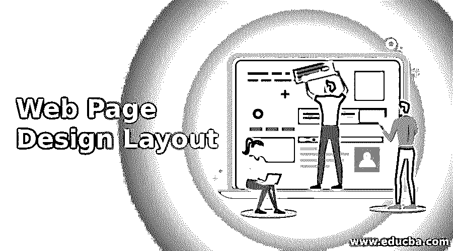
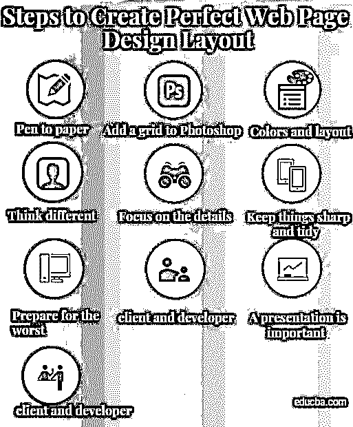
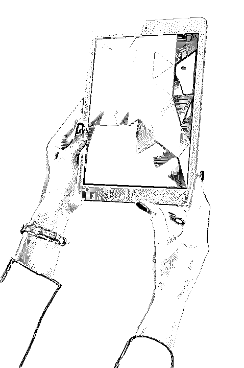

# 网页设计布局

> 原文：<https://www.educba.com/web-page-design-layout/>

<address>

</address>

## 网页设计布局技巧

当你设计和布局一个网站的时候，有很多事情需要考虑。即使是最有经验的网页设计师也会犯错误，尽管他们有多年的设计经验，所以我们不要考虑初学者会犯的那种错误。

以下十个网页设计布局步骤涵盖了你在开始一个新网站项目或开始与数字机构合作之前应该知道的所有基本信息，也涵盖了在网页设计布局过程中应该关注的内容

它们涵盖了基本的网页设计布局方面，如登录页面的设计，以及更好地运行网站的一般工作流程问题。遵循这些网页设计布局步骤，您将能够更好地创建专业级别的网页设计布局。

<small>网页开发、编程语言、软件测试&其他</small>

### 创建完美网页设计布局的步骤

以下是步骤:

#### 1.笔到纸

当你开始一个项目时，不要只是启动 Photoshop 或网页设计软件。这是一个常见的错误，即使是有经验的设计师在考虑他们必须解决的问题之前也会犯这个错误。没错；网页设计布局是为了解决问题，而不仅仅是为了好看和美观。这些问题只能通过良好、清晰的层级和布局来解决。在看颜色代码和阴影之前，先关注内容、布局和功能。

当你必须创建一个项目的外观和感觉时，你需要做的第一件事就是创建一个能够解决所有网页设计布局问题的顶级框架。框架是围绕内容的用户界面，它有助于在网站上执行操作和导航。该框架还包括底部和侧边栏和其他组件，以及导航元素。不用说，你不能错过这些重要的部分。从这个角度开始你的网页设计项目，你会对布局和如何设计每个页面有一个清晰的理解。

#### 2.在 Photoshop 中添加一个网格，然后选择你的字体

现在，你可以启动 Photoshop 了。但是在你开始设计任何东西之前，你首先需要一个合适的网格。不管你对网页设计布局软件有多精通，不管怎样，不使用网格最终都会导致糟糕的网页设计布局。网格有助于构建不同部分的页面布局，并根据不同的屏幕尺寸要求为您提供指导。更重要的是，它有助于创建一个响应式的网页设计布局，并在间距和其他元素方面做出一致的设计。

一旦网页设计网格设置好了，是时候进入字体和颜色了。这可能需要一段时间，但也是网页设计项目中令人兴奋的阶段。一般来说，在网站布局中最好不要使用两种以上的字体。然而，这可能因不同的网页设计项目而异；你可以坚持使用一种字体，也可以尝试几种不同的字体。不管怎样，选择一种易于阅读的字体，即使有很多文本需要阅读。行动号召和标题要更有创意，选择大字体。此外，保持整个网站在排版方面的一致性。

#### 3.颜色和布局

网页设计在为网站选择颜色时可能会变得疯狂，但最好使用有限的色调和颜色，因为任何东西太多都是不好的。你可能在选择字体的时候就在看颜色。探索在用户界面、文本和背景中使用什么颜色。为一般用户界面使用有限的色调和颜色。基于元素的功能在整个 UI 中应用一致的颜色。看看 Vimeo、Quora 和脸书等热门网站的布局就知道了。除了用户界面之外，图形细节或插图不应该有颜色限制，只要它们不干扰网站的其他组件或功能。

至于网页设计布局，最好遵循的原则是“越简单越好”。每个部分都必须对网站至关重要，有一个理由和对访问者最终结果的好处。布局必须能够突出最重要的内容和元素。保持一个页面上的调出数量最少，这样整个网站才能为访问者提供价值。确保布局最简单的一个好方法是从最基本的开始，只在必要的地方添加元素。

#### 4.思考不同

在这一点上，你会对网站的基本元素有所了解，但是不要害怕重新思考当前的惯例。想想现在被认为重要的因素。例如，你需要一个搜索按钮吗？在某些情况下，它可能会有所帮助，但在大多数情况下，它是多余的。网页设计布局约定和网页设计布局模式之所以存在，是因为它们在某些情况下是有效的。然而，它们可能并不适用于所有情况，并且可能已经过时。重新思考组件上已建立的模式，并考虑如何改进它们。

<address>Image source: pixabay.com</address>

也不要将你的反思局限于行业标准或惯例。你还得重新思考自己的习惯和网页设计布局模式。创新并不总是来自挑战外界的惯例；它也可以来自于在每个项目中挑战自己。不要把自己局限在一种或几种工作方式上。各种挑战的例子可能包括新的网格系统，新的组件，或者只是避免某些颜色和字体。

**推荐课程**

*   [专业免费 Python 培训](https://www.educba.com/software-development/courses/python-certification-course/)
*   自由软件测试课程
*   [免费 Java 认证培训](https://www.educba.com/software-development/courses/java-course/)

#### 5.关注细节

每一个称职的网页设计师都会强调这一点，而且理由很充分。俗话说‘上帝在细节中’。网站或网页中最小的细节都会对用户的可用性产生巨大的影响。

一些简单的事情，如一个小的互动，美学触摸或动画可以改善整个网站。但是这些细节是必不可少的，随着你获得更多的经验，它们会自然而然地出现。专注于每一个组件的卓越，它将汇集在一起，形成一个优秀的完整产品。每个组件都必须设计成它自己就是最好的独立组件。很多设计师把他们网站的一部分留到了最后，很少考虑它们。

#### 6.保持物品整洁

通过设置背景/背景颜色和笔触之间的正确对比度，保持网站上所有图像和内容的清晰度。除了美观之外，你还必须避免一些其他常见的东西来创建一个干净整洁的网站。锐化输出时要避免的一些事情包括模糊边缘、渐变条带、字体渲染选项以及与背景融合不良的笔画。

这些只是一些简单的网页设计的例子。继续从整体上审视你的网页设计布局，看看是否一切都配合得很好。然后分别更仔细地分析每个组件。

当用 Photoshop 设计时，保持你的 PSD 文件干净，不管项目有多大，也不管参与项目的设计师有多少。更干净的文件可以更容易地导出各种部分，使网页设计布局过程更快，以及与使用共享文件的其他设计人员一起工作。

#### 7.做最坏的打算，保持专注

网页设计者通过不同的约束来解决问题。就网页设计而言，约束可以是技术上的、内容相关的或概念上的。当你开始做一个项目时，不要只想到理想的情况，还要想到最坏的情况。例如，用户可能试图在一个四英寸的屏幕上访问网站，该屏幕上运行的操作系统已经更新了两次以上。请记住，您的网站布局将如何在不同的屏幕尺寸、设备和操作系统中工作。

当你接近一个网站时，你必须设计好网页，这样即使在最坏的情况下也是最好的情况。作为一名网页设计师，你也必须对这个项目着迷。每个优秀的设计师都全身心地投入到每个项目中。让你的网站成为你生活的一部分，最终你会看得更清楚。然后你可以识别缺陷和问题，并最终改变它们。随着项目的成熟，作为网页设计师的你也会成熟。到最后，你会从这个项目中学到比你脱离它更多的东西。而且，最后的输出会好很多。如果你把自己的汗水和鲜血倾注到每一个项目中，一定会给大家看的。

#### 8.与你的客户和开发商建立良好的关系

如果你打算成为一名专业的网页设计师，你将不得不接触和处理大量的客户和网站开发者。让我们从客户开始，因为客户永远是第一位的。

当你提出一个交互式网页设计或概念时，你必须与你的客户保持开放的交流，这样你们双方就在同一页面上。不要长时间停留在一个概念上；尽快与客户分享。一旦一个最初的概念被认可，你将会更好地了解你的客户想要什么，并使你自己更接近这个项目。如果这个概念没有被认可，你可以从客户那里收集尽可能多的反馈，以得到一个更合适的概念。无论如何，不要等到你做出一个详细的概念。

一旦你的概念准备好了，你开始着手这个项目，你必须和你的开发团队建立良好的关系。开发者不仅仅是程序员；他们也很有创造力，他们和网页设计师一样对自己的工作充满热情。然而，他们通常从一开始就没有参与到项目中，只有当概念已经确定，不再需要他们的创造性投入时，他们才会参与到项目中。可惜这个过程是错误的。有时候，最好的网页设计布局想法来自最不可能的来源。不要低估开发团队的创造力。在开始时将他们带入概念化过程，从一开始就让他们成为项目的一部分。与你的开发者分享你的网页设计布局概念，并[吸引他们提出更好的想法](https://www.educba.com/web-design-tools/)，并最终从他们那里得到更好的编码和执行。

#### 9.演示很重要，有些想法可能不重要

虽然创建一个伟大的网站和制作一个伟大的项目是非常重要的，但是把它很好地呈现给客户也是非常重要的。即使是世界上最好的网页设计布局，如果没有很好地呈现，也可能会被完全忽略或厌恶。请记住，项目中使用的网页设计布局概念和想法对于和您的整个团队来说可能很清楚，但是对于您的客户或后来成为项目一部分的人来说可能不太清楚。

同样，你也应该记住不要太依赖你所有的网页设计想法和网页设计布局概念。为它们中的每一个都做一个有力的论证，但是记住如果你的团队或者客户不同意他们的观点，你就要放弃。记住偏好可能是主观的；对您有效的方法可能对客户或开发人员完全无效。作为一名网页设计师，你需要对自己的想法有坚定的看法，但你也应该足够灵活，如果别人不同意，你可以迅速改变概念和想法。

#### 10.跟踪和监控每个阶段的进展，并向社区展示

任何在代理机构工作的人都知道，当他们的前一个项目正在开发或刚刚完成时，为一个新项目的网页设计工作是多么艰难。与人们可能认为的相反，设计师的工作不仅仅是发送 PSD 文件和样式表。如果你完全投入到一个项目中，你还必须检查开发人员，看看你的网页设计和交互想法是否按照你的计划执行，并根据需要帮助他们，以确保每个细节都工作正常。

您还可以与设计师社区共享您的工作进展组件和样式表。有时，项目中最好的部分会被遗漏或丢失在归档文件夹中。一旦项目完成并得到客户的批准，您就可以创建一个案例研究，其中包含正在进行的工作以及被省略的网页设计和组件。这对社区来说是一笔巨大的财富，你可以从反馈中学到很多。

### 相关文章

这是一个网页设计布局技巧的指南，很容易记住。在本帖中，我们学习了创建完美网页设计布局的步骤。这里有一些文章可以帮助你获得更多关于网页设计布局的细节，所以只要浏览一下链接就可以了。

1.  [网页设计趋势](https://www.educba.com/web-design-trends/)
2.  [有效网页设计师作品集的 10 个特征](https://www.educba.com/10-features-of-effective-web-designer-portfolio/)
3.  [免费网页设计软件](https://www.educba.com/free-web-page-designing-software/)
4.  [静态与动态网页](https://www.educba.com/static-vs-dynamic-web-page/)

