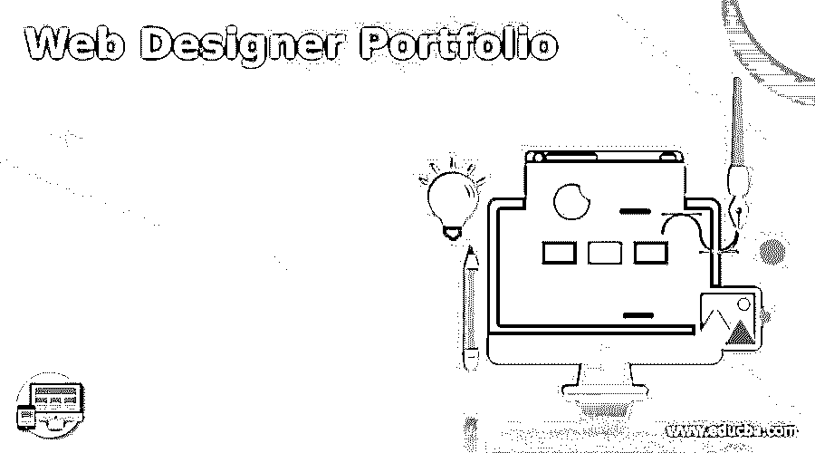

# 网页设计师作品集

> 原文：<https://www.educba.com/10-features-of-effective-web-designer-portfolio/>

## 网页设计师作品集简介

作为一名网页设计师，网上作品集对于获得业务是绝对必要的。每个潜在客户肯定会至少看一次你的投资组合，并根据你的投资组合有多好来做出决定。建立一个投资组合可能相当困难，这不是你做一次就可以忘记的事情。你需要不断更新它来加强你的在线形象。无论你是建立一个新的投资组合还是更新一个现有的投资组合，这里有十个对留下最佳印象至关重要的特征。

### 网页设计师作品集的 10 个特点

网页设计师作品集如下:

<small>网页开发、编程语言、软件测试&其他</small>

#### 1.它应该有你最好的作品

你的在线作品集的强度取决于里面最弱的一张照片。换句话说，你需要确保你投资组合中的每一个元素都是你最好的作品。如果有什么是低于标准的，删除它或更新它，使它变得更好。不要只是组装你所有的[设计作品](https://www.educba.com/web-design-trends/ "10 Web Design Trends for 2016")，好的和坏的。建议在你的作品集里放大约 8 到 20 件作品。有些人可能会推荐更多，有些人会推荐更少，但没有人会告诉你把你赚的所有东西都放进你的投资组合。策划你的工作以获得最佳质量。

没有过去工作的例子，投资组合网站将是不完整的，这是大多数客户希望看到和衡量你的技能水平。用正确的方式展示你的作品也会带来很大的不同。许多网页设计师以一种独特的、令人印象深刻的或创造性的方式展示他们的作品。有时候，呈现的方式会盖过作品本身，有好有坏。

精心策划你的作品，只展示最好的例子，也能确保客户不会被过多的内容淹没。在任何情况下，大多数潜在客户都不会坐下来浏览每一个设计，所以你展示的东西必须选择能产生最大影响的。

如果你进行不同的设计，比如标识、商务汽车、博客主题等等，最好是在每个类别中只展示几个最好的例子，而不是展示一大堆你的作品。较小且更具选择性的作品集更容易被访问者仔细阅读。

#### 2.应该有变化

虽然让你的作品集拥有最好的作品很重要，但也应该展示一些不同的作品来展示你广泛的技能。如果你有一项技能，你的作品集应该炫耀它。无论是 logo 设计，还是编辑设计，还是其他。展示你的各种工作和技能，就像你如何把它们写进简历一样。你的作品集实际上就是一份视觉简历。如果你专注于某种媒介或技能，如排版、整合品牌或布局设计，你仍然可以展示更多样的设计来展示你的工艺。

#### 3.清晰的交流

一个作品集网站应该简洁而[清晰地传达所提供的服务](https://www.educba.com/communication-skills-benefits/ "How to Develop Good Communication Skills")以及你作为一个网页设计师必须向你的客户提供什么。有许多不同的设计类型和专业，并不是所有的客户都清楚地了解所提供的服务。事实上，最好假设每个访问者都不清楚你提供的服务，并创建一个网站明确告知他们这一点。如果你的[网站不能有效地沟通](https://www.educba.com/10-ways-of-communicating-ideas-effectively/ "10 ways of Communicating Ideas Effectively")，访问者很可能会感到困惑或不感兴趣。不管怎样，你都找不到工作。

同样，你可能会面临是否在投资组合网站上公布价格的决定。这可能是一个小时的费用或基于项目。你也可以选择不透露任何价格，并要求潜在客户亲自向你寻求免费报价。这里没有明确的对错。无论哪种方式都可以，但要确保你清楚地表达这一点。

影响网站可传播性的一个主要因素是它提供了多少信息。作品集网站需要陈述和解释某些项目，但关键是要删除任何多余的内容，以帮助必要的信息更加突出，使观众更容易理解。

问题中的多余可以指任何内容或措辞，甚至是设计元素。最好的投资组合网站实际上在他们的方法上是相当少的。基本保持不变:列出服务，描述资格，介绍过去的工作，给出联系方式。不必要的过量元素实际上会有害。很多网站都有博客，这将在后面讨论，实际上是好的，但大多数其他内容和多余的元素对吸引新的潜在客户没有什么帮助。保持整洁的布局，只呈现相关信息。

#### 4.团结的意识

现在，你的作品集里会有你最好的作品和各种各样的颜色、风格和设计。鉴于这种混合，你的作品集可能最终看起来像是风格和主题的混乱组合。不惜一切代价避免这种情况。你的在线作品集必须有一种统一感。呈现的作品和呈现的风格必须流畅，相辅相成。你需要建立一个组合网站，看起来不错，也补充了目前的工作。如果你过于关注设计，你可能会损害网站的整体质量。在一个同样完美的网站上展示你最完美的作品，你会得到客户更积极的回应。

作品集网站可以展示一些最有创意的设计。鉴于网页设计是一个高度创造性和艺术性的职业，你的在线作品集应该是你的技能和作品的真实体现。因此，你可以对你的投资组合网站进行更多的创造性自由，而不用担心任何可能的负面结果。事实上，客户更愿意看到你所有的原创性和创造性，精神错乱。

#### 5.一个好的平台

一个[高质量的作品集网站](https://www.educba.com/10-best-website-architecture-tools/ "10 Best Website Architecture Tools")和正在呈现的作品一样重要，网站平台对其最终质量起着很大的作用。你可以使用像 Dreamweaver 这样的 WYSIWYG 编辑器，但是很多网页设计者选择内容管理系统(CMS ),因为它更容易使用和设置，并且有响应模板。如果你是一个经验丰富的网页设计师，你可以选择自己创建整个网站，包括编码和其他。只需选择最适合你的作品，以及最适合展示你作品的作品。

#### 6.响应式设计

如今，响应性不仅仅是一个网站的吸引力；这是一个基本要素。而不仅仅是一个投资组合网站；鉴于多达三分之二的网络流量来自平板电脑和[移动设备](https://www.educba.com/mobile-web-service-performance/ "A Guide To Mobile Web Performance")，每个网站都应该理想地采用响应式设计。因此，你需要确保你的网站看起来不错，功能正常，不管用的是什么设备，屏幕大小如何。响应也不局限于你的整个网站。你的图像也需要适应。你需要上传我们作品的高分辨率版本，而不是缩小到旧的网络图像标准。你可以使用你的 CMS 来实现，或者使用 CSS3、JavaScript 或 HTML5 编码来整合“响应式”图像，这些图像可以缩放以适应大小屏幕。

#### 7.个人品牌

在这一点上，你应该能够做出一个真正好的作品集网站，但是它真的能从其他使用相同原则的作品集网站中脱颖而出吗？它需要脱颖而出，因为个人品牌对于客户和其他访客记住你是必要的。你需要能够从成千上万的网页设计师中脱颖而出，而一个个人品牌正好可以做到这一点。你的个人品牌可以是一个独特的网页设计元素或反映你作品的主题，或者只是一个独特的标志设计或图标。它应该能够抓住浏览者的眼球，帮助客户和雇主在成千上万的网站中记住你的网站。

当潜在客户访问在线投资组合时，有许多因素会影响他们的决定。一些因素是显而易见的；展示的作品质量很重要，作品的种类和风格也很重要。成本也是一个主要因素，客户的网页设计师与那些使设计过程顺利、愉快和成功的人一起工作也是一个主要因素。你需要通过你的作品集网站展示这些特质。你的个人品牌应该能够与客户建立个人联系，并让他们相信与你合作会很容易。

#### 8.自定义域名和行动号召

有些人可能认为自定义域名是绝对必要的，他们这么说是有道理的。但是，您仍然可以在非定制域上托管您的在线投资组合。不过，域名给你的网站增加了一些自主性和可信度，而且价格也很便宜。

最终，你希望你的投资组合网站能够吸引新客户。所以在你的网站上添加行动号召是有意义的。行动号召不必过于激进。大多数网站只是提示访问者联系他们以获得免费报价，或者提供联系方式以获得更多信息。这很简单，但是你可以得到有用的联系方式。

一旦你加入了让访问者联系你的行动号召，关键是你也要让他们容易联系到你。大多数投资组合网站都有一个简单的联系方式。有些网站只是给出网站设计者的电子邮件地址，让访问者最终决定是否主动联系。这两种方法各有利弊，但无论你选择哪种，联系信息都应该容易找到，并且可以从任何页面访问。

#### 9.社交媒体元素

今天的社交媒体越来越普遍，它已经成为任何网站的基本元素。因此，它也应该是你投资组合设计的重要组成部分。整合社交媒体按钮，加强你的在线形象，让访客分享你的作品或在社交媒体上查看你的形象。他们也可以通过社交媒体联系你。但请记住，你的社交媒体活动应该反映你的整体品牌，所以要保持整洁，反映你的风格。

#### 10.添加博客

一个简单的作品集网站很好，但是把它和设计博客结合起来会更好。博客元素会给你的作品集网站增加更多的特征和信息。它会给访问者更多关于你的工作方式、设计过程、风格偏好和价值观的信息。此外，它还能让你的网站更有价值，更容易被发现。撰写针对互联网优化的博客文章，并为客户和其他网站设计者提供有用的提示。为搜索引擎优化你的文章，以提高你的投资组合网站的页面排名，并将其列入首选。谷歌非常关注新鲜和优化的内容，所以用新的和信息丰富的博客文章保持你的网站新鲜只会提高你的评级。添加博客也很容易，因为大多数 CMS 系统都支持博客。

设计博客的另一个巨大好处是它将你树立为行业专家，即使你可能并不总是喜欢它。把你知道的东西拿出来，也许会让某个地方的某个人受益，建立你在网页设计师社区以及客户中的信誉。

### 结论

遵循这些步骤，你将拥有一个伟大的作品集网站，但你的工作还没有完成。可见性很重要。你不能简单地建立一个网站，并期望它吸引流量，除非你提高其搜索引擎页面排名。有几种方法可以做到这一点。第一种是将你的网站或图片提交给已经从潜在客户那里获得大量流量的图片库。博客也不错，SEO 技术也不错。竞争是激烈的，所以保持警觉，继续做你的网站，即使在它到达搜索引擎结果页面的顶端并开始吸引流量之后。

### 推荐文章

这是一个网页设计师作品集的指南。在这里，我们已经讨论了基本概念，以描述性的方式展示了 10 种令人惊叹的网页设计师作品。您可以阅读以下文章了解更多信息——

1.  自由网页设计师
2.  [排版 app](https://www.educba.com/typography-app/)
3.  [网页设计工具](https://www.educba.com/web-designing-tools/)
4.  [个人网站创建](https://www.educba.com/personal-website-creation/)

