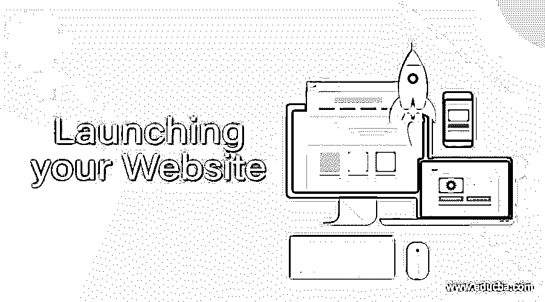
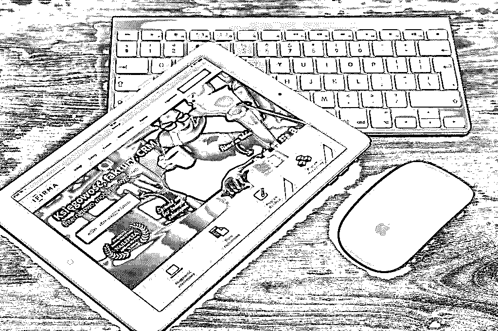

# 启动您的网站

> 原文：<https://www.educba.com/launching-your-website/>

## 推出您的网站简介

你的新[商业计划](https://www.educba.com/business-plan-ideas/ "How to Write a Business Plan?")已经准备好，你即将开始运作。

现在，你需要用一个网站向全世界宣布你已经到了。为了让人们对它刮目相看，它需要脱颖而出，让用户停下脚步，而且不要太贵。

<small>网页开发、编程语言、软件测试&其他</small>

正确吗？

嗯，也许不是。对于任何互联网营销人员来说，建议一个网站可能不是所有企业都需要的，这可能是职业自杀。然而，这就是冷酷的事实。而且即使需要网站，也不一定需要专业做的网站。

这并不是建议企业放弃互联网；这就是未来的业务所在。专业网站可能没有必要展示你的业务。如果需要的话，一个通常免费的登录页面可能就足够了。

通常，公司已经在网站上花费了数千美元，但并没有真正实现多少。对于小公司来说，他们通常没有全职的 IT 人员，这意味着完全依赖于网站开发者。通常情况下，这会导致网站没有不必要的花里胡哨。

通常，你公司的营销组合需要网站。毕竟，所有这些在线链接将会把我们引向何方？传统上，网站是大多数公司在线营销策略的支柱。但是新的研究显示，越来越多的人通过手机和设备获取信息。大部分在线时间花在社交媒体上。那么，网站将何去何从？

当然——你需要把话传出去。当然，每个人都在互联网上。但是一个网站能实现所有这些吗？让我们进一步调查。

### 网站类型

在我们继续评估企业之前，这里有一个关于小型企业网站类型的简短入门，这样你就可以了解[不同风格的网站](https://www.educba.com/types-of-websites/):

*   小册子风格的网站:这种类型的网站被认为是一个基本的网站，一个在线目录条目可以直接访问的地方。这种网站上有所有的业务信息，基本内容和选择可用产品的信息。当小型企业希望在网上开展业务时，这通常是他们想要的。
*   **有博客的网站:**现在，这些也可以是宣传册式的或者[电子商务网站](https://www.educba.com/ecommerce-shopping-websites/ "10 Best Ecommerce Websites and Why")，但最主要的一点是它需要更新，以一定的频率。当你想让博客空间不仅提供你的产品，还提供技巧、工具、观点等时，通常需要博客。手工艺品商店就是一个很好的例子。
*   支持电子商务的网站:这种网站允许用户在线购买产品。这只是基本手册网站上的一层，上面有人们可以购买的产品。
*   **网络应用**:如果你的业务需要用户输入，然后使用和处理，那么你就在[网络应用](https://www.educba.com/how-to-build-web-applications-using-mongodb/ "How to Build Web Applications with Mongo db")的领域。如果你是的话，你会知道的。这些网站，连同电子商务网站，现在已经被应用领域侵占。越来越多的企业正在走应用程序的道路，整合网络应用程序和电子商务设施。例如，在线订餐已经让位于移动订餐，在印度，与基于应用程序的订单相比，必胜客的在线订单数量大幅下降。

### 七个问题

这里有一个快速测验，可以帮助你确定你是否需要一个网站，如果需要，是什么样的网站。

#### 1.你的企业需要更多的客户吗？

很多时候，信不信由你，答案是否定的。许多小企业主说，“是的，这很好，但我们现在还没有准备好。”影响他人的生意；例如，拥有固定和稳定客户群的零部件制造公司甚至不需要网站。

有些商家可能不确定。在这种情况下，最好保留 URL，只保留一个通常免费提供给域名的简单页面。

#### 2.你的潜在客户会在网上找你吗？

有大量的企业需要在线，但却没有。有成千上万的企业从网上业务中一无所获，然而他们有一个。一个典型的例子是当地的杂货商。除非杂货商计划进行在线订购(使用应用程序会更好——稍后会详细介绍),否则网站不会向用户提供任何附加信息。如果计划是在人们搜索“新德里的杂货店”时出现，那么营销应该集中在目录列表上，而不是一个专门的网站。

#### 3.你的潜在客户在网上做什么？

这个问题和问题 2 不一样。一家制作个性化礼物选择的公司做了一项调查，调查显示大多数潜在客户在社交媒体上花费的时间比其他任何活动都多。他们决定放弃网站，只在脸书展示所有的信息和特殊设计。他们只花了网站费用的一小部分，就产生了足够让他们忙上六个月的查询。

所以，问自己一个问题:你的潜在客户在网上做什么？如果他们浏览，网站是自动去的。如果他们把它用于推特和社交媒体，也许网站不是必须的。

#### 4.他们想从你的网站上了解什么？

当然，这指的是人们浏览你的网站的目的。答案将决定你需要什么样的网站。

他们会寻找产品信息、运输和交付、一般公司信息或一般行业趋势吗？

例如，如果你是一个古怪的艺术商店，当然，他们会寻找产品规格和可能的网上购物选项。这可能需要支持电子商务的商店。

如果你是一个工业零部件制造商，网站的访问者可能会寻找产品的规格和交货信息等。这可能只需要一个小册子类型的网站。

例如，如果你是一家有机商店，人们想要的可能不仅仅是产品规格和运输；他们可能想去你的商店了解更多。然后可能需要一个博客，在那里你可以谈论有机农业的趋势，你可能参与的任何行动等等。

#### 5.你的产品是什么？

所以，这是一个很明显的问题。例如，手工工艺品、设计师服装和稀奇古怪的礼品等利基产品将需要一个网站，让顾客知道期待什么样的产品。杂货商可能不需要网站。

另一方面，[基于技术的企业](https://www.educba.com/technology-to-improve-productivity/ "How to Use Technology To Improve Productivity")可能需要一个网站。当然，[一家网页设计公司](https://www.educba.com/web-page-design-layout/ "How To Create a Perfect Web Page Design")需要一个网站？一般来说，希望“突出”他们的一些工作的创意服务公司需要一个空间来展示他们最令人惊叹的工作，而社交媒体往往会冲淡一些。因此，广告公司、电影制作人和网页设计师需要网站来展示他们最好的作品。

 

#### 6.你有多少钱？

市场营销中的标准笑话如下。客户问:要花多少钱，中介告诉客户:“你有多少钱？就是那个加 20%。”

但是说到网站，知道你有多少闲钱是很重要的。网站是一种营销技巧，它的大小并不重要。无论你是大企业还是小企业，你都需要一个网站。托管率在任何情况下都是一样的，无限存储是常态而不是例外。区别在于维护和[网页设计](https://www.educba.com/web-design-trends/ "10 Web Design Trends for 2016")。对于不需要很多更新的网站来说，[的主要成本在网页设计上。如果你有钱，并且你认为你有资格拥有一个时髦的网站，那就去做吧。如果你的预算非常有限，你甚至可以从购买域名时免费提供的登陆页面开始(www.yourbusinesshere.com)。](https://www.educba.com/freelance-web-graphic-designer/ "How to Be a Successful Freelance Web Designer")

如果你不确定你在网站上有多少钱，那就写一份营销计划。如果这是一个需要在线眼球的新业务，那么选择中间产品可能是明智的。

#### 7.你的网站会提供哪些增值服务？

这个问题将回答这个问题:你的网站将提供什么服务？

以下是企业可以提供的增值服务示例:

*   **网购**:人们可以在网上向你订购吗？有一点需要考虑:最近，亚马逊等在线企业以荒谬的价格提供产品，以至于该公司网站上几乎没有订单，就像图书出版商一样。
*   **预订**:假设你经营一家民宿。你提供的增值服务可以是查看某一天的可用性。
*   **评分:**顾客可以看到别人对产品的看法。
*   **观点和博客**:例如健康和保健类的网站，以及工艺品商店，在这些网站上，经常性的操作方法和信息可以使人认同这个品牌，并把这个商店当成一个你正在与之交谈的朋友。这需要一个不断更新博客的人，拥有一个废弃的博客有时比没有博客更糟糕。

请注意，大多数问题都是直观的，只是指导原则。最终，你知道自己想要什么。即使你不是一个需要网站的企业，你现在也可能想要一个。这完全可以接受。如果你正在考虑是否需要一个网站，如果需要，需要什么样的网站，这些都是你需要考虑的简单要点。

### Appy 之路

 

这肯定是最新的消息，但是应用程序，或者说[应用程序](https://www.educba.com/top-6-best-iphone-apps-of-all-time/ "Top 6 Best iPhone Apps of All Time")，已经存在了！他们，就像企业倾向于做的那样，正在聚集。这意味着，如果你有一个卖东西的小商店，可能会有一个较大的在线零售商会给你一个位置。有专门经营家具、书籍、五金、家居用品、杂货的网上商店，应有尽有。

作为一个小企业主，它可能对你来说是有意义的简单插入。例如，在印度，一个名为 Peppertap 的应用程序将食品杂货送到你家门口。他们的运作方式很简单:他们与当地的杂货商合作，并在当地的杂货店派驻送货人员。当订单到达应用程序时，他们只需从商店到顾客所在地完成订单。现在，如果你是做杂货生意的，你可能想和 Peppertap 合作，因为他们会为你提供所有的服务。在某种程度上，大多数大型在线零售商都这样做。

如果你在寻找自己产品的品牌，你可能仍然需要自己的网站。如果你在处理通用产品，或者是一个经销商或批发商，与应用程序的家伙打字可能更有意义。

在线购物世界的另一个趋势是纯应用网站。一些网站，如 Myntra.com，只提供应用程序。这可能是网站发展的方向，所以当你考虑和设计你的网站时，你也需要考虑到这一点。

### 移动友好网站

越来越多的在线活动发生在移动设备上。所以，无论你决定创建什么样的网站，记住一件事:它必须是手机友好的。简单网站的最佳选择是使用内置了移动响应能力的模板。基本上，这意味着网站将以最佳形象出现在各种设备上:无论是手机、平板电脑、台式机还是笔记本电脑。该网站会计算出你的屏幕分辨率，并适当调整菜单和内容。重要的是要注意，它不只是把你的网站挤入你的设备——那会使多栏网站几乎不可读！它**重新设计了你的网站，让它更容易阅读。**

因此，如果你想要一个网站，即使是一个基本的登陆页面类型的网站，也要选择一个响应迅速的网站:它的价格一天比一天便宜。因为如果你的网站变得复杂，你想要回复到一个响应式的设计，这将是非常耗时的。

所以，你有它。无论你是小企业主还是大企业主，无论你是一家有几代历史的公司还是一家初创公司，你都需要在[数字营销](https://www.educba.com/digital-marketing-coaching-online/ "Digital Marketing Coaching Online")、网站和[移动应用](https://www.educba.com/bundle/mobile-apps-full-courses-bundle/ "Mobile Apps Full Courses – Bundle!")的世界中导航。你如何从另一端脱颖而出，很大程度上取决于对你自己、你的业务以及你开展业务的环境的了解。

### 推荐文章

这是启动你的网站的指南。在这里，我们已经讨论了基本概念，类型的网站，移动友好的网站以及七个快速的问题分别。您也可以看看以下文章，了解更多信息–

1.  [为您的网站带来有机流量](https://www.educba.com/drive-organic-traffic-to-your-website/)
2.  [链接构建策略](https://www.educba.com/link-building-strategies/)
3.  [优质网站](https://www.educba.com/high-quality-website/)
4.  [电子商务购物网站](https://www.educba.com/ecommerce-shopping-websites/)

