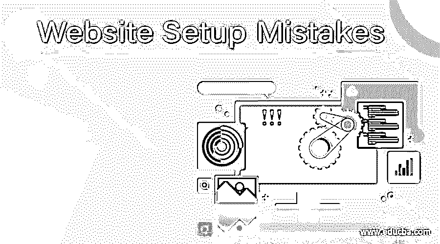
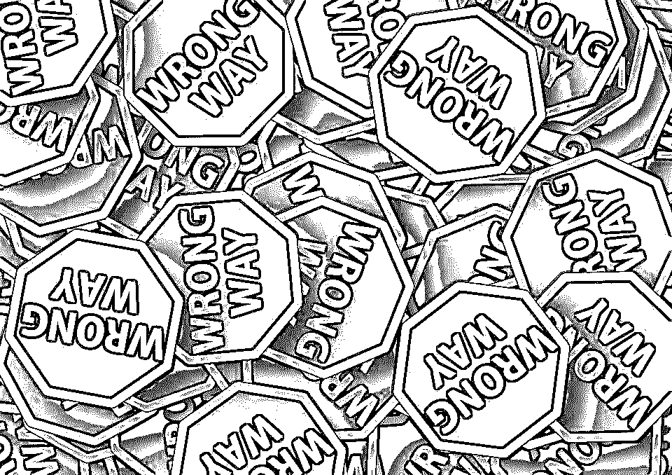

# 网站设置错误

> 原文：<https://www.educba.com/website-setup-mistakes/>

## 5 个网站设置错误介绍

在急于获得成功的过程中，我们经常会犯一些可以而且应该避免的错误。这些错误经常导致重要工作的失败。不管出于什么原因，拥有自己的网站，可能是把你的作品集放在网上，你自己的博客或有一个电子商务网站来销售你的产品，如果做得正确，会非常有成效，如果你做了错误的决定，甚至会崩溃。就像任何传统的商业冒险一样，你的决定要么带你前进，要么拖你后腿。

个人网站仍然可以有缺陷，因为它们中的大多数是免费托管的，而且几乎不花创作者任何钱。所以，如果你有一个博客，但你没有自己的域名，你偶尔会发布一些随机的东西，这没什么，但在商业中，小错误会让你付出很大代价。做出错误的决定和投资可能是灾难性的。数字营销可能是[营销你的品牌](https://www.educba.com/course/brand-management-building-a-strong-brand-9/)最便宜的方式之一，但你每年仍必须投入一大笔钱。别忘了，这些错误不仅会让你损失金钱，还会让你失去消费者。

<small>网页开发、编程语言、软件测试&其他</small>

 

<address>Image source: pixabay.com</address>

网站设置错误可能有各种类型。你可能会觉得雇佣专业人士来做你的工作会在某种程度上减少失误的百分比，但事实并非如此。即使你有经验，你也可能犯最常见的网站设置错误。

这里列出了人们最常犯的网站设置错误，以及你必须避免的错误:

### 网站设置错误

以下是一些网站设置错误:

#### 1.没有计划或策略——网站设置错误

人们常说，直面问题从来都不是正确的解决方案。当你面临落后于竞争对手的问题时，你经常会想到做一些不同的事情来给你带来优势。这通常会让你迅速采取措施，并在做出决定后减少投资。你决定盲目跟随当前趋势，没有发现制定计划或制定策略的必要性。

把你的生意放到网上是当前的趋势之一。但是就像任何重大的商业决策一样，数字营销需要一些时间和思考。假设和变量对商业[没有帮助](https://www.educba.com/business-plan-ideas/)。你不能认为上网会让你一夜成名，因为大多数人都使用互联网。把你的消费者作为变量，也就是说，不知道你要接触的受众是什么，这不是明智之举。

如果你想增加网站的流量，你需要商业计划和营销策略。现在，这些并不涉及冗长的文件，复杂而精确地描述你在做什么，制定计划和策略只是涉及回答通常的问题，什么，为什么，如何和谁。

所以，从-什么开始？

你的网站是关于什么的？你将销售什么样的产品？除了你们的产品，你们还打算提供什么服务？这会给你一个关于你的网站可能会是什么样子的基本概念，并告诉你的客户你的主张。

下一个，世卫组织？

你的目标人群是谁？你的竞争对手是谁？这真的减少了你在以后建立网站时的工作量。

最后，怎么做？

你的网站与现有的有什么不同？你打算如何解决客户的问题？你打算如何从中获利？

这个问题真的会[帮助你设计一个更好的网站](https://www.educba.com/website-ranking-traffic/ "How to Improve Website Ranking")来运营你的业务。此外，在牢记 SEO 和 PPC 等概念的同时制定策略肯定会让网站设置的任务不那么令人生畏。

 

<address>Image source: pixabay.com</address>

#### 2.认为这是小菜一碟——网站设置错误

他们说，永远不要低估你的敌人。这并不是说建立你自己的网站会成为你的敌人，但是，不要低估为了使它成功你必须付出的努力。进入数字营销没有简单的方法。虽然作为一个客户，你可能会觉得这就像一个餐馆，你点了东西，过了一段时间它们就会到达你的手中，但对于一个网站的建立和维护来说，它不仅仅是一个简单的需求和供应链。

除了你的产品，你的注意力是你的网站和你的消费者所需要的。建立适当的技术和永远不停滞不前是要完成的任务。因此，与任何传统企业不同，你需要付出很多努力，才能充分认识到手头的任务。没有通往巅峰的捷径。永远记住，慢而稳赢得比赛！平台可能已经改变了，但是你的努力不应该改变。

即使在你建立了一个网站之后，还有很多工作要做。大多数情况下，一个更好的做法是在你的网站上总是有一个公共论坛。为什么？因为你怎么知道你的顾客是否满意呢？他们可以发表关于他们经历的评论，你可以从中学习。例如，如果他们有什么负面的话要说，立即去做，这样就不会再发生了。比如他们发现产品缺货，或者抱怨没有收到他们看到的商品。你的客户应该能够信任你，而这只有在你倾听他们的意见并把他们放在第一位的时候才会发生。

此外，如果您的客户发现很难对您的网站进行分类，客户支持人员必须全天候为他们提供指导。工作并没有就此停止。你需要不断更新你的网站。你的网站不能和上个月看起来一样，感觉也一样。也就是说，你应该每天都在成长和进化。

所以，如果你认为有一个在线业务将是一件轻而易举的事，现在你知道，它不会！

#### 3.托管平台知识有限-网站设置错误

网站不会自己建立并运行，它们需要被托管，而当你想成为一个严肃的企业时，托管一个网站是很昂贵的。所以，你必须确保你的钱没有白费。为什么需要付费？答案很简单，在你看来，www.abcXYZ.wordpress.com 和 www.abcXYZ.com 哪个听起来更严重？显然，如果你有自己的域名，你必然会被重视。如果你选择在 Weebly 或 WordPress.com 上免费托管你的站点，那么你就属于那些仅仅作为爱好写博客的人，也就是说，你写博客不是为了赚钱。拥有自己的域名，展示你的品牌名称，虽然你要为此付费，但它值得每一分钱。

免费网站托管的其他问题是，许多必要的功能对你来说是不可用的，比如连接到社交媒体，你对网站或其内容不负责任。简而言之，你不是自己的老板，这不是你想要处理的事情。这是至关重要的，因为如果你不决定在你的网站上发布什么，你将不会被视为一个可靠的来源。连接社交媒体也很重要。社交媒体是数字营销的一个大平台，你可以接触到更多的人群，最重要的是，不仅仅是你所在国家的年轻人，而是全球的年轻人。因此，如果你不能决定你的网站将包含或不包含什么，你怎么能期望它代表你，你的企业或你的意识形态？

当你决定了你的网站将代表什么，你必须相应地选择一个平台。做一个彻底的研究，哪个托管网站最适合你，最符合你的预算。此外，你可以托管自己的网站，但这不仅需要财务投资，还需要良好的托管知识。慢慢做决定，这是建立网站最关键的一步。

 

<address>Image source: pixabay.com</address>

#### 4.缺乏展示产品的努力——网站设置错误

我们网站的访问者感兴趣的是你的产品。设身处地为你的消费者着想，试着想清楚一旦你上了网站，你希望网站的服务如何呈现给你。

不像传统的营销宣传，没有推销员严谨地推销你的产品。销售你的产品的唯一途径是在网页有限的空间里你能告诉我们多少关于产品的信息。高质量、令人印象深刻的照片和简短而有效的描述将会派上用场。所有关于产品的重要信息都必须提供，否则，你的顾客最终只会说，“去商店会更好”。如果你正在建立一个网站来销售你的产品，那是你最不希望你的访问者想到的事情。

请记住，顾客既摸不到也看不到你的产品能提供什么，所以你只有一次机会给顾客留下印象并赢得他们的信任。如何销售你的产品完全是你的责任，如果你做不到，没有人会受到责备。

您的产品、库存、规格、描述和成本对您企业的成功都至关重要。你不能认为任何事情都是理所当然的。

#### 5.设计问题——网站设置错误

最后但同样重要的是，你的网站看起来如何是你的 USP(独特卖点)。访问者只能通过你的网站与你联系。因此，你的网站必须恰当地代表你真实的自我和你的品牌名称。

你的网站不仅应该在视觉上吸引人，还应该提供丰富的信息。是的，它应该大声宣传你的服务和产品，但不应该让人害怕。与视觉吸引力相关的常见误解是，它意味着使用大量的颜色和图像。这是非常错误的。尽可能保持你的网站设计简洁。选择一个主题并围绕它工作。两三种对比鲜明的颜色就够了。讲述故事的图片就足够了。不要在你的网站上塞满不必要的东西。简单是关键！

但是设计、主题和图片并不是你的网站中唯一需要的东西。他们只是为访问者提供网站内容的要点。实际的知识总是来自网站中的文字。你提出的信息必须清晰明了。没有人会花几个小时去阅读你的网站，也没有人会满足于有限的知识。

在网站的设计和信息之间必须有一个适当的平衡。任何一方都不应压倒另一方。它们必须携手并进。如果你发现自己没有能力设计这样一个平衡的网站，那么请一个设计师。这是你不能妥协的部分。详细解释你希望你的网站对设计师来说是什么样子，并检查它的进展。

你的域名，你的服务和你的网站设计是唯一能增加你网站流量的东西。不要放弃在这些领域的投资。

如果你已经决定建立一个网站，聪明点。你现在有了建立网站的完整的备忘单。你知道什么该做，什么不该做。如果你的网站是你生意的唯一收入来源，即使不是，它也是你生意的成败所在。你说得对，大多数人确实使用互联网，这意味着他们变得越来越聪明。所以也必须如此。不只是聪明，要有智慧！

### 推荐文章

1.  [WordPress 和 Joomla](https://www.educba.com/wordpress-vs-joomla/)
2.  [个人网站创建](https://www.educba.com/personal-website-creation/)
3.  [启动您的网站](https://www.educba.com/launching-your-website/)
4.  [电子商务购物网站](https://www.educba.com/ecommerce-shopping-websites/)

