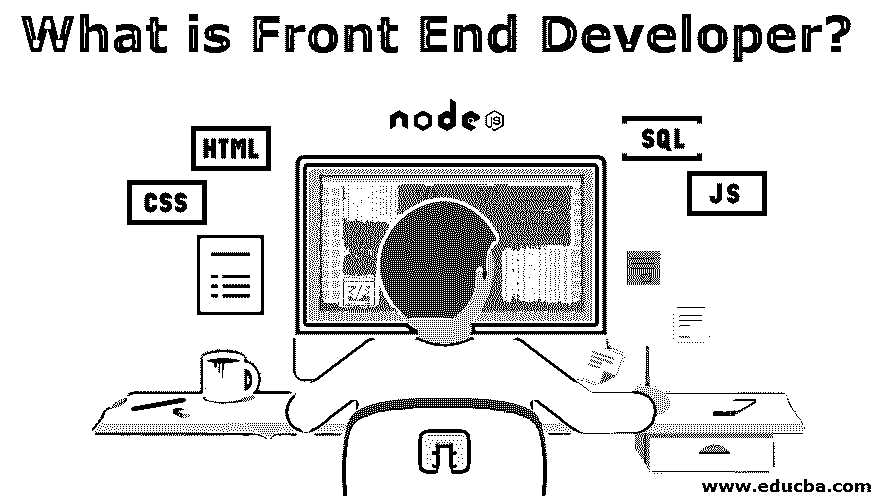

# 什么是前端开发人员？

> 原文：<https://www.educba.com/what-is-front-end-developer/>

## 前端开发人员简介

前端开发是[计算机科学开发](https://www.educba.com/career-in-computer-science/) 的核心 领域，主要专注于编码和构建可见的东西，主要是在 web 应用程序或网站中。前端开发人员是负责为这些类型的应用程序设计布局或模式的人。除了传统的开发技术和方法，前端开发还包括移动应用程序的创建。

一个前端开发者使用的框架或包有 Jquery、Angular JS、Angular JS 2、NodeJS、ReactJs、backboneJS、Bootstrap 等。所有这些都主要建立在基本的 HTML 和 CSS 之上，它们构成了前端开发的基础。此外，它是一种将普通数据转换成供最终用户使用和娱乐的图形界面的技术，这样他/她就可以使用 JavaScript、HTML 和 CSS 等基本语言通过进行可视和数字交互来进行查看和交互。

<small>网页开发、编程语言、软件测试&其他</small>

### 前端开发人员如何让工作变得如此简单？

*   前端开发人员是最了解什么样的开发模式和视觉布局会被一般人喜欢和欣赏的人。他使用内容管理系统(CMS)，如 [Magento](https://www.educba.com/magento-versions/) ，这使得工作变得非常容易。其他的包括 WordPress，Wireframing 等。
*   他还擅长跨浏览器测试和各种平台和设备之间的测试，以及单元和可访问性测试，这是当今开发的大多数网站和 web 应用程序的要求。
*   他还精通搜索引擎优化(SEO)和 SEMs，以及如何与界面设计进行交互。有了这些技能和对网络字体嵌入的了解，内容策略是只有数字营销人员才知道的关于机器人和爬虫在特定数据或布局上如何表现的东西。
*   他熟悉组织的基本战略和要求交付的内容，因此，提供两者之间的完美融合是对他的要求。这份工作肯定不容易，但很有趣，所有这些技能，加上互联网上的大量信息，让为他工作变得如此容易。

### 前端开发人员的角色

前端开发人员的角色是实现视觉和交互元素，这有助于在使用 web 应用程序时通过使用用户的 web 浏览器来吸引用户，web 应用程序通常由负责创建应用程序逻辑的服务器端的后端开发人员提供支持，其余的集成工作由前端开发人员完成。职责通常包括将 UI/UX 线框翻译成真正的代码，这将有助于产生产品的实际基于视觉的元素。

### 前端开发人员所需的技能

前端开发人员必须是 HTML、CSS 和 Javascript 的专家，或者精通其他 Jquery 类框架的编写，如 Angular JS nodeJs 等。除了了解和使用这些框架和技术，他还应该非常精通预处理部分，尤其是像级联样式表这样的部分。

像任何其他优秀的开发人员一样，他应该知道如何编写逻辑或代码，并且能够在项目中作为业务环境工作。因此，他应该使用过任何版本控制工具，比如 GIT Subversion。同样，他还应该精通持续集成和持续部署工具，如 [TeamCity 或 Jenkins](https://www.educba.com/jenkins-vs-teamcity/) ，它们在开发人员的生活中起着重要作用，因为它们有助于管理和自动化构建，这在开发中起着至关重要的作用，同样，他还应该对当今业界可用的各种构建工具有良好的实践经验，如 Maven、Ant 等。任何一个优秀的开发人员都不仅仅局限于技术层面，还应该具有组织层面的经验，因此使用敏捷和其他方法是他技能的重要组成部分。

### 为什么我们需要一个前端开发人员？

前端开发人员是为后端发生的一切提供形状和视觉效果的人。没有他，我们只会到处和 API 打交道。想象一下，如果创建了一个关于手机和购买手机的网站，却不能浏览手机图片，只能以获取或发布 API 的形式浏览，那该有多奇怪。一个普通的用户将被要求有正常的技能，因此前端开发人员开始发挥作用。

### 这项技术将如何帮助你的职业发展？

这是一种永远不会消失的技术，因为每个用户都需要视觉来使任务变得简单和有吸引力。只有前端开发人员具有上述能力，并能使这些事情发生。当然，这取决于专业技能，但如果一个对细节有眼光的人，一个知道网站有什么问题的人，或者知道网站有什么技术进步可以创造奇迹的人，对他来说可能性几乎是无穷无尽的。

像技术中的其他领域一样，前端开发也是 web 开发不完整的一部分，在不久的将来，用市场上流行的任何其他随机工作配置文件来取代这一工作似乎不太合适，也不容易；因此，如果你对这个角色有浓厚的兴趣，并有兴趣选择它，那么为什么要等待。上车吧，让成功为你说话。我希望你喜欢我们的文章。请继续关注更多类似的内容。

### 推荐文章

这是一个什么是前端开发人员的指南。在这里，我们讨论前端开发人员如何通过前端开发人员的角色、技能和职业发展使工作变得如此简单。您也可以看看以下文章，了解更多信息–

1.  [软件开发 vs 网页开发](https://www.educba.com/software-development-vs-web-development/)
2.  [网站开发者工具和资源](https://www.educba.com/website-developer-tools/)
3.  [网络开发职业](https://www.educba.com/career-in-web-development/)
4.  [前端开发者面试问题](https://www.educba.com/front-end-developer-interview-questions/)

