# 网站中的错误

> 原文：<https://www.educba.com/errors-in-website/>

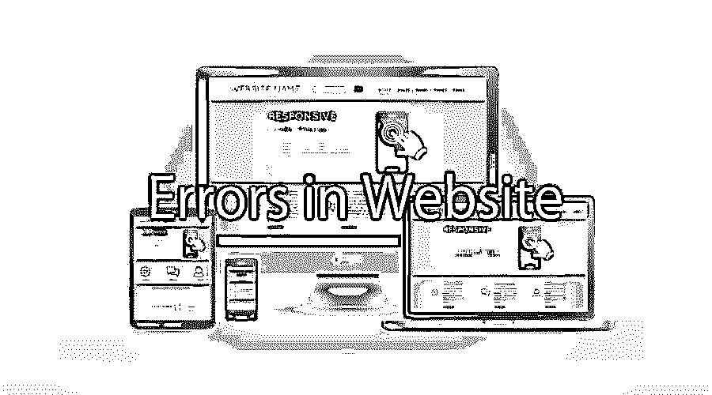

## 网站错误介绍

通常，网站出现错误是因为不安全的互联网连接、过时的网页或损坏的链接。几乎每个人在上网时都会遇到这个问题。世界上没有一个人会说他们在网上有过没有错误的经历。所以网站中的错误更常见。你只需要找出以下问题的答案

*   下来多久了？
*   问题的主要原因是什么？
*   如何尽快修复问题？

这篇文章将向你解释一些在网络中经常出现的错误和解决方法。

<small>网页开发、编程语言、软件测试&其他</small>

现在你们中的许多人会有一个问题。

为什么我需要知道这些错误？

但是了解网站中的[错误及其解决方法将有助于你获得知识，也将有助于网站管理员和网络管理员了解网络中最常见的问题以及如何处理这些问题。有时，要解决问题，您只需验证设置并运行简单的维护任务。这样做可以提高系统的安全性和通过网络传输数据的速度。](https://www.educba.com/link-building-strategies/)

### 快速简便地修复网站中的错误

一个注重转化的网站有三个主要支柱——合格的流量、简单的导航和良好的网站策略。这些支柱有时会被网站上的一些小问题分散注意力。这些小问题被认为是像车辆维护。它们需要经常修理才能平稳运行。下面列出了几个网站上容易修复的错误。

#### 网站中的拼写错误

如果你的网站内容中有任何语法或打字错误，那么你的网站会看起来不专业。所以在内容发布到网站之前，你需要非常谨慎。如果你需要制作高质量的网站内容，那么你需要一个编辑。

#### 断开的链接

如果你的网站中有断开的链接，那么你的用户可能会对你的网站失去兴趣。要修复断开的链接，请使用工具，而不是手动操作。这会节省你大量的时间和资源。

#### 过时的版权

你可能会惊讶地看到别人网站上过时的版权。那你的呢？你的用户对过时的版权会有什么反应？这会给你的客户一种你出局了的感觉。

#### 破碎的图像

丢失或损坏的图像是一个容易识别和快速修复的错误。你需要有一个[内容管理系统(CMS)](https://www.educba.com/best-ecommerce-sites/) 来找出这样的错误，并正确地重建它。

#### 不友好的 URL

*   **友好的网址–**www.website.com/blog/common-website-errors-to-fix
*   **非友好 URL-**www.website.com/ CGI-bin/gen . pl？id=8 & view=standard
    不友好的 URL 很难被记住，它们会减少网站的流量。他们也很难分享或链接到社交网络。但是改变 URL 是一件大事，你需要在改变之前做好相应的计划。

#### 标准化

规范化是指你能够通过两种不同的方式访问你的站点。这将产生问题，如重复的内容，也将减少您的网站的流量。

http://www.website.com

http://website.com

#### 重复内容

如果你的网站中不止一个地方有确切的内容，那么请删除这些内容。这个问题在拥有数千个页面的大型网站中更为常见。这是一个常见的 SEO 错误。

#### JavaScript 错误

你需要经常检查下拉菜单是否正常工作，网站导航是否容易，动画是如何工作的。如果任何问题持续存在，那么这意味着您的 JavaScript 没有正常工作。网站上的这些错误会影响用户体验，降低网站性能。

#### 缓慢加载页面

网站每个页面的速度是搜索引擎考虑的主要因素。慢速网页会导致跳出率高，转化率低。使用工具找出网站是否有问题，使网站变慢。

#### 无表单验证

正确的验证将帮助用户更快更容易地完成表单。正确的[表单验证将确保](https://www.educba.com/javascript-form-validation/)用户提供完整的信息并完成转换。

#### 浏览器特定错误

您应该观察每个浏览器对您的网站的反应，并找出哪些不能正常工作。市场上有几种工具可以让你知道你的网站如何在不同的浏览器和多个版本的浏览器中运行。使用一个这样的工具来避免网站上的浏览器特定错误。

永远不要让小问题变成大问题。尝试在短期内修复小错误，并为长期内更难的错误做好计划。

### 客户端错误

以下是客户端错误:

#### 400 错误请求

当服务器无法理解请求时，会出现此错误。当浏览器忽略了 HTTP 协议的规则时，就会发生这种情况。这给服务器处理请求带来了困难。出现此错误是由于以下原因之一

*   客户端出现了一些问题
*   缺少互联网连接
*   有缺陷的浏览器
*   缓存问题

因此，在联系网站所有者之前，请检查您的系统并清空您的缓存。

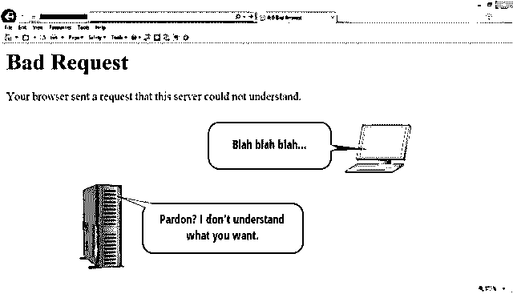

#### 401–需要授权

当网站受客户端密码保护时，会出现此错误。401 授权错误不会提供错误消息，但会显示一个弹出窗口，要求用户输入登录 id 和密码。如果您知道登录和密码的详细信息，那么您可以进入受保护的网站。如果您没有详细信息，您将被带到“需要授权”错误页面。

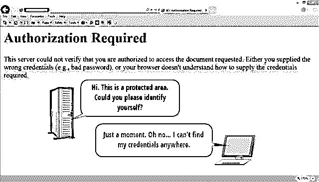

如果你是一个网站的所有者，并且你想用密码来保护你的网站，那么你可以用 c 面板帐户来添加密码保护。

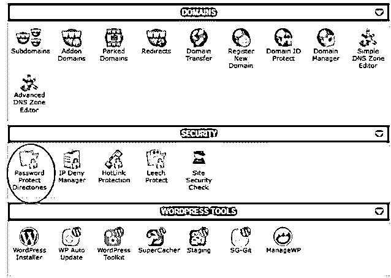

#### 403 禁止

当服务器能够理解请求，但由于某种原因拒绝接受时，会出现此错误。当用户收到这个错误消息时，意味着服务器拒绝了请求，没有任何解释。

此错误的常见原因是网站所有者不允许浏览器访问网站的文件目录结构。另一个原因是浏览器想要查看的特定文件没有必要的权限。

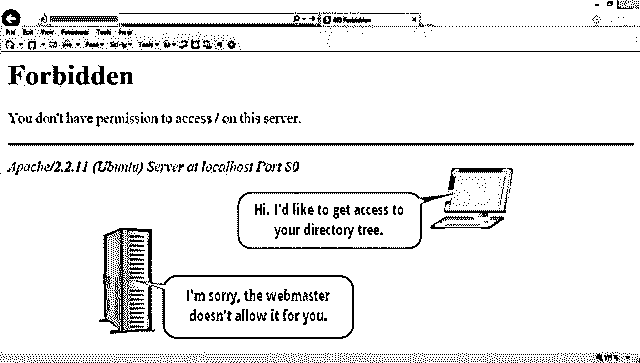

出于安全原因，网站所有者也可以使用它。可以保护网站不被黑。网站所有者可以通过使用以下命令在 C 面板中使用此选项

高级菜单–索引管理器–无索引选项

#### 404 未找到

404 是最常见的 HTTP 错误代码。当服务器在请求的位置找不到任何内容时，web 浏览器会显示此错误。这个错误有两个主要原因——要么是 URL 输入错误，要么是网站的永久链接结构被更改。当网站最近移动到新位置时，此错误会显示在 URL 的顶层。

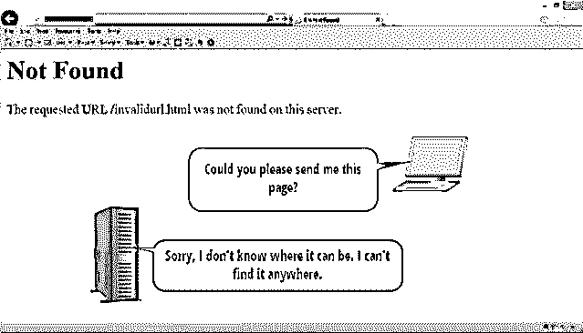

404 被视为影响网站 SEO 的主要因素。它通常会增加你的网站的跳出率。避免这种错误的最好方法是使用 301 永久重定向和 302 临时重定向。

#### 408–请求超时

如果客户端的请求处理时间过长，服务器就会超时并关闭连接。在这种情况下，浏览器将显示 408 请求超时错误消息。当服务器在特定的时间范围内没有从用户端获得完整的请求时，就会发生这种情况。此错误也可能是由于服务器或客户端系统上的工作负载过重以及临时的互联网高峰造成的。此错误可以通过使用 F5 按钮重新加载页面来修复。

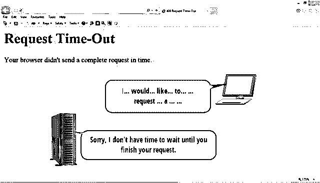

#### 410 走了

410 错误与 404 错误非常相似。这两个错误都意味着服务器找不到请求的文件。唯一的区别是 404 错误给出了一个替代的目标文件，而 410 错误显示了一个永久的条件。410 错误意味着文件由于所有者的某种意图而变得不可用，因为他想从 web 上删除传入的链接。410 表示文件永久不可用。

410 和 404 被浏览器区别对待。对于网站所有者来说，区分网站上的 410 和 404 错误是至关重要的，以使网站搜索引擎友好。

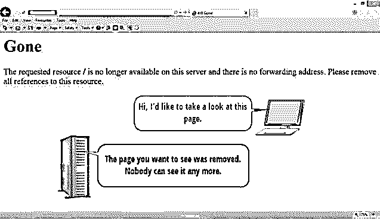

**网站服务器错误**

#### 500-网站内部服务器错误

500 是最常见的服务器错误。当服务器面临阻止其完成请求的意外情况时，会发生此错误。当没有其他服务器端 5XX 错误代码可用时，会返回此错误代码。

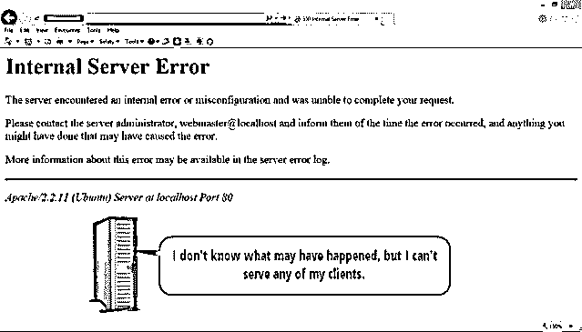

要解决此错误，您可以重新加载页面，清理缓存，清理浏览器 cookies 并重新启动浏览器。

如果你得到这个错误，那么你可以联系你的主机提供商，因为原因可能是权限错误，损坏的文件或内存限制。在 [WordPress 网站](https://www.educba.com/wordpress-vs-joomla/)中，这个错误可能是由于第三方插件引起的。您可以轻松解决这个问题。

#### 502 错误网关

502 错误信息显示服务器之间存在[通信问题](https://www.educba.com/10-communication-secrets-of-great-leaders/)。当客户端连接到必须访问上游服务器的服务器时，就会出现此错误。当服务器收到来自上游服务器的无效响应时出现此错误。

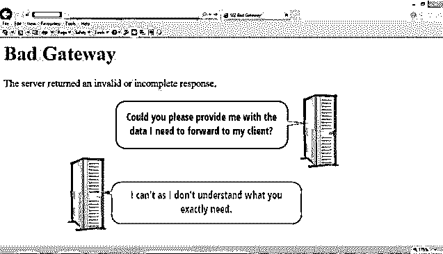

在这个错误中，它通常意味着两个服务器都不接受交换数据的协议。这是因为其中一个服务器配置或编程错误。要解决这个问题，请联系您的主机提供商。

#### 503–服务暂时不可用

每当服务器出现临时过载或服务器进行定期维护时，您都会收到此错误消息。503 错误意味着 web 服务器当前不可用。此错误是暂时的，可以在短时间内解决。

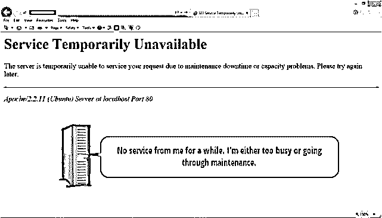

如果你是一个网站所有者，那么你应该更清楚 503 错误，以正确维护网站。作为一个网站所有者，如果你没有以正确的方式定期维护网站，那么它肯定会影响你在搜索引擎中的排名。

#### 504–网关超时

504 网关超时错误也是后端服务器之间的通信问题。此错误还表明有一个更高级别的服务器负责向客户端的服务器发送数据。下级服务器没有从上游服务器接收到及时的响应。

504 网关超时错误消息显示服务器之间的通信缓慢，这通常发生在高端服务器完全关闭时。

此错误也与 408 请求超时错误相同。但这里的区别是，它不发生在客户端和服务器之间，而是发生在后端的两个服务器之间的通信问题。

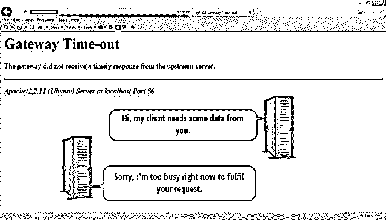

504 错误只能由访问网络的人来解决，因为它发生在后台。如果主机提供程序在另一端处理相同的内容，也可以通过一段时间后刷新页面来解决此错误。

下面列出了一些 HTML 错误代码及其描述

100–继续

101–交换协议

200–好的

201–已创建

202–已接受

203–部分信息

204–无内容

205–重置内容

206–部分内容

300–多项选择

301–永久移动

302–临时移动

303–查看其他

304–未修改

305–使用代理

402–要求付款

405–不允许的方法

406–不可接受

413–请求实体太大

414–请求 URL 太大

415–不支持的媒体类型

505–不支持 HTTP 版本

### 结论

任何时候你访问一个网站，更常见的是会有很多地方出错。从这篇文章中，你会知道最常见的原因和他们的解决办法。修复这些错误可以帮助你提供一个更加用户友好和搜索引擎友好的网站。这并不容易，但绝对值得。

### 推荐文章

这是一个网站错误的指南。这里我们已经讨论了由于不安全的互联网连接、过时的网页或损坏的链接而经常发生的错误。您可以阅读以下文章了解更多信息——

1.  [物联网应用](https://www.educba.com/iot-applications/)
2.  [为您的网站带来有机流量](https://www.educba.com/drive-organic-traffic-to-your-website/)
3.  [优质网站](https://www.educba.com/high-quality-website/)
4.  [C#数组 vs 列表](https://www.educba.com/c-sharp-array-vs-list/)

