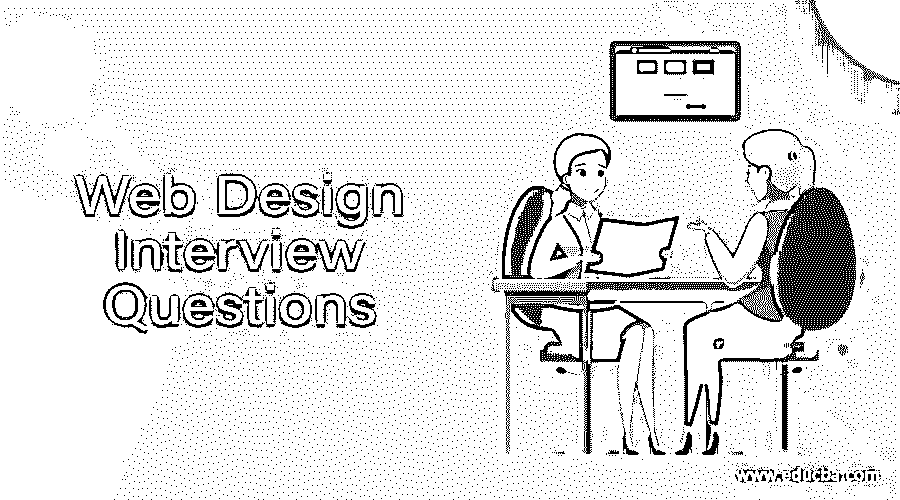

# 网页设计面试问题(2022)

> 原文：<https://www.educba.com/web-design-interview-questions/>

## 网页设计概论面试问答

网页设计是一个有趣的领域。然而，做好网站设计需要很多技能。HTML，CSS < JavaScript，JQuery 等。，是一些重要的语言和框架，你需要了解它们才能设计出迷人的网站。

所以你终于找到了你梦想中的网页设计工作，但是想知道如何通过网页设计面试，以及网页设计可能会有哪些问题。当然，每个面试都不一样，工作范围也不一样。牢记这一点，我们设计了最常见的网页设计面试问题和答案，以帮助你在面试中取得成功。这些面试问题分为以下两部分:

<small>网页开发、编程语言、软件测试&其他</small>

### 第 1 部分-网页设计面试问题(基础)

第一部分包括基本的网页设计，面试问题和答案

#### Q1。一个网站如何优化？从哪里开始？

**答案:**
要提高一个网站的性能，开发者需要有针对每个项目性质的想法。一些常见且易于实现的优化技巧是:

*   [最小化 CSS](https://www.educba.com/css3-interview-questions/) 和 JS 代码。这节省了每个页面加载的千字节。
*   以最合适的格式压缩所有资产。
*   应该启用像 Redis 这样的服务器端缓存机制。
*   应根据设备屏幕大小和像素密度提供图像。仅为给定用户加载适当的图像。
*   最后，HTML 应该清晰简洁。

#### Q2。使用以下 HTML5 标签进行描述:STRONG，EM，SMALL。

**答案:**
这些标签创造了特定的视觉处理。例如-strong 粗体文本，EM 使其倾斜，SMALL 使其变小。但这不是他们的目的。每个都有如下语义目的:

*   **EM–**应该强调的文本，从而改变其上下文含义。
*   STRONG-它可以用在标题、小标题和段落中，以强调它的单词或短语。
*   **小号—**用于免责声明和澄清。

让我们转到下一个网页设计面试问题。

#### Q3。描述使用 CSS 框架如 Bootstrap 或 Foundation 的优点和缺点。

**答案:**

**优点:**

*   框架提供了布局、元素和页面的快速原型，
*   促进整个项目中许多一致元素的可重用性，并消除对 Photoshop 模型的需要。它还确保删除其他高保真静态草图。
*   自带常用的标准化件
*   内置的文档化的代码。当问题出现时，它有一个庞大的支持社区。

**缺点:**

*   试图概括共同的元素，往往导致不那么好看的设计
*   创建非传统或复杂的设计或布局
*   更多的精力涉及处理框架，而不是简单地从头开始编写代码。
*   有太多多余的东西永远不会被使用，或者样式如果没有被正确使用就会被忽略
*   与从头开始编写代码相比，加载时间更慢。

#### Q4。区分“可见性:隐藏”和“显示:无”？

**答案:**
两者都是风格属性

*   **visibility: hidden:** 它隐藏了元素，但仍然占用布局中的空间。
*   **显示:无:**消除元素。它不占用任何空间。它的 HTML 在源代码中，但是没有空间。

#### Q5。什么是空白？它如何影响网络上的内容？

**答:**
留白是任何故意留白的区域。不需要是白色的。在网页设计中，空白分隔元素，将元素分组，引起对特定功能的注意，或者强调内容布局。

### 第 2 部分-网页设计面试问题(高级)

现在让我们来看看高级网页设计面试的问题和答案。

#### Q6。定义“格式塔”的原理？

**答案:**

格式塔原理来自视觉感知理论。在网页设计中应用的一些原则是:

*   **相似性–**人类大脑会感知到具有相似特征的元素，这意味着这些元素是相互关联或分组的。
*   **邻近性–**相互靠近放置的元素被认为是彼此成组或相关的，或者是整体的一部分。
*   **闭包–**闭包原则让元素看起来更迷人。这使得设计更令人愉快；
*   **图-背景关系**倾向于根据颜色、形状和经验在精神上分离事实。
*   **共同命运–**元素同步移动，通常被视为成组
*   **连续性—**我们的大脑能够看到事物之间的联系，并根据它们之间的相似性遵循一条路径或不同的路径。

#### Q7。字体怎么组合？哪些类型的字体组合效果很好？在网站上可以使用多少种不同类型的字体？

**回答:**
有些字体配合得很好，在同一个页面上看起来很漂亮。但是，要将两种字体恰当地结合起来，就要仔细看它们之间的异同。
如果两种字体相似或差异很大，它们可以很好地配合使用。为了使两种字体相等，它们应该具有相似的 x 高度。
应该避免将看起来非常相似的字体组合在一起，比如 Helvetica 和 Lucida Grande。

#### Q8。在网页上提及一个响应式设计。

**答:**
响应式设计:一种提供最佳视觉体验和交互性的网站建设方法。它专注于网站的简单导航。它确保在所有设备上最小化滚动、平移和调整大小。
Bootstrap 可能是开发基于 CSS、HTML 和 JS 的响应式 web 设计最流行的框架。

让我们转到以下网页设计面试问题。

#### Q9。提一些网页设计不好的例子。

**答案:**
下面提到了一些非常糟糕的做网页设计的方法，大家要避免。

*   闪烁、旋转或闪烁的图像。
*   黑色或非常暗的背景，带有白色、浅色或浅色文本
*   黑色背景，带有棕色、灰色或深色文本
*   带有浅色或深色文本的平铺背景图像
*   一切都在页面中央
*   页面上的图片太多或者图片太大
*   这么多的链接列表
*   太多闪烁的标题或文字

#### Q10。你什么时候使用 JPEG 压缩，什么时候更喜欢 PNG？

**答案:**
每种图像压缩格式都有特定的用途。

*   **JPEG:–**通过寻找相似颜色的区域来缩小图像。较高的压缩级别确保此类网站看起来更具攻击性，从而导致视觉信息的丢失和伪像的产生。这种压缩最适合照片、绘图和渐变。JPEG 不太适合截图、简单的 UI 元素、平面图标或示意图。它不适合文本。
*   **PNG:–**这种压缩方法通过减少使用的颜色来实现。这可能会导致轻微的颜色损失。PNG 方法非常适用于徽标、图标、标志和文本图像。对于简单的插图或 UI 元素和截图，PNG 也是合适的。大多数情况下，PNG 文件比 JPEGs 文件大。

### 推荐文章

这是一个网页设计面试问题和答案列表的指南。这里我们列出了十个最佳的面试问题，这样求职者可以很容易地通过面试。您也可以阅读以下文章，了解更多信息——

1.  [Web 服务面试问题](https://www.educba.com/web-services-interview-questions/)
2.  [网页开发面试问题](https://www.educba.com/web-development-interview-questions/)
3.  [Java Web 服务面试问题](https://www.educba.com/java-web-services-interview-questions-and-answers/)
4.  [引导程序 4 备忘单](https://www.educba.com/bootstrap-4-cheat-sheet/)

