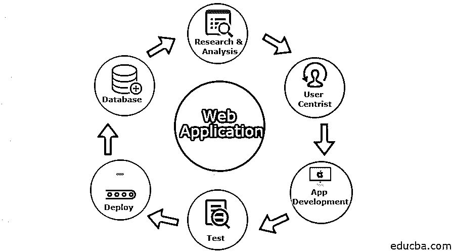

# 什么是 Web 应用？

> 原文：<https://www.educba.com/what-is-web-application/>

## 什么是 Web 应用？

当今世界，web 应用程序的使用与日俱增。软件领域的专业人员，如软件开发人员和软件测试人员，需要熟悉 Web 应用程序。

它是一个客户端-服务器应用程序，存储在远程服务器上，使用 web 浏览器和 web 技术通过浏览器界面在互联网上执行特定功能。

<small>网页开发、编程语言、软件测试&其他</small>

如上所述，它是一个客户端-服务器应用程序，因此在客户端-服务器环境中，多台计算机可以共享信息，就像将信息保存到数据库中一样。“客户端”可用于输入信息，“服务器”用作信息的存储。

### 定义

简而言之，你可以把它定义为一个计算机程序，通过使用网络浏览器在客户端执行一些特定的任务。基于 Web 的应用程序也称为 web 应用程序。

常见的例子包括 Gmail、Yahoo 和 AOL 等网络邮件、在线零售、在线表格、购物车、文字处理器、电子表格、视频和照片编辑、文件转换、文件扫描、Google 应用程序(如 Google Docs)、Google Sheets、Google Slides、在线存储等。

有六种不同类型的应用程序:

*   静态
*   动态的
*   在线商店或电子商务
*   门户网站应用程序
*   愉快的
*   内容管理系统

### 谅解

为了理解 web 应用程序的概念，您需要一个 web 服务器来处理用户请求，一个应用服务器来执行所需的任务，一个数据库来存储信息。

下面分几点来简要解释这个过程:

*   用户通过互联网向 web 服务器发送请求，互联网使用 web 浏览器或应用程序的用户界面。
*   接下来，web 服务器将用户请求发送到适当的 Web 应用服务器。
*   服务器执行指定的功能，例如查询数据库或处理请求的数据。
*   服务器将用户数据和所请求的信息一起转发给 web 服务器。
*   最后，网络服务器在屏幕上显示用户请求的信息。

### 它是如何让工作变得如此简单的？

它使得基于客户机-服务器架构的工作变得非常容易。这里，客户机用于输入信息，服务器用于存储和检索信息。它与应用程序、中间件系统和数据库交互，以便与多个应用程序协同工作。服务器接受用户通过浏览器发送的请求。此后，浏览器执行这些文件并向用户显示所请求的页面。现在，用户可以与网站互动。

### 你能用它做什么？

它可以通过利用网络浏览器和网络技术在互联网上实现一些特定的功能。应用程序通过使用 PHP 和 ASP 等服务器端脚本来处理存储和检索信息；借助客户端脚本，如 [JavaScript 和 HTML](https://www.educba.com/html-vs-javascript/) ，将信息呈现给用户。

网络应用最好的例子是网络电子邮件，谷歌的 Gmail 和微软的 Outlook 提供了基于网络的电子邮件客户端。

您可以执行以下操作:

*   您可以用图形格式显示报告。
*   在线获取产品信息。
*   员工可以通过移动设备获得与任务相关的信息。
*   该应用程序允许远程工作人员在指定时间内完成工作。
*   客户可以轻松跟踪商品的订单和预算。

### 工作

下列要点描述了如何使用 web 应用程序流程:

*   最初，客户端会通过 HTTP 向 HTTP 服务器请求。
*   接下来，web 服务器将在静态数据请求的帮助下向静态数据存储发送消息。
*   web 服务器响应静态数据存储，并通过使用包含 web 容器和其他服务的 servlet 请求移动到应用服务器。
*   然后 servlet 请求从应用程序数据存储中提取信息，并响应 web 服务器。
*   最后，web 服务器使用 HTTP 响应给用户一个响应。

### 优势

以下是优点:

*   它运行在不同类型的平台上。
*   数据安全，易于备份。
*   您可以轻松地更新应用程序。
*   你可以很容易地使用低规格的电脑或智能手机。
*   它消除了兼容性问题，因为用户可以访问相同的版本。
*   在 SaaS 的帮助下，他们减少了基于订阅的网络应用中的软件盗版。
*   有了 web 应用程序，员工可以通过访问互联网在任何地方工作。

### 所需技能

以下是开发 web 应用程序所需的基本技能:

*   通过使用 PHP、ASP.Net 和 Ruby 等服务器端脚本来处理存储和检索信息。
*   客户端脚本语言(JavaScript、HTML 和 CSS)。
*   使用计算机软件对…进行处理
*   WordPress 和 SEO
*   响应设计技能
*   开发工具，如 ide、编辑器(Visual Studio、Eclipse)
*   Web 服务器(Apache、IIS)

### 为什么我们应该使用或为什么我们需要 Web 应用程序？

您应该使用或需要它来向客户提供业务利益。以下几点说明了我们在软件领域使用或需要它的原因:

*   您可以轻松地创建一个响应式的 it 设计，以获得更好的用户体验。
*   由于有云存储设施，所以可以增加 web 应用的存储。
*   它降低了业务成本，因为业务维护更少，对最终用户系统的要求也更低。
*   不需要任何安装，因为所有系统都将有一个浏览器；因此消除了空间限制。
*   它通过收集现有客户的反馈来改进客户的产品和服务。
*   使用它，你可以联系世界上任何地方的任何人。

### 范围

其范围包括提高客户的生产力和效率。它使用更少的商业成本，并允许在世界任何地方访问商业信息。它节省了时间和金钱以及消费者和商业伙伴之间的连接。

### 谁是学习 Web 应用程序技术的合适受众？

这些技术拥有大量的目标受众，因为它同时使用 web 浏览器和 web 技术来执行 internet 上的某些功能。它主要被商业人士、零售销售人员、维基开发者、消息服务开发者等等使用。

### 这项技术将如何帮助你的职业发展？

这项技术提供了良好的职业发展。要成为这方面的大师，需要更多的日常实践，并且需要更加灵活地适应所有的网络趋势。这项技术是当今世界发展最快的行业，所以你需要学习新技术，应该更有活力。

### 结论

到目前为止，我们已经研究了它是如何工作的，它们将如何帮助当前行业中的客户，使用它的优势等等。它提供了在降低成本的同时提高业务效率的能力。Gmail、Yahoo 和 AOL、在线零售、在线表格、购物车、文字处理器、电子表格、视频和照片编辑等常见应用程序具有跨多个平台工作的优势，并且可以从任何地方轻松访问。

### 推荐文章

这是一个什么是 web 应用程序的指南？.在这里，我们讨论了网络应用的基本概念、范围、职业发展、技能和优势。您也可以浏览我们推荐的其他文章，了解更多信息——

1.  [网络开发职业](https://www.educba.com/career-in-web-development/)
2.  [如何使用 MongoDB 构建 Web 应用](https://www.educba.com/how-to-build-web-applications-using-mongodb/)
3.  [HTML 的应用](https://www.educba.com/uses-of-html/)
4.  [Web 测试应用](https://www.educba.com/web-testing-application/)

