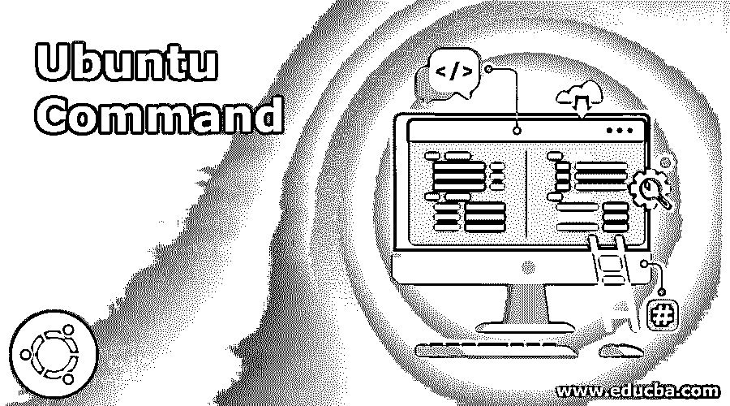

# Ubuntu 命令

> 原文：<https://www.educba.com/ubuntu-commands/>

## Ubuntu 命令简介

以下文章提供了 Ubuntu 命令的概要。Ubuntu 可以被认为是基于 Linux 的发行系统，它是开源的，在公共市场上完全免费。Ubuntu 系统通常有三种版本，一种是桌面版，另一种是服务器版，最后一种是特定设备或机器人版。在当前的云计算市场中，它通常作为操作系统非常受欢迎。

### 基本命令

有许多 Ubuntu Linux 命令可以在 [Ubuntu 和 Linux](https://www.educba.com/linux-vs-ubuntu/) 平台上运行或处理文档、创建文档、维护各种目录或编写脚本。

<small>网页开发、编程语言、软件测试&其他</small>

下面提到了一些基本命令:

*   **获取日期的命令:**这是在 Ubuntu Linux 屏幕上帮助显示正常日期和时间的常用命令之一。还可以设置一些自定义日期，这些日期可以通过使用此特定命令来管理。

**代码:**

`# date –set=’17 Jan 2019 12:16’`

**执行上述命令，总是给出以下结果作为输出:**

美国东部时间 2019 年 1 月 17 日星期四 12:18:20

*   **显示日历的命令:**Ubuntu Linux 操作系统的一个关键命令是 cal，它实际上有助于在 Ubuntu Linux 终端屏幕上显示适当的所需日历，任何人都可以识别当地日期。在 Ubuntu 命令的情况下，有许多额外的日历包可用，人们可以用各种方式管理日历，有时他们可以用这个额外的命令垂直显示日历或其他一些重要的功能。这个额外的命令包称为 ncal 包，需要下载到您的本地 Linux 机器上才能使用那些特性。
*   whoami 和 who 命令:在 Ubuntu Linux 平台中非常有用和流行的命令是 Whoami 和 who 命令。Whoami 是一个关键的命令，它提供了一个确切有效的用户名立即'谁参与执行这个具体的命令。以及“谁是将给出全部登录用户详细信息的命令”。
*   Pwd 实际上代表打印工作目录。该命令主要用于显示命令执行器当前所属的具体目录。有时候在 Ubuntu Linux 平台的情况下，用户无法理解他现在在哪一个目录中。那么 PWD 就是理解这一点的关键命令。
*   **Ls:** 这也是 Ubuntu Linux 平台中非常常用的命令。每个用户，在他们的逻辑之后，这是他们执行的第一个命令。命令 ls 实际上提供了该特定目录中可用文档的完整列表。ls 还有其他几个扩展命令，用于以适当的方式管理这些文件的显示。假设 ls–lrt，ls–al 被给定了特定目录中文件列表的一些附加信息。
*   **Cd:** Cd 命令主要用于在 Ubuntu Linux 平台下更改目录。
*   Mkdir: Mkdir 是 Ubuntu Linux 平台的关键命令之一。这实际上有助于在 Ubuntu Linux 平台上创建一个新目录。
*   **Cat:** Cat 命令常用于显示一个文件的全部内容。它还可以用于在 Ubuntu Linux 平台上创建或连接单个或多个文件。
*   **Cp:** 该命令通常用于复制现有文件或目录的镜像，并以不同的文件名粘贴到 Ubuntu Linux 平台的任何地方。
*   **Mv:** MV 命令也是一个非常常用的命令，用于将文件或目录移动到另一个具有相同名称和内容的位置。

### 中间命令

还有其他几个流行的命令，也是那些不是非常基本的命令，但更多地使用 Ubuntu Linux 的开发人员所使用的。

下面提到了一些需要中间命令的类型:

*   **Rm:** Rm 命令主要用于删除或移除一个或多个文件。如果我们递归地使用这个 rm 命令，那么它将删除整个目录。
*   **Uname:** 该命令对于正确显示整个当前系统信息非常有用。它有助于在 Linux 环境中以正确的方式显示 Ubuntu Linux 系统信息，以便了解系统当前的配置。
*   正常运行时间:正常运行时间也是 Ubuntu Linux 平台的关键命令之一，它给出了系统运行时间的信息。
*   **Users:** 该命令用于显示当前登录 Linux 系统的登录用户名。
*   **Less:** Less 命令主要用于显示文件，不需要打开或使用 cat 或 vi 命令。这个命令基本上是 Ubuntu Linux 环境中“more”命令的强大扩展之一。

### 高级命令

然而，一些关键任务通常需要由 Ubuntu Linux 命令的用户来执行。这些任务还有一些高级命令，主要由一些管理器用来排序、识别或修改特定文件、编写 shell 脚本、调度作业等。

高级命令如下所述:

*   **更多:**该命令用于一次在一页上显示正确的输出。它主要用于通过避免滚动来读取一个长文件。
*   **排序:**用于对某个特定定义文件的内容进行排序。这对于按排序顺序显示大文件的一些关键内容非常有用。如果我们使用–r 包含这个排序命令，那么它将给出内容的逆序。
*   Vi: 这是在 Unix 或 Linux 平台上从第一天起就可用的主要编辑器之一。它通常提供两种模式，普通和插入。
*   **Free:** 提供 Ubuntu Linux 系统中可用的空闲内存或 RAM 的详细信息。
*   **历史:**这个命令保存了 Ubuntu Linux 平台上所有执行过的命令的历史。

### Ubuntu 命令的提示和技巧

一些经常使用这些命令的普通用户通常会使用一些提示和技巧来正确使用 Ubuntu Linux 命令输出。这些类型的技巧通常解决一些特定于用户的查询，并显示执行输出以正确理解这些查询。

一些非常常用的关键技巧是:

*   **保护 Ubuntu Linux 的安全:**通过使用 VPN 服务，对 Ubuntu Linux 中的关键进程进行一些配置更改，特别是在自定义代理中。
*   **用密码保护:**有一个实用程序可以用特定的密码保护您的个人信息，并将它们锁定在我们的目标上。并通过提供正确的密码来恢复。

### 结论——Ubuntu 命令

这是目前可用于多种用途的关键操作系统之一。具体来说，它在 can 系统中太受欢迎了，因为它的正常视图目前看起来像 windows 系统，这对普通 windows 用户非常有帮助。

### 推荐文章

这是一个 Ubuntu 命令的指南。这里我们已经讨论了基本的、高级的和一些中级的 Ubuntu 命令。您也可以阅读以下文章，了解更多信息——

1.  [Ubuntu 版本](https://www.educba.com/ubuntu-version/)
2.  [Ubuntu 的使用](https://www.educba.com/uses-of-ubuntu/)
3.  [Ubuntu 替代品](https://www.educba.com/ubuntu-alternatives/)
4.  [如何安装 Ubuntu](https://www.educba.com/install-ubuntu/)

