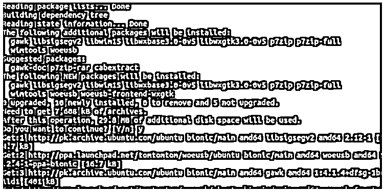
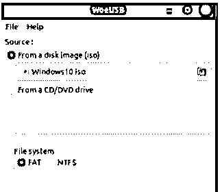
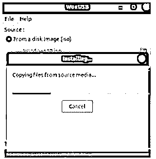
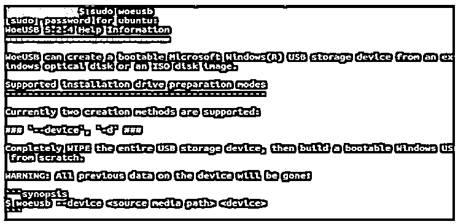

# 乌乌斯乌邦图

> 原文：<https://www.educba.com/woeusb-ubuntu/>


## WoeUSB Ubuntu 简介

以下文章提供了 WoeUSB Ubuntu 的概要。如今，我们有不同的工具来创建可启动的闪存驱动器，但过程中会产生一些问题，以创建可启动的驱动器或存储卡。但 WoeUSB 是 Linux 提供的工具之一，可以通过使用 ISO 映像或我们可以使用 windows DVD 来创建 windows 操作系统的可引导设备。基本上它有两个不同的程序，它使用 windows 的 fork WinUSB 来平滑地制作一个可引导的设备。

### 关键要点

*   基本上，它支持 windows 安装程序，或者我们可以说，传统的 PC 引导。
*   还支持原生 UEFI 引导；这是最新的不带兼容性支持模式的 PC 引导选项。
*   WoeUSb 工具支持带有传统引导选项的 NTFS 文件系统。它会自动下载 NTFS 加载程序，但我们需要互联网连接。

### 什么是 WoeUSB Ubuntu？

基本上，WoeUSB 是借助 ISO 镜像制作 Windows USB 安装程序的著名工具之一，通常它是 I 2012 的更新版。我们可以通过命令行访问 WoeUSB，这意味着我们可以使用 GUI 等两种方法或通过终端来创建可引导设备。尽管如此，Linux 客户不需要为每一件事都与 Windows 打交道，但有时我们可能会在 Windows 上遇到一些可以想象的事情。

<small>网页开发、编程语言、软件测试&其他</small>

通常情况下，它在所有情况下都在窗口上移动。在制作可引导设备时，我们必须确保允许不同框架之间的数据交换。使 USB 可引导是最简单和最容易实现的方法。在源媒体和目标媒体的帮助下，我们可以很容易地删除我们想要的记录。同样，它支持 UEFI 的引导计划；但是，将使用 Windows UEFI 引导程序。

### 如何安装 WoeUSB Ubuntu？

WoeUSB 的安装非常正常和简单。通常有任何主动支持的程序需要捕获，或者我们可以说我们不能从 git repo 下载和安装。但是，我们可以找到另一种方法来安装 WoeUSB 使用 PPAs 软件包的帮助下，以下步骤。

1.首先，我们需要开始在我们的系统中安装 WoeUSB 工具。因此，对于安装，我们需要在终端上执行命令。所以首先我们需要用 Ctrl + Alt +T 打开一个终端，我们得到一个终端窗口。

2.之后，我们需要将 WoeUSB 存储库添加到系统中，因此我们可以使用下面的命令。

**命令:**

```
$ sudo add-apt-repository ppa:tomtomtom/woeusb
```

3.在第三步中，我们需要 o 来输入我们的 root 的密码并点击 enter，这样我们就可以启用 WoeUSB 进程，如下图所示。


4.我们需要在下面命令的帮助下更新这个包。

**命令:**

```
$ sudo apt update
```

5.现在，我们可以在下面命令的帮助下开始安装 WoeUSB 工具，如下所示。

**命令:**

```
$ sudo apt install woeusb-frontend-wxgtk
```

执行后，我们得到如下结果，如下图所示。

**输出:**




这里我们可以看到 WoeUSB 工具的成功安装。

### 如何创建可启动的 Windows WoeUSB Ubuntu？

首先，我们需要从应用程序中打开 WoeUSB 工具，或者我们可以使用终端打开 WoeUSb，如下图所示。




2.在第二步中，我们需要点击从磁盘映像，点击此按钮后，我们得到浏览菜单。这里我们需要选择已经下载的 Windows ISO 映像。

3.在下一步中，我们需要选择我们想要刻录 Windows ISO 文件的目标设备，如下图所示。




4.在这里，我们需要等到安装过程完成。如果不太麻烦的话，在你随意点击“引入”让你的 Windows USB 可引导之前，先检查一下你是否选择了正确的驱动器。引入周期将擦除所选 USB 驱动器中的项目。你将会丢失储存在上面的任何信息。

### 如何创建 USB WoeUSB Ubuntu？

让我们看看如何创建 USB WoeUSB Ubuntu，如下所示:

在上面一点中，我们已经看到了如何使用 WoeUSB 创建可启动的窗口，现在让我们看看如何使用 WoeUSB 工具来创建 USB 驱动器。因此，终端和点击帮助命令得到一个关于它的想法，如下图所示。




在这里，我们可以看到关于 WoeUSB 订单的每个边界的数据。正如屏幕截图中所说，有两种方法可以制作可引导的 USB。您可以利用主要技术(- device 或–d)或后续策略(包括利用现有部件(- partition 或–p)在没有任何准备的情况下创建一个。

### 常见问题解答

下面是提到的常见问题:

#### Q1。WoeUSb 工具有哪些替代品？

**答:**对于 WoeUSb 工具，我们有不同类型的替代品，如 Bootiso、Etcher、Mkusb、MultiSystem、Rufus、WinTo-UsbLinux 和 WindUSB。每个工具都有不同的功能。

#### Q2。如何在 Ubuntu 操作系统上制作 WoeUSB？

**回答:**首先我们需要运行 WoeUSB，然后点击文件夹并打开文件资源管理器，在这里我们需要选择我们想要制作可启动 USB 驱动器的 ISO 文件。在第三步中，选择文件系统并单击 install 按钮。

#### Q3。WoeUSB 是面向用户的开源工具？

**回答:**它是我们可以从 GitHub 下载的免费开源工具，那里有源代码。

### 结论

在本文中，我们看到了 WoeUSB Ubuntu 是什么，以及 WoeUSB Ubuntu 带配置的一些基本关键思路。我们还看到了 WoeUSB Ubuntu 的用途和功能，以及如何使用它们。

### 推荐文章

这是 WoeUSB Ubuntu 的使用指南。这里我们讨论一下入门，如何安装&创建 WoeUSB Ubuntu？和常见问题。您也可以看看以下文章，了解更多信息–

1.  [Ubuntu 版本](https://www.educba.com/ubuntu-version/)
2.  [Ubuntu 替代品](https://www.educba.com/ubuntu-alternatives/)
3.  [Ubuntu 命令](https://www.educba.com/ubuntu-commands/)
4.  [Ubuntu 恢复模式](https://www.educba.com/ubuntu-recovery-mode/)


