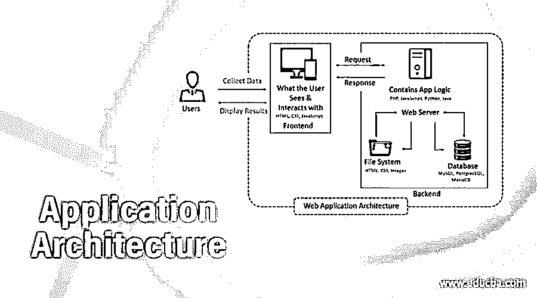
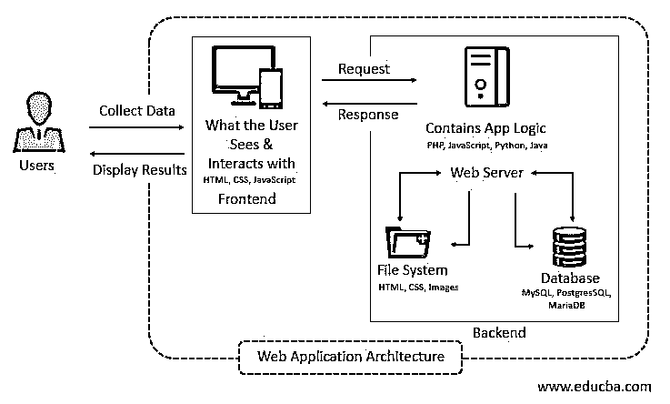

# 应用架构

> 原文：<https://www.educba.com/application-architecture/>

## 应用程序架构介绍

一般来说，体系结构解释了结构中部件或组件的组装。应用程序架构与此并无不同。它解释了组件的组装以及组件之间的交互。此外，在架构中还解释了当每个结构被修改时，它们如何交互以及这些组件的行为。这使得开发人员既能满足客户需求，也能满足业务需求，因为了解客户是所有业务的基础。这是企业架构的一部分，因此理解应用程序架构对于了解企业及其层次非常重要。

### 应用程序架构的解释

*   应用程序架构位于系统的顶层，它应该包含贯穿其组件的质量和可靠性。大多数情况下，这种架构满足系统的技术和操作需求，而不是功能方面。因此，所有的质量属性都必须与性能度量一起得到满足。

<small>网页开发、编程语言、软件测试&其他</small>

*   最常用的应用程序架构是服务器端渲染和客户端渲染。
*   当用户单击链接访问网页时，URL 将请求发送到服务器，并向页面提供所需的 HTML 和页面内容。当用户再次需要该页面时，重复相同的过程。这是服务器端渲染。在客户端呈现中，一旦页面被加载，它将不会请求服务器再次加载页面。生成动态脚本，并且只发出一个请求来在应用程序中生成页面。
*   不同的服务器和数据库决定了系统中架构的模型。这三种不同的模型是一个服务器、一个数据库模型、多个服务器、一个数据库模型和多个数据库模型。让我们来看看每一个。

#### 1.一个服务器一个数据库模型

这是建筑中最简单的模型。顾名思义，不如单台服务器宕机时可靠；整个应用程序不工作。因此，它不用于实时应用。这个模型是用于学习目的和了解建筑的基本原理。

#### 2.多台服务器一个数据库模型

这里的主要优点是，即使一台服务器出现故障，另一台服务器也会继续工作。所有的数据不是存储在服务器上，而是存储在数据库中。这是为了避免数据丢失，即使服务器出现故障。数据在服务器中处理，信息传递给数据库。也称为无状态架构，如果数据库关闭，web 应用程序将停止工作。如果一个服务器出现故障，请求会自动重定向到另一个服务器，因此这个模型是可靠的。

#### 3.多服务器多数据库模式

在这个模型中，我们可以将数据存储在单个数据库中，也可以将数据库中的数据分布开来。这种模型被认为是一种高效的模型，因为如果出现故障，数据库和服务器都可以替换。要么我们可以用两个服务器和数据库来平衡。如果负载更多，我们可以使用更多的服务器，在这种情况下最好使用负载平衡器。数据库规范化有助于分析情况。

*   应用架构可以分为三种类型，如单页面应用、微服务和无服务器架构。

#### 1.单页应用程序

这是流行的单页和更少的存储和空间。那些喜欢更少资源的人可以看看 SPA。用更少的元素很好的维护了用户体验，在页面上进行动态交互。

#### 2.微服务

这比应用程序中具有特定功能的其他方法更快、更有效。这可以用任何编码语言编写，因此灵活性是选择微服务的一个因素。任何技术、任何语言都可以用在建筑上。

#### 3.无服务器架构

这种架构中没有服务器，因此不存在这种类型的基础架构问题。后端服务器在这里不会产生任何问题，因为它们不存在于架构中。

*   理解建筑的运作很简单。它接收来自用户的请求，处理它们，并向用户显示它们。这些组件和类型有助于理解基础结构并维护它以供将来使用。这有助于轻松扩展应用程序，并在服务器中自动进行部署。可以用一致的方式管理查询，并且可以减少系统中的响应时间。

### 应用程序架构的组件

*   组件很容易理解，因为我们已经从架构的模型中听到了。体系结构的组件分为用户界面和结构组件。结构组件是解释功能、控制和用户与数据库交互的客户机和服务器。解释了结构模式，因此理解这一点在建筑学中很重要。这有助于控制服务器和存储。

1.客户端:用户与用 HTML、CSS 和 JavaScript 编写的客户端进行交互。客户端基本上是系统中的 web 浏览器。这接收输入并提供输出。用户界面对客户来说很重要，它必须让使用它的客户满意。

2.服务器有一个网络服务器和数据库。服务器端开发需要语言知识来管理数据库和服务器。所有的数据都存储在数据库服务器中，主控制中心在 web 服务器上。这里我们增加了服务器和数据库的数量，应用程序的功能也发生了变化。

*   用户界面组件提供了关于网页显示及其配置和设置的概念。开发不是用户界面的一部分，但是通知和仪表板构成了架构中的这个组件。

### 结论

在选择架构之前，必须正确评估业务需求。更多地了解架构并开发网页和应用程序，这样即使出现故障，我们也可以轻松地纠正问题。建造时必须遵循建筑标准。希望这篇文章对你的目的有帮助。

### 推荐文章

这是应用程序架构指南。这里我们讨论应用程序架构的解释以及组件。您也可以看看以下文章，了解更多信息–

1.  自动化的应用
2.  [RPA 应用程序](https://www.educba.com/rpa-applications/)
3.  [模式识别应用](https://www.educba.com/pattern-recognition-applications/)
4.  [GIS 的应用](https://www.educba.com/applications-of-gis/)

