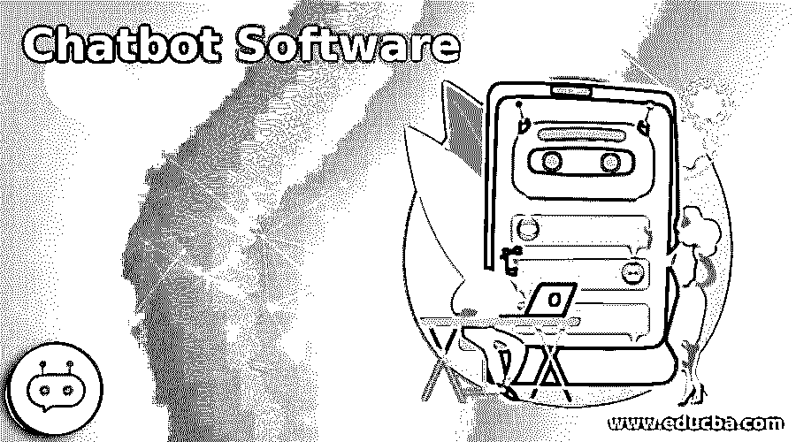

# 聊天机器人软件

> 原文：<https://www.educba.com/chatbot-software/>

## 聊天机器人软件简介

以下文章提供了聊天机器人软件的概述。聊天机器人慢慢成为客户的一种商业趋势，因为大多数用户选择发送回复，而不是在电话上聊天。Salesforce 指出，相比之下，90%的客户会使用聊天机器人，而不是表格(如果有的话)。因此，到 2020 年，80%的企业将部署聊天机器人；并不令人震惊。许多专家认为聊天机器人对主要用户体验也很重要。与品牌沟通的主要方式不再是联络中心、博客和智能手机应用程序。对于希望与客户打交道的机构来说，聊天机器人正迅速成为市场必需品。聊天机器人在网上的发展比以往任何媒介都要快。

通常，聊天机器人通过智能扬声器、智能设备和常见的聊天和消息系统进行交互，如短信、Facebook Messenger、WhatsApp 和 LINE。聊天机器人提供简单的基于按钮的应用程序，为人工智能虚拟助手提供他们熟悉的问题的预定义答案，这些回答可以识别并智能地回答详细的问题。

<small>网页开发、编程语言、软件测试&其他</small>

### 聊天机器人软件

以下是聊天机器人的软件:

#### 1.许多聊天

ManyChat 是脸书信使的聊天机器人创建者。它为使用 Messenger 脸书的超过 1.3 万亿用户的脸书网络提供了更广阔的范围和更好的重定向可能性。它允许你使用 Facebook Messenger 进行购买，减少购物车下降，抓住线索，等等。它有一个基本的拖放图形用户界面，所以你可以很快地为你的脸书页面配置一个聊天机器人。您可以立即适应新用户，指向项目，计划帖子，回复这些关键字，等等。

#### 2.新鲜事

用于 Messenger、WhatsApp、苹果公司、智能手机和网络的聊天机器人都内置了 Freshchat。他们的人工智能算法，弗雷迪，是有动力的。目标是检测意图并与客户建立联系，而不仅仅是为了释放聊天代理的时间。Freshchat 还将通过其机器学习技术为您提供一系列客户和预期问题，这些问题需要正确或更好的答案。

#### 3.聊天燃料

Chatfuel 是 Messenger、脸书和 Instagram 的强势聊天网站。使用它不需要任何编码技能或以前的经验。很多企业，包括阿迪达斯、T-Mobile、乐高、TechCrunch 等等，都使用谈话燃料。您可以使用您的机器人来增加收入，验证线索，或回答常见的问题。这为客户服务人员节省了大量时间。在 Chatfuel 网站上，有大量的细节可以帮助你快速创建一个机器人。这为如何确保您遵守脸书的 bot 法律提供了指导。

#### 4.焦油

Tars 是一个帮助你创建对话页面的工具。本质上，这意味着传统的聊天板取代了登录页面。这让你更容易申请。Tars 经过特别优化，旨在鼓励智能手机用户自然轻松地进行通话。用 Tars 制作聊天机器人非常简单。你可以从头开始创建一个讨论练习，或者使用一个预先构建的原型。

#### 5.Zendesk 聊天

Zendesk Chat 是 Zendesk 的一部分，这是一个流行的企业客户服务网络。它为你提供服务通行证，与你的客户聊天等等。你仍然可以使用它。在 Zendesk Chat 中，你可以使用自动消息来激活消息，这取决于你的客户在做什么。通过检查哪些消息具有高互动率，您甚至可以细化帖子。如果您喜欢更复杂的聊天机器人功能，您也可以将其与其他聊天机器人软件结合使用。

#### 6.Quriobot

Quriobot 是一个免费的基本聊天机器人，这使得它成为小型企业预算紧张的合理选择。像大多数聊天机器人应用一样，它只有一个拖放界面。你可以从头开始说，也可以使用现有的模型。你也可以同时创建多个机器人。你可以改变 Quriobot 的风格来匹配你的网站的配色方案，甚至可以添加自定义 CSS。如果你想要一个完整的解决方案，为你提供一个桌面，实时聊天等，Quriobot 结合了支持桌面应用程序，如 LiveAgent。

#### 7.卡扣接合

SnapEngage 旨在提供帮助和购买。在 WordPress 网站上，你可以使用它。它还包括脸书的 Messenger 和其他流行应用程序。机器人，包括信息捕捉和响应机器人，都可以使用。自定义机器人 API 还可以帮助您构建自定义机器人。SnapEngage 提供健康承诺“以保持健康的实时聊天、短信发布和符合 HIPAA 的聊天机器人。

#### 8\. LivePerson

正如你的名字所期望的，LivePerson 提供实时聊天应用。您还可以使用它来构建自动聊天流。你的聊天机器人会将潜在的购买者连接到一个实时支持代理，提供基于客户的交易，甚至安排会议或活动。客户还可以监控他们的订单状态，评估他们的余额，并解决有关帐单或付款的问题。

### 结论–聊天机器人软件

这篇文章已经看到了聊天机器人软件自动聊天和支持过程及其特点和用途。我们可以根据自己的需求选择任何一种。

### 推荐文章

这是聊天机器人软件的指南。为了更好的理解，我们在这里讨论聊天机器人的介绍和软件。您也可以看看以下文章，了解更多信息–

1.  [软件事件管理](https://www.educba.com/software-incident-management/)
2.  [远程支持软件](https://www.educba.com/remote-support-softwares/)
3.  [软件可靠性](https://www.educba.com/software-reliability/)
4.  [软件审查](https://www.educba.com/software-review/)

