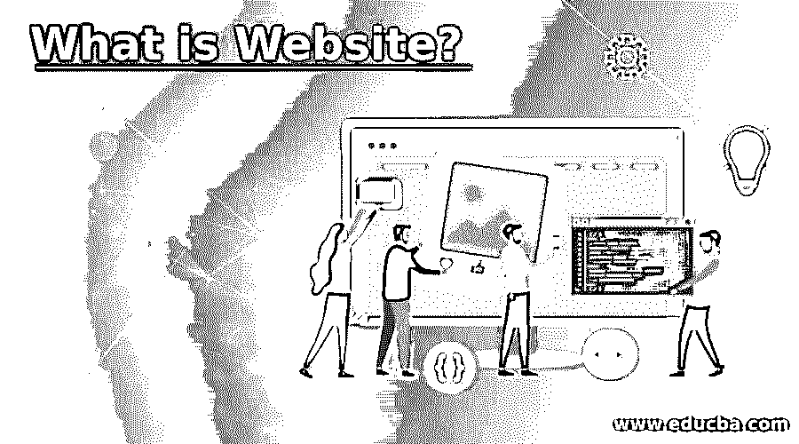

# 什么是网站？

> 原文：<https://www.educba.com/what-is-website/>

## 网站介绍

网站或站点是通过使用浏览器访问网站的主页来连接和访问的网页的中心位置。一系列互联网站共享一个域名，并对公众开放。一个人、一个团体、一个公司或一个组织可以出于各种目的建立和维护网站。

### 你需要一个自己的网站吗？

*   数字网络存在允许互联网查看内容，包括文本、图片和视频。
*   企业需要代理网站有多种原因:为潜在客户提供有关商品和服务的知识，推广公司，与各部门互动或在线交付产品。它为私人用户提供了直接参与公共事务的能力。
*   也有一些个人网站提供信息或娱乐材料。
*   你可以通过在你的社交网络资料旁边连接到你自己的网站，来增加吸引潜在雇主、感兴趣的人或志同道合的人的注意的机会。

### 创建网站

*   大多数企业在名片上或电子邮件签名中都有网站链接。
*   当在浏览器的搜索栏中输入该地址时，它的起始页就会出现。
*   根据网站的大小，网站访问者可以访问它的子页面。
*   为了连接一个网站的单个 HTML 文档，使用超链接或简单的“链接”。在导航中，通常，到基本子页面的连接被组合在一起，并且可以在标题中找到。
*   这可以在网站的所有子页面上看到，而不仅仅是在主页上。
*   用户可以在导航的引导下显示网页的布局。
*   更多的子页面可以链接到文本和图像组件中的内容。
*   更多详细信息的链接，如网站所有者和法律结构，也会出现在页面底部的页脚中。

### 类型

网站主要有以下两种类型:

<small>网页开发、编程语言、软件测试&其他</small>

#### 1.静态网站

它以 HTML、CSS 和 JS 文件的形式存储在服务器上。当浏览器向服务器发送 HTTP 请求时，这些文件按原样返回给服务器。没有生产这种材料的加工过程。这就像通过互联网和浏览器从你的文件系统中获取一个文件。

#### 2.动态网站

它在它的末端执行一些处理，以根据接收到的请求配置 HTML ,并将这个配置的输出发送到用户的浏览器。

目前在网络上可以访问数以百万计的网站，这些网站可以归入以下网站组之一。

请注意，一个网站会属于以上几个类别。例如，网站、网络邮件、博客或搜索引擎也可以是站点。

*   **博客:**你在浏览体验中已经注意到了博客；即使是不熟悉的，也是经常更新的在线期刊或知识网站。通常，博客可以涵盖任何话题，无论是旅行贴士、金融建议还是甜甜圈评论，都可以由个人或小团体运营。虽然它们大多是以非正式或对话的方式撰写的，但专业博客已经成为一种非常常见的在线赚钱方式。
*   **企业:**50%的小企业没有网站。考虑到在线业务的价值推动着公司的声誉，这一数字非常小。幸运，也就是说；您可以构建它，为您的公司带来竞争优势。你不能直接通过公司销售，但是你可以通过这些网站提供你公司的详细信息，让潜在客户知道如何联系你。
*   电子商务:你可以从电子商务网站(也称为电子商店)在线支付商品或服务的费用。商店可以单独运营，也可以与博客或公司网站配对。例如，一个没有电子商务的严格意义上的企业网站仍然可以隐性地允许用户购物而无需付款。
*   **作品集:**和作品集一样，这些网页是用来展示之前作品的样本，进行推广的。一个作品集主要可以被创意行业的人使用，就像一份展示才能以取悦客户、客户和未来雇主的简历。
*   社交媒体:我们都知道 Twitter 和脸书，但许多其他类型的社交网站。这些平台通常被设计用来交换想法、照片或想法，或者仅仅是与他人就类似的话题进行交流。社交媒体网站越来越成为阅读新闻的门户。

### 你能在网站上做什么？

*   你可以在大多数网站上阅读任何网站的信息。
*   如果有有趣的超链接，单击或点击这些链接可以找到更多信息或完成一项工作。
*   音乐、照片、商店、通信等等，你也可以在几个网站上听。

### 推荐文章

这是一个什么是网站的指南？这里我们讨论一下入门，你会需要一个自己的网站吗？创作，类型和你能在里面做什么？您也可以看看以下文章，了解更多信息–

1.  [动态网站](https://www.educba.com/dynamic-website/)
2.  [静态网站](https://www.educba.com/static-website/)
3.  [网站监控工具](https://www.educba.com/website-monitoring-tool/)
4.  [手机友好网站](https://www.educba.com/mobile-friendly-website/)

