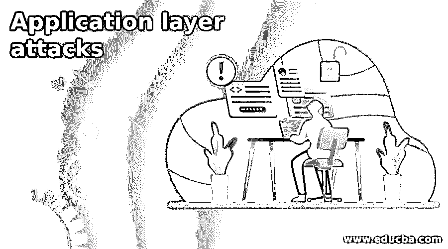

# 应用层攻击

> 原文：<https://www.educba.com/application-layer-attacks/>

## 应用层攻击简介

基于 Web 的应用程序开发正变得越来越流行。我们日常生活中需要的一切都可以在网上找到，包括谷歌文档、电子邮件、计算器、存储、天气、地图以及新闻。由于几乎所有的移动应用程序都连接到存储我们的照片、用户名和密码以及机密信息的云端，没有互联网，手机就毫无用处。甚至我们的家用电器现在都连接到了互联网，因为像 Wink 这样的物联网平台，允许用户从手机上调暗灯光。在本主题中，我们将了解应用层攻击。

### 应用层攻击

应用层是最难保护的。这里检测到的漏洞经常依赖于复杂的用户输入，而这些输入很难用入侵检测签名来定义。这一层也是最暴露于外界，最容易接触到的。该应用程序必须在端口 80 (HTTP)或端口 443 (HTTPS)上可用。

<small>网页开发、编程语言、软件测试&其他</small>

SQL 注入是一种应用程序攻击形式，在 2014 年造成了 8.1%的数据泄露。在恶意软件和分布式拒绝服务尝试之后，这是第三种最常见的攻击。其他常见的应用程序漏洞，如安全错误配置、使用具有已知漏洞的组件和跨站点脚本，也包括在列表中。在不被网络防御措施发现的情况下，攻击者能够修改应用程序输入并收集机密数据。

在 Web 应用程序的专有代码中发现的大多数漏洞被认为是零日漏洞，因为它们对于安全防御系统来说是未知的。这是因为这些缺陷是每个应用程序所特有的，以前从未被发现过。在不被发现的情况下，有经验的攻击者可以迅速找到这些弱点并加以利用。

开发安全的应用程序是抵御这些网络攻击的最佳手段。开发人员必须了解应用程序攻击是如何工作的，并将软件防御整合到他们的程序中。

开放 Web 应用程序安全项目的目的是教育和通知开发人员有关应用程序漏洞(OWASP)的信息。该组织编制了一份十大最普遍的应用程序漏洞列表。

下面是一些应用层攻击的例子。

#### 1.未经验证的转发和重定向

这种类型的漏洞通常用于网络钓鱼攻击，用户被误导访问恶意网站。攻击者可以通过更改可信网站的 URL 将用户重定向到不需要的位置。

#### 2.使用具有已知漏洞的组件

此类型适用于尚未打补丁的第三方组件。攻击者可以利用旧的第三方元素，因为它们的缺陷已经被公开披露，并且工具通常使攻击者可以很容易地利用它们。任何脚本小子都可以进行攻击。

#### 3.跨站点请求伪造

这种形式的攻击通常与社会工程结合使用。它使攻击者能够欺骗用户采取他们不知道的行动。

#### 4.缺少功能级访问控制

这种类型的攻击包括对级别较低或未经授权的用户隐藏最高权限操作，而不是由访问控制强制执行。

#### 5.敏感数据暴露

此类别适用于传输中未加密或未移动的数据。攻击者可以从 Web 应用程序中窃取或修改敏感数据，如支付卡或登录凭据，并利用这些数据实施身份盗窃、信用卡欺诈或其他犯罪。

#### 6.安全错误配置

这是列表中最常见的漏洞，通常是由默认设置或过于冗长的错误消息引起的。例如，应用程序可能向用户显示过度描述的错误，这可能表明程序的弱点。这可以通过删除任何不必要的代码特性并确保错误消息更加灵活来避免。

#### 7.不安全的反序列化

当来自不可信来源的数据被反序列化时，就会发生这种情况，并可能导致灾难性的后果，如 DDoS 攻击和远程代码执行攻击。虽然可以通过监视反序列化和应用类型检查等操作来尝试识别攻击者，但防止不安全的反序列化攻击的唯一可靠方法是防止数据从不受信任的来源被反序列化。

#### 8.跨站点脚本(XSS)

当 web 应用程序允许用户将自定义代码插入到 url 路径中，甚至插入到其他用户可以查看的网站上时，就会发生跨站点脚本攻击。该缺陷可用于将恶意 JavaScript 代码注入受害者的浏览器。例如，攻击者可以向受害者发送一封看似来自一家知名银行的电子邮件，其中包含该银行网站的链接。

阻止不受信任的 HTTP 请求，以及验证和/或过滤用户生成的内容，都是跨站点脚本的防范技术。跨站点脚本安全性也内置于 ReactJS 和 Ruby on Rails 等现代 web 开发框架中。

#### 9.不完整的身份验证和会话管理(XSS)

攻击者可以通过利用身份验证(登录)系统中的漏洞来访问用户帐户，并可能危及整个系统的安全。例如，攻击者可以在数据泄露后获取数千个已知用户名/密码组合的列表，并使用脚本在登录系统上测试所有这些组合，以查看它们中的任何一个是否有效。

使用双因素身份验证(2FA)和速率限制来限制或推迟重复登录尝试是缓解身份验证问题的两种方法。

#### 10.注射

当不可信数据通过表单输入或提交给 web 应用程序的其他数据提供给代码解释器时，就会发生注入攻击。例如，攻击者可以将 SQL 数据库代码放入需要明文用户名的表单中。如果表单输入不够安全，将运行 SQL 代码。这也称为 SQL 注入攻击。

验证和/或过滤用户提交的数据有助于避免注入攻击。(净化是指清除数据中可疑的元素，而验证是指拒绝可疑的数据。)数据库管理员还可以建立控制措施来限制注入攻击可能泄露的数据量。

### 推荐文章

这是应用层攻击的指南。这里我们讨论各种应用级攻击。我们希望这篇文章对您有所帮助。您也可以看看以下文章，了解更多信息–

1.  [Arduino 应用](https://www.educba.com/arduino-application/)
2.  [数字图像处理的应用](https://www.educba.com/application-of-digital-image-processing/)
3.  [Spring Boot 应用程序.属性](https://www.educba.com/spring-boot-application-properties/)
4.  [RPA 应用程序](https://www.educba.com/rpa-applications/)

