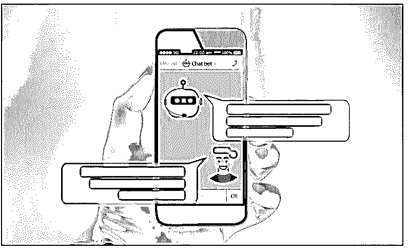
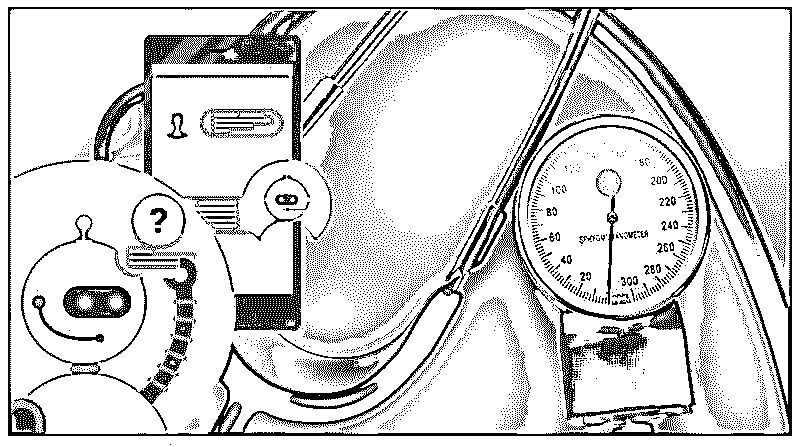
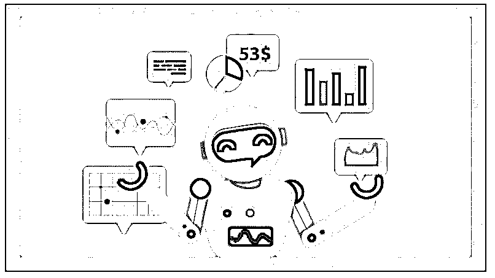

# 聊天机器人使用

> 原文：<https://www.educba.com/chatbot-uses/>

## 聊天机器人使用简介

我们可以将聊天机器人的用途定义为拥有聊天机器人的好处，聊天机器人可以通过语音到文本或仅文本的模式提供 24/7 支持，使我们的生活变得更加轻松。聊天机器人的用途是减少人力，可以在一年 365 天、24/7 的任何时间工作，而不用休假或每周休息，产生更多的线索(由于其 24/7 的可用性)，对客户的好处是提供服务不受时区限制，除此之外，它们的用途还在于降低公司的成本，同时提高客户的服务速度。

### 聊天机器人的不同用途

你能想象聊天机器人不在的领域吗？它们几乎无处不在，让你的日常生活变得轻松。对于客户来说，聊天机器人可以提供快速响应、更快的售后或售前服务，让他们感觉自己与公司紧密相连。对于公司来说，聊天机器人可以通过降低支持成本、产生更多线索，从而获得更多客户、提高客户转换率等方式获益。

<small>网页开发、编程语言、软件测试&其他</small>

以下是 chatbot support 收购的一些行业:

#### 1.电子商务行业

随着聊天机器人的兴起，首当其冲受到影响的行业是电子商务行业。2019 年，电子商务市场的价值为 9.09 万亿美元。这个市场价值预计到 2020 年将达到 10.36 万亿，这表明了人们从电子商务平台购买商品的全球趋势。越来越多的顾客是他们最头疼的问题。为什么？

想象一下这样一种情况，你是一个电商平台的老板，没有足够的人力为你的客户提供售后服务。或者你没有足够的销售人员来为你挖掘客户购买偏好的线索。由于这个原因，他们选择了聊天机器人，现在，对他们来说，没有什么比一个礼貌而谦逊的聊天机器人更有用的了，他可以全天候为客户服务。他们帮助电子商务行业赚更多的钱，节省人力，增加销售周期，更高的售后服务客户满意率。

#### 2.医疗保健/医药行业

在这个新冠肺炎时代，医生已经像天使一样出现了，不是吗？关注病人仍然是他们的首要任务，当他们有管理工作要做时，这一点就会受到影响。研究结果表明，美国医生将近六分之一的工作时间消耗在行政工作上。

根据在美国进行的一项研究，医生们倾向于使用聊天机器人来安排医生的预约，定位最近的健康中心，提供医疗信息；就目前疫情的情况来看，聊天机器人甚至在帮助处理基本的用户信息。

WhatsApp 最近与世卫组织合作，推出了聊天机器人服务，可以回答用户关于新冠肺炎的问题/担忧。印度政府还与 WhatsApp 联合推出了 My Gov Corona 服务台，帮助人们获取关于疫情的全国和全球信息。

#### 3.银行业

如果没有新冠肺炎的话，这个行业应该已经排在第二位了。该部门已经使用聊天机器人来减少银行中的人员流量。想象一下，你可能有一个私人银行家、关系经理、贷款代理人等等。，触手可及。忘了每天去银行吧。这就是原因；如今，如果你去银行，你就不会排很长的队。

他们还帮助银行做出数据驱动的决策。例如特定客户的定期存款的利率应该是多少，如果客户在一个月内通过交易花费了一定数量的钱，他或她将有资格获得一定的礼券，等等。

#### 4.旅游产业

旅游业已经采用了聊天机器人系统，就像上面三个中的任何一个一样。其背后的核心原因是，一个人只工作八个小时，旅行社应该总是根据他们的时区接待全球各地的客户。聊天机器人可以让你产生与旅行相关的客户线索，全年 365 天，每天 24 小时都有帮助(你知道，它从不休息！)为您的业务，这类似于选择旅行，预订，住宿服务等。

#### 5.B2B 行业

B2B 公司通常寻找三个重要的数据点，这些数据点提供了关于客户及其方法的信息。这三个数据点是姓名、手机号码和电子邮件 ID。这三个数据点对于 B2B 行业产生销售线索非常重要。拥有一个助理聊天机器人而不是一个可以全天候管理线索来源平台的人类销售人员是一件好事。领英、脸书等。).聊天机器人将帮助你获得来自全球各个角落的线索，而不受时区的限制，也不需要人力参与。

### 聊天机器人的局限性

下面给出了提到的限制:

*   第一个限制是响应限制。由于聊天机器人是基于行为数据库开发的，它对你提出的问题的范围有限，有时可能根本无法帮助你。
*   你可以一次问一个问题，你的第一个回答会被聊天机器人考虑。这就是为什么如果你问了多个问题或者只是想纠正之前给出的答案，你就完了。
*   聊天机器人及其效率高度依赖于语言处理，因此它有时会失败，因为语言处理由于不同的口音、拼写和错误等而具有有限的范围。

### 结论

聊天机器人几乎已经收购了所有其他行业，因为它可以 24/7 全天候工作，而且公司都在敦促减少人力。电子商务行业是使用聊天机器人进行销售线索挖掘、客户支持、增加销售周期等等的先驱之一。医疗保健行业最近越来越多地使用聊天机器人来帮助患者安排与医生的会面，了解基本的健康状况，引导人们前往最近的健康中心等。银行业已经使用聊天机器人来减少银行中的人口贩运。你可以让你的私人经理，财富经理，贷款经理，最近的自动柜员机定位器都在你的指尖。旅游业已经采用聊天机器人来帮助他们全天候管理全球客户，而无需请假来生成线索、为客户定制预订、酒店房间、旅游细节等。

### 推荐文章

这是聊天机器人使用指南。在这里，我们分别讨论介绍、不同的聊天机器人用途以及局限性。您也可以看看以下文章，了解更多信息–

1.  [软件系统架构](https://www.educba.com/software-system-architecture/)
2.  [软件事件管理](https://www.educba.com/software-incident-management/)
3.  [软件成本估算](https://www.educba.com/software-cost-estimation/)
4.  [软件设计](https://www.educba.com/software-design/)

