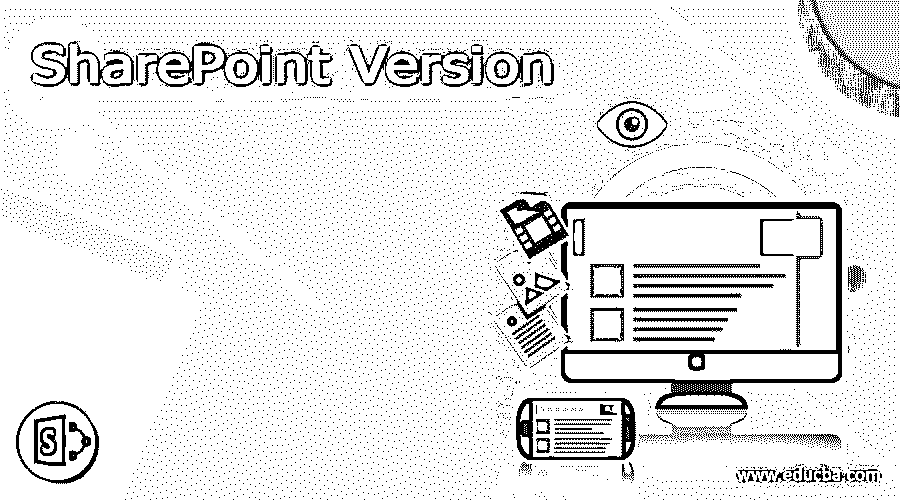

# SharePoint 版本

> 原文：<https://www.educba.com/sharepoint-version/>

## SharePoint 版本简介

基本上，SharePoint 证明了网络基础的集体平台。相同的平台将有助于与 Microsoft Office 集成。2001 年，SharePoint 推出。最初，SharePoint 是在存储系统和文档管理方面销售的。之后，SharePoint 将在一个非常精确的管理器中进行配置。它在不同组织中被广泛而有效地使用。根据这份报告，微软称有 1.9 亿用户在使用 SharePoint web bases 集体平台。有 20 万客户与同一个 SharePoint 平台相关联。最晚是 2020 年。它既来自平台，如内部部署平台，也来自云平台。它推出了一个新功能，安全更新，缺陷修复。因此，强烈建议我们使用最新或更新版本的 SharePoint。

### SharePoint 版本

我们已经检查了 SharePoint 基本上用于内容管理。它提供了一个基于网络的平台，这将有助于与微软 Office 集成。SharePoint 在不同的地理区域被广泛使用。它没有坚持单一领域或用例。我们可以在不同的领域和不同的用例中使用 SharePoint。例如，在美国，最大的 pharm domain 客户之一在内容管理方面使用 SharePoint。它保存 SharePoint 平台上包含的使用量。我们可以说版本信息是随着发明日期出现的。SharePoint 的每个新版本都是在旧版本的基础上推出新的增强功能。当新版本发布时，它将添加新功能。但是，当我们使用不同的 SharePoint 版本时，我们还需要检查许可证的成本。我们需要从微软获得一些许可证，然后只有我们可以在企业级的 SharePoint 平台上工作。在许可证条款中，有不同的条款，在部署任何生产环境或企业 SharePoint 部署之前，我们需要确保我们拥有正确或兼容的 SharePoint 版本。它拥有有效的许可证。

<small>网页开发、编程语言、软件测试&其他</small>

以下是列表:

#### A) SharePoint 版本 2020

1.  它将支持 SharePoint Online 功能。它将能够与 Office 365 集成。
2.  它满足通信合规流程。
3.  它可以将比较视图选项添加到 O365 中。
4.  在 MAC OS 中，它提供 S/MIME 证书交付。
5.  它提供了一个很好的电子发现仪表板。
6.  它正在提供微软应用程序目录。

#### b)SharePoint 2019 版

1.  在 2019 版本中，它为 ADFS 的危险 IP 地址提供了外网保护。
2.  它为 Azure cloud 提供了良好的功能，即 AIP 分析。
3.  这里，它更新了“更改外观面板”视图或选项。
4.  它改变了管理中心的体验，即从默认体验到新的或现代的体验。
5.  这也是设备管理的一个变化。它也将在模块应用程序中更新。
6.  它将支持管理中心更新。该功能将包括回拨时间表功能和整页机票历史记录。
7.  在 Office 365 和 Microsoft 365 套件中，它还提供 MyAnalytics 插件功能。
8.  我们在文件的基础上增加了一个不同的特性，比如缺失元数据、DLP 块、检出、共享等。
9.  它还提供了粘性列标题的特性。这将有助于发现当我们水平或垂直滚动时，大的列标题应该是可见的。这将有助于在庞大的图书馆列表中进行搜索。
10.  它在新闻发布和简单页面方面提供了良好的体验。
11.  用户能够在组部分的页脚获得总计和小计列的列表。在这里，不需要更改 SharePoint 经典模式。

#### c)SharePoint 2018 版

1.  SharePoint 2019 内部部署
2.  这将有助于保持 SharePoint 2018 版看起来像 SharePoint online。
3.  它引入了新的现代界面
4.  它提供了一个响应迅速的用户界面。
5.  在 SharePoint 版中，it 无法自动执行混合配置。
6.  它改进了团队网站
7.  它提供了新的现代体验
8.  它在通信站点上有很好的改进
9.  对业务流程的良好支持

#### d)SharePoint 2017 版

1.  SharePoint 版将支持在线 office 365
2.  它将在一个在线网站的帮助下支持微软团队。

#### e)SharePoint 2016 版

1.  它支持本地环境配置。
2.  2016 年 5 月，微软发布了支持 feature pack 2 的 SharePoint 版。
3.  在 SharePoint 版中，它仅支持一个驱动器中的现代界面。
4.  在 SharePoint online 站点中，它还支持 Office 365 组。
5.  在 SharePoint 版中，最大文件存储增加到 10 GB。之前是 2 GB。
6.  它引入了 MinRioles 概念。
7.  它改进了修补功能。打补丁时不需要停机。
8.  在 SharePoint 版中，内容数据库大小增加到 1TB。之前是 200 GB。
9.  在用户界面和 PowerShell 命令的帮助下，它有助于更快地创建站点。

### 结论

我们已经看到了带有适当解释的“SharePoint 版本”的完整概念。我们建议使用最新版本的 SharePoint，因为它有很多错误修复。它对内容管理非常有用。

### 推荐文章

这是 SharePoint 版本的指南。在这里我们分别讨论介绍、SharePoint 版本列表。您也可以看看以下文章，了解更多信息–

1.  [Pro Tools 版本](https://www.educba.com/pro-tools-version/)
2.  [PowerPoint 版本](https://www.educba.com/powerpoint-version/)
3.  [卡夫卡版](https://www.educba.com/kafka-version/)
4.  [Joomla 版本](https://www.educba.com/joomla-version/)

