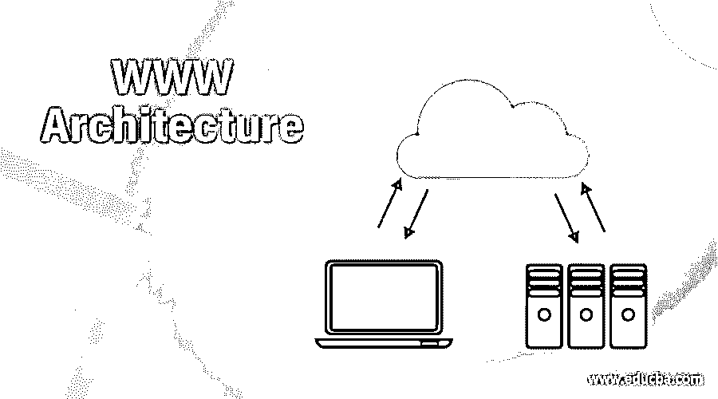

# WWW 架构

> 原文：<https://www.educba.com/www-architecture/>

## WWW 体系结构介绍

万维网是一个万维网，是一个由世界各地的信息链接而成的信息库。WWW 具有灵活性、可移植性和用户友好特性的独特组合，使其区别于因特网提供的其他服务。此外，WWW 是一种分布式客户端-服务器服务，其中使用浏览器的客户端可以使用服务器来访问服务。在这个主题中，我们将学习 WWW 架构。

然而，所提供的服务分布在许多称为站点的位置。每个站点包含一个或多个文档。这些文档被称为网页。每个网页可以包含一些其他链接到相同或其他网站上的其他网页。网页可以是简单的，也可以是复合的。有链接到其他网站的网页被称为简单网页。具有一个或多个链接的网页称为复合网页。每个网页都是一个有名字和地址的文件。在这个主题中，我们将学习 WWW 架构。

<small>网页开发、编程语言、软件测试&其他</small>

### 万维网的体系结构

WWW 体系结构由超文本和超媒体、web 客户机、web 服务器和 URL 组成。让我们逐一讨论这些组件。

#### 1.超文本和超媒体

超文本是创建引用其他文档的文档的过程。在超文本文档中，文本的某些部分可以被定义为到其他文档的链接。当用浏览器浏览超文本时，可以点击链接检索其他文档。超媒体是应用于包含到其他文本文档或包含图像、音频或视频的文档的链接的文档的过程。

#### 2.网络客户端

许多供应商提供解释和显示 web 文档的商业浏览器，所有这些浏览器都使用几乎相同的体系结构。浏览器由控制器、客户端协议和解释器组成。

*   **控制器:**控制器用于接收鼠标和键盘的输入。它使用客户端程序来访问文档。在文档被访问后，控制器使用其中一个解释器在屏幕上显示文档。
*   **客户端协议:**客户端协议可以是 FTP、HTTP 或 Telnet 等协议之一。
*   解释器:解释器可以是这些类型中的一种，比如 HTML 或 Java 或 JavaScript。类型取决于文档类型。一些商业浏览器是 Firefox、Internet Explorer 和 Netscape Navigator。

#### 3.网络服务器

网络服务器用于存储网页。当客户端向服务器发送请求时，服务器向客户端发送相应的文档。为了提高这些效率，web 服务器将请求的文件存储在内存的缓存中，因为内存的访问速度比磁盘快。通过使用多线程或多重处理，web 服务器也可以变得更加高效。在这种情况下，web 服务器可以一次回答多个请求。一些流行的 web 服务器包括 Apache 和 Microsoft Internet Information Server。

#### 4.统一资源定位器

想要访问网页的客户端需要文件名和地址。以方便获取分布在世界各地的文件。URL(统一资源定位器)是用于指定互联网上任何种类信息的标准定位器。它定义了协议、端口、主机和路径。

主机是信息所在的计算机的域名。通常存储在计算机和计算机中的网页被赋予域名别名，通常以字符“www”开头，即万维网。但是，这不是强制性的，因为主机可以有任何域名。

该协议是用于检索文档的客户端-服务器应用程序。许多协议可以检索 web 文档。其中一些是 FTP、HTTP、TELNET 和 news。目前最常用的协议是 HTTP。

URL 可以选择性地包含服务器的端口号。如果包含端口，它位于主机和路径之间，并且用冒号与主机隔开。路径是信息所在文件的路径名。请注意，在 UNIX 操作系统中，路径本身可以包含斜线。将目录与子目录和文件分开。换句话说，我们可以说誓言定义了文档在目录结构中存储的完整文件名。

### 推荐文章

这是 WWW 体系结构的指南。这里我们讨论 WWW 体系结构及其组成部分，如超文本和超媒体、web 客户机，即浏览器、web 服务器和路径。您也可以看看以下文章，了解更多信息–

1.  [什么是 WWW？](https://www.educba.com/what-is-www/)
2.  [网站监控工具](https://www.educba.com/website-monitoring-tool/)
3.  [静态网站](https://www.educba.com/static-website/)
4.  [HTML 文本装饰](https://www.educba.com/html-text-decoration/)

