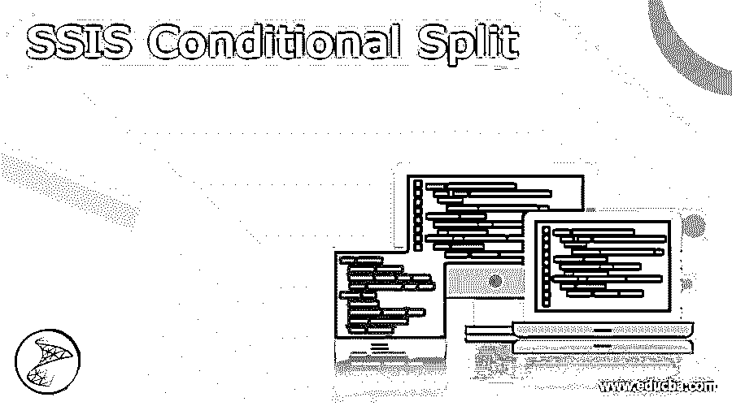
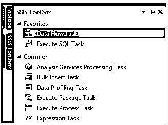
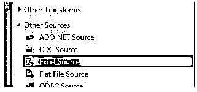
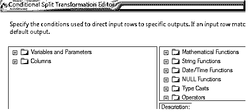
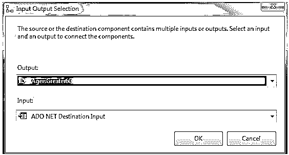

# SSIS 条件分裂

> 原文：<https://www.educba.com/ssis-conditional-split/>

## SSIS 条件分裂的定义

SSIS 条件分裂是 MSBI 工具的主要组成部分之一。那就是微软商业智能工具。它隐含在 ETL 过程的数据流中。条件拆分是开发人员使用的程序，通过使用简单的条件来执行程序或过程，这些条件易于理解，可以像 CASE 语句或 IF 语句一样轻松地执行任何特定的任务。在本文中，我们可以看到 SQL Server 集成系统中的条件性拆分实现。

### 什么是 SSIS 条件分裂？

在 SSIS，条件性拆分就像 Case 语句或 IF 条件一样简单。它确保给定的条件依赖于条件的输出，结果将被定向到合适的目的地路径，它具有单个输入和多个输出。比如我们想通过排名系统将学生数据库保存在一个表中，那么就可以通过给定条件拆分数据来实现条件拆分。然后，它构造和处理数据，并使用给定的条件给出最终输出。但是 SSIS 的条件拆分是区分大小写的。

<small>网页开发、编程语言、软件测试&其他</small>

### 创建 SSIS 条件分解

条件性拆分转换可用于检查执行的条件，并根据执行的条件管理到给定目标的数据流。例如，如果一名男子的年龄超过 58 岁，他可以利用老年公民配额。如果不是，他就不被认为是老年人。然后，在这种情况下，IF 语句用于结构化和拆分数据。

上面的例子可以被认为是用于创建条件性拆分的条件。这位老人有一个配额。所以我们可以先相应地创建一个列表。

1.创建一个 excel 文件，包含个人 id、个人姓名、个人年龄、个人级别等详细信息。
2。然后从数据仓库创建一个 SQL 表来保存、提取和过滤来自 excel 源的数据。58 岁以下的人不被视为老年公民，58 岁以上的人将进入老年公民配额。
3。单击 SSIS 项目，然后选择“控制流”来拖放数据流任务。
4。给出典型名称，双击导航到数据流窗口。

5.excel 中的源文件是从 SSIS
6 的工具箱中取出的。然后配置 excel 源来保存 excel 文件，这是 ETL 过程的一部分。

7.从 SSIS 的工具箱中拖放组件条件性拆分

8.然后右键单击并编辑这两个条件，根据年龄组将结果拆分为两种不同的格式，一种是 58 岁以下，另一种是 58 岁以上。
9。将查询添加到页面后，单击 OK 并保存所做的工作。
10。要在数据库中包含分割数据，请从 SSIS 组件中选择 ADO.NET 目的地，以获得两种不同格式的输出，并且需要单独调整。因此，我们需要添加 ADO.NET 的两个组件，然后对其进行相应的配置。

11.执行项目并验证 SQL 表中的输出。

### SSIS 条件分裂变换

条件性拆分转换的执行与编程中的 CASE 语句相同。它根据结果计算查询，并将数据导航到所需的输出。还可以应用转换来获得默认输出，这样，如果任何一行符合 no 表达式，就会打印默认结果。

应该提供表达式来计算每个条件的布尔函数，以测试需要在哪里执行转换。那么应该指定处理条件的顺序。然后应该对其进行评估，并将该行提供给输出，并且应该根据给定的条件对其进行处理，以检查其是否为真。

从一个输入中仅获得一个输出，并且如果它是根据第一个条件的第一个输出，那么它可以被设置为真。如果条件表示名字的列中的任何值，那么它应该以 A 开始到单个输出，并且如果我们得到不同的输出，应该用字母 B 初始化行。那么它应该被相应地处理，并且应该被馈送到 A 或 b。

### SSIS 条件分离实现

集成服务可以附带操作符和函数，用户需要这些操作符和函数来编译查询以评估输入，还可以管理直接输出数据。条件性拆分转换具有自定义的属性，称为加载包的友好表达式。转换有单个输入，输出可以是单个或多个，有时会得到单个错误输出。高级编辑器属性还用于获取可以通过编程方式配置的属性。

### 分割控制

为了实现控制流，不需要有条件的分离。通过包含对优先约束或值的表达式或查询，可以获得相同的功能。然后，如果在优先值和任务之间双击它，则可以在编辑器对话框中添加表达式值，这有助于计算它是真还是假。这个模态窗口不需要表达式生成器，它可以从内存中复制所有数据。所以用户在这里应该小心，因为表达式字段容易区分大小写。因此，最好在优先约束之前包含一个具有唯一名称的空白脚本，作为有效的条件性拆分。

### 结论

因此，这是一个关于条件性拆分功能的实现和配置的简短过程。这个概念很简单，通过使用条件语句，原始数据可以被分割成两个数据集，并可以用于所需的目的。

### 推荐文章

这是一个 SSIS 有条件分裂的指南。在这里，我们讨论定义，什么是 SSIS 条件分裂，代码实现的例子。您也可以看看以下文章，了解更多信息–

1.  [SSIS](https://www.educba.com/ssis/)
2.  [Scala 拆分](https://www.educba.com/scala-split/)
3.  [MySQL 拆分](https://www.educba.com/mysql-split/)
4.  [PHP 拆分字符串](https://www.educba.com/php-split-string/)

