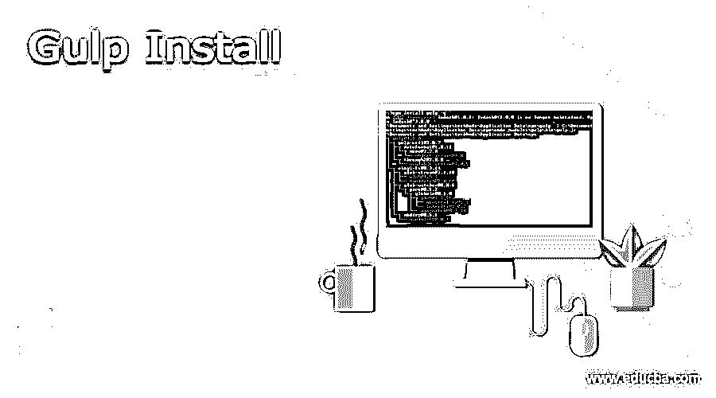
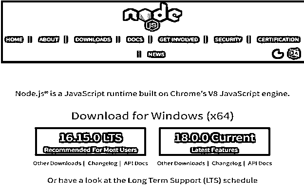
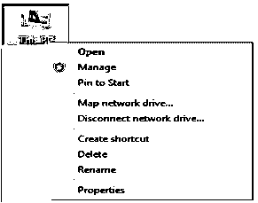
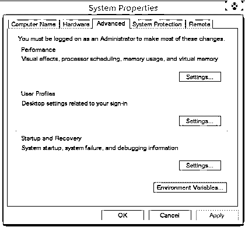
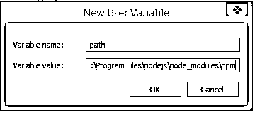
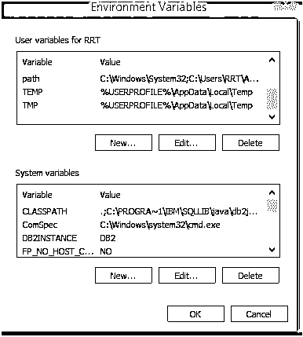
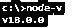
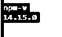
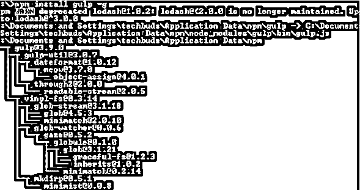

# 大口安装

> 原文：<https://www.educba.com/gulp-install/>

## 吞咽装置的定义

基本上 gulp 是一个开发工具，帮助我们管理项目开发的工作流程。有时我们需要处理或者我们可以说我们需要自动化非常耗时的工作流程，或者我们可以说它太复杂而无法处理，这时我们可以在我们的系统上安装 gulp。通常情况下，我们可以根据自己的需求将 gulp 与不同的 ide 集成在一起，比如 PHP。NET、Node.js 或任何其他我们想要的平台。gulp 最重要的优势之一是跨平台，因此开发人员可以根据自己的需求自动执行多个任务。

### 如何安装 gulp？

在安装之前，我们需要了解什么是 gulp。gulp 是一个跨阶段、流式的企业 sprinter，它允许工程师将大量的改进任务机械化。在一个重要的层面上，gulp 将记录作为流来细读，并将流与各种任务联系起来。这些差事是基于代码的，使用模块。企业改变记录，将源文档构建成创建记录。

<small>网页开发、编程语言、软件测试&其他</small>

**自动化任务:** gulp 是一个工具盒，帮助您将改进工作过程中困难或繁琐的工作机械化。

**跨平台:**集成被整合到所有重要的 ide 中，个人使用 PHP。NET，Node.js，Java，不同阶段。

**稳固的生态系统:**使用 npm 模块做任何您需要的事情+2000 多个安排好的模块用于流记录更改

**基础:**通过给出一个无关紧要的 API 表面，gulp 并不难学，也容易使用

Gulp 是一个帮助你完成一些关于网络发展的任务的工具。它经常被用来做前端工作，比如启动 web 服务器。因此，在保存文档的任何时候都要重新加载程序。

现在，让我们看看如何按照如下不同步骤安装 gulp。

在第一步中，我们需要如下检查系统需求。

**操作系统:**由于是跨平台的，我们可以根据自己的需求使用任何操作系统。

**支持:**支持 ie 浏览器(基本是 8+)、Firefox、Chrome、Opera、Safari 等不同类型的浏览器。

在下一步中，我们需要 Node.js 来执行 gulp，所以首先从其官方网站下载 Node.js，作为参考，请查看以下截图。

在这里我们可以看到推荐的版本和最新的版本，所以我们需要下载 zip 文件的最新版本，并在我们的机器上运行安装程序。

在下一步中，我们需要使用如下步骤来设置本地机器的环境变量。

1.  首先，我们需要右键单击我的电脑图标，如下图所示。

2.  第二步，我们需要点击属性，如下图所示。

3.  在这里，我们需要单击高级选项卡，并在环境变量中单击，如下图所示。

4.在这里，我们可以得到上面截图中显示的编辑用户变量选项。在该字段中，我们需要添加 npm 的路径。在为不同的文档设置了截止到现在的方式的情况下，您希望将分号(；)之后添加 Node.js，如随附的屏幕截图所示。

之后，点击确定按钮。

在下一步中，我们需要设置系统变量，在系统变量选项卡下，我们有一个新的选项，如上图所示。

在下一步中，我们需要在本地机器中打开命令行提示符，并输入如下命令。

**节点 v**

**解释**

通过使用上面的命令，我们可以看到 Node.js 的安装版本，执行后我们可以看到下面命令的结果，如下所示。

在命令行提示符下，输入附带的命令以显示 npm (Node.js bundle chief)的变体，该变体用于引入模块。它将显示引入的 Node.js 表单。通过使用如下命令。

**npm -v**

**解释**

执行上述命令后，我们可以看到我们机器上当前安装的 npm 版本，如下图所示。

现在我们成功地安装了 Node.js，现在我们需要使用如下命令安装 gulp。

**npm 安装吞咽 g**

**解释**

在上面的命令中，我们使用 g 作为标志，确保 gulp 对所有项目都是全局可用的。输入上述命令后，我们得到如下屏幕截图所示。

为了验证 gulp，我们需要运行如下命令。

**吞咽–v**

**解释**

执行上述命令后，我们得到了当前安装的 gulp 版本，如下图所示。

Gulp 是一个将 Node.js 作为一个阶段的赋值 sprinter。Gulp 只是利用 JavaScript 代码，协助运行前端任务和大范围的 web 应用程序。它构建了框架机械化任务，如 CSS 和 HTML 缩小化，连接库文档，并对 SASS 记录进行排序。这些任务可以利用订单行上的 Shell 或 Bash 脚本来运行。

现在让我们来看看大口的特征如下。

*   与另一个短跑运动员相比，它更有限、更容易、更快。
*   利用 SASS 和 LESS 作为 CSS 预处理程序。
*   在修改源文档之后，自然地激活页面。
*   构造 Gulpfile.js，理由是它利用纯粹的 JavaScript 代码来完成任务。
*   相对于其他短跑运动员的巨大速度优势
*   易于编码和理解。
*   测试 web 应用程序很简单。
*   模块很容易使用，它们是用来依次做每一件事情的。
*   多次执行单调的任务，例如，缩小模板、压缩图片等。

### 结论

借助上面的文章，我们试着了解一下 Gulp 安装。从这篇文章中，我们学习了关于 Gulp 安装的基本知识，我们也看到了 Gulp 安装的集成以及我们如何在 Gulp 安装中使用它。

### 推荐文章

这是一个指南吞咽安装。在这里，我们讨论定义，如何大口安装，以及代码实现和输出的例子。您也可以看看以下文章，了解更多信息–

1.  [Keras Install](https://www.educba.com/keras-install/)
2.  gitlab 安装
3.  [Linux 安装命令](https://www.educba.com/linux-install-command/)
4.  [安装 VPN](https://www.educba.com/install-vpn/)

