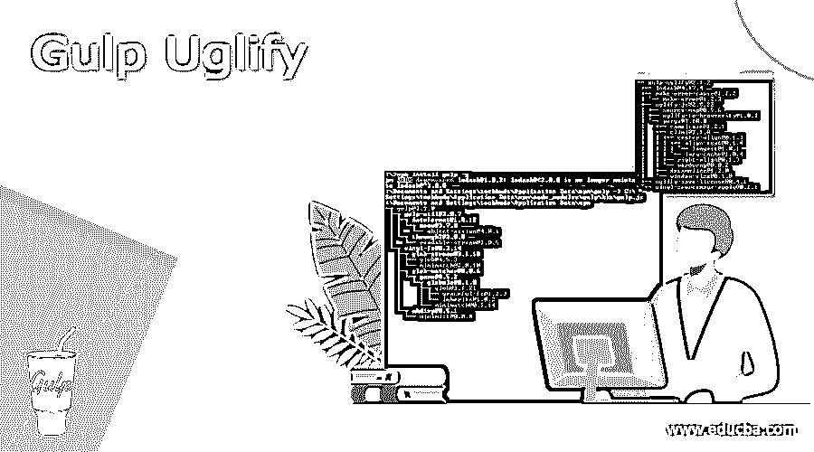
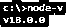
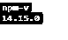
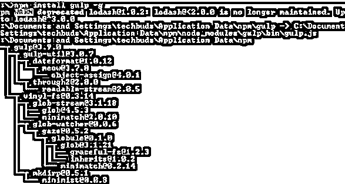
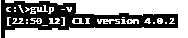
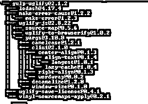
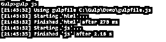

# 吞咽丑陋

> 原文：<https://www.educba.com/gulp-uglify/>

## 吞咽丑陋的定义

基本上，gulp 是用来根据开发人员的需求自动执行开发任务的，gulp 为开发人员提供了不同类型的特性。在这一点上，丑陋是大口提供的特征之一。基本上丑是用来避免错误事件，如果它不能缩小我们的文件。主要是在现代 web 开发中，很多时候我们需要在本地服务器上运行重复的任务，所以在开发阶段可能会出现很多错误，我们需要避免这些错误，或者我们可以说在执行过程中发出这些错误。丑陋的大口给开发者提供了这样一个特征。

### 什么是吞咽丑陋？

如果缩小一个特定的文件不能的话，gulp uglify 会传递一个“失策”的情况。该模块发出的错误构造函数用于实例检查。它包含附带的属性:fileName 被缩小的记录的完整文档路径。

<small>网页开发、编程语言、软件测试&其他</small>

该任务仔细阅读 js 注册表中的所有 JavaScript 文档(与 gulpfile.js 记录比较)，对它们执行丑化工作(丑化/缩小代码)，然后将它们放入表单目录中(如果不存在，则创建它)。当今的网络进步有许多多余的工作，比如运行附近的服务器、精简代码、简化图片、预处理 CSS 等等。这篇文章谈到了 gulp，这是一种用于将这些作业机械化的成型设备。

Gulp 是一个跨阶段、流式的企业 sprinter，它允许设计师自动完成大量的改进任务。在不可否认的层面上，gulp 细读文件，并把这些文件排到各种差事上。这些作业是基于代码的，使用模块。作业调整文档，将源记录构建到创建文档中。要了解 gulp 能做什么，实际上可以看看 GitHub 上的 gulp 计划纲要。

### 丑陋的装置

现在让我们看看如何安装吞咽丑化如下。首先，我们需要使用下面的命令在我们的机器上安装 node.js。

**节点 v**

**解释**

通过使用上面的命令，我们可以看到 Node.js 的安装版本，执行后我们可以看到下面的命令的结果，如下所示。

在命令行提示符下，输入附带的命令以显示 npm (Node.js bundle chief)的变体，该变体用于引入模块。它将显示引入的 Node.js 表单。通过使用下面的命令。

**npm -v**

**解释**

执行上述命令后，我们可以看到我们机器上当前安装的 npm 版本，如下图所示。

现在我们成功地安装了 Node.js，现在我们需要使用如下命令安装 gulp。

**npm 安装吞咽 g**

**解释**

在上面的命令中，我们使用 g 作为标志，确保 gulp 对所有项目都是全局可用的。输入上述命令后，我们得到如下屏幕截图所示。

为了验证 gulp，我们需要运行如下命令。

**吞咽–v**

**解释**

执行上述命令后，我们得到了当前安装的 gulp 版本，如下图所示。

现在我们需要在 npm 的帮助下添加一个包，通过使用如下命令来安装 uglify。

**npm 安装-保存-开发吞咽-丑陋**

**解释**

执行上述命令后，我们得到如下结果，如下图所示。

之后，我们需要创建 gulpfile.js 并添加如下代码。

var gulp = require(' gulp ')；

var uglify = require(' gulp-uglify ')；

var pipeline = require('可读流')。管道；

gulp.task('compress '，function () {

回流管道(

gulp.src('lib/*。js’)，

丑化()，

gulp.dest('dist ')

);

});

**解释**

在上面我们可以看到，我们使用了 gulp 的不同特性，如 gulp.src()和 gulp.dest()，我们还包括了管道来根据我们的要求正确处理错误。

现在我们来看看错误是什么。

在缩小一个特定的文件不能的情况下，吞咽丑陋发出一个“错误”的场合。该模块发出的错误构造函数用于实例检查。它包含附带的属性:

**文件名称:**被缩小记录的完整文件方式。

**原因:**第一次丑 JS 失策，如果可及。

常见错误消息包含如下属性。

1.  第一条消息或者我们有消息
2.  包含错误的文件的名称
3.  线条

现在让我们来看一个例子，以便更好地理解。

var gulp = require('gulp ')，htm _ LC lean = require(' gulp-html clean ')，uglify = require(' gulp-uglify ')；

要有路径= {。

来源:“C:吞咽/演示”，

build:“build/”

};

gulp.task('html '，function() {

var result = path . build+' html/'；

return gulp . src(source . source+' html/*/*)

.管道(html_clean())

.pipe(gulp . dest(out))；

});

gulp.task('js '，['html']，function() {

return gulp . souce(path . source+' js/*/* ')

.管道(丑陋())

.pipe(gulp . dest(path . build+' js/'))；

**解释**

在上面的例子中，我们试图实现如下所示的丑陋，这里我们试图通过使用丑陋函数来清理 html 文件。这里，我们首先将 HTML 文件的路径发送给 uglify 函数进行处理，如图所示，这里我们使用管道概念以我们想要的正确格式显示错误。在程序的最后，我们还需要发送目的地路径来构建 js。为了执行上述代码，我们需要使用如下命令。

**一饮而尽是**

执行上述命令后，结果如下图所示。

### 吞下丑陋的选项

现在我们来看看丑丑中的一个选项如下。

大部分来自 UglifyJ API 的 minify 选择被支持。在选项中，我们有不同类型的案例。

不应设置 sourceMap 选项，因为它会根据您的吞咽安排自然设计。请参见 Gulp 源地图的文档。

基本上，丑化提供了如下不同的选项。

**注释:**用于提供注释注释，用于外部工具。

**压缩:**用于提供自定义对象。

ie: 它启用了 internet explorer bugs。

它还提供了不同的选项，如 **Keep_fargs、keep_fnames、mangle、nameCache 等。**

### 结论

借助上述文章，我们试图了解吞咽丑陋。从这篇文章中，我们了解了吞咽丑化的基本情况，我们也看到了吞咽丑化的整合以及我们如何在吞咽丑化中使用它。

### 推荐文章

这是一个吞咽丑陋的指南。在这里，我们讨论定义，什么是吞咽丑陋，吞咽丑陋的安装，以及代码实现的例子。您也可以看看以下文章，了解更多信息–

1.  [Gulp vs Webpack](https://www.educba.com/gulp-vs-webpack/)
2.  [大口 vs 咕噜](https://www.educba.com/gulp-vs-grunt/)
3.  [全栈技术](https://www.educba.com/full-stack-technologies/)
4.  [棱角分明的材质版本](https://www.educba.com/angular-material-version/)

