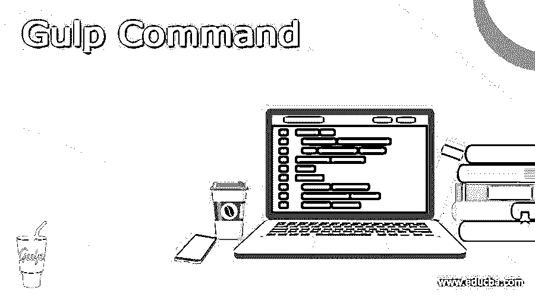
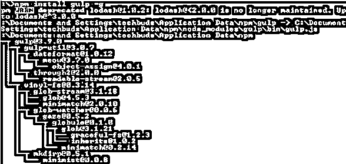
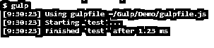

# 吞咽命令

> 原文：<https://www.educba.com/gulp-command/>




## 吞咽命令的定义

我们知道 gulp 基本上是用来按照开发者的要求自动完成网站任务的，比如可以考虑预处理 CSS 代码、缩小 JavaScript 和阅读。通常 Gulp 是一个开源社区工具，为了实现 Gulp，我们需要另一个工具或应用程序，我们称之为 npm。通常 gulp 是一个 JavaScript 库来实现 JavaScript 代码。通过使用 CLI，我们可以在 shell 的帮助下访问我们机器上的 gulp。在命令行界面上，我们能够执行不同的操作，例如安装不同的软件包，并且能够根据我们的要求从命令行界面运行程序。

### 吞咽命令概述

Gulp 是 Node.js 的一个请求行任务运行器。Gulp 让我们现代化周期，轻松完成多余的事情。Gulp 与其他任务运行器的不同之处在于它使用了节点流；转移收益从一个努力作为数据开始，然后转移到下面。它只需要检查一次记录，然后，在这一点上，通过各种任务处理它，最后形成结果存档。这些结果导致更快的发展，因为有一个令人信服的动机，使和审查中心个人记录的硬盘驱动器。

<small>网页开发、编程语言、软件测试&其他</small>

Prior 是 gulp 的一个变种，你想在全球和本地推出。

全球范围内的 gulpfile.js 都使用邻域变体在控制中心运行。

从根本上来说，它现在起作用了。

然而，由于变体 4 gulp(它还没有被完全使用)你真的想引入 gulp CLI，同样在此之前消除 gulp 的全球形式

**NPM RM–全局吞咽**

这种分裂是因为世界范围内和附近的相似性问题。

世界各地都引入了 gulp CLI bundle (gulp 指令行接口)来执行 Gulp 指令。

gulp bundle 是作为一种进步的依赖而引入的，用于构建风险企业树，并在修改 Gulpfile.js 记录时提供编码帮助。

Gulp 是 Node.js 的一个请求行任务冲刺程序。Gulp 允许我们更新周期并毫无问题地完成更多的事情。与其他赋值冲刺程序相比，Gulp 的优势在于它利用了节点流；重定向产量从作为信息的一个承诺开始，然后到伴随的。它基本上只需检查一次记录，然后通过不同的差事处理它，总而言之，构造结果文档。这些结果带来了更快的改善，因为有一个令人信服的灵感来制作和调查硬盘上的重点个人记录。所有的 Gulp 设置都记录在一个名为 gulpfile.js 的记录中，该记录位于企业的基础上。编写作业的例子是，你首先负担一个你将要使用的模块，然后描述一个依赖于该模块的任务。

Gulp 是非常模块驱动的；要实现某个目标，您需要知道使用哪个模块。通常，一个单独的模块有一个单独的原因，所有的模块都只是习惯性的 JavaScript。

### 基本吞咽命令

**节点 v**

**解释**

通过使用上面的命令，我们可以看到 Node.js 的安装版本，执行后我们可以看到下面命令的结果，如下所示。


在命令行提示符下，输入附带的命令以显示 npm (Node.js bundle chief)的变体，该变体用于引入模块。它将在下面命令的帮助下显示已安装的版本 Node.js 表单。

**npm -v**

**解释**

执行上述命令后，我们可以看到我们机器上当前安装的 npm 版本，如下图所示。


现在我们成功地安装了 Node.js，现在我们需要使用下面的命令安装 gulp，如下所示。

**npm 安装吞咽 g**

**解释**

在上面的命令中，我们使用 g 作为标志，确保 gulp 对所有项目都是全局可用的。输入上述命令后，我们得到如下屏幕截图所示。




为了验证 gulp，我们需要如下运行下面的命令。

**吞咽–v**

**解释**

执行上述命令后，我们得到了当前安装的 gulp 版本，如下图所示。


**未找到吞咽命令**

现在让我们来看看 gulp 命令，如下所示。

**吞咽——版本**

**解释**

上述命令的最终结果如下图所示。


在 windows 上安装 gulp 之后，有时会出现这个错误消息，所以我们需要通过全局安装 gulp cli 包来解决这个问题。所以我们需要借助 cli 安装 gulp-cli，重启终端。有时它会显示一条错误消息，然后我们需要用 sudo 运行相同的命令，并确保环境变量的路径。

sudo npm install -g gulp-cli

### 吞咽命令示例

现在让我们来看看不同的吞咽命令的例子，如下所示。

在上面我们已经看到了不同的 gulp 命令的例子，假设我们想要创建一个新的项目，那么我们可以使用下面的命令。

**npm init**

**解释**

通过使用上面的命令，我们可以生成 package.json 文件。基本上，通过使用这个文件，我们可以随时跟踪项目的包。

首先，我们需要在项目的根文件夹中创建一个. js 文件，或者我们可以利用文本编辑器来创建一个. js 文件。这里我们创建了 **gulpfile.js** 并编写了如下代码。

```
function testfunction(tf) {

// inside the function we can write code for our test task

tf();

}
```

exports.test= testfunction

**解释**

在上面的例子中，我们试图测试 gulp cli 的执行，这意味着检查 gulp cli 的执行是否正确。所以在下面命令的帮助下执行上面的文件，如下所示。

**一饮而尽**

**解释**

我们可以在下面的截图中看到上面执行的最终结果如下。




如果我想同时执行多个任务，那么我们可以使用如下语法。

**一饮而尽<指定任务 1 > <指定其他任务>**

### 结论

借助上面的文章，我们试着了解一下 Gulp 命令。从这篇文章中，我们了解了吞咽命令的基本情况，我们也看到了吞咽命令的集成以及我们如何在吞咽命令中使用它。

### 推荐文章

这是一个吞咽命令的指南。这里我们讨论定义、概述和解释。您也可以看看以下文章，了解更多信息–

1.  [JUnit 代码覆盖率](https://www.educba.com/junit-code-coverage/)
2.  朱尼特木星
3.  [JUnit assertEquals](https://www.educba.com/junit-assertequals/)
4.  [JUnit 参数化测试](https://www.educba.com/junit-parameterized-test/)


