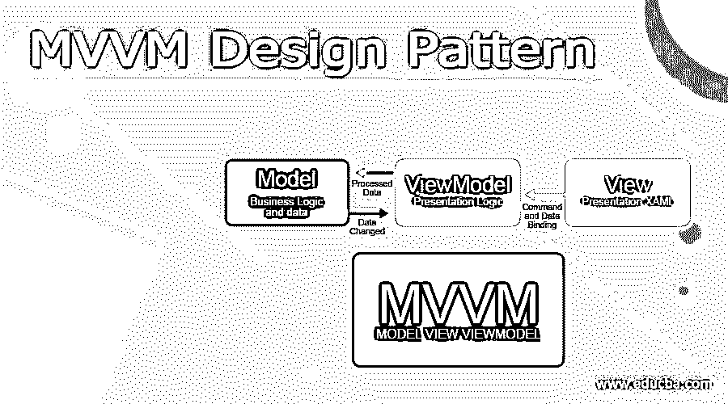
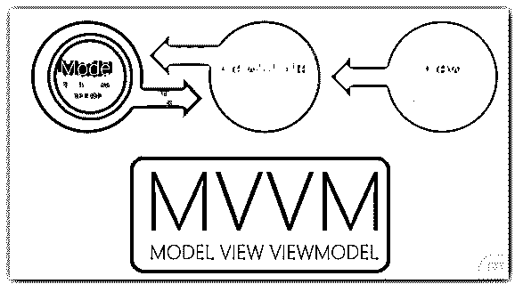
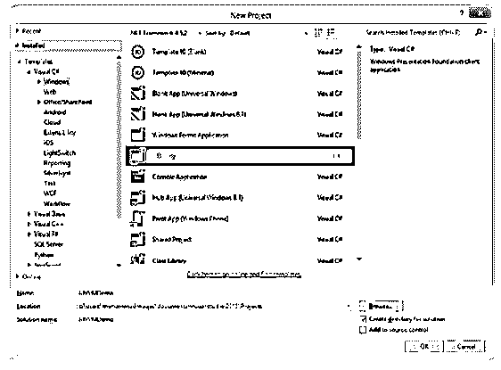
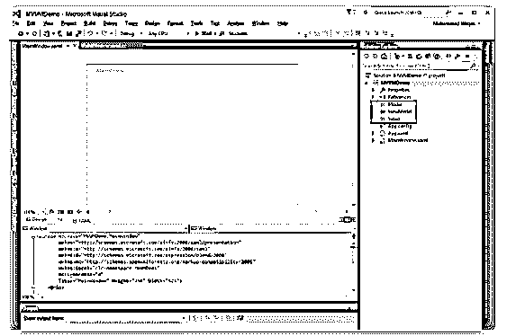
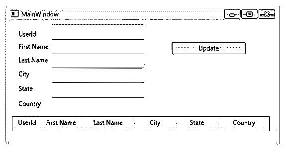
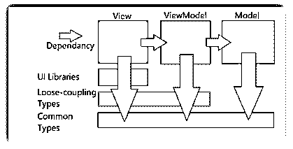

# MVVM 设计模式

> 原文：<https://www.educba.com/mvvm-design-pattern/>




## MVVM 设计模式介绍

MVVM 设计模式是将对象分成三个主要部分的结构设计模式；它们是模型、视图和视图模型。这种软件设计模式分为程序逻辑和用户界面控制。它也被称为模型-视图-绑定器，它简化了用户界面和构建块的并行开发。它们大多是结构或简单的类。视图用于可视化地显示 UI 上的一些控件。

### MVVM 设计模式概述

MVVM 抽象只是想象视图，减少了应用程序代码中所需的业务逻辑。ViewModel 比事件驱动代码更容易测试。MVVM 设计模式也称为架构，它将对象分为三个部分，它们是模型-视图-视图模型，这是业界公认的架构模式，克服了 MVC 和 MVP 设计模式的全部缺点。MVVM 将 UI 逻辑与应用程序的业务逻辑部分分离开来。

<small>网页开发、编程语言、软件测试&其他</small>

MVVM (Model-View-ViewModel)模式获得了广泛的关注，这种模式非常简单，大多数开发人员都难以实现。开发人员经常使用提供 MVVM 模式实现的工具包/框架，由于不了解模式本身，他们会延迟使用特定的框架。框架是提供库的基本东西，通过封装基本 XAML 引擎中不可访问的功能来实现模式。




### 如何使用 MVVM 设计模式？

让我们看看 MVVM 模式的基本功能和用法，

MVVM (Model-View-ViewModel)是微软发明的软件平台中使用的架构模式，它专门研究模型设计模式的表示。它基于 MVC(模型-视图-控制器)模式，面向现代用户界面开发平台(如 WPF 和 SilverLight)。他们是 UX 开发者，有着不同于一般开发者的需求。MVVM(模型-视图-视图模型)是创建客户端应用程序的方法，这是 WPF 平台的一个功能，它支持简单的应用程序测试，并帮助设计人员和开发人员共同工作，最大限度地减少技术问题。

MVVM(模型-视图-视图模型)被分成三个组件，它们是

1.  视角
2.  模型
3.  视图模型

让我们看看每个组件的用法

1.  **视图**–视图在**、**中描述，其背后的代码中不能有任何逻辑，它是通过数据绑定在 ViewModel 中绑定的。
2.  **模型**——模型主要用于表示方法中的数据，这是 WPF 简单精致的。
3.  视图模型(ViewModel)–视图模型是呈现应用程序的模型，或者我们可以说，是视图的抽象。它描述了适用于视图的数据，并表示了视图的活动，通常带有命令。

### 创建项目 MVVM 设计模式

MVVM 设计模式是软件设计模式，分为程序逻辑和用户界面控制。结构设计模式将对象分为三个主要部分；它们是模型、视图和视图模型。让我们看看下面的创作，

首先，打开 VS 2010 和 File à Newà项目来创建 WPF 项目。

在已安装的模板中选择窗口，选择 WPF 应用程序，并给出合适的名称和想要保存的位置。

最后，单击确定。




在根应用程序中创建三个文件夹。这些名称必须是 Model、View 和 ViewModel，并且包括 Model 中的新类




文件夹中，类名是 UserDetails 并包含名称空间

使用系统。组件模型；

**用户详细信息. cs**

```
public class UserDetails : INotifyPropertyChanged

{

private int u_userId;

private string u_firstName;

private string u_lastName;

private string u_city;

private string u_state;

private string u_country;

public int u_userId

{

get

{

return u_userId;

}

set

{

u_userId = value;

OnPropertyChanged("u_userId");

}

}

public string u_firstName

{

get

{

return u_firstName;

}

set

{

u_firstName = value;

OnPropertyChanged("u_firstName");

}

}

public string u_lastName

{

get

{

return u_lastName;

}

set

{

u_lastName = value;

OnPropertyChanged("u_lastName");

}

}

public string u_city

{

get

{

return u_city;

}

set

{

u_city = value;

OnPropertyChanged("u_city");

}

}

public string u_state

{

get

{

return u_state;

}

set

{

u_state = value;

OnPropertyChanged("u_state");

}

}

public string u_country

{

get

{

return u_country;

}

set

{

u_country = value;

OnPropertyChanged("u_country");

}

}

#region INotifyPropertyChanged Members

public event PropertyChangedEventHandler PropertyChanged;

private void OnPropertyChanged(string propertyName)

{

if (PropertyChanged != null)

{

PropertyChanged(this, new PropertyChangedEventArgs(propertyName));

}

}

#endregion

 }
```

然后右键单击 ViewModel 文件夹并包含新类，如下所示，

**UserDetailViewModel.cs**

```
using System.Windows.Input;

using System.ComponentModel;

class UserDetailViewModel

{

private IList<UserDetails> _UsersList;

public UserDetailViewModel()

{

_UsersList = new List<UserDetails>

{

new UserDetails {u_UserId=1001,u_firstName="Peter",u_lastName="Paul",u_city="New York",u_state="NY",u_country="USA"},

new UserDetails{u_UserId=1002,u_firstName="Danial",u_lastName="Rio",u_city="Delhi", u_state="DEL", u_country="India"},

};

}

public IList<UserDetails> Users

{

get { return _UsersList; }

set { _UsersList = value; }

}

private ICommand mUpdater;

public ICommand UpdateCommand

{

get

{

if (mUpdater == null)

mUpdater = new Updater();

return mUpdater;

}

set

{

mUpdater = value;

}

}

private class Updater : ICommand

{

public bool CanExecute(object parameter)

{

return true;

}

public event EventHandler CanExecuteChanged;

public void Execute(object parameter)

{

}

}

}
```

现在转到视图，在视图文件夹中包含新窗口。

**Important.xaml**

```
<Window x:Class="WpfMVVMSample.MainWindow"

xmlns:x="http://schemas.microsoft.com/winfx/2006/xaml"

Title="MainWindow" Height="485" Width="525">

<Grid Margin="0,0,0,20">

<Grid.RowDefinitions>

<RowDefinition Height="Auto"/>

<RowDefinition Height="*"/>

<RowDefinition Height="Auto"/>

</Grid.RowDefinitions>

<ListView Name="UserGrid" Grid.Row="1" Margin="4,178,12,13"  ItemsSource="{Binding Users}"  >

<ListView.View>

<GridView x:Name="UsergrdTest">

<GridViewColumn Header="ID" DisplayMemberBinding="{Binding u_UserId}"  Width="50"/>

<GridViewColumn Header="First Name" DisplayMemberBinding="{Binding u_firstName}"  Width="80" />

<GridViewColumn Header="Last Name" DisplayMemberBinding="{Binding u_lastName}" Width="100" />

<GridViewColumn Header="City" DisplayMemberBinding="{Binding u_City}" Width="80" />

<GridViewColumn Header="State" DisplayMemberBinding="{Binding u_State}" Width="80" />

<GridViewColumn Header="Country" DisplayMemberBinding="{Binding u_Country}" Width="100" />

</GridView>

</ListView.View>

</ListView>

<TextBox Grid.Row="1" Height="23" HorizontalAlignment="Left" Margin="80,7,0,0" Name="txtUserId" VerticalAlignment="Top" Width="178" Text="{Binding ElementName=UserGrid,Path=SelectedItem.User_UserId}" />

<TextBox Grid.Row="1" Height="23" HorizontalAlignment="Left" Margin="80,35,0,0" Name="txtFirstName" VerticalAlignment="Top" Width="178" Text="{Binding ElementName=UserGrid,Path=SelectedItem.u_firstName}" />

<TextBox Grid.Row="1" Height="23" HorizontalAlignment="Left" Margin="80,62,0,0" Name="txtLastName" VerticalAlignment="Top" Width="178" Text="{Binding ElementName=UserGrid,Path=SelectedItem.u_lastName}" />

<Label Content="ID" Grid.Row="1" HorizontalAlignment="Left" Margin="12,12,0,274" Name="label1" />

<Label Content="Last Name" Grid.Row="1" Height="28" HorizontalAlignment="Left" Margin="12,60,0,0" Name="label2" VerticalAlignment="Top" />

<Label Content="First Name" Grid.Row="1" Height="28" HorizontalAlignment="Left" Margin="12,35,0,0" Name="label3" VerticalAlignment="Top" />

<Button Content="Update" Grid.Row="1" Height="23" HorizontalAlignment="Left" Margin="310,40,0,0" Name="btnUpdate"

VerticalAlignment="Top" Width="141"  Command="{Binding Path=UpdateCommad}"  />

<TextBox Grid.Row="1" Height="23" HorizontalAlignment="Left" Margin="80,143,0,0" x:Name="txtCity" VerticalAlignment="Top" Width="178" Text="{Binding SelectedItem.City, ElementName=UserGrid}" />

<Label Content="Country" Grid.Row="1" Height="28" HorizontalAlignment="Left" Margin="12,141,0,0" x:Name="label2_Copy" VerticalAlignment="Top" />

<TextBox Grid.Row="1" Height="23" HorizontalAlignment="Left" Margin="80,88,0,0" x:Name="txtCountry" VerticalAlignment="Top" Width="178" Text="{Binding SelectedItem.Country, ElementName=UserGrid}" />

<Label Content="City" Grid.Row="1" Height="28" HorizontalAlignment="Left" Margin="12,86,0,0" x:Name="label2_Copy1" VerticalAlignment="Top" />

<TextBox Grid.Row="1" Height="23" HorizontalAlignment="Left" Margin="80,115,0,0" x:Name="txtSTate" VerticalAlignment="Top" Width="178" Text="{Binding SelectedItem.State, ElementName=UserGrid}" />

<Label Content="State" Grid.Row="1" Height="28" HorizontalAlignment="Left" Margin="12,113,0,0" x:Name="label2_Copy2" VerticalAlignment="Top" />

</Grid>

</Window>
```

然后 **App.xaml.cs** 在此绑定应用启动

```
protected override void OnStartup(StartupEventArgs e)

{

base.OnStartup(e);

WpfMVVMSample.MainWindow window = new MainWindow();

UserDetailViewModel VM = new UserDetailViewModel();

window.DataContext = VM;

window.Show();

}
```

最后执行应用程序。




### MVVM 设计非模式

MVVM(模型-视图-视图模型)模式支持开发人员创建应用程序，它为三个组件层提供了如下所示的依赖关系，




它类似于 MVVM 的非模式。MVVM 设计模式被称为架构，它将对象分成三个部分:模型-视图-视图模型。

### 结论

本文解释了 MVVM 设计模式，这是一种软件设计模式，分为程序逻辑和用户界面控件。为了更好地理解，本文用编程方式举例说明。

### 推荐文章

这是 MVVM 设计模式的指南。在这里，我们讨论介绍，概述，如何使用 MVVM 设计模式，以及代码实现的例子。您也可以看看以下文章，了解更多信息–

1.  [MVVM 建筑](https://www.educba.com/mvvm-architecture/)
2.  [MVVM 面试问题](https://www.educba.com/mvvm-interview-questions/)
3.  [什么是 MVVM](https://www.educba.com/what-is-mvvm/)
4.  [MVVM vs MVC](https://www.educba.com/mvvm-vs-mvc/)


