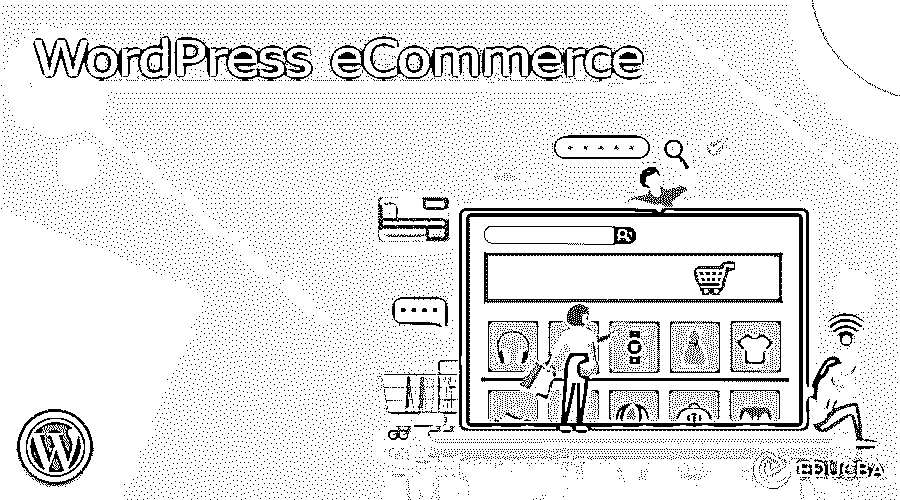

# WordPress 电子商务

> 原文：<https://www.educba.com/wordpress-ecommerce/>

## 什么是 WordPress 电子商务？

WordPress 电子商务是一个平台，允许发布、配置和维护通过在线商店购买和销售商品，以在不同的市场赚取收入，并使产品可供潜在用户使用。关注销售策略和博客发布是非常重要的。所以 WordPress 为电子商务网站的部署提供了最大的优势，因为它将有助于用正确的插件扩展更多的功能。WordPress 电子商务是按原样呈现的，也就是说，一个人可以很容易地自己安装或者在一个自动运行的主机服务上结算。WP 电子商务包含基本功能，如购物车，结帐功能的产品页面，库存管理，也有辉煌的数据报告能力。

### 如何创建一个 WordPress 电子商务？

要创建我们自己的电子商务在线商店，首先要做的是在 WooCommerce、Shopify、Squarespace 等平台中做出选择。但最重要的是，WordPress 可以成为你的电子商务和博客 CMS 的一个有能力和强大的著名平台，为你的商店提供你所期望的一切。

<small>网页开发、编程语言、软件测试&其他</small>

WP 电子商务可能不像 WooCommerce 那样功能齐全，但它是选择 WordPress 建立在线商店的另一个标准和强有力的选择。像其他插件一样，这是免费的，但也有付费选项，加上免费扩展可以增加更多的功能。对于额外的高级工具，如布局和功能，电子商务插件有付费金购物车包的选项。用户甚至可以购买高级支付网关，例如，**Authorize.net，和 Stripe** 。

现在，在为 WordPress 网站选择了电子商务插件之后，你需要按照下面的步骤在 WordPress 的后端设置它:

1.  登录 WordPress 管理面板(仪表板)。
2.  从侧边栏面板部分单击插件选项，然后单击添加新选项。
3.  在搜索框中输入 WooCommerce，点击输入。出现该选项时，选择 WooThemes 推出的 Woocommerce 上的 Install Now。

因此，插件已经安装好了，现在你可以开始在产品页面上添加产品了。为此，您需要了解产品的以下详细信息:

1.  产品名称
2.  价格
3.  图像
4.  简要描述

对于主题，从侧面板进入外观选项，点击主题，你可以选择可用的主题，甚至可以搜索任何特定的主题，然后安装它。

为了快速获得结果，确保你已经完成了 WordPress 电子商务的注册和购买过程，没有任何中断和插件安装。

### 最佳 WordPress 电子商务插件

对于 WordPress 电子商务在线商店，WP 用户需要选择最好的电子商务平台，其中一些提到如下:

#### a)网络商务

WordPress 本身不包含内置的电子商务功能。不过，它有一个专门的电子商务插件，名为 WooCommerce。当一个人在 WP 网站上安装这个插件，你将能够开发以及定制一个完整的电子商务网站，因为，Woocommerce 是一个开源插件。此外，用户可以下载数百个 Woocommerce 主题和 Woocommerce 插件来修改商店的外观和功能。

它支持实物和数字商品，并能够添加联盟营销选项。它还包括库存管理功能，支付和运输功能，搜索引擎优化，以及文件支持选项。

#### b)大商业

BigCommerce 插件是一个完全托管的电子商务平台，提供与 WordPress 的完美集成。当使用 WP 时，它允许应用一个可访问的电子商务平台来处理内容和运行网站。它需要更少的维护，可以在几个渠道销售，不收取交易费用。

#### c)购物

如今，Shopify 是众所周知的快速增长的电子商务平台，为客户管理一切。你说这不仅仅是一个插件，而是一个完全无障碍的一体化解决方案。对于初学者来说很容易学习，它支持实物和数字商品，库存管理，支付和运输选项，还包括脸书商店和可购买的 pin。

#### d)轻松的数字下载

EDD 通过 WordPress 帮助销售在线提供的数字下载。它实现起来很简单，并为开发一个好看且有目的的数字商品商店增加了强大的功能。它包含各种扩展、带有电子邮件营销的支付网关插件、软件许可、代销商管理等等。

#### e)成员压力

MemberPress platform 同意出售基于订阅的数字产品和服务，因此它被认为是最好的 WordPress 会员插件，有许多集成选项。甚至它可以与 Woocommerce 整合，包括联盟营销、内容滴流、扩展等。

### 关键要点

*   在 WordPress 中使用电子商务真的很有帮助，因为它的多功能性是一个强大的特性，也提供了一个可定制的方法来操作带有模板和插件的网站。
*   WordPress 包含了一个很大的插件库，用于扩展更多的功能，而不仅仅是一个简单的在线商店，比如自动备份解决方案、多语言支持、SEO 集中配置等。

### 常见问题

下面是提到的常见问题。

#### Q1。Woocommerce 扩展和 WordPress 插件有什么区别？

**回答:**基本上扩展可以被定义为需要一个基础插件来操作和运行的 WordPress 插件。假设，在使用 Woocommerce 扩展之前，必须安装 Woocommerce 插件。

#### Q2。WordPress 电子商务对产品处理的限制。

**回答:** WordPress 电子商务可以管理数千种依赖于网络主机和 Woocommerce 插件的产品，因为它需要比基本 WordPress 安装更多的内存。

#### Q3。WordPress 电子商务有任何交易费用吗？

**回答:**不，不收费。但是你需要在 woocommerce.com 或者插件商店网站支付年费。支付网关可能会向您收取每笔交易的费用。人们可以在他们的网站上查看这些计划，从中选出最好的一个。

### 结论

与一个电子商务网站合作不需要任何深厚的编程知识，但有一个好的策略加上一个良好的零售网站，然后，你可以在 WordPress 中获得顶级插件，将你的网站变成一个在线商店。Wordpress 还提供了一个同样大的库，包含可以改变网站外观和感觉的自定义模板，甚至可以通过专家委托制作自己的模板。

### 推荐文章

这是一个 WordPress 电子商务指南。在这里，我们讨论什么是 WordPress 电子商务，如何创建一个 WordPress 电子商务，以及关键要点。您也可以看看以下文章，了解更多信息–

1.  [WordPress 网站](https://www.educba.com/wordpress-website/)
2.  [WordPress 主题](https://www.educba.com/wordpress-theme/)
3.  [WordPress 登录](https://www.educba.com/wordpress-login/)
4.  [WordPress 主机](https://www.educba.com/wordpress-hosting/)