# WooCommerce

> 原文：<https://www.educba.com/wordpress-woocommerce/>

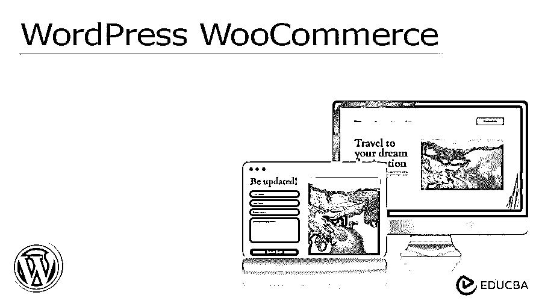

## 什么是 WordPress WooCommerce？

一般来说，WooCommerce 可以被定义为一个为 WordPress 引入的电子商务插件。另一方面，WordPress 是一个流行的内容管理系统，用于托管和创建网站。WordPress WooCommerce 被认为是世界上最优秀的开源电子商务解决方案。这个基础平台超级灵活，不受限制，对于初学者来说易于操作，具有成本效益，并且由全球社区强化，这意味着用户始终保留商店数据和内容的完全所有权。

WordPress WooCommerce 为大型和小型在线企业提供了一个平台。WooCommerce 提供了几个工具选项，如许多运输和支付技术、可变产品等等。

<small>网页开发、编程语言、软件测试&其他</small>

### 你为什么需要 WooCommerce？

在 WordPress，你可以考虑很多在线电子商务商店的插件，并且可以免费实现，但是在所有这些插件中，WooCommerce 插件是最有名的。以下是我们需要 WooCommerce 的一些原因:

*   它是为 WordPress 设计的，具有无缝集成的特性，也可以与其他几个 WordPress 客户端建立连接。
*   WooCommerce 显示了可伸缩性，因此它可以根据您的需求驱动潮流，如大、小、多或少。
*   WooCommerce 确认了安全性，保护用户的数据不会落入某个第三方平台的手中。它有助于保护所有者和消费者之间的交易。
*   经过 Sucuri 的审核，它证明了插件符合编码标准和 WordPress 的最佳实践。
*   它由一个庞大且不断增长的全球社区组成，拥有超过 350 名贡献者和 500 万个安装程序。
*   WooCommerce 拥有完善的支持和全面的指南，涵盖了广泛的 WooCommerce 和商店托管主题，如安装、SSL、代码片段、主题化、安全性等。
*   WooCommerce 最显著的优势之一是使用大量的免费和付费的扩展，允许在线定制 WordPress WooCommerce 商店，具有广泛的集成和功能。

### 关键要点

WooCommerce 被认为是为 WordPress 设计的最好的电子商务解决方案之一。

*   这个插件拥有大约 400 万的活跃安装量，在 wordpress.org，它被用户和一群快乐忠诚的数字在线商店所有者评为 4.6 星。
*   它包括几个有益的功能，如客户参与、订单跟踪、库存管理、交付状态、运输集成、安全支付税务管理等。

### 如何设置 WordPress WooCommerce？

让我们讨论一下如何设置和启动我们的 WordPress WooCommerce 的步骤，简述如下:

#### 1.从 WooCommerce 域开始

你可以选择世界上最大的虚拟主机提供商“Bluehost ”,它在虚拟主机上提供折扣。因此，请访问 Bluehost 网站，点击“立即开始”按钮选择您的托管计划。

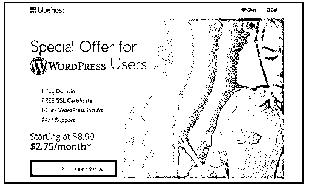

您可以查看最受欢迎的基本计划和附加计划:

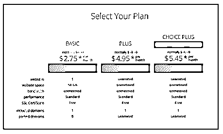

之后，你需要注册一个新的域名或者使用一个已经流行的域名来继续。

接下来将是带有附加选项的套餐信息部分。

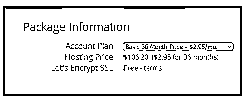

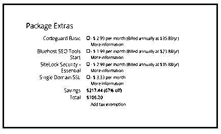

接下来是支付流程，一旦提交，您将收到一封包含登录详细信息的电子邮件，并可以通过提供的仪表板管理网站。

#### 2.WordPress 安装程序

当你登录到你的主机账户时，你可以看到 Bluehost 通过“登录 WordPress”按钮自动提供 WordPress 安装。

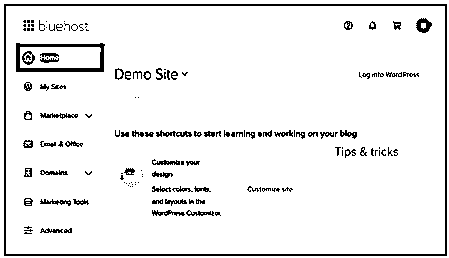

现在，没有密码要求，你将登录到 wp-admin 面板。

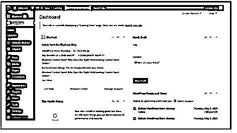

进入设置页面，设置基本的 WordPress 设置。

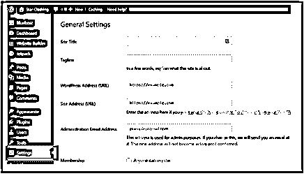

#### 3.安装 WooCommerce

在 wp 仪表板中，访问插件页面，找到 WooCommerce 插件并安装它。然后，激活插件，这将启动 WooCommerce 设置向导，您可以选择并继续该过程，并完成商店设置。

然后，激活将启动 WooCommerce 设置向导的插件。

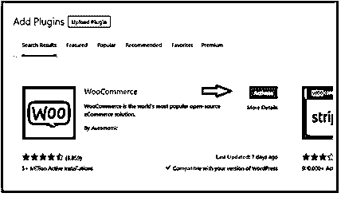

现在，您可以选择并继续该过程，完成商店设置向导。

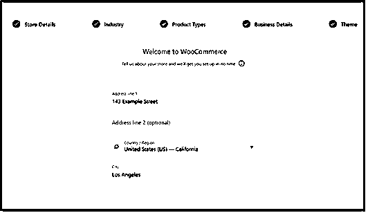

#### 4.WooCommerce 商店设置

在 WooCommerce 仪表盘中，您将看到一个定制商店的步骤列表。

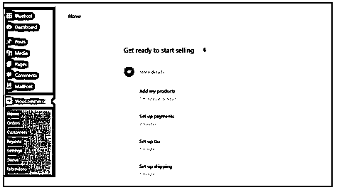

这包括:

**添加产品:**通过模板、导入 CSV 或从其他来源手动添加

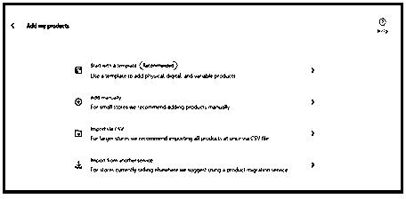

您需要为数字或物理或可变类型产品选择一个模板，

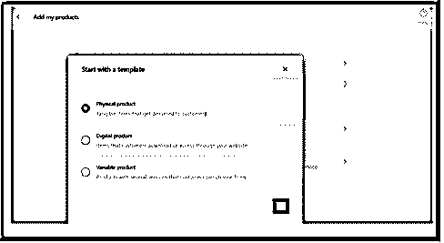

单击 GO 后，您将转到产品编辑器，然后在那里添加一个新的产品页面:

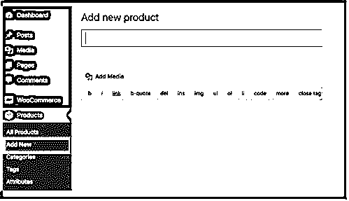

选择类别、标题、描述、图片等。，然后使用发布按钮发布它。

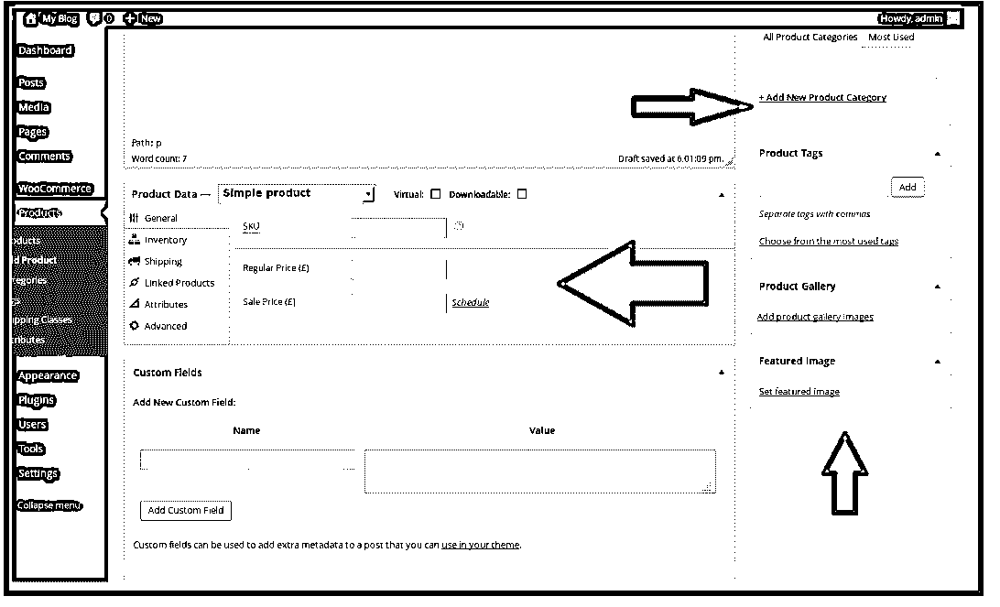

**支付设置**；通过 WooCommerce 选项，转到任何支付流程连接它

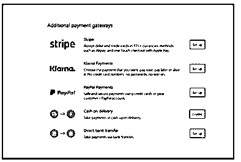

**税收选项设置；**通过 WooCommerce 页面进入设置税务选项

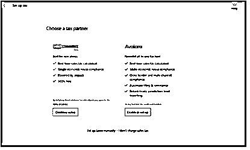

&最后，进行**发货设置；**通过 WooCommerce 设置指南点击设置运送选项。

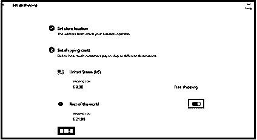

#### 5.WooCommerce 模板/主题选择

你可以从 WooCommerce 在线商店市场上的数千种选择中选择你的专业模板或主题设计。你可以找到免费和付费的移动友好和搜索引擎优化支持的设计，如 Astra，Shoppe 等。

#### 6.WooCommerce 插件和扩展安装

强大的附件、扩展和插件提升了我们 WooCommerce 商店的真正实力。这些就像任何 WordPress 插件一样，可以很容易地安装并用于联系表单、SEO、优化、安全、礼品卡、登陆页面、电子邮件营销等。

#### 7.在线电子商务商店增长的资源

现在，你的 WooCommerce 商店运行正常，但最好通过以下一些选项开始你的业务推广和增长，如电子邮件列表、更多线索、WooCommerce 用户跟踪、SEO、提高无限制购物车销售等。

### WordPress WooCommerce 模板

*   如今，你可以在网上找到数千家与 WooCommerce 竞争销售相关产品的商店。为了创造一个巨大的差异，需要选择一个有吸引力的专业商店设计，让消费者可以看到你的品牌。
*   在市场上，WooCommerce 包含许多可供用户使用的模板和主题。然而，你也可以用一些 WordPress 主题来实现 WooCommerce，但是推荐使用一个 WooCommerce 就绪的主题。这些主题是专门为 WooCommerce 网站商店设计的，有助于增加销售额。
*   对于初学者来说，选择一个完美的设计可能很成问题，因为市场上有成千上万的付费和免费模板和主题可供选择。为此，我们精心挑选了一些最好的 WooCommerce 现成模板和主题，这些模板和主题是移动友好的，并根据 SEO 性能进行了优化:

1.  [阿斯特拉](https://www.wpbeginner.com/refer/astra-woocommerce-theme/)
2.  [OceanWP](https://oceanwp.org/?utm_source=wpbeginner.com&utm_medium=website&utm_campaign=fs_aff)
3.  [专柜](https://themify.me/themes/shoppe)
4.  [outfitter Pro](https://www.studiopress.com/themes/?SSAID=422250&sscid=91k6_50s41&utm_source=SAS&utm_medium=affiliate&utm_campaign=422250&utm_content=1321112)

### 常见问题

下面是提到的常见问题:

#### Q1。在哪里可以找到 WooCommerce 用户指南和文档？

**答:**关于 WooCommerce 的设置和配置帮助和支持，可以参考文档:[入门](https://woocommerce.com/documentation/plugins/woocommerce/getting-started/?utm_medium=referral&utm_source=wordpress.org&utm_campaign=wp_org_repo_listing)，也可以参考[新 Woocommerce 店主指南](https://woocommerce.com/guides/new-store/?utm_medium=referral&utm_source=wordpress.org&utm_campaign=wp_org_repo_listing)。进一步帮助主题化或扩展 WooCommerce，请访问我们的 [codex](https://woocommerce.com/documentation/plugins/woocommerce/woocommerce-codex/?utm_medium=referral&utm_source=wordpress.org&utm_campaign=wp_org_repo_listing) 以及[插件开发者手册](https://woocommerce.com/document/create-a-plugin/?utm_medium=referral&utm_source=wordpress.org&utm_campaign=wp_org_repo_listing)。

#### Q2。WordPress WooCommerce 会和我的主题一起使用吗？

**回答:**是的当然！WooCommerce 适用于任何主题。但它可能需要一些额外的造型。如果你正在寻找一个以 WooCommerce 整合为特色的主题，我们可以向你推荐主题[店面](https://woocommerce.com/storefront/?utm_medium=referral&utm_source=wordpress.org&utm_campaign=wp_org_repo_listing)。

#### Q3。哪里可以报告 bug？

**答:**用户可以通过我们的支持论坛直接向 WooCommerce 团队通知错误，但要确认与相同错误问题相关的论坛没有提前报告。要报告错误，请访问 [Woocommerce GitHub 知识库](https://github.com/woocommerce/woocommerce/issues?utm_medium=referral&utm_source=wordpress.org&utm_campaign=wp_org_repo_listing)。

### 结论

当然，WooCommerce 是将 WordPress 变成一个功能齐全的电子商务在线商店的好方法。此外，最好的部分是，用户不需要有深入的编程知识来在线营销产品。甚至，这个 WordPress 插件被翻译成各种语言，包括波斯语、丹麦语和乌克兰语。此外，您还可以通过添加特定的地区或访问网站**wordpress.org**来本地化 WooCommerce。

### 推荐文章

这是 WordPress WooCommerce 的指南。在这里我们讨论介绍，需求，以及如何建立 WordPress WooCommerce。您也可以看看以下文章，了解更多信息–

1.  [WordPress 电子商务](https://www.educba.com/wordpress-ecommerce/)
2.  [WordPress 网站](https://www.educba.com/wordpress-website/)
3.  [WordPress 主机](https://www.educba.com/wordpress-hosting/)
4.  [Magento vs WooCommerce](https://www.educba.com/magento-vs-woocommerce/)

