# 谷歌分析

> 原文：<https://www.educba.com/wordpress-google-analytics/>

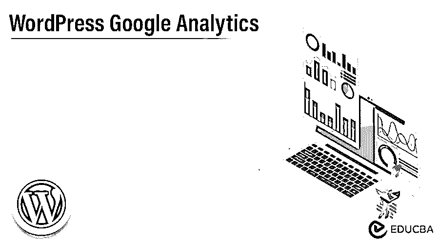

## WordPress 谷歌分析简介

WordPress Google Analytics 用于增强您的网站改进。它有助于收集你需要的细节，以提高用户体验，并有助于提高 WordPress 网站的转化率。Google Analytics 包括收集数据、分析、整合、监控、报告和可视化等功能。这些功能有助于用户识别访问者参与网站的趋势和模式。

### 关键要点

*   Google Analytics 包括收集数据、分析、整合、监控、报告和可视化等功能。
*   这是一个范围广泛的信息，分为五类:

1.  转换策略
2.  行为
3.  获得物ˌ获得
4.  实时
5.  观众

### 什么是 WordPress Google Analytics？

Google Analytics 是由 Google 提供的网络分析服务，用于跟踪和报告 Google 营销平台商标所包含的当前网站流量。谷歌分析包括高度发达的方面，以补充 WordPress.com 统计。该报告支持跟踪访问者通过您的网站的路径和目标调整，以衡量访问者如何完成精确的任务，如接触联系表单或产品页面。

<small>网页开发、编程语言、软件测试&其他</small>

### 如何添加 WordPress Google Analytics？

有多种方法可以将 Google Analytics 连接到 WordPress 网站。对于大多数 WordPress 用户来说，最简单的方法是用 Google Analytics WordPress 插件在他们的网站上包含 Google Analytics。

要应用这一点，有两个插件推荐如下:

#### a)谷歌网站工具包

如果你想在 WordPress 网站中加入 Google Analytics，Google 已经用最简单的强大插件方法覆盖了它，这就是 Google 的 Site Kit。

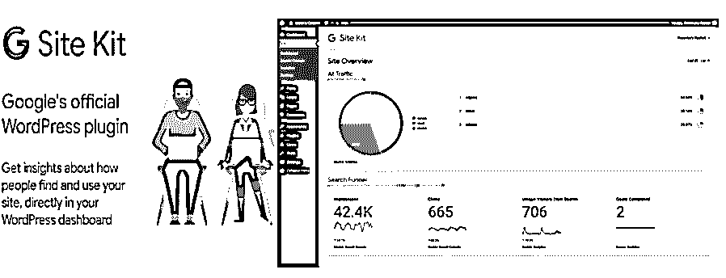

我们来看看下面的流程来添加它:

Google 提供的服务是 Google AdSense、PageSpeed Insights 和 Google Search Console，这使得能够创建基于 Google 作为数据源的仪表板。让我们看看如何开始安装和激活谷歌插件网站工具包，只需点击开始设置按钮。

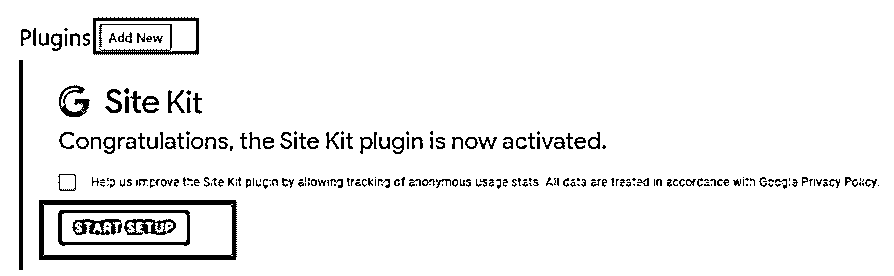

一旦该过程结束，我们需要将网站连接到分析帐户。我们需要以下步骤来确认域名的所有者，并允许谷歌访问数据和分组你喜欢的服务，包括 WordPress。

Once connected successfully with Google Account then we can be able to visualize the data from Google Analytics with the entire services activated directly in the dashboard.

让我们看看它是什么样子的:

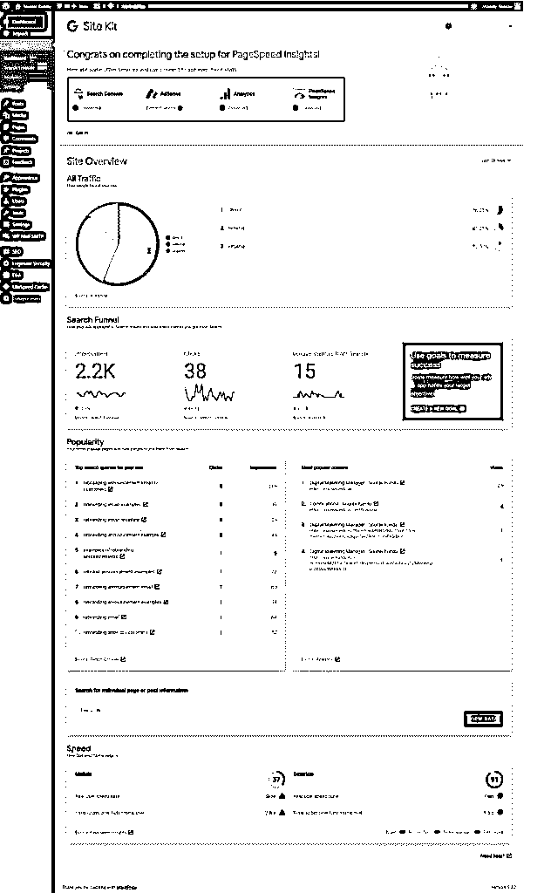

整个数据总是可以在左侧的侧边栏上找到。如果插件不适合任何情况，你可能会关注下一个插件，即谷歌分析如下。

#### b) GA 谷歌分析

这是 Jeff Starr 开发的免费插件 GA Google Analytics，已经有超过 400，000 次的活跃安装使用，并获得最高评级。

安装并激活 Google Analytics WordPress 插件后，必须在设置中输入 Google Analytics 跟踪 ID。要获得您的跟踪 ID，只需进入 GA 帐户，然后点击侧栏管理。

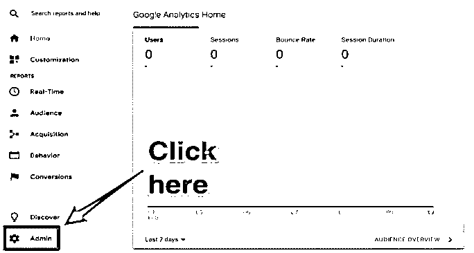

在酒店中，只需选择跟踪信息，然后点击跟踪代码:

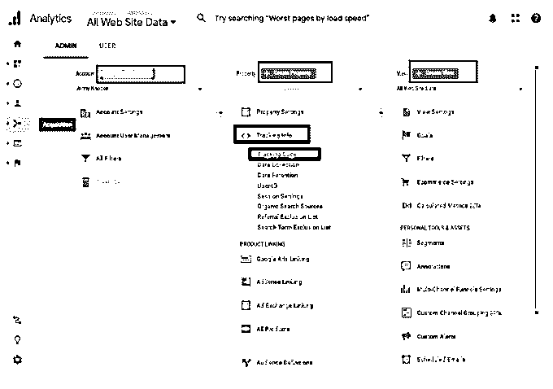

跟踪 ID 以 UA 开头，位于该部分的顶部。

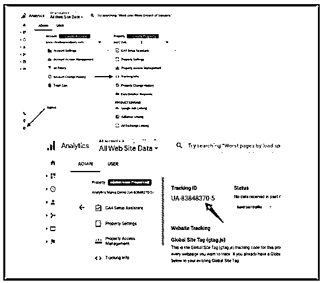

在仪表板中，只需导航到设置谷歌分析，然后向下滚动插件设置，并在相关领域包括跟踪代码。

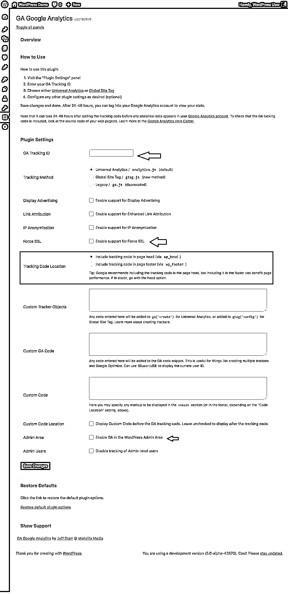

这个插件可以让你选择是否跟踪放置在页眉和页脚的代码，包括自定义跟踪代码强制 SSL 和停止跟踪管理员用户和少量其他功能选项。一旦完成您的要求，只需向下滚动并选择保存更改按钮。谷歌分析现在活跃在 WordPress 网站上。

### 如何在仪表盘中添加 WordPress Google Analytics？

有各种插件可供选择。让我们看看工具，它们允许将平台连接到网站，并通过仪表板显示一些指标。

有五种最好的 Google Analytics WordPress 插件可以考虑，它们是:

*   monster insights——WordPress 的谷歌分析
*   谷歌网站工具包
*   Google Analytics Dashboard by analytic fy
*   谷歌分析 WD
*   蜂巢分析

让我们看看 Dashboard 中的两种类型的 Google Analytics:

#### 1.Google Analytics Dashboard by analytic fy

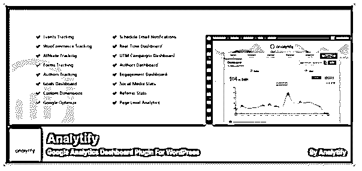

Google Analytics Dashboard 插件的名字是什么？有了这个插件，我们只需点击几下鼠标就可以添加谷歌分析，并访问管理面板中的仪表板。

该插件提供了几个特性，并显示了一些数据集。

*   支持 WooCommerce，增加了电子商务跟踪。
*   整个 WordPress 页面和帖子的内置流量数字。
*   统计的设备类型。
*   顶级国家和城市的游客。
*   页面反弹的评级。
*   找到哪些网站发送最多的游客。

全部数据以图表和简单的数字分类两种形式提供。

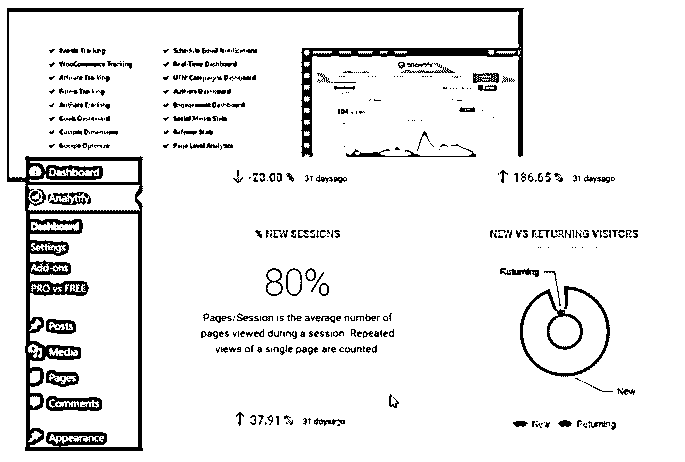

#### 2.蜂巢分析

Beehive Analytics 是 WPMU Dev 系列插件之一。这是一个免费的插件，允许连接 WordPress 的分析帐户，并在仪表板上显示数据。Beehive 还允许规划哪些用户角色有权使用仪表板中的哪些数据。

通过使用 Beehive Analytics，您可以访问以下内容:

*   评级反弹统计
*   会话和用户的数量
*   页面访问者数量
*   页面上的平均时间
*   热门国家的已访问页面
*   推荐网站和搜索引擎的报告

它是强大的谷歌分析仪表板，提供整个指标，这是监视，Beehive Analytics 是一个可靠的选择。

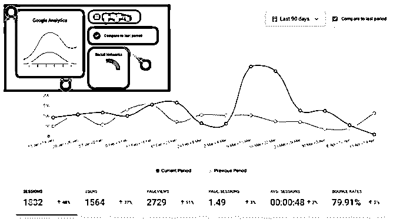

### 常见问题解答

下面是提到的常见问题:

#### Q1。如何在 WordPress Dashboard 上找到 Google Analytics？

**回答:**默认情况下，当 GA 连接到 WordPress 时，不允许访问 CMS 仪表板中的指标。我们需要使用 GA WordPress 插件包括的功能。

#### Q2。WordPress 最好的 Google Analytics 插件是哪个？

**答:**它用于根据我们需要监控的指标，选择我们喜欢的用户界面。它包括 MonsterInsights 的 Google Analytics for WordPress 和 Beehive Analytics。

#### Q3。如何提高 GA 指标？

**回答:**提高谷歌分析指标需要 SEO(搜索引擎优化)工作。通过使用 WordPress，我们使用了各种各样的 SEO 插件，添加了 Yoast SEO 和 RankMath。

### 结论

在这篇文章中，我们看到了 Google Analytics WordPress 及其特性。该报告支持跟踪访问者通过您的网站的路径和目标调整，以衡量访问者如何完成精确的任务。

### 推荐文章

这是一个谷歌分析指南。在这里，我们讨论介绍，以及如何添加谷歌分析。和常见问题。您也可以看看以下文章，了解更多信息–

1.  [WordPress CMS](https://www.educba.com/wordpress-cms/)
2.  WordPress WooCommerce
3.  [WordPress 登录](https://www.educba.com/wordpress-login/)
4.  [WordPress 主机](https://www.educba.com/wordpress-hosting/)

