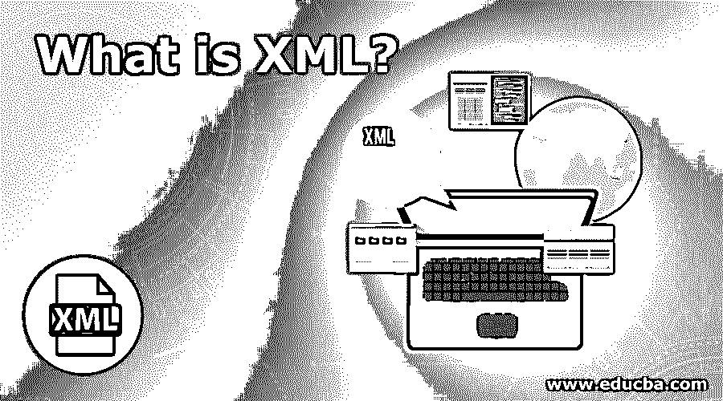

# 什么是 XML？

> 原文：<https://www.educba.com/what-is-xml/>

## XML 简介

XML 可以扩展为“可扩展标记语言”，这是一种基于文本的语言，用于定义要在 web 上发布的标记文档。它可以包含普通数据的数据及其格式细节。与另一种标记语言相比，XML 具有显著的数据存储能力，支持公共标准，并且是可扩展的。这种语言是通过提取 SGML 的特性而形成的，即标准的通用标记语言。

### 理解 XML

XML 有几个重要的特性，使它在几个技术领域非常有用。它们陈述如下:

<small>网页开发、编程语言、软件测试&其他</small>

*   **可扩展:**允许我们根据需要创建不同的标签，并配以适当的描述或语言。
*   **数据存储:**用于存储数据，与数据在下一步中的显示方式无关。
*   公共标准:一个叫做万维网联盟或 W3C 的组织开发了它，并使它成为一个开放标准。

### XML 的使用

它有多种用途，比如简化 HTML 文档的创建，重新加载数据库等等。

它们描述如下:

1.  这个可以用来表示任何类型的数据，没有太多的限制。
2.  它被用在后端来简化大型网站中使用的 HTML 文档的创建。
3.  它们很容易与样式表合并，这有助于创建许多不同的输出。
4.  它们用于不同组织或不同系统之间的数据交换。
5.  它们有助于数据处理，并用于以期望的方式存储和排列数据。
6.  它们用于重装数据库或不同的维护活动。

有一组由 XML 定义的规则与用于编码文档的标记语言一致，这些文档将被人和机器阅读。因此，标记语言可以被定义为以某种方式产生文档的正确含义的任何种类的信息，它标识文档的不同部分如何相互关联。此外，标记语言由放置在文档中指示文档不同部分的符号组成。

下面是一个带有标记外观的示例 XML 片段:

`<information>
<lines>How are you</lines>
</information>`

上面的例子显示了通常被称为标签的标记符号，如 <information>…..</information>和 <lines>…</lines>。标签<information>和</information>划分了 XML 代码片段的开始和结束。标签<lines>和</lines>封装了“你好吗”这一行。

XML 不应该与编程语言混淆。编程语言由创建程序时可以遵循的特定规则和约定组成。并且这些程序指示计算机执行定义的任务。然而， [XML 并不能证明](https://www.educba.com/xml-commands/)是一种编程语言，因为它不执行任何计算或算法。它通常存储在文本文件中，并由解释 XML 的软件设计进行处理。

### XML 是如何让工作变得如此简单的？

与其他标记语言相比，编写 XML 文档很容易。没有预定义的规则可以遵循，作者可以创建自己的标签和规则来满足他们的需要。这样，XML 在开发文档方面非常灵活。它也可以放在任何 web 应用程序的后端来维护样式表。这些样式表可以通过更新 XML 文档来更新。

**顶级公司**

由于其简单的性质，它被所有领先的公司使用，如施乐，微软，谷歌，脸书，福特汽车，以及许多其他公司。

### 你能用 XML 做什么？

XML 用于数据和信息的存储和传输。它纯粹是一种基于文档的技术，独立于任何专门的软件或硬件需求。它也是一种自我描述的语言。它是自描述的，包含发送者信息、接收者信息、标题和消息体。XML 文档中的信息可以随时添加，扩展了文档的内容，使 XML 具有可扩展性。它还简化了一些事情，如数据共享、数据传输、平台变化和数据可用性。而且，这是 W3C 的推荐标准。

### 使用 XML

它由两部分组成:

1.  提高价格。
2.  数据的文本或字符。

它还可以有一个声明，如下所示。这里，XML 版本和编码定义了文档中使用的字符编码。下面给出了一个示例声明:

`<?xml version = "1.0" encoding = "UTF-8"?>`

下面定义了一些语法规则:

1.  声明应该用小写字母写“”。它区分大小写，应该总是写在开头。
2.  如果声明出现在 XML 文档中，它必须出现在开头。
3.  XML 声明中给出的编码可以被这里使用的任何 HTML 协议覆盖。
4.  XML 文档由元素和标记组成。XML 元素用三角括号括起来。

#### 元素语法

XML 元素以开始或结束元素结束，如 <element>…。</element>或者像<element>这样的简单从句。</element>

#### 嵌套元素

它允许语句嵌套，但是它们不应该相互重叠。这意味着元素的结束标记必须与最近的不匹配开始标记同名。

#### 根元素

单个 XML 文档只有一个根元素，如下所示。

`<root>
<x>...</x>
<y>...</y>
</root>` 

#### 区分大小写

XML 元素总是区分大小写，这意味着开始和结束元素必须是相同的大小写。

属性是使用名称-值对的元素的单个属性。一个元素可能有多个属性。下面是一个例子:

`<a href = "http://www.samplearticle.com/">Sample</a>`

在上面的例子中，href 是属性名，而 www.samplearticle.com 是属性值。

为属性定义的语法规则很少，如下所示:

*   XML 属性名区分大小写。
*   同一属性不能有多个值。
*   属性值出现在引号中，而属性名称是在没有引号的情况下定义的。
*   引用用于添加额外的信息或在 XML 文档中进行标记。它们总是以“&”符号开头，以“；”结尾.

下面给出了两种类型的参考:

#### 实体引用

在实体引用中，在开始和结束分隔符之间定义了一个名称。任何种类的预定义字符串，如文本或标记，都可以用作名称。

#### 字符引用

字符引用具有包含后跟数字的散列标记(" # ")的引用。数字是指字符的 Unicode。

属性和元素的名称区分大小写，这意味着开始和结束属性应该是同一个大小写。将文档保存为 Unicode UTF-8 或 UTF-16 格式可以避免所有字符编码问题。这会导致属性和元素之间的所有空格、制表符和换行符被忽略。有些 XML 保留语法不能直接使用。有一些用于避免这种情况的替换实体。

### 优势

以下是 XML 的优点:

**1。**文档标准是一个国际标准，由负责维护 web 标准的组织 W3C 维护。XML 文档不特定于任何供应商，也不局限于任何单一的应用程序或组织。市场上有各种各样的文档编写器。其中一些通常是专有的，并与为特定类型的文档分配的软件一起工作。然而，XML 文档可以在任何编辑器中创建，也可以在不同的编辑器中编辑，从而使它们独立于特定的指定编辑器。甚至记事本文本编辑器也可以用来创建 XML 文档，尽管不推荐这样做。

**2。** XML 标签或 XML 元素用于定义 XML 文档的结构。一旦定义了文档结构，就可以像选择样式表一样选择流程来操作内容，并在操作后重用它们。随着内容与显示的分离，我们可以在许多不同的环境中使用单一来源的内容。与 HTML 不同，它没有固定数量的标签或元素，因此允许设计者用有意义的标签设计文档。它允许设计者根据自己的需要创建标记语言。即使是新元素也可以根据需要定义，让设计者能够定制元素是 XML 提供的一个独特特性。

**3。**它们提供了内容重用的特性，从而允许不同的组织节省大量的金钱和精力，同时使作者更有效率。一旦创建了内容，就可以在其他几个文档中使用。XML 文档经常被修改以适应不同用户的需求。不同的样式表可以应用于 XML 文档，以操作适合某些特定用户的内容，或者输出不同类型的文档。

**4。XML 允许内容和格式的分离。在完成 XML 文档格式化的地方维护一个单独的样式表。因此，由于这种独立性，在需要时可以容易地更新和维护文档。此外，当内容与格式分离时，很容易为所有文档维护一致的样式表。**

**5。**在发布来自同一来源的多种语言的文档时，这非常有用。如果内容存储在 XML 源文件中，也可以减少翻译的覆盖。因此，当以多种语言发布文档时，只需点击一下鼠标即可完成。发布源 XML 文件时会自动应用格式。

### 我们为什么要使用 XML？

使用 XML 有很多目的，比如以结构化格式将数据从一个源点传输到任何目的地等等。XML 中使用的标签用于确保数据的结构。标签和文本的组合用于存储信息。文本被按照预定义的规则编写的标签包围，并且包含关于被包围文本的有意义的信息。因此，存储信息和传输信息是非常容易的。

### 为什么我们需要 XML？

对它的需求是巨大的，因为它主要用于外包数据。HTML 文档使用 XML 作为后端存储数据。它以纯文本格式存储数据，并且独立于平台，可以毫无问题地导入、导出或从一个地方移动到另一个地方。

### 谁是学习 XML 技术的合适受众？

虽然它很容易学，但是对于想要学习的读者来说，掌握 XSLT、XQuery 和 XPath 的必备知识是很好的。除了这些，HTML 的知识也是一件好事。

### 这项技术将如何帮助你的职业发展？

几乎所有使用基本数据和网络操作的公司都使用这种技术。从它所提供的用途和优势来看，拥有高薪的机会也是显而易见的。

### 结论

它是许多通用工具支持的 web 信息的标准表示，也是分层结构文本的一种符号。它是高级语言的编码，如 RDF 用于定义文档信息，OWL 用于定义本体。它也是语义网计划的基础构件。

### 推荐文章

这是什么是 XML 的指南。这里我们讨论 XML 的理解、工作、范围、技能和优势。您也可以浏览我们推荐的其他文章，了解更多信息——

1.  [XML 命令](https://www.educba.com/xml-commands/)
2.  [什么是 HTML](https://www.educba.com/what-is-html/)
3.  [什么是 SDLC](https://www.educba.com/what-is-sdlc/)